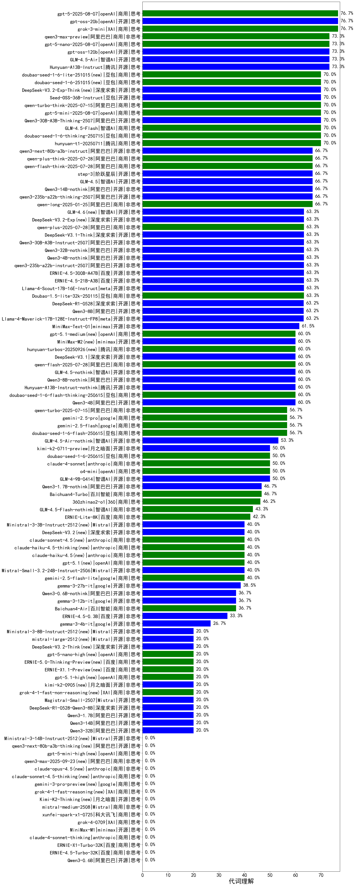

|类别|机构|大模型|【代词理解】准确率|平均耗时|平均消耗token|花费/千次（元）|排名（准确率）|
|---|---|-----|-------------------|-------|-----------|-----------|-----------|
|商用|openAI|gpt-5-2025-08-07|76.7%|244s|271|14.8|1|
|开源|openAI|gpt-oss-20b|76.7%|229s|658|0.6|2|
|商用|XAI|grok-3-mini|76.7%|93s|731|2.5|3|
|商用|阿里巴巴|qwen3-max-preview|73.3%|290s|278|5.4|4|
|商用|openAI|gpt-5-nano-2025-08-07|73.3%|32s|1282|3.5|5|
|开源|openAI|gpt-oss-120b|73.3%|295s|438|1.1|6|
|开源|腾讯|Hunyuan-A13B-Instruct|73.3%|291s|323|1.1|7|
|开源|智谱AI|GLM-4.5-Air|73.3%|288s|1292|7.4|8|
|商用|阿里巴巴|qwen-turbo-think-2025-07-15|70.0%|923s|923|2.6|9|
|商用|豆包|doubao-seed-1-6-lite-251015(new)|70.0%|14s|307|0.5|10|
|开源|深度求索|DeepSeek-V3.2-Exp-Think(new)|70.0%|175s|475|1.4|11|
|商用|腾讯|hunyuan-t1-20250711|70.0%|18s|432|1.4|12|
|商用|豆包|doubao-seed-1-6-thinking-250715|70.0%|4s|429|2.9|13|
|商用|豆包|doubao-seed-1-6-251015(new)|70.0%|37s|354|2.1|14|
|商用|智谱AI|GLM-4.5-Flash|70.0%|38s|1275|0.0|15|
|开源|阿里巴巴|Qwen3-30B-A3B-Thinking-2507|70.0%|46s|1100|2.9|16|
|商用|openAI|gpt-5-mini-2025-08-07|70.0%|256s|620|8.0|17|
|开源|豆包|Seed-OSS-36B-Instruct|70.0%|310s|540|2.0|18|
|商用|阿里巴巴|qwen-plus-think-2025-07-28|66.7%|922s|1496|11.5|19|
|开源|阿里巴巴|qwen3-235b-a22b-thinking-2507|66.7%|329s|1462|22.9|20|
|开源|阿里巴巴|Qwen3-14B-nothink|66.7%|15s|238|0.4|21|
|开源|阿里巴巴|qwen3-next-80b-a3b-instruct|66.7%|286s|355|1.2|22|
|开源|智谱AI|GLM-4.5|66.7%|107s|1332|17.9|23|
|开源|阶跃星辰|step-3|66.7%|191s|1239|4.8|24|
|商用|阿里巴巴|qwen-flash-think-2025-07-28|66.7%|294s|1101|1.6|25|
|商用|阿里巴巴|qwen-long-2025-01-25|66.7%|136s|140|0.2|26|
|开源|阿里巴巴|Qwen3-4B-nothink|63.3%|341s|251|0.6|27|
|开源|阿里巴巴|qwen3-235b-a22b-instruct-2507|63.3%|13s|254|1.6|28|
|商用|豆包|Doubao-1.5-lite-32k-250115|63.3%|2s|126|0.1|29|
|开源|阿里巴巴|Qwen3-30B-A3B-Instruct-2507|63.3%|312s|276|0.7|30|
|开源|meta|Llama-4-Scout-17B-16E-Instruct|63.3%|10s|322|0.6|31|
|开源|阿里巴巴|Qwen3-32B-nothink|63.3%|348s|237|0.7|32|
|商用|阿里巴巴|qwen-plus-2025-07-28|63.3%|286s|247|0.4|33|
|开源|智谱AI|GLM-4.6(new)|63.3%|25s|1163|15.6|34|
|开源|深度求索|DeepSeek-V3.1-Think|63.3%|22s|448|4.9|35|
|开源|百度|ERNIE-4.5-300B-A47B|63.3%|339s|118|0.5|36|
|开源|深度求索|DeepSeek-V3.2-Exp(new)|63.3%|266s|208|0.6|37|
|开源|百度|ERNIE-4.5-21B-A3B|63.3%|49s|130|0.1|38|
|开源|meta|Llama-4-Maverick-17B-128E-Instruct-FP8|63.2%|10s|477|1.9|39|
|开源|深度求索|DeepSeek-R1-0528|63.2%|80s|991|15.1|40|
|开源|阿里巴巴|Qwen3-8B|63.2%|36s|716|0.0|41|
|开源|minimax|MiniMax-Text-01|61.5%|4s|805|6.5|42|
|开源|智谱AI|GLM-4.5-nothink|60.0%|314s|351|4.2|43|
|开源|minimax|MiniMax-M2(new)|60.0%|37s|527|3.8|44|
|开源|阿里巴巴|Qwen3-8B-nothink|60.0%|11s|260|0.0|45|
|商用|豆包|doubao-seed-1-6-flash-thinking-250615|60.0%|3s|307|0.3|46|
|商用|openAI|gpt-5.1-medium(new)|60.0%|80s|463|27.3|47|
|开源|阿里巴巴|Qwen3-4B|60.0%|71s|487|1.3|48|
|商用|腾讯|hunyuan-turbos-20250926(new)|60.0%|5s|274|0.4|49|
|开源|腾讯|Hunyuan-A13B-Instruct-nothink|60.0%|261s|144|0.4|50|
|商用|阿里巴巴|qwen-flash-2025-07-28|60.0%|312s|262|0.3|51|
|开源|深度求索|DeepSeek-V3.1|60.0%|10s|176|1.6|52|
|商用|google|gemini-2.5-flash|56.7%|204s|898|15.2|53|
|商用|阿里巴巴|qwen-turbo-2025-07-15|56.7%|15s|233|0.1|54|
|商用|google|gemini-2.5-pro|56.7%|251s|1247|86.0|55|
|商用|豆包|doubao-seed-1-6-flash-250615|56.7%|1s|146|0.1|56|
|开源|智谱AI|GLM-4.5-Air-nothink|53.3%|284s|397|2.0|57|
|商用|豆包|doubao-seed-1-6-250615|50.0%|137s|191|0.8|58|
|开源|智谱AI|GLM-4-9B-0414|50.0%|5s|147|0.0|59|
|商用|anthropic|claude-4-sonnet|50.0%|44s|311|24.4|60|
|商用|openAI|o4-mini|50.0%|19s|413|11.4|61|
|开源|月之暗面|kimi-k2-0711-preview|50.0%|10s|179|2.1|62|
|开源|阿里巴巴|Qwen3-1.7B-nothink|46.7%|314s|196|0.4|63|
|商用|百川智能|Baichuan4-Turbo|46.7%|/|/|/|64|
|商用|360|360zhinao2-o1|46.2%|/|/|/|65|
|商用|智谱AI|GLM-4.5-Flash-nothink|43.3%|12s|402|0.0|66|
|商用|百度|ERNIE-Lite-8K|42.3%|/|/|/|67|
|商用|openAI|gpt-5.1(new)|40.0%|245s|160|5.8|68|
|商用|anthropic|claude-haiku-4.5(new)|40.0%|10s|458|12.7|69|
|开源|Mistral|Mistral-Small-3.2-24B-Instruct-2506|40.0%|547s|207|0.3|70|
|商用|anthropic|claude-haiku-4.5-thinking(new)|40.0%|34s|1218|39.4|71|
|商用|google|gemini-2.5-flash-lite|40.0%|216s|181|0.4|72|
|开源|google|gemma-3-27b-it|38.5%|/|/|/|73|
|开源|阿里巴巴|Qwen3-0.6B-nothink|36.7%|306s|133|0.2|74|
|商用|百川智能|Baichuan4-Air|36.7%|/|/|/|75|
|开源|google|gemma-3-12b-it|36.7%|/|/|/|76|
|开源|百度|ERNIE-4.5-0.3B|33.3%|179s|94|0.0|77|
|开源|google|gemma-3-4b-it|26.7%|/|/|/|78|
|开源|阿里巴巴|Qwen3-1.7B|20.0%|82s|776|2.1|79|
|开源|深度求索|DeepSeek-R1-0528-Qwen3-8B|20.0%|585s|1014|0.0|80|
|开源|Mistral|Magistral-Small-2507|20.0%|32s|2626|27.9|81|
|开源|阿里巴巴|Qwen3-32B|20.0%|127s|768|2.9|82|
|开源|阿里巴巴|Qwen3-14B|20.0%|168s|915|1.7|83|
|开源|月之暗面|Kimi-K2-Thinking(new)|/%|41s|758|11.3|84|
|商用|Mistral|mistral-medium-2508|/%|122s|184|1.7|85|
|开源|阿里巴巴|Qwen3-0.6B|/%|76s|422|1.1|86|
|商用|百度|ERNIE-4.5-Turbo-32K|/%|3s|130|0.3|87|
|商用|anthropic|claude-4-sonnet-thinking|/%|44s|768|74.1|88|
|开源|minimax|MiniMax-M1|/%|29s|907|5.9|89|
|商用|XAI|grok-4-0709|/%|650s|474|45.3|90|
|商用|科大讯飞|xunfei-spark-x1-0725|/%|/|288|3.5|91|
|商用|百度|ERNIE-X1-Turbo-32K|/%|327s|443|1.6|92|

