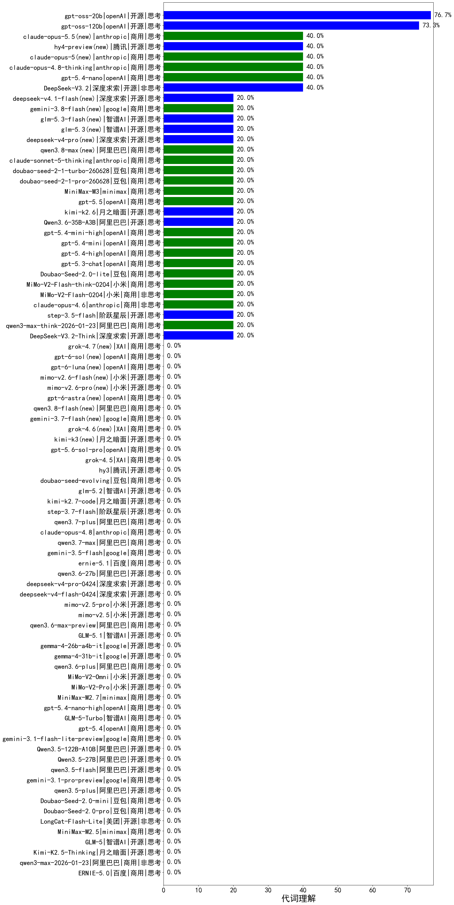

|类别|机构|大模型|【代词理解】准确率|平均耗时|平均消耗token|花费/千次（元）|排名（准确率）|
|---|---|-----|-------------------|-------|-----------|-----------|-----------|
|开源|openAI|gpt-oss-20b|76.7%|229s|658|0.6|1|
|开源|openAI|gpt-oss-120b|73.3%|295s|438|1.1|2|
|开源|深度求索|DeepSeek-V3.2|40.0%|99s|248|0.7|3|
|商用|anthropic|claude-opus-5.5(new)|40.0%|11s|474|52.7|4|
|开源|腾讯|hy4-preview(new)|40.0%|98s|6890|123.0|5|
|商用|openAI|gpt-5.4-nano|40.0%|8s|165|0.8|6|
|商用|anthropic|claude-opus-5(new)|40.0%|10s|572|83.4|7|
|商用|anthropic|claude-opus-4.8-thinking|40.0%|7s|474|66.1|8|
|商用|豆包|doubao-seed-2-1-pro-260628|20.0%|146s|5853|172.7|9|
|商用|openAI|gpt-5.4-mini-high|20.0%|8s|706|19.9|10|
|开源|阿里巴巴|Qwen3.6-35B-A3B|20.0%|94s|1291|13.2|11|
|开源|月之暗面|kimi-k2.6|20.0%|47s|1090|28.0|12|
|商用|openAI|gpt-5.5|20.0%|4s|304|48.2|13|
|商用|minimax|MiniMax-M3|20.0%|22s|716|9.1|14|
|商用|anthropic|claude-sonnet-5-thinking|20.0%|13s|464|25.7|15|
|商用|豆包|doubao-seed-2-1-turbo-260628|20.0%|76s|2962|43.0|16|
|商用|openAI|gpt-5.4-high|20.0%|7s|403|34.5|17|
|商用|阿里巴巴|qwen3.8-max(new)|20.0%|16s|484|14.7|18|
|开源|深度求索|deepseek-v4-pro(new)|20.0%|24s|1081|26.5|19|
|开源|智谱AI|glm-5.3(new)|20.0%|935s|8490|236.1|20|
|开源|智谱AI|glm-5.3-flash(new)|20.0%|98s|3926|10.8|21|
|商用|google|gemini-3.8-flash(new)|20.0%|8s|588|27.7|22|
|开源|深度求索|deepseek-v4.1-flash(new)|20.0%|7s|656|4.7|23|
|商用|openAI|gpt-5.4-mini|20.0%|11s|146|2.3|24|
|商用|豆包|doubao-seed-2-1-lite-260915(new)|20.0%|112s|5251|14.0|25|
|开源|阶跃星辰|step-3.5-flash|20.0%|12s|1036|2.1|26|
|商用|阿里巴巴|qwen3-max-think-2026-01-23|20.0%|82s|2656|26.0|27|
|商用|小米|MiMo-V2-Flash-think-0204|20.0%|740s|1200|2.4|28|
|商用|小米|MiMo-V2-Flash-0204|20.0%|73s|250|0.4|29|
|商用|豆包|Doubao-Seed-2.0-lite|20.0%|183s|860|2.7|30|
|商用|anthropic|claude-opus-4.6|20.0%|6s|288|33.3|31|
|商用|openAI|gpt-5.3-chat|20.0%|11s|307|22.4|32|
|开源|深度求索|DeepSeek-V3.2-Think|20.0%|23s|685|2.0|33|
|开源|小米|mimo-v2.6-flash(new)|0.0%|31s|355|0.6|34|
|开源|小米|mimo-v2.6-pro(new)|0.0%|14s|340|1.8|35|
|商用|豆包|doubao-seed-2-1-pro-260915(new)|0.0%|19s|678|17.5|36|
|商用|XAI|grok-4.7(new)|0.0%|72s|3662|116.8|37|
|商用|豆包|doubao-seed-evolving|0.0%|125s|4521|132.8|38|
|开源|美团|LongCat-Flash-Lite|0.0%|14s|113|0.0|39|
|开源|腾讯|hy3|0.0%|52s|147|0.3|40|
|商用|XAI|grok-4.5|0.0%|58s|1574|58.2|41|
|商用|openAI|gpt-5.6-sol-pro|0.0%|6s|2254|119.9|42|
|开源|月之暗面|kimi-k3(new)|0.0%|32s|671|55.3|43|
|商用|minimax|MiniMax-M2.5|0.0%|17s|685|5.1|44|
|开源|智谱AI|GLM-5|0.0%|34s|1075|18.3|45|
|商用|openAI|gpt-6-sol(new)|0.0%|98s|150|5.5|46|
|商用|XAI|grok-4.6(new)|0.0%|21s|1334|48.1|47|
|商用|google|gemini-3.7-flash(new)|0.0%|3s|377|8.3|48|
|开源|智谱AI|glm-5.2|0.0%|17s|670|17.2|49|
|商用|阿里巴巴|qwen3.8-flash(new)|0.0%|13s|740|1.8|50|
|开源|月之暗面|Kimi-K2.5-Thinking|0.0%|123s|559|10.6|51|
|商用|openAI|gpt-6-luna(new)|0.0%|191s|283|0.7|52|
|商用|openAI|gpt-6-astra(new)|0.0%|12s|144|25.6|53|
|商用|阿里巴巴|qwen3-max-2026-01-23|0.0%|31s|254|2.0|54|
|商用|百度|ERNIE-5.0|0.0%|180s|1806|42.2|55|
|商用|openAI|gpt-5.4|0.0%|8s|165|9.5|56|
|商用|豆包|Doubao-Seed-2.0-pro|0.0%|133s|735|10.2|57|
|开源|月之暗面|kimi-k2.7-code|0.0%|10s|420|9.9|58|
|开源|阿里巴巴|qwen3.5-flash|0.0%|324s|2268|4.4|59|
|商用|智谱AI|GLM-5-Turbo|0.0%|27s|530|10.4|60|
|商用|google|gemini-3.1-flash-lite-preview|0.0%|1s|165|1.1|61|
|开源|阿里巴巴|Qwen3.5-122B-A10B|0.0%|258s|1970|12.2|62|
|开源|阿里巴巴|Qwen3.5-27B|0.0%|111s|1912|8.9|63|
|商用|openAI|gpt-5.4-nano-high|0.0%|31s|237|1.4|64|
|商用|minimax|MiniMax-M2.7|0.0%|20s|623|4.6|65|
|开源|小米|MiMo-V2-Pro|0.0%|167s|757|11.5|66|
|开源|小米|MiMo-V2-Omni|0.0%|329s|995|10.4|67|
|商用|阿里巴巴|qwen3.6-plus|0.0%|31s|1200|13.6|68|
|开源|google|gemma-4-31b-it|0.0%|7s|189|0.4|69|
|开源|google|gemma-4-26b-a4b-it|0.0%|21s|232|0.5|70|
|开源|智谱AI|GLM-5.1|0.0%|72s|564|12.2|71|
|商用|阿里巴巴|qwen3.6-max-preview|0.0%|32s|1126|57.3|72|
|开源|阶跃星辰|step-3.7-flash|0.0%|16s|1032|7.8|73|
|商用|google|gemini-3.1-pro-preview|0.0%|28s|635|48.7|74|
|开源|小米|mimo-v2.5|0.0%|7s|881|8.8|75|
|开源|阿里巴巴|qwen3.5-plus|0.0%|22s|1603|7.4|76|
|开源|深度求索|deepseek-v4-flash-0424|0.0%|6s|277|0.5|77|
|开源|深度求索|deepseek-v4-pro-0424|0.0%|13s|312|6.7|78|
|商用|豆包|Doubao-Seed-2.0-mini|0.0%|259s|1164|2.1|79|
|开源|阿里巴巴|qwen3.6-27b|0.0%|19s|1265|21.6|80|
|商用|百度|ernie-5.1|0.0%|39s|489|7.7|81|
|商用|google|gemini-3.5-flash|0.0%|6s|928|54.5|82|
|商用|阿里巴巴|qwen3.7-max|0.0%|11s|464|14.9|83|
|商用|anthropic|claude-opus-4.8|0.0%|8s|226|22.7|84|
|商用|阿里巴巴|qwen3.7-plus|0.0%|14s|658|4.8|85|
|开源|小米|mimo-v2.5-pro|0.0%|9s|760|11.5|86|

