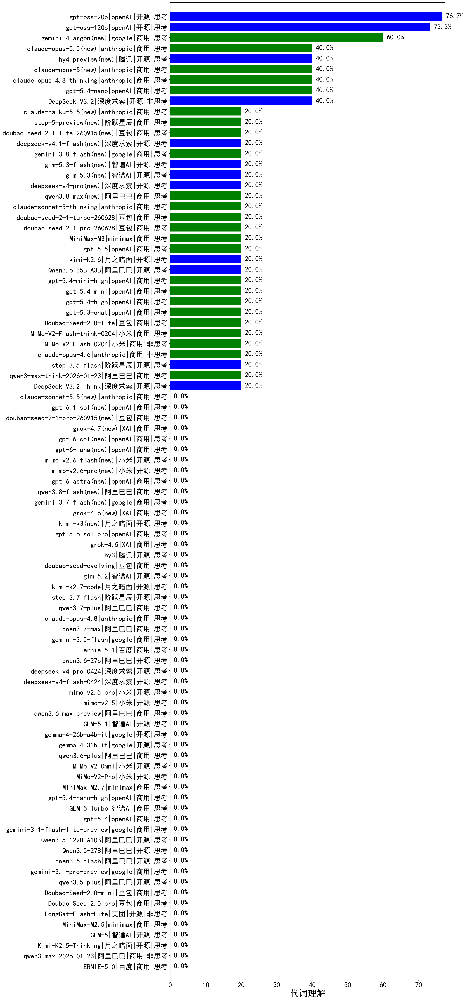

|类别|机构|大模型|【代词理解】准确率|平均耗时|平均消耗token|花费/千次（元）|排名（准确率）|
|---|---|-----|-------------------|-------|-----------|-----------|-----------|
|开源|openAI|gpt-oss-20b|76.7%|229s|658|0.6|1|
|开源|openAI|gpt-oss-120b|73.3%|295s|438|1.1|2|
|商用|google|gemini-4-argon(new)|60.0%|20s|210|17.6|3|
|开源|深度求索|DeepSeek-V3.2|40.0%|99s|248|0.7|4|
|商用|anthropic|claude-opus-4.8-thinking|40.0%|7s|474|66.1|5|
|商用|anthropic|claude-opus-5.5(new)|40.0%|11s|474|52.7|6|
|开源|腾讯|hy4-preview(new)|40.0%|98s|6890|123.0|7|
|商用|anthropic|claude-opus-5|40.0%|10s|572|83.4|8|
|开源|深度求索|deepseek-v4-pro|20.0%|24s|1081|26.5|9|
|商用|豆包|doubao-seed-2-1-pro-260628|20.0%|146s|5853|172.7|10|
|商用|anthropic|claude-sonnet-5-thinking|20.0%|13s|464|25.7|11|
|商用|阿里巴巴|qwen3.8-max|20.0%|16s|484|14.7|12|
|商用|google|gemini-3.8-flash(new)|20.0%|8s|588|27.7|13|
|开源|智谱AI|glm-5.3(new)|20.0%|935s|8490|236.1|14|
|开源|智谱AI|glm-5.3-flash(new)|20.0%|98s|3926|10.8|15|
|商用|openAI|gpt-5.5|20.0%|4s|304|48.2|16|
|开源|深度求索|deepseek-v4.1-flash(new)|20.0%|7s|656|4.7|17|
|商用|豆包|doubao-seed-2-1-lite-260915(new)|20.0%|112s|5251|14.0|18|
|商用|阶跃星辰|step-5-preview(new)|20.0%|30s|1452|28.1|19|
|商用|anthropic|claude-haiku-5.5(new)|20.0%|16s|489|1.4|20|
|商用|minimax|MiniMax-M3|20.0%|22s|716|9.1|21|
|商用|豆包|doubao-seed-2-1-turbo-260628|20.0%|76s|2962|43.0|22|
|开源|深度求索|DeepSeek-V3.2-Think|20.0%|23s|685|2.0|23|
|开源|阿里巴巴|Qwen3.6-35B-A3B|20.0%|94s|1291|13.2|24|
|开源|月之暗面|kimi-k2.6|20.0%|47s|1090|28.0|25|
|开源|阿里巴巴|qwen3.6-27b|0.0%|19s|1265|21.6|26|
|商用|openAI|gpt-6-luna(new)|0.0%|191s|283|0.7|27|
|开源|google|gemma-4-31b-it|0.0%|7s|189|0.4|28|
|商用|阿里巴巴|qwen3.6-plus|0.0%|31s|1200|13.6|29|
|商用|openAI|gpt-6-astra(new)|0.0%|12s|144|25.6|30|
|商用|minimax|MiniMax-M2.7|0.0%|20s|623|4.6|31|
|商用|google|gemini-3.1-flash-lite-preview|0.0%|1s|165|1.1|32|
|开源|小米|mimo-v2.6-pro(new)|0.0%|14s|340|1.8|33|
|开源|小米|mimo-v2.6-flash(new)|0.0%|31s|355|0.6|34|
|商用|openAI|gpt-6-sol(new)|0.0%|98s|150|5.5|35|
|开源|google|gemma-4-26b-a4b-it|0.0%|21s|232|0.5|36|
|商用|XAI|grok-4.7(new)|0.0%|72s|3662|116.8|37|
|开源|阿里巴巴|Qwen3.5-122B-A10B|0.0%|258s|1970|12.2|38|
|商用|豆包|doubao-seed-2-1-pro-260915(new)|0.0%|19s|678|17.5|39|
|开源|阿里巴巴|Qwen3.5-27B|0.0%|111s|1912|8.9|40|
|商用|google|gemini-3.1-pro-preview|0.0%|28s|635|48.7|41|
|商用|openAI|gpt-6.1-sol(new)|0.0%|5s|139|4.7|42|
|商用|anthropic|claude-sonnet-5.5(new)|0.0%|44s|307|14.7|43|
|商用|百度|ERNIE-5.0|0.0%|180s|1806|42.2|44|
|商用|minimax|MiniMax-M3.1-Flash(new)|0.0%|10s|498|1.2|45|
|商用|阿里巴巴|qwen3.8-flash(new)|0.0%|13s|740|1.8|46|
|商用|google|gemini-3.7-flash|0.0%|3s|377|8.3|47|
|商用|百度|ernie-5.1|0.0%|39s|489|7.7|48|
|开源|智谱AI|glm-5.2|0.0%|17s|670|17.2|49|
|商用|google|gemini-3.5-flash|0.0%|6s|928|54.5|50|
|商用|阿里巴巴|qwen3.7-max|0.0%|11s|464|14.9|51|
|商用|anthropic|claude-opus-4.8|0.0%|8s|226|22.7|52|
|开源|深度求索|deepseek-v4-pro-0424|0.0%|13s|312|6.7|53|
|商用|阿里巴巴|qwen3.7-plus|0.0%|14s|658|4.8|54|
|开源|阶跃星辰|step-3.7-flash|0.0%|16s|1032|7.8|55|
|开源|深度求索|deepseek-v4-flash-0424|0.0%|6s|277|0.5|56|
|开源|月之暗面|kimi-k2.7-code|0.0%|10s|420|9.9|57|
|开源|小米|mimo-v2.5-pro|0.0%|9s|760|11.5|58|
|商用|XAI|grok-4.6|0.0%|21s|1334|48.1|59|
|开源|小米|mimo-v2.5|0.0%|7s|881|8.8|60|
|商用|豆包|doubao-seed-evolving|0.0%|125s|4521|132.8|61|
|开源|腾讯|hy3|0.0%|52s|147|0.3|62|
|商用|XAI|grok-4.5|0.0%|58s|1574|58.2|63|
|商用|openAI|gpt-5.6-sol-pro|0.0%|6s|2254|119.9|64|
|开源|月之暗面|kimi-k3|0.0%|32s|671|55.3|65|
|商用|阿里巴巴|qwen3.6-max-preview|0.0%|32s|1126|57.3|66|
|开源|智谱AI|GLM-5.1|0.0%|72s|564|12.2|67|
|开源|月之暗面|kimi-k3.1-pro(new)|0.0%|26s|906|53.5|68|

