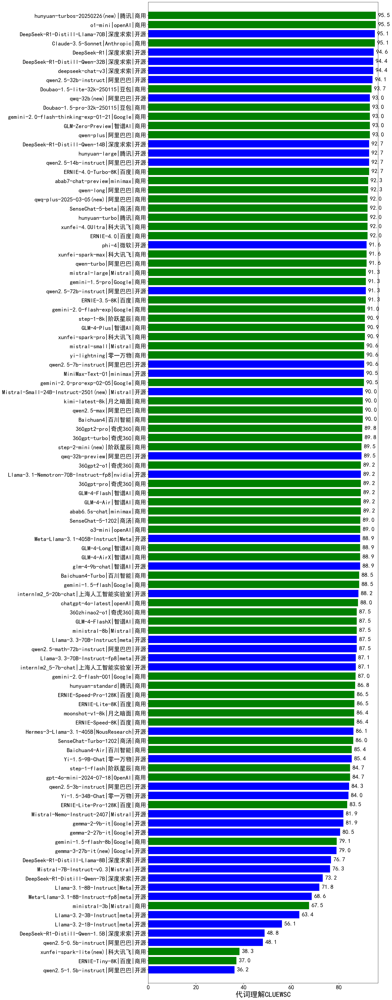

| 类别 | 大模型                         | 代词理解CLUEWSC | 排名 |
|-----|------------------------------|---------|----|
|开源|Qwen3-8B(new)|96.7|1|
|开源|Qwen3-4B(new)|96.7|2|
|开源|Qwen3-30B-A3B(new)|96.7|3|
|商用|GLM-4-Plus|94.7|4|
|开源|GLM-Z1-9B-0414(new)|94.7|5|
|开源|deepseek-chat-v3-0324|94.2|6|
|开源|DeepSeek-R1|94.2|7|
|开源|DeepSeek-R1-Distill-Llama-70B|94.2|8|
|商用|hunyuan-turbos-20250226|94.2|9|
|商用|Claude-3.5-Sonnet|94.2|10|
|商用|abab6.5s-chat|93.7|11|
|开源|DeepSeek-R1-Distill-Qwen-32B|93.7|12|
|商用|ERNIE-X1-32K-Preview(new)|93.3|13|
|商用|kimi-latest-8k|93.3|14|
|开源|qwen2.5-32b-instruct|93.1|15|
|开源|Llama-3.3-70B-Instruct-fp8|93.1|16|
|商用|hunyuan-t1-20250321|92.0|17|
|商用|GLM-Z1-Flash(new)|91.5|18|
|商用|hunyuan-turbos-20250313|91.5|19|
|商用|Doubao-1.5-lite-32k-250115|91.5|20|
|开源|hunyuan-large|91.5|21|
|商用|qwen-plus|91.5|22|
|开源|qwen2.5-14b-instruct|91.5|23|
|开源|Llama-4-Maverick-17B-128E-Instruct-FP8(new)|91.0|24|
|开源|Meta-Llama-3.1-8B-Instruct-fp8|91.0|25|
|开源|phi-4|91.0|26|
|开源|Mistral-Small-3.1-24B-Instruct-2503(new)|91.0|27|
|商用|GLM-Z1-FlashX(new)|91.0|28|
|商用|qwen-long|91.0|29|
|商用|xunfei-4.0Ultra|90.8|30|
|商用|GLM-4-AirX|90.5|31|
|商用|GLM-4-Air|90.5|32|
|商用|Doubao-1.5-pro-32k-250115|90.5|33|
|开源|DeepSeek-R1-Distill-Qwen-14B|90.5|34|
|开源|Llama-3.3-70B-Instruct|90.5|35|
|开源|GLM-Z1-32B-0414(new)|90.0|36|
|商用|SenseChat-5-beta|90.0|37|
|商用|gemini-2.5-flash-preview-04-17(new)|90.0|38|
|开源|Qwen3-14B(new)|90.0|39|
|开源|qwq-32b|90.0|40|
|开源|Qwen3-1.7B(new)|90.0|41|
|商用|GLM-Z1-Air(new)|90.0|42|
|商用|hunyuan-turbo|89.9|43|
|开源|Llama-3.1-8B-Instruct|89.9|44|
|商用|qwen-turbo|89.9|45|
|商用|xunfei-spark-pro|89.9|46|
|商用|xunfei-spark-max|89.4|47|
|开源|Meta-Llama-3.1-405B-Instruct|89.4|48|
|开源|qwen2.5-72b-instruct|89.4|49|
|商用|o3-mini|89.2|50|
|商用|qwq-plus-2025-03-05|89.2|51|
|商用|ERNIE-4.5-8K-Preview|89.0|52|
|商用|ERNIE-4.0-Turbo-8K|88.9|53|
|商用|GLM-4-Long|88.9|54|
|开源|Llama-3.2-3B-Instruct|88.9|55|
|商用|ERNIE-3.5-8K|88.9|56|
|商用|mistral-large|88.9|57|
|开源|qwen2.5-7b-instruct|88.9|58|
|商用|SenseChat-5-1202|88.5|59|
|商用|SenseChat-Turbo-1202|87.7|60|
|开源|MiniMax-Text-01|87.7|61|
|开源|Llama-4-Scout-17B-16E-Instruct(new)|87.3|62|
|商用|mistral-small|87.3|63|
|开源|GLM-4-32B-0414(new)|87.3|64|
|商用|360gpt2-pro|86.8|65|
|开源|GLM-4-9B-0414(new)|86.8|66|
|商用|step-2-mini|86.8|67|
|商用|yi-lightning|86.8|68|
|开源|GLM-Z1-Rumination-32B-0414(new)|86.7|69|
|商用|360gpt-turbo|86.2|70|
|商用|360gpt2-o1|85.2|71|
|商用|qwen2.5-max|84.6|72|
|开源|glm-4-9b-chat|84.1|73|
|商用|ERNIE-Lite-8K|83.8|74|
|商用|GLM-4-Flash|83.6|75|
|开源|internlm2_5-7b-chat|83.6|76|
|开源|Qwen3-32B(new)|83.3|77|
|商用|GLM-Z1-AirX(new)|83.3|78|
|商用|Baichuan4-Turbo|83.1|79|
|商用|ministral-8b|83.1|80|
|商用|360zhinao2-o1|83.1|81|
|开源|internlm2_5-20b-chat|82.5|82|
|商用|ERNIE-Lite-Pro-128K|82.3|83|
|开源|qwen2.5-3b-instruct|82.0|84|
|商用|gemini-2.0-flash-001|81.5|85|
|商用|moonshot-v1-8k|81.5|86|
|商用|hunyuan-standard|81.5|87|
|商用|GLM-4-FlashX|80.8|88|
|商用|ERNIE-Speed-Pro-128K|80.0|89|
|商用|chatgpt-4o-latest|80.0|90|
|开源|Qwen3-235B-A22B(new)|80.0|91|
|商用|gemini-2.5-pro-preview-03-25(new)|80.0|92|
|商用|ERNIE-Speed-8K|79.4|93|
|商用|Baichuan4-Air|78.3|94|
|开源|Qwen3-0.6B(new)|76.7|95|
|商用|gpt-4o-mini|76.7|96|
|开源|gemma-3-12b-it|72.0|97|
|开源|gemma-3-27b-it|70.0|98|
|开源|DeepSeek-R1-Distill-Llama-8B|69.3|99|
|商用|ministral-3b|68.3|100|
|开源|DeepSeek-R1-Distill-Qwen-7B|67.2|101|
|开源|Llama-3.2-1B-Instruct|64.6|102|
|开源|gemma-3-4b-it|43.4|103|
|开源|DeepSeek-R1-Distill-Qwen-1.5B|38.6|104|
|开源|qwen2.5-0.5b-instruct|31.2|105|
|商用|ERNIE-Tiny-8K|9.2|106|
|开源|qwen2.5-1.5b-instruct|8.5|107|
|商用|xunfei-spark-lite|6.3|108|

