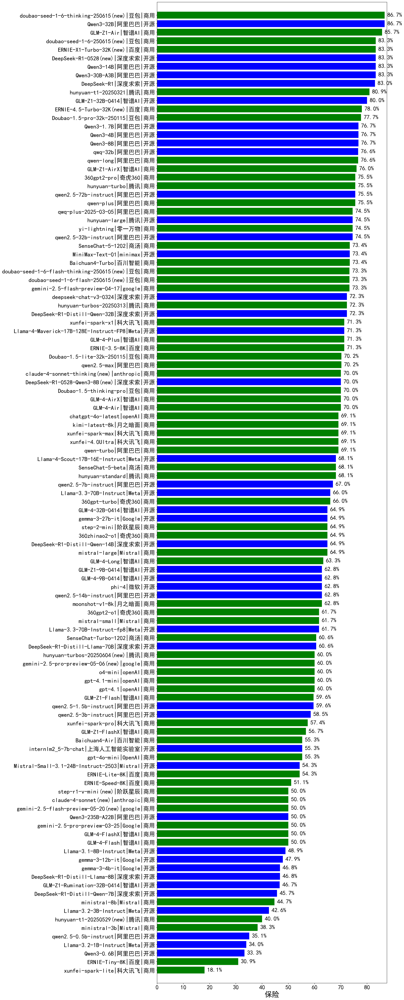

|类别|机构|大模型|【保险】准确率|平均耗时|平均消耗token|花费/千次（元）|排名（准确率）|
|---|---|-----|-------------------|-------|-----------|-----------|-----------|
|开源|深度求索|DeepSeek-V3.2-Exp-Think(new)|100.0%|56s|1330|3.9|1|
|开源|深度求索|DeepSeek-V3.1-Think|100.0%|50s|1020|11.6|2|
|开源|深度求索|DeepSeek-R1-0528|85.0%|256s|2132|33.1|3|
|开源|阿里巴巴|Qwen3-14B|85.0%|25s|988|1.8|4|
|商用|阿里巴巴|qwen-long-2025-01-25|80.0%|18s|374|0.6|5|
|商用|科大讯飞|xunfei-spark-x1-0725|80.0%|/|950|11.4|6|
|商用|阿里巴巴|qwen-plus-think-2025-07-28|80.0%|/|4017|31.4|7|
|商用|腾讯|hunyuan-t1-20250711|80.0%|22s|1330|4.9|8|
|商用|阿里巴巴|qwen-turbo-2025-07-15|80.0%|9s|396|0.2|9|
|商用|阿里巴巴|qwen-plus-2025-07-28|80.0%|14s|539|1.0|10|
|开源|阿里巴巴|qwen3-235b-a22b-instruct-2507|80.0%|13s|567|3.9|11|
|商用|豆包|doubao-seed-1-6-thinking-250715|80.0%|24s|1581|11.9|12|
|商用|Mistral|mistral-medium-2508|80.0%|18s|603|7.3|13|
|开源|深度求索|DeepSeek-V3.2-Exp(new)|80.0%|25s|465|1.3|14|
|开源|阿里巴巴|Qwen3-1.7B-nothink|80.0%|16s|508|1.2|15|
|开源|阿里巴巴|Qwen3-8B-nothink|80.0%|21s|542|0.0|16|
|开源|深度求索|DeepSeek-V3.1|80.0%|17s|294|2.9|17|
|商用|智谱AI|GLM-4.5-Flash|80.0%|43s|2376|0.0|18|
|开源|智谱AI|GLM-4.5-Air|80.0%|41s|1854|10.7|19|
|开源|阿里巴巴|Qwen3-30B-A3B-Instruct-2507|80.0%|4s|596|1.6|20|
|商用|阿里巴巴|qwen-flash-2025-07-28|80.0%|9s|756|1.0|21|
|商用|openAI|gpt-5-mini-2025-08-07|80.0%|38s|896|11.6|22|
|商用|阿里巴巴|qwen3-max-preview|80.0%|11s|502|10.3|23|
|开源|阿里巴巴|qwen3-next-80b-a3b-instruct|80.0%|7s|544|1.9|24|
|开源|阿里巴巴|Qwen3-8B|80.0%|600s|14721|0.0|25|
|商用|百度|ERNIE-X1-Turbo-32K|80.0%|158s|2261|8.8|26|
|开源|智谱AI|GLM-4.6(new)|80.0%|51s|2043|27.6|27|
|开源|阿里巴巴|Qwen3-32B|80.0%|27s|1126|4.2|28|
|商用|豆包|doubao-seed-1-6-lite-251015(new)|80.0%|40s|1066|2.3|29|
|开源|阿里巴巴|Qwen3-4B|75.0%|25s|2330|6.7|30|
|商用|百度|ERNIE-4.5-Turbo-32K|75.0%|17s|440|1.2|31|
|商用|google|gemini-2.5-pro|75.0%|29s|2317|161.7|32|
|开源|meta|Llama-4-Maverick-17B-128E-Instruct-FP8|75.0%|13s|602|2.3|33|
|开源|百度|ERNIE-4.5-300B-A47B|75.0%|12s|411|2.7|34|
|开源|minimax|MiniMax-M1|75.0%|227s|4160|29.9|35|
|商用|豆包|doubao-seed-1-6-250615|75.0%|111s|486|3.0|36|
|商用|豆包|doubao-seed-1-6-flash-thinking-250615|75.0%|6s|633|0.8|37|
|开源|meta|Llama-4-Scout-17B-16E-Instruct|70.0%|7s|597|1.2|38|
|开源|minimax|MiniMax-Text-01|70.0%|14s|915|7.3|39|
|开源|阿里巴巴|Qwen3-1.7B|70.0%|13s|1300|3.6|40|
|商用|anthropic|claude-4-sonnet-thinking|70.0%|54s|1739|175.7|41|
|商用|豆包|doubao-seed-1-6-flash-250615|70.0%|4s|388|0.4|42|
|开源|智谱AI|GLM-4-9B-0414|70.0%|11s|399|0.0|43|
|商用|XAI|grok-4-0709|70.0%|587s|1541|159.5|44|
|商用|豆包|Doubao-1.5-lite-32k-250115|65.0%|6s|285|0.1|45|
|商用|百川智能|Baichuan4-Turbo|65.0%|/|/|/|46|
|开源|google|gemma-3-27b-it|65.0%|/|/|/|47|
|开源|深度求索|DeepSeek-R1-0528-Qwen3-8B|65.0%|281s|2122|0.0|48|
|商用|google|gemini-2.5-flash|65.0%|12s|2146|37.3|49|
|商用|google|gemini-2.5-flash-lite|60.0%|3s|508|1.3|50|
|开源|Mistral|Magistral-Small-2507|60.0%|156s|5954|63.8|51|
|商用|豆包|doubao-seed-1-6-251015(new)|60.0%|8s|865|6.0|52|
|商用|腾讯|hunyuan-turbos-20250926(new)|60.0%|17s|721|1.3|53|
|商用|阿里巴巴|qwen-turbo-think-2025-07-15|60.0%|/|2655|7.7|54|
|商用|阿里巴巴|qwen-flash-think-2025-07-28|60.0%|42s|4386|6.4|55|
|开源|minimax|MiniMax-M2(new)|60.0%|26s|1806|14.4|56|
|开源|豆包|Seed-OSS-36B-Instruct|60.0%|113s|2107|8.2|57|
|商用|openAI|gpt-5-nano-2025-08-07|60.0%|135s|2134|5.9|58|
|开源|openAI|gpt-oss-120b|60.0%|7s|735|2.0|59|
|商用|openAI|gpt-5-2025-08-07|60.0%|79s|479|28.2|60|
|开源|openAI|gpt-oss-20b|60.0%|12s|1117|1.2|61|
|开源|阿里巴巴|qwen3-235b-a22b-thinking-2507|60.0%|188s|3002|58.2|62|
|商用|智谱AI|GLM-4.5-Flash-nothink|60.0%|18s|871|0.0|63|
|开源|阿里巴巴|Qwen3-4B-nothink|60.0%|13s|492|1.2|64|
|商用|openAI|o4-mini|60.0%|32s|1303|39.1|65|
|商用|anthropic|claude-4-sonnet|60.0%|44s|595|51.4|66|
|开源|百度|ERNIE-4.5-21B-A3B|60.0%|3s|347|0.0|67|
|开源|腾讯|Hunyuan-A13B-Instruct|60.0%|58s|1606|6.2|68|
|开源|智谱AI|GLM-4.5-Air-nothink|60.0%|14s|951|5.2|69|
|开源|月之暗面|kimi-k2-0711-preview|60.0%|24s|471|6.6|70|
|开源|阿里巴巴|Qwen3-14B-nothink|60.0%|22s|492|0.8|71|
|开源|智谱AI|GLM-4.5-nothink|60.0%|27s|789|10.0|72|
|开源|阿里巴巴|Qwen3-32B-nothink|60.0%|140s|613|2.1|73|
|开源|智谱AI|GLM-4.5|60.0%|99s|2603|35.5|74|
|开源|阿里巴巴|Qwen3-30B-A3B-Thinking-2507|60.0%|85s|3195|8.7|75|
|开源|阶跃星辰|step-3|60.0%|157s|2901|11.4|76|
|商用|百川智能|Baichuan4-Air|55.0%|/|/|/|77|
|开源|google|gemma-3-4b-it|55.0%|/|/|/|78|
|商用|360|360zhinao2-o1|50.0%|/|/|/|79|
|开源|google|gemma-3-12b-it|50.0%|/|/|/|80|
|商用|百度|ERNIE-Lite-8K|45.0%|/|/|/|81|
|开源|月之暗面|Kimi-K2-Thinking(new)|40.0%|907s|15863|252.8|82|
|开源|阿里巴巴|Qwen3-0.6B-nothink|40.0%|11s|248|0.5|83|
|商用|XAI|grok-3-mini|40.0%|253s|1161|4.1|84|
|开源|腾讯|Hunyuan-A13B-Instruct-nothink|40.0%|10s|342|1.1|85|
|开源|阿里巴巴|Qwen3-0.6B|25.0%|7s|1431|4.0|86|
|开源|Mistral|Mistral-Small-3.2-24B-Instruct-2506|20.0%|137s|429|0.8|87|
|开源|百度|ERNIE-4.5-0.3B|20.0%|2s|387|0.0|88|

