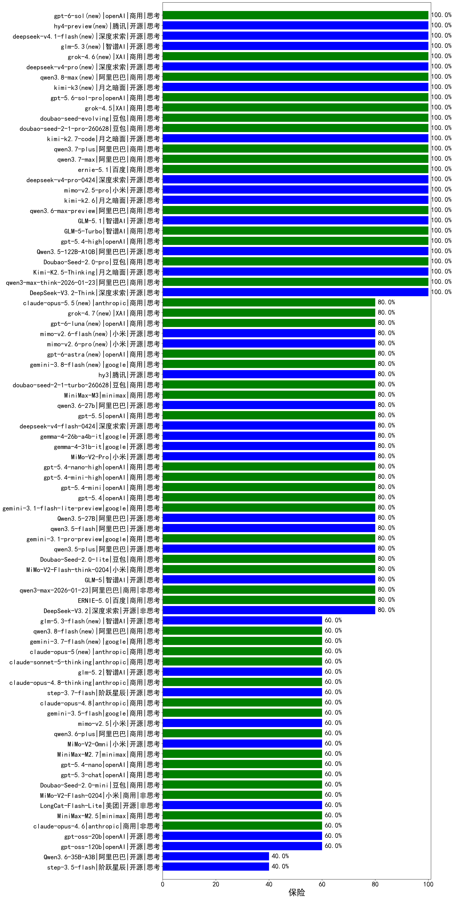

|类别|机构|大模型|【保险】准确率|平均耗时|平均消耗token|花费/千次（元）|排名（准确率）|
|---|---|-----|-------------------|-------|-----------|-----------|-----------|
|商用|阿里巴巴|qwen3.7-max|100.0%|23s|1042|35.2|1|
|开源|小米|mimo-v2.5-pro|100.0%|28s|1747|31.9|2|
|商用|openAI|gpt-5.4-high|100.0%|18s|1061|102.0|3|
|开源|深度求索|deepseek-v4-pro-0424|100.0%|47s|1299|30.2|4|
|开源|深度求索|deepseek-v4.1-flash(new)|100.0%|15s|2846|22.1|5|
|开源|月之暗面|kimi-k2.6|100.0%|91s|1693|44.0|6|
|开源|阿里巴巴|Qwen3.5-122B-A10B|100.0%|369s|3317|20.7|7|
|商用|XAI|grok-4.5|100.0%|58s|1765|65.9|8|
|商用|百度|ernie-5.1|100.0%|54s|1044|17.5|9|
|商用|XAI|grok-4.6(new)|100.0%|37s|1885|70.9|10|
|商用|阿里巴巴|qwen3.6-max-preview|100.0%|61s|1998|103.6|11|
|开源|腾讯|hy4-preview(new)|100.0%|43s|2885|50.8|12|
|开源|深度求索|deepseek-v4-pro(new)|100.0%|78s|2276|58.5|13|
|商用|豆包|Doubao-Seed-2.0-pro|100.0%|263s|1162|16.8|14|
|开源|智谱AI|glm-5.3(new)|100.0%|103s|4144|114.1|15|
|商用|阿里巴巴|qwen3.7-plus|100.0%|27s|1413|10.7|16|
|商用|阿里巴巴|qwen3.8-max(new)|100.0%|18s|904|29.3|17|
|开源|月之暗面|kimi-k2.7-code|100.0%|69s|2503|65.8|18|
|开源|月之暗面|kimi-k3(new)|100.0%|52s|1070|93.9|19|
|商用|openAI|gpt-6-sol(new)|100.0%|177s|431|24.1|20|
|商用|豆包|doubao-seed-2-1-pro-260628|100.0%|477s|9787|290.3|21|
|开源|月之暗面|Kimi-K2.5-Thinking|100.0%|496s|2466|50.3|22|
|商用|阿里巴巴|qwen3-max-think-2026-01-23|100.0%|387s|4692|46.2|23|
|开源|智谱AI|GLM-5.1|100.0%|170s|1365|31.2|24|
|商用|豆包|doubao-seed-evolving|100.0%|237s|7808|231.0|25|
|开源|深度求索|DeepSeek-V3.2-Think|100.0%|157s|1523|4.5|26|
|商用|openAI|gpt-5.6-sol-pro|100.0%|54s|5076|487.9|27|
|商用|智谱AI|GLM-5-Turbo|100.0%|40s|1676|35.4|28|
|商用|anthropic|claude-opus-5.5(new)|80.0%|19s|817|98.1|29|
|开源|深度求索|deepseek-v4-flash-0424|80.0%|42s|1592|3.1|30|
|商用|openAI|gpt-5.5|80.0%|34s|2064|414.5|31|
|开源|阿里巴巴|qwen3.6-27b|80.0%|30s|1898|32.7|32|
|开源|google|gemma-4-31b-it|80.0%|94s|600|1.5|33|
|商用|minimax|MiniMax-M3|80.0%|28s|782|10.0|34|
|商用|豆包|doubao-seed-2-1-turbo-260628|80.0%|302s|12235|181.9|35|
|开源|google|gemma-4-26b-a4b-it|80.0%|65s|570|1.4|36|
|商用|openAI|gpt-5.4-nano-high|80.0%|13s|720|5.5|37|
|开源|阿里巴巴|qwen3.5-plus|80.0%|39s|3238|15.2|38|
|商用|google|gemini-3.1-pro-preview|80.0%|30s|1814|147.7|39|
|开源|深度求索|DeepSeek-V3.2|80.0%|23s|451|1.3|40|
|商用|百度|ERNIE-5.0|80.0%|287s|3230|76.1|41|
|商用|阿里巴巴|qwen3-max-2026-01-23|80.0%|17s|589|5.1|42|
|商用|XAI|grok-4.7(new)|80.0%|105s|8081|302.1|43|
|开源|智谱AI|GLM-5|80.0%|91s|2969|52.2|44|
|商用|openAI|gpt-6-luna(new)|80.0%|376s|962|3.1|45|
|开源|小米|mimo-v2.6-flash(new)|80.0%|94s|1654|3.2|46|
|开源|小米|mimo-v2.6-pro(new)|80.0%|73s|1766|10.3|47|
|商用|小米|MiMo-V2-Flash-think-0204|80.0%|956s|2420|4.9|48|
|商用|豆包|Doubao-Seed-2.0-lite|80.0%|225s|1156|3.7|49|
|开源|腾讯|hy3|80.0%|31s|249|0.7|50|
|开源|阿里巴巴|qwen3.5-flash|80.0%|411s|4150|8.1|51|
|开源|阿里巴巴|Qwen3.5-27B|80.0%|195s|3771|17.7|52|
|商用|google|gemini-3.1-flash-lite-preview|80.0%|4s|441|3.8|53|
|商用|openAI|gpt-5.4|80.0%|3s|268|18.6|54|
|商用|openAI|gpt-5.4-mini|80.0%|89s|256|5.2|55|
|商用|openAI|gpt-5.4-mini-high|80.0%|27s|2811|85.7|56|
|商用|openAI|gpt-6-astra(new)|80.0%|14s|406|111.8|57|
|商用|google|gemini-3.8-flash(new)|80.0%|11s|848|40.4|58|
|开源|小米|MiMo-V2-Pro|80.0%|20s|1437|25.4|59|
|开源|智谱AI|glm-5.3-flash(new)|60.0%|70s|2811|7.7|60|
|商用|anthropic|claude-opus-5(new)|60.0%|17s|1008|156.2|61|
|商用|google|gemini-3.7-flash(new)|60.0%|7s|883|21.2|62|
|商用|阿里巴巴|qwen3.8-flash(new)|60.0%|119s|6530|17.4|63|
|开源|openAI|gpt-oss-120b|60.0%|7s|735|2.0|64|
|商用|anthropic|claude-sonnet-5-thinking|60.0%|19s|1364|87.5|65|
|开源|智谱AI|glm-5.2|60.0%|77s|3254|89.2|66|
|商用|anthropic|claude-opus-4.6|60.0%|24s|661|95.3|67|
|商用|minimax|MiniMax-M2.5|60.0%|65s|2621|21.3|68|
|开源|美团|LongCat-Flash-Lite|60.0%|406s|580|0.0|69|
|商用|小米|MiMo-V2-Flash-0204|60.0%|95s|492|0.9|70|
|商用|豆包|Doubao-Seed-2.0-mini|60.0%|635s|3149|6.0|71|
|商用|openAI|gpt-5.3-chat|60.0%|69s|547|44.3|72|
|商用|openAI|gpt-5.4-nano|60.0%|11s|237|1.3|73|
|商用|minimax|MiniMax-M2.7|60.0%|70s|2491|20.2|74|
|开源|小米|MiMo-V2-Omni|60.0%|15s|1517|17.4|75|
|商用|阿里巴巴|qwen3.6-plus|60.0%|54s|2266|26.2|76|
|开源|openAI|gpt-oss-20b|60.0%|12s|1117|1.2|77|
|商用|google|gemini-3.5-flash|60.0%|10s|1842|111.0|78|
|商用|anthropic|claude-opus-4.8|60.0%|10s|649|93.4|79|
|开源|阶跃星辰|step-3.7-flash|60.0%|186s|4674|37.2|80|
|商用|anthropic|claude-opus-4.8-thinking|60.0%|25s|988|152.8|81|
|开源|小米|mimo-v2.5|60.0%|24s|1659|19.4|82|
|开源|阿里巴巴|Qwen3.6-35B-A3B|40.0%|429s|2089|21.7|83|
|开源|阶跃星辰|step-3.5-flash|40.0%|31s|2738|5.6|84|

