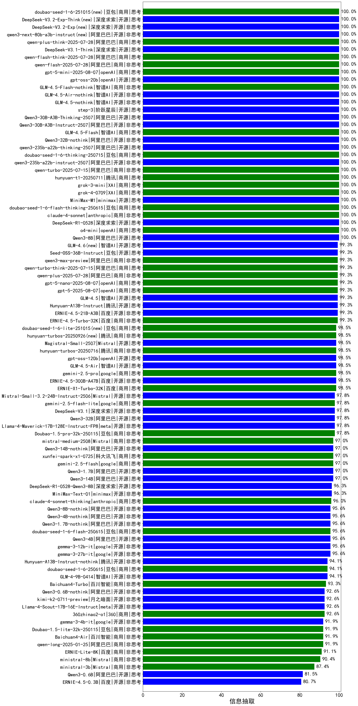

|类别|机构|大模型|【信息抽取】准确率|平均耗时|平均消耗token|花费/千次（元）|排名（准确率）|
|---|---|-----|-------------------|-------|-----------|-----------|-----------|
|开源|阿里巴巴|qwen3-235b-a22b-thinking-2507|100.0%|27s|1459|27.4|1|
|开源|智谱AI|GLM-4.5-nothink|100.0%|5s|214|1.9|2|
|商用|XAI|grok-4-0709|100.0%|163s|587|55.3|3|
|商用|XAI|grok-3-mini|100.0%|174s|672|2.3|4|
|商用|腾讯|hunyuan-t1-20250711|100.0%|7s|445|1.4|5|
|商用|阿里巴巴|qwen-turbo-2025-07-15|100.0%|5s|165|0.1|6|
|开源|阿里巴巴|qwen3-235b-a22b-instruct-2507|100.0%|2s|176|0.8|7|
|商用|豆包|doubao-seed-1-6-thinking-250715|100.0%|8s|435|2.7|8|
|开源|阿里巴巴|Qwen3-32B-nothink|100.0%|9s|192|0.5|9|
|商用|智谱AI|GLM-4.5-Flash|100.0%|16s|950|0.0|10|
|开源|阿里巴巴|Qwen3-30B-A3B-Instruct-2507|100.0%|1s|179|0.3|11|
|开源|阿里巴巴|Qwen3-30B-A3B-Thinking-2507|100.0%|31s|1446|3.8|12|
|开源|阶跃星辰|step-3|100.0%|55s|1104|4.2|13|
|开源|智谱AI|GLM-4.5-Air-nothink|100.0%|2s|183|0.6|14|
|开源|minimax|MiniMax-M1|100.0%|45s|1271|6.5|15|
|商用|智谱AI|GLM-4.5-Flash-nothink|100.0%|5s|186|0.0|16|
|开源|openAI|gpt-oss-20b|100.0%|4s|579|0.5|17|
|商用|openAI|gpt-5-mini-2025-08-07|100.0%|125s|575|6.9|18|
|商用|阿里巴巴|qwen-flash-2025-07-28|100.0%|4s|181|0.1|19|
|商用|阿里巴巴|qwen-flash-think-2025-07-28|100.0%|16s|1435|2.0|20|
|开源|深度求索|DeepSeek-V3.1-Think|100.0%|28s|574|6.2|21|
|商用|阿里巴巴|qwen-plus-think-2025-07-28|100.0%|/|1375|10.3|22|
|开源|阿里巴巴|qwen3-next-80b-a3b-instruct|100.0%|9s|226|0.6|23|
|开源|深度求索|DeepSeek-V3.2-Exp(new)|100.0%|469s|182|0.5|24|
|开源|深度求索|DeepSeek-V3.2-Exp-Think(new)|100.0%|548s|688|2.0|25|
|商用|豆包|doubao-seed-1-6-251015(new)|100.0%|3s|417|2.4|26|
|商用|anthropic|claude-haiku-4.5(new)|100.0%|6s|606|13.7|27|
|开源|月之暗面|Kimi-K2-Thinking(new)|100.0%|57s|579|7.7|28|
|开源|深度求索|DeepSeek-R1-0528|100.0%|173s|1038|15.5|29|
|商用|anthropic|claude-4-sonnet|100.0%|40s|597|37.9|30|
|开源|阿里巴巴|Qwen3-8B|100.0%|6s|657|0.0|31|
|商用|openAI|o4-mini|100.0%|20s|715|17.9|32|
|商用|XAI|grok-4-1-fast-non-reasoning(new)|100.0%|77s|459|1.0|33|
|商用|XAI|grok-4-1-fast-reasoning(new)|100.0%|4s|716|1.9|34|
|商用|豆包|doubao-seed-1-6-flash-thinking-250615|100.0%|3s|304|0.3|35|
|商用|阿里巴巴|qwen-plus-2025-07-28|99.3%|3s|187|0.3|36|
|商用|openAI|gpt-5-nano-2025-08-07|99.3%|68s|1030|2.7|37|
|商用|阿里巴巴|qwen3-max-preview|99.3%|2s|185|2.7|38|
|商用|阿里巴巴|qwen-turbo-think-2025-07-15|99.3%|/|664|1.7|39|
|开源|智谱AI|GLM-4.5|99.3%|102s|1199|15.8|40|
|开源|百度|ERNIE-4.5-21B-A3B|99.3%|7s|155|0.0|41|
|商用|openAI|gpt-5-2025-08-07|99.3%|20s|393|21.5|42|
|开源|豆包|Seed-OSS-36B-Instruct|99.3%|43s|475|1.6|43|
|商用|百度|ERNIE-4.5-Turbo-32K|99.3%|3s|138|0.2|44|
|开源|智谱AI|GLM-4.6(new)|99.3%|30s|1196|15.7|45|
|开源|腾讯|Hunyuan-A13B-Instruct|99.3%|39s|386|1.3|46|
|商用|腾讯|hunyuan-turbos-20250926(new)|98.5%|3s|220|0.3|47|
|开源|Mistral|Magistral-Small-2507|98.5%|392s|4145|44.1|48|
|开源|百度|ERNIE-4.5-300B-A47B|98.5%|1s|149|0.6|49|
|商用|百度|ERNIE-X1-Turbo-32K|98.5%|33s|794|2.9|50|
|开源|openAI|gpt-oss-120b|98.5%|121s|424|1.0|51|
|开源|智谱AI|GLM-4.5-Air|98.5%|23s|984|5.4|52|
|商用|豆包|doubao-seed-1-6-lite-251015(new)|98.5%|6s|393|0.7|53|
|商用|google|gemini-2.5-pro|98.5%|14s|1298|87.8|54|
|开源|minimax|MiniMax-M2(new)|98.5%|9s|665|4.8|55|
|开源|阿里巴巴|Qwen3-32B|97.8%|2s|186|0.4|56|
|开源|Mistral|Mistral-Small-3.2-24B-Instruct-2506|97.8%|342s|236|0.3|57|
|开源|meta|Llama-4-Maverick-17B-128E-Instruct-FP8|97.8%|1s|273|0.7|58|
|开源|深度求索|DeepSeek-V3.1|97.8%|7s|179|1.4|59|
|商用|google|gemini-2.5-flash-lite|97.8%|0s|175|0.3|60|
|开源|阿里巴巴|Qwen3-1.7B|97.0%|4s|609|1.6|61|
|开源|阿里巴巴|Qwen3-14B-nothink|97.0%|7s|191|0.2|62|
|商用|Mistral|mistral-medium-2508|97.0%|13s|272|2.3|63|
|商用|科大讯飞|xunfei-spark-x1-0725|97.0%|/|361|4.3|64|
|商用|google|gemini-2.5-flash|97.0%|4s|875|14.3|65|
|开源|阿里巴巴|Qwen3-14B|97.0%|7s|559|1.0|66|
|开源|minimax|MiniMax-Text-01|96.3%|9s|917|7.3|67|
|开源|深度求索|DeepSeek-R1-0528-Qwen3-8B|96.3%|280s|831|0.0|68|
|商用|anthropic|claude-haiku-4.5-thinking(new)|96.0%|7s|970|26.1|69|
|商用|google|gemini-3-pro-preview(new)|96.0%|57s|1265|96.9|70|
|商用|anthropic|claude-4-sonnet-thinking|96.0%|47s|977|79.2|71|
|开源|阿里巴巴|Qwen3-4B-nothink|95.6%|7s|190|0.3|72|
|开源|google|gemma-3-27b-it|95.6%|/|/|/|73|
|开源|google|gemma-3-12b-it|95.6%|/|/|/|74|
|开源|阿里巴巴|Qwen3-4B|95.6%|10s|180|0.3|75|
|开源|阿里巴巴|Qwen3-8B-nothink|95.6%|10s|195|0.0|76|
|开源|阿里巴巴|Qwen3-1.7B-nothink|95.6%|6s|212|0.4|77|
|商用|豆包|doubao-seed-1-6-flash-250615|95.6%|2s|147|0.1|78|
|开源|智谱AI|GLM-4-9B-0414|94.1%|7s|167|0.0|79|
|开源|腾讯|Hunyuan-A13B-Instruct-nothink|94.1%|3s|148|0.3|80|
|商用|豆包|doubao-seed-1-6-250615|94.1%|14s|176|0.5|81|
|商用|百川智能|Baichuan4-Turbo|93.3%|/|/|/|82|
|开源|meta|Llama-4-Scout-17B-16E-Instruct|92.6%|2s|272|0.4|83|
|商用|360|360zhinao2-o1|92.6%|/|/|/|84|
|开源|阿里巴巴|Qwen3-0.6B-nothink|92.6%|8s|156|0.2|85|
|开源|月之暗面|kimi-k2-0711-preview|92.6%|87s|185|2.0|86|
|商用|openAI|gpt-5.1-medium(new)|92.0%|50s|396|16.9|87|
|商用|openAI|gpt-5.1(new)|92.0%|110s|331|12.3|88|
|开源|月之暗面|kimi-k2-0905(new)|92.0%|35s|215|1.7|89|
|商用|百川智能|Baichuan4-Air|91.9%|/|/|/|90|
|开源|google|gemma-3-4b-it|91.9%|/|/|/|91|
|商用|豆包|Doubao-1.5-lite-32k-250115|91.9%|2s|138|0.1|92|
|商用|阿里巴巴|qwen-long-2025-01-25|91.9%|6s|276|0.3|93|
|商用|百度|ERNIE-Lite-8K|91.1%|/|/|/|94|
|开源|阿里巴巴|Qwen3-0.6B|81.5%|1s|433|1.0|95|
|开源|百度|ERNIE-4.5-0.3B|80.7%|9s|152|0.0|96|

