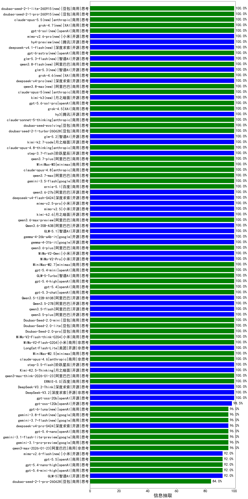

|类别|机构|大模型|【信息抽取】准确率|平均耗时|平均消耗token|花费/千次（元）|排名（准确率）|
|---|---|-----|-------------------|-------|-----------|-----------|-----------|
|开源|小米|mimo-v2.5-pro|100.0%|13s|899|13.4|1|
|商用|minimax|MiniMax-M3|100.0%|16s|616|6.6|2|
|商用|豆包|doubao-seed-evolving|100.0%|111s|3283|93.6|3|
|商用|豆包|doubao-seed-2-1-turbo-260628|100.0%|49s|2318|32.3|4|
|开源|智谱AI|glm-5.2|100.0%|33s|951|23.7|5|
|开源|月之暗面|kimi-k2.7-code|100.0%|11s|510|11.2|6|
|商用|anthropic|claude-opus-4.8-thinking|100.0%|6s|552|58.7|7|
|开源|阶跃星辰|step-3.7-flash|100.0%|74s|952|6.8|8|
|商用|阿里巴巴|qwen3.7-plus|100.0%|19s|1020|7.3|9|
|商用|anthropic|claude-opus-4.8|100.0%|9s|535|55.6|10|
|开源|腾讯|hy3|100.0%|10s|291|0.7|11|
|商用|阿里巴巴|qwen3.7-max|100.0%|16s|816|26.1|12|
|商用|google|gemini-3.5-flash|100.0%|4s|947|51.6|13|
|商用|百度|ernie-5.1|100.0%|32s|396|4.8|14|
|开源|阿里巴巴|qwen3.6-27b|100.0%|22s|1431|23.7|15|
|开源|深度求索|deepseek-v4-flash-0424|100.0%|14s|379|0.6|16|
|开源|openAI|gpt-oss-20b|100.0%|4s|579|0.5|17|
|开源|小米|mimo-v2.5|100.0%|6s|874|7.9|18|
|商用|anthropic|claude-sonnet-5-thinking|100.0%|9s|533|22.2|19|
|商用|XAI|grok-4.5|100.0%|107s|1060|34.4|20|
|商用|阿里巴巴|qwen3.6-max-preview|100.0%|37s|1317|65.0|21|
|商用|openAI|gpt-6-astra(new)|100.0%|8s|331|65.5|22|
|商用|豆包|doubao-seed-2-1-pro-260915(new)|100.0%|60s|1802|49.2|23|
|商用|anthropic|claude-opus-5.5(new)|100.0%|14s|659|61.6|24|
|商用|XAI|grok-4.7(new)|100.0%|17s|1815|37.1|25|
|商用|openAI|gpt-6-sol(new)|100.0%|110s|319|12.2|26|
|开源|小米|mimo-v2.6-pro(new)|100.0%|8s|433|2.2|27|
|开源|腾讯|hy4-preview(new)|100.0%|42s|2913|50.7|28|
|开源|深度求索|deepseek-v4.1-flash(new)|100.0%|17s|927|6.5|29|
|开源|智谱AI|glm-5.3-flash(new)|100.0%|16s|641|1.5|30|
|商用|openAI|gpt-5.6-sol-pro|100.0%|18s|3244|216.7|31|
|商用|阿里巴巴|qwen3.8-flash(new)|100.0%|19s|663|1.4|32|
|开源|智谱AI|glm-5.3(new)|100.0%|34s|687|16.3|33|
|商用|XAI|grok-4.6(new)|100.0%|809s|1043|33.7|34|
|开源|深度求索|deepseek-v4-pro(new)|100.0%|22s|1020|23.7|35|
|商用|阿里巴巴|qwen3.8-max(new)|100.0%|10s|549|15.6|36|
|商用|anthropic|claude-opus-5(new)|100.0%|9s|686|82.1|37|
|开源|月之暗面|kimi-k3(new)|100.0%|28s|679|51.5|38|
|开源|月之暗面|kimi-k2.6|100.0%|34s|892|21.5|39|
|商用|豆包|doubao-seed-2-1-lite-260915(new)|100.0%|78s|3677|9.6|40|
|开源|阿里巴巴|Qwen3.6-35B-A3B|100.0%|98s|1365|13.5|41|
|商用|openAI|gpt-5.4|100.0%|5s|312|17.0|42|
|商用|小米|MiMo-V2-Flash-0204|100.0%|46s|318|0.4|43|
|商用|小米|MiMo-V2-Flash-think-0204|100.0%|96s|1628|3.2|44|
|商用|豆包|Doubao-Seed-2.0-pro|100.0%|195s|954|12.6|45|
|商用|豆包|Doubao-Seed-2.0-lite|100.0%|162s|882|2.6|46|
|商用|豆包|Doubao-Seed-2.0-mini|100.0%|227s|1025|1.7|47|
|开源|阿里巴巴|qwen3.5-plus|100.0%|34s|2324|10.6|48|
|开源|智谱AI|GLM-5.1|100.0%|118s|961|20.6|49|
|开源|阿里巴巴|qwen3.5-flash|100.0%|251s|1657|3.1|50|
|开源|阿里巴巴|Qwen3.5-27B|100.0%|122s|1899|8.5|51|
|开源|阿里巴巴|Qwen3.5-122B-A10B|100.0%|285s|1838|11.0|52|
|商用|anthropic|claude-opus-4.6|100.0%|6s|504|50.4|53|
|开源|阶跃星辰|step-3.5-flash|100.0%|8s|740|1.4|54|
|商用|openAI|gpt-5.3-chat|100.0%|9s|291|13.1|55|
|商用|openAI|gpt-5.4-high|100.0%|23s|535|40.4|56|
|开源|美团|LongCat-Flash-Lite|100.0%|87s|219|0.0|57|
|商用|智谱AI|GLM-5-Turbo|100.0%|42s|1130|22.5|58|
|商用|openAI|gpt-5.4-mini|100.0%|3s|306|4.9|59|
|开源|月之暗面|Kimi-K2.5-Thinking|100.0%|129s|709|12.7|60|
|商用|阿里巴巴|qwen3-max-think-2026-01-23|100.0%|79s|2051|19.4|61|
|商用|百度|ERNIE-5.0|100.0%|89s|820|17.5|62|
|商用|minimax|MiniMax-M2.7|100.0%|15s|732|5.1|63|
|开源|小米|MiMo-V2-Pro|100.0%|232s|1284|21.5|64|
|开源|小米|MiMo-V2-Omni|100.0%|252s|883|8.0|65|
|开源|深度求索|DeepSeek-V3.2-Think|100.0%|103s|737|2.1|66|
|开源|深度求索|DeepSeek-V3.2|100.0%|5s|236|0.6|67|
|商用|阿里巴巴|qwen3.6-plus|100.0%|36s|1247|13.6|68|
|开源|google|gemma-4-31b-it|100.0%|11s|263|0.4|69|
|开源|google|gemma-4-26b-a4b-it|100.0%|14s|291|0.5|70|
|商用|minimax|MiniMax-M2.5|100.0%|14s|911|6.6|71|
|开源|openAI|gpt-oss-120b|98.5%|121s|424|1.0|72|
|商用|google|gemini-3.7-flash(new)|96.0%|4s|692|14.9|73|
|商用|google|gemini-3.8-flash(new)|96.0%|10s|718|31.2|74|
|商用|google|gemini-3.1-flash-lite-preview|96.0%|2s|241|1.2|75|
|商用|openAI|gpt-5.4-nano|96.0%|15s|316|1.4|76|
|商用|openAI|gpt-6-luna(new)|96.0%|230s|334|0.7|77|
|商用|阿里巴巴|qwen3-max-2026-01-23|96.0%|56s|240|1.3|78|
|开源|深度求索|deepseek-v4-pro-0424|96.0%|21s|468|9.6|79|
|商用|google|gemini-3.1-pro-preview|96.0%|16s|1126|85.0|80|
|开源|智谱AI|GLM-5|92.0%|31s|1163|19.0|81|
|商用|openAI|gpt-5.4-mini-high|92.0%|81s|484|10.5|82|
|开源|小米|mimo-v2.6-flash(new)|92.0%|22s|395|0.6|83|
|商用|openAI|gpt-5.4-nano-high|92.0%|4s|379|2.0|84|
|商用|openAI|gpt-5.5|92.0%|4s|388|50.0|85|
|商用|豆包|doubao-seed-2-1-pro-260628|84.0%|100s|3460|99.0|86|

