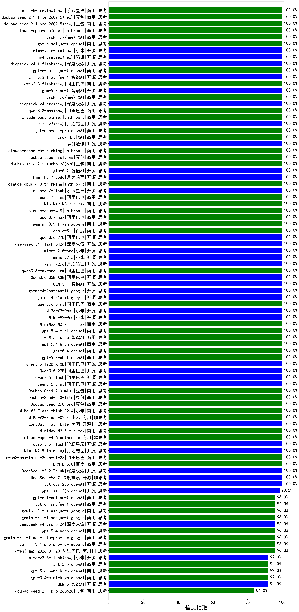

|类别|机构|大模型|【信息抽取】准确率|平均耗时|平均消耗token|花费/千次（元）|排名（准确率）|
|---|---|-----|-------------------|-------|-----------|-----------|-----------|
|商用|阿里巴巴|qwen3.7-plus|100.0%|19s|1020|7.3|1|
|开源|阶跃星辰|step-3.7-flash|100.0%|74s|952|6.8|2|
|开源|月之暗面|kimi-k2.7-code|100.0%|11s|510|11.2|3|
|开源|智谱AI|glm-5.2|100.0%|33s|951|23.7|4|
|开源|openAI|gpt-oss-20b|100.0%|4s|579|0.5|5|
|商用|豆包|doubao-seed-2-1-turbo-260628|100.0%|49s|2318|32.3|6|
|商用|豆包|doubao-seed-evolving|100.0%|111s|3283|93.6|7|
|商用|anthropic|claude-sonnet-5-thinking|100.0%|9s|533|22.2|8|
|开源|腾讯|hy3|100.0%|10s|291|0.7|9|
|商用|XAI|grok-4.5|100.0%|107s|1060|34.4|10|
|商用|openAI|gpt-5.6-sol-pro|100.0%|18s|3244|216.7|11|
|开源|月之暗面|kimi-k3|100.0%|28s|679|51.5|12|
|商用|anthropic|claude-opus-5|100.0%|9s|686|82.1|13|
|商用|阿里巴巴|qwen3.8-max|100.0%|10s|549|15.6|14|
|开源|深度求索|deepseek-v4-pro|100.0%|22s|1020|23.7|15|
|商用|XAI|grok-4.6|100.0%|809s|1043|33.7|16|
|商用|阶跃星辰|step-5-preview(new)|100.0%|8s|683|11.8|17|
|开源|智谱AI|glm-5.3(new)|100.0%|34s|687|16.3|18|
|商用|阿里巴巴|qwen3.8-flash(new)|100.0%|19s|663|1.4|19|
|开源|智谱AI|glm-5.3-flash(new)|100.0%|16s|641|1.5|20|
|商用|豆包|doubao-seed-2-1-lite-260915(new)|100.0%|78s|3677|9.6|21|
|商用|openAI|gpt-6-astra(new)|100.0%|8s|331|65.5|22|
|开源|深度求索|deepseek-v4.1-flash(new)|100.0%|17s|927|6.5|23|
|开源|腾讯|hy4-preview(new)|100.0%|42s|2913|50.7|24|
|开源|小米|mimo-v2.6-pro(new)|100.0%|8s|433|2.2|25|
|商用|豆包|doubao-seed-2-1-pro-260915(new)|100.0%|60s|1802|49.2|26|
|商用|anthropic|claude-opus-5.5(new)|100.0%|14s|659|61.6|27|
|商用|anthropic|claude-opus-4.8-thinking|100.0%|6s|552|58.7|28|
|商用|openAI|gpt-6-sol(new)|100.0%|110s|319|12.2|29|
|商用|XAI|grok-4.7(new)|100.0%|17s|1815|37.1|30|
|商用|minimax|MiniMax-M3|100.0%|16s|616|6.6|31|
|开源|深度求索|DeepSeek-V3.2|100.0%|5s|236|0.6|32|
|开源|深度求索|DeepSeek-V3.2-Think|100.0%|103s|737|2.1|33|
|商用|百度|ERNIE-5.0|100.0%|89s|820|17.5|34|
|商用|anthropic|claude-haiku-5.5(new)|100.0%|4s|570|1.2|35|
|开源|阿里巴巴|Qwen3.5-27B|100.0%|122s|1899|8.5|36|
|开源|阿里巴巴|Qwen3.5-122B-A10B|100.0%|285s|1838|11.0|37|
|商用|google|gemini-4-argon(new)|100.0%|17s|304|23.1|38|
|商用|minimax|MiniMax-M2.7|100.0%|15s|732|5.1|39|
|商用|阿里巴巴|qwen3.6-plus|100.0%|36s|1247|13.6|40|
|开源|google|gemma-4-31b-it|100.0%|11s|263|0.4|41|
|开源|google|gemma-4-26b-a4b-it|100.0%|14s|291|0.5|42|
|开源|智谱AI|GLM-5.1|100.0%|118s|961|20.6|43|
|开源|阿里巴巴|Qwen3.6-35B-A3B|100.0%|98s|1365|13.5|44|
|商用|阿里巴巴|qwen3.6-max-preview|100.0%|37s|1317|65.0|45|
|开源|月之暗面|kimi-k2.6|100.0%|34s|892|21.5|46|
|开源|小米|mimo-v2.5|100.0%|6s|874|7.9|47|
|开源|小米|mimo-v2.5-pro|100.0%|13s|899|13.4|48|
|开源|深度求索|deepseek-v4-flash-0424|100.0%|14s|379|0.6|49|
|商用|anthropic|claude-sonnet-5.5(new)|100.0%|8s|561|24.0|50|
|开源|阿里巴巴|qwen3.6-27b|100.0%|22s|1431|23.7|51|
|商用|百度|ernie-5.1|100.0%|32s|396|4.8|52|
|商用|google|gemini-3.5-flash|100.0%|4s|947|51.6|53|
|商用|阿里巴巴|qwen3.7-max|100.0%|16s|816|26.1|54|
|商用|anthropic|claude-opus-4.8|100.0%|9s|535|55.6|55|
|开源|openAI|gpt-oss-120b|98.5%|121s|424|1.0|56|
|商用|openAI|gpt-6.1-sol(new)|96.0%|5s|333|13.3|57|
|商用|minimax|MiniMax-M3.1-Flash(new)|96.0%|9s|623|1.5|58|
|商用|openAI|gpt-6-luna(new)|96.0%|230s|334|0.7|59|
|商用|google|gemini-3.8-flash(new)|96.0%|10s|718|31.2|60|
|商用|google|gemini-3.7-flash|96.0%|4s|692|14.9|61|
|开源|深度求索|deepseek-v4-pro-0424|96.0%|21s|468|9.6|62|
|商用|google|gemini-3.1-flash-lite-preview|96.0%|2s|241|1.2|63|
|商用|google|gemini-3.1-pro-preview|96.0%|16s|1126|85.0|64|
|开源|小米|mimo-v2.6-flash(new)|92.0%|22s|395|0.6|65|
|商用|openAI|gpt-5.5|92.0%|4s|388|50.0|66|
|商用|豆包|doubao-seed-2-1-pro-260628|84.0%|100s|3460|99.0|67|

