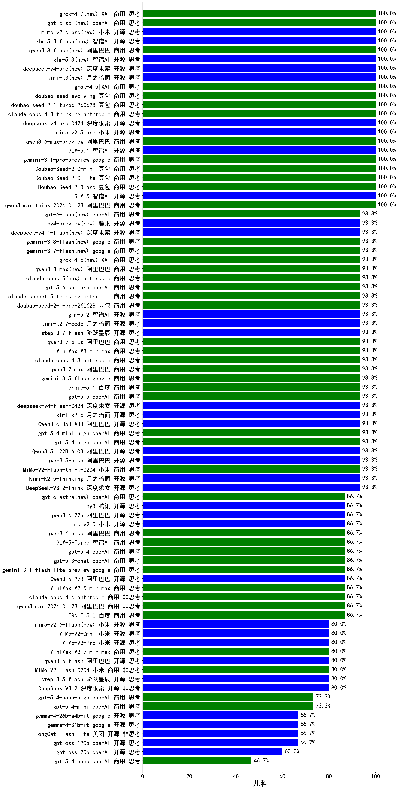

|类别|机构|大模型|【儿科】准确率|平均耗时|平均消耗token|花费/千次（元）|排名（准确率）|
|---|---|-----|-------------------|-------|-----------|-----------|-----------|
|商用|豆包|Doubao-Seed-2.0-pro|100.0%|213s|1006|14.6|1|
|开源|深度求索|deepseek-v4-pro(new)|100.0%|29s|956|23.1|2|
|商用|阿里巴巴|qwen3-max-think-2026-01-23|100.0%|119s|3140|30.8|3|
|商用|阿里巴巴|qwen3-max-preview-think|100.0%|165s|2394|55.9|4|
|开源|智谱AI|GLM-5.1|100.0%|165s|1594|36.9|5|
|商用|XAI|grok-4.5(new)|100.0%|82s|1401|51.1|6|
|商用|豆包|Doubao-Seed-2.0-lite|100.0%|197s|881|2.8|7|
|商用|豆包|doubao-seed-1-8-251215|100.0%|31s|830|5.8|8|
|开源|智谱AI|GLM-5|100.0%|89s|2286|40.1|9|
|开源|月之暗面|kimi-k3(new)|100.0%|33s|652|53.1|10|
|商用|google|gemini-3.1-pro-preview|100.0%|38s|1732|141.9|11|
|商用|豆包|doubao-seed-2-1-turbo-260628(new)|100.0%|267s|5637|83.2|12|
|商用|anthropic|claude-opus-4.8-thinking(new)|100.0%|14s|915|143.1|13|
|开源|深度求索|deepseek-v4-pro-0424|100.0%|42s|932|21.5|14|
|商用|腾讯|hunyuan-2.0-thinking-20251109|100.0%|27s|824|3.1|15|
|商用|腾讯|hunyuan-2.0-instruct-20251111|100.0%|21s|541|0.9|16|
|开源|智谱AI|glm-5.3(new)|100.0%|55s|1393|37.4|17|
|商用|阿里巴巴|qwen3.8-flash(new)|100.0%|34s|1289|3.2|18|
|开源|智谱AI|glm-5.3-flash(new)|100.0%|39s|1390|3.7|19|
|开源|小米|mimo-v2.5-pro|100.0%|22s|1392|24.7|20|
|商用|豆包|Doubao-Seed-2.0-mini|100.0%|338s|2020|3.8|21|
|商用|阿里巴巴|qwen3.6-max-preview|100.0%|54s|1772|92.2|22|
|商用|豆包|doubao-seed-evolving(new)|100.0%|182s|6938|205.4|23|
|开源|阿里巴巴|qwen3.5-plus|93.3%|44s|3707|17.5|24|
|商用|阿里巴巴|qwen3.7-plus(new)|93.3%|25s|1247|9.5|25|
|商用|minimax|MiniMax-M3(new)|93.3%|28s|796|10.3|26|
|商用|豆包|doubao-seed-2-1-pro-260628(new)|93.3%|164s|6059|179.1|27|
|开源|阿里巴巴|Qwen3.5-122B-A10B|93.3%|389s|4108|25.9|28|
|商用|anthropic|claude-opus-4.8(new)|93.3%|11s|667|99.8|29|
|商用|阿里巴巴|qwen3.7-max|93.3%|28s|1347|46.6|30|
|商用|google|gemini-3.5-flash|93.3%|10s|1382|82.9|31|
|商用|百度|ernie-5.1|93.3%|41s|1049|17.9|32|
|商用|openAI|gpt-5.4-mini-high|93.3%|43s|1071|31.2|33|
|商用|openAI|gpt-5.5|93.3%|13s|657|120.8|34|
|开源|深度求索|deepseek-v4-flash-0424|93.3%|35s|793|1.5|35|
|开源|月之暗面|kimi-k2.6|93.3%|113s|2254|59.3|36|
|商用|openAI|gpt-5.4-high|93.3%|17s|962|92.5|37|
|开源|阿里巴巴|Qwen3.6-35B-A3B|93.3%|17s|2163|22.6|38|
|商用|小米|MiMo-V2-Flash-think-0204|93.3%|918s|2256|4.6|39|
|开源|阶跃星辰|step-3.7-flash(new)|93.3%|78s|3848|30.6|40|
|商用|google|gemini-3.8-flash(new)|93.3%|12s|722|34.6|41|
|开源|深度求索|DeepSeek-V3.2-Think|93.3%|76s|1161|3.4|42|
|开源|阿里巴巴|qwen3-next-80b-a3b-thinking|93.3%|111s|3298|12.9|43|
|商用|google|gemini-3.7-flash(new)|93.3%|5s|709|16.9|44|
|商用|XAI|grok-4.6(new)|93.3%|235s|1760|66.2|45|
|商用|阿里巴巴|qwen3.8-max(new)|93.3%|34s|1556|53.2|46|
|商用|anthropic|claude-opus-5(new)|93.3%|17s|820|126.6|47|
|商用|google|gemini-3-flash-preview|93.3%|72s|1208|24.3|48|
|商用|openAI|gpt-5.6-sol-pro(new)|93.3%|16s|3613|295.4|49|
|开源|智谱AI|GLM-4.7|93.3%|59s|2552|34.9|50|
|开源|智谱AI|GLM-4.7-Flash|93.3%|1393s|6936|0.0|51|
|商用|anthropic|claude-sonnet-5-thinking(new)|93.3%|20s|881|54.9|52|
|开源|月之暗面|Kimi-K2.5-Thinking|93.3%|435s|2088|42.6|53|
|开源|智谱AI|glm-5.2(new)|93.3%|34s|1469|39.5|54|
|开源|月之暗面|kimi-k2.7-code(new)|93.3%|60s|1270|32.8|55|
|开源|阿里巴巴|qwen3.6-27b|86.7%|33s|1974|34.3|56|
|开源|腾讯|hy3(new)|86.7%|60s|261|0.8|57|
|开源|小米|mimo-v2.5|86.7%|21s|1471|17.0|58|
|商用|智谱AI|GLM-5-Turbo|86.7%|36s|1563|33.1|59|
|商用|openAI|gpt-6-astra(new)|86.7%|12s|337|90.6|60|
|商用|anthropic|claude-opus-4.6|86.7%|21s|728|110.5|61|
|商用|openAI|gpt-5.3-chat|86.7%|29s|501|40.8|62|
|商用|阿里巴巴|qwen-plus-think-2025-12-01|86.7%|75s|2904|22.6|63|
|开源|小米|MiMo-V2-Flash-think|86.7%|106s|2303|0.0|64|
|开源|美团|LongCat-Flash-Thinking-2601|86.7%|204s|2585|0.0|65|
|商用|百度|ERNIE-5.0|86.7%|148s|2284|53.7|66|
|商用|阿里巴巴|qwen3-max-2026-01-23|86.7%|104s|651|5.9|67|
|商用|minimax|MiniMax-M2.5|86.7%|32s|1430|11.4|68|
|商用|openAI|gpt-5.2-high|86.7%|8s|547|45.9|69|
|商用|google|gemini-3.1-flash-lite-preview|86.7%|13s|457|4.1|70|
|开源|阿里巴巴|Qwen3.5-27B|86.7%|330s|3331|15.7|71|
|商用|openAI|gpt-5.4|86.7%|6s|350|28.3|72|
|开源|Mistral|mistral-large-2512|86.7%|15s|647|6.1|73|
|商用|阿里巴巴|qwen3.6-plus|86.7%|37s|1802|20.9|74|
|开源|阿里巴巴|qwen3.5-flash|80.0%|327s|4474|8.8|75|
|商用|小米|MiMo-V2-Flash-0204|80.0%|258s|643|1.2|76|
|商用|openAI|gpt-5.2|80.0%|7s|261|17.5|77|
|开源|深度求索|DeepSeek-V3.2|80.0%|39s|472|1.3|78|
|商用|阿里巴巴|qwen-plus-2025-12-01|80.0%|26s|977|1.9|79|
|开源|阶跃星辰|step-3.5-flash|80.0%|21s|1979|4.0|80|
|商用|minimax|MiniMax-M2.7|80.0%|42s|1627|13.0|81|
|开源|小米|MiMo-V2-Pro|80.0%|83s|1203|20.7|82|
|商用|minimax|MiniMax-M2.1|80.0%|115s|1862|15.0|83|
|开源|小米|MiMo-V2-Omni|80.0%|155s|1520|17.7|84|
|商用|openAI|gpt-5.2-medium|80.0%|9s|423|33.6|85|
|商用|openAI|gpt-5.4-mini|73.3%|23s|316|7.4|86|
|商用|openAI|gpt-5.4-nano-high|73.3%|90s|568|4.3|87|
|开源|google|gemma-4-26b-a4b-it|66.7%|42s|667|1.7|88|
|开源|小米|MiMo-V2-Flash|66.7%|170s|561|0.0|89|
|开源|google|gemma-4-31b-it|66.7%|76s|630|1.6|90|
|开源|美团|LongCat-Flash-Lite|66.7%|283s|879|0.0|91|
|开源|openAI|gpt-oss-120b|66.7%|5s|715|1.9|92|
|开源|openAI|gpt-oss-20b|60.0%|168s|1289|1.4|93|
|开源|Mistral|Ministral-3-14B-Instruct-2512|46.7%|7s|691|1.0|94|
|商用|openAI|gpt-5.4-nano|46.7%|7s|239|1.4|95|
|开源|Mistral|Ministral-3-8B-Instruct-2512|26.7%|14s|677|0.7|96|
|开源|Mistral|Ministral-3-3B-Instruct-2512|20.0%|6s|658|0.5|97|

