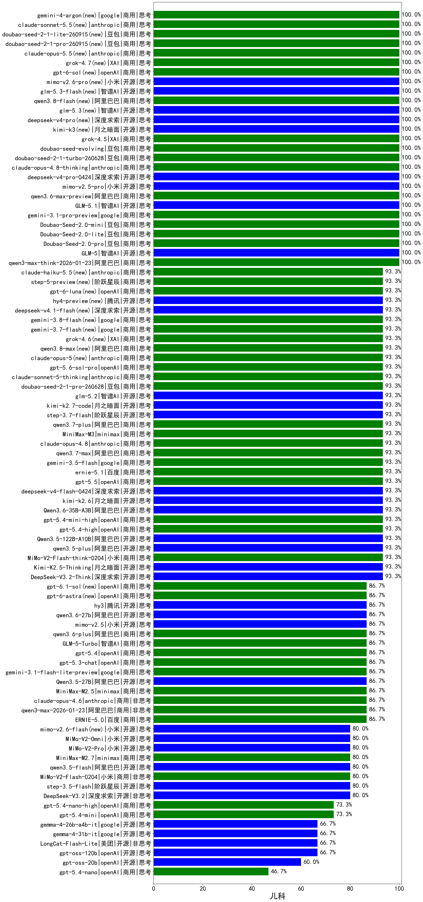

|类别|机构|大模型|【儿科】准确率|平均耗时|平均消耗token|花费/千次（元）|排名（准确率）|
|---|---|-----|-------------------|-------|-----------|-----------|-----------|
|开源|深度求索|deepseek-v4-pro|100.0%|29s|956|23.1|1|
|商用|豆包|doubao-seed-2-1-pro-260915(new)|100.0%|32s|732|19.3|2|
|商用|openAI|gpt-6-sol(new)|100.0%|292s|281|14.3|3|
|商用|XAI|grok-4.5|100.0%|82s|1401|51.1|4|
|开源|深度求索|deepseek-v4-pro-0424|100.0%|42s|932|21.5|5|
|开源|小米|mimo-v2.6-pro(new)|100.0%|43s|1159|6.7|6|
|开源|小米|mimo-v2.5-pro|100.0%|22s|1392|24.7|7|
|商用|XAI|grok-4.7(new)|100.0%|33s|3366|104.6|8|
|商用|阿里巴巴|qwen3.6-max-preview|100.0%|54s|1772|92.2|9|
|商用|豆包|doubao-seed-evolving|100.0%|182s|6938|205.4|10|
|开源|智谱AI|GLM-5.1|100.0%|165s|1594|36.9|11|
|商用|anthropic|claude-opus-5.5(new)|100.0%|47s|768|93.7|12|
|商用|豆包|doubao-seed-2-1-lite-260915(new)|100.0%|18s|825|2.0|13|
|商用|豆包|doubao-seed-2-1-turbo-260628|100.0%|267s|5637|83.2|14|
|开源|智谱AI|glm-5.3(new)|100.0%|55s|1393|37.4|15|
|商用|阿里巴巴|qwen3.8-flash(new)|100.0%|34s|1289|3.2|16|
|商用|anthropic|claude-sonnet-5.5(new)|100.0%|130s|591|34.5|17|
|商用|google|gemini-3.1-pro-preview|100.0%|38s|1732|141.9|18|
|商用|google|gemini-4-argon(new)|100.0%|20s|736|91.3|19|
|开源|智谱AI|glm-5.3-flash(new)|100.0%|39s|1390|3.7|20|
|商用|anthropic|claude-opus-4.8-thinking|100.0%|14s|915|143.1|21|
|开源|月之暗面|kimi-k3|100.0%|33s|652|53.1|22|
|商用|openAI|gpt-5.6-sol-pro|93.3%|16s|3613|295.4|23|
|商用|anthropic|claude-sonnet-5-thinking|93.3%|20s|881|54.9|24|
|商用|豆包|doubao-seed-2-1-pro-260628|93.3%|164s|6059|179.1|25|
|商用|anthropic|claude-opus-5|93.3%|17s|820|126.6|26|
|商用|阿里巴巴|qwen3.8-max|93.3%|34s|1556|53.2|27|
|开源|智谱AI|glm-5.2|93.3%|34s|1469|39.5|28|
|商用|XAI|grok-4.6|93.3%|235s|1760|66.2|29|
|商用|google|gemini-3.7-flash|93.3%|5s|709|16.9|30|
|商用|google|gemini-3.8-flash(new)|93.3%|12s|722|34.6|31|
|商用|openAI|gpt-6-luna(new)|93.3%|256s|492|1.5|32|
|商用|阿里巴巴|qwen3.7-max|93.3%|28s|1347|46.6|33|
|开源|月之暗面|kimi-k2.7-code|93.3%|60s|1270|32.8|34|
|开源|阶跃星辰|step-3.7-flash|93.3%|78s|3848|30.6|35|
|商用|anthropic|claude-haiku-5.5(new)|93.3%|7s|990|3.1|36|
|开源|深度求索|DeepSeek-V3.2-Think|93.3%|76s|1161|3.4|37|
|开源|阿里巴巴|Qwen3.5-122B-A10B|93.3%|389s|4108|25.9|38|
|商用|阶跃星辰|step-5-preview(new)|93.3%|23s|1663|32.2|39|
|开源|阿里巴巴|Qwen3.6-35B-A3B|93.3%|17s|2163|22.6|40|
|开源|月之暗面|kimi-k2.6|93.3%|113s|2254|59.3|41|
|开源|深度求索|deepseek-v4-flash-0424|93.3%|35s|793|1.5|42|
|商用|openAI|gpt-5.5|93.3%|13s|657|120.8|43|
|商用|百度|ernie-5.1|93.3%|41s|1049|17.9|44|
|商用|google|gemini-3.5-flash|93.3%|10s|1382|82.9|45|
|开源|深度求索|deepseek-v4.1-flash(new)|93.3%|15s|1686|12.9|46|
|商用|anthropic|claude-opus-4.8|93.3%|11s|667|99.8|47|
|商用|minimax|MiniMax-M3|93.3%|28s|796|10.3|48|
|商用|阿里巴巴|qwen3.7-plus|93.3%|25s|1247|9.5|49|
|开源|腾讯|hy4-preview(new)|93.3%|39s|2324|40.8|50|
|商用|openAI|gpt-6.1-sol(new)|86.7%|7s|275|13.8|51|
|商用|minimax|MiniMax-M3.1-Flash(new)|86.7%|22s|1453|5.0|52|
|商用|openAI|gpt-6-astra(new)|86.7%|12s|337|90.6|53|
|开源|腾讯|hy3|86.7%|60s|261|0.8|54|
|开源|阿里巴巴|qwen3.6-27b|86.7%|33s|1974|34.3|55|
|开源|小米|mimo-v2.5|86.7%|21s|1471|17.0|56|
|商用|阿里巴巴|qwen3.6-plus|86.7%|37s|1802|20.9|57|
|商用|google|gemini-3.1-flash-lite-preview|86.7%|13s|457|4.1|58|
|开源|阿里巴巴|Qwen3.5-27B|86.7%|330s|3331|15.7|59|
|商用|百度|ERNIE-5.0|86.7%|148s|2284|53.7|60|
|开源|小米|mimo-v2.6-flash(new)|80.0%|50s|1026|2.0|61|
|商用|minimax|MiniMax-M2.7|80.0%|42s|1627|13.0|62|
|开源|深度求索|DeepSeek-V3.2|80.0%|39s|472|1.3|63|
|开源|google|gemma-4-26b-a4b-it|66.7%|42s|667|1.7|64|
|开源|google|gemma-4-31b-it|66.7%|76s|630|1.6|65|
|开源|openAI|gpt-oss-120b|66.7%|5s|715|1.9|66|
|开源|openAI|gpt-oss-20b|60.0%|168s|1289|1.4|67|

