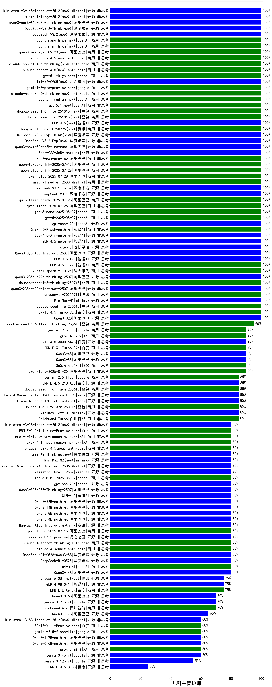

| 类别 |机构| 大模型                         | 儿科主管护师 | 排名 |
|-----|----|--------------------------|---------|----|
|开源|腾讯|hunyuan-large|100.0%|1|
|商用|腾讯|hunyuan-turbo|100.0%|2|
|开源|minimax|MiniMax-M1(new)|100.0%|3|
|开源|阿里巴巴|Qwen3-235B-A22B|100.0%|4|
|商用|腾讯|hunyuan-turbos-20250604(new)|100.0%|5|
|商用|百度|ERNIE-4.5-Turbo-32K|98.0%|6|
|开源|阿里巴巴|Qwen3-32B|96.7%|7|
|商用|豆包|doubao-seed-1-6-thinking-250615(new)|96.7%|8|
|商用|豆包|doubao-seed-1-6-250615(new)|96.7%|9|
|商用|豆包|Doubao-1.5-pro-32k-250115|96.2%|10|
|商用|阿里巴巴|qwq-plus-2025-03-05|96.2%|11|
|商用|阿里巴巴|qwen-turbo-think-2025-04-28|93.3%|12|
|商用|豆包|doubao-seed-1-6-flash-thinking-250615(new)|93.3%|13|
|商用|腾讯|hunyuan-turbos-20250313|92.5%|14|
|商用|阿里巴巴|qwen-turbo-2025-02-11|92.3%|15|
|商用|阿里巴巴|qwen-plus-2025-01-25|92.3%|16|
|开源|深度求索|DeepSeek-R1-Distill-Qwen-32B|92.3%|17|
|开源|阿里巴巴|qwen2.5-32b-instruct|92.3%|18|
|开源|阿里巴巴|qwq-32b|92.3%|19|
|商用|豆包|Doubao-1.5-thinking-pro|90.0%|20|
|商用|豆包|doubao-seed-1-6-flash-250615(new)|90.0%|21|
|商用|腾讯|hunyuan-t1-20250529(new)|90.0%|22|
|商用|科大讯飞|xunfei-4.0Ultra|90.0%|23|
|商用|google|gemini-2.5-pro-preview-05-06|90.0%|24|
|商用|阿里巴巴|qwen-plus-think-2025-04-28|90.0%|25|
|商用|阿里巴巴|qwen-turbo-2025-04-28|90.0%|26|
|开源|百度|ERNIE-4.5-300B-A47B(new)|90.0%|27|
|商用|百度|ERNIE-X1-Turbo-32K|90.0%|28|
|商用|腾讯|hunyuan-t1-20250321|88.9%|29|
|商用|腾讯|hunyuan-standard|88.5%|30|
|商用|科大讯飞|xunfei-spark-max|88.5%|31|
|商用|阿里巴巴|qwen-long-2025-01-25|88.5%|32|
|开源|minimax|MiniMax-Text-01|88.5%|33|
|开源|深度求索|DeepSeek-R1|88.5%|34|
|商用|智谱AI|GLM-Z1-AirX|86.0%|35|
|开源|百度|ERNIE-4.5-21B-A3B(new)|85.0%|36|
|商用|智谱AI|GLM-4-Plus|85.0%|37|
|开源|阿里巴巴|qwen2.5-72b-instruct|84.6%|38|
|商用|奇虎360|360gpt-turbo|84.6%|39|
|商用|豆包|Doubao-1.5-lite-32k-250115|84.6%|40|
|商用|零一万物|yi-lightning|84.6%|41|
|商用|月之暗面|kimi-latest-8k|84.6%|42|
|开源|深度求索|DeepSeek-R1-Distill-Qwen-14B|84.6%|43|
|商用|智谱AI|GLM-Z1-Air|84.0%|44|
|开源|智谱AI|GLM-Z1-32B-0414|83.3%|45|
|开源|阿里巴巴|Qwen3-30B-A3B|83.3%|46|
|商用|智谱AI|GLM-4-Air|83.3%|47|
|商用|智谱AI|GLM-4-AirX|83.3%|48|
|开源|阿里巴巴|Qwen3-4B|83.3%|49|
|商用|阿里巴巴|qwen-plus-2025-04-28|83.3%|50|
|开源|Meta|Llama-4-Maverick-17B-128E-Instruct-FP8|82.0%|51|
|商用|奇虎360|360gpt2-o1|80.8%|52|
|商用|百川智能|Baichuan4-Turbo|80.8%|53|
|开源|阿里巴巴|qwen2.5-14b-instruct|80.8%|54|
|商用|奇虎360|360gpt2-pro|80.8%|55|
|商用|百度|ERNIE-3.5-8K|80.8%|56|
|商用|阿里巴巴|qwen2.5-max|80.8%|57|
|商用|奇虎360|360zhinao2-o1|80.8%|58|
|开源|深度求索|deepseek-chat-v3-0324|80.5%|59|
|开源|阿里巴巴|Qwen3-14B|80.0%|60|
|商用|科大讯飞|xunfei-spark-x1|80.0%|61|
|开源|深度求索|DeepSeek-R1-0528|80.0%|62|
|商用|openAI|o4-mini|80.0%|63|
|商用|openAI|gpt-4.1|80.0%|64|
|开源|阿里巴巴|Qwen3-8B|80.0%|65|
|商用|anthropic|claude-4-sonnet-thinking|80.0%|66|
|商用|anthropic|claude-4-sonnet|80.0%|67|
|开源|智谱AI|GLM-4-32B-0414|79.5%|68|
|开源|Meta|Llama-4-Scout-17B-16E-Instruct|77.0%|69|
|开源|阿里巴巴|qwen2.5-7b-instruct|76.9%|70|
|商用|科大讯飞|xunfei-spark-pro|76.9%|71|
|商用|月之暗面|moonshot-v1-8k|76.9%|72|
|商用|openAI|chatgpt-4o-latest|76.9%|73|
|商用|智谱AI|GLM-4-Long|76.7%|74|
|开源|腾讯|Hunyuan-A13B-Instruct(new)|75.0%|75|
|商用|智谱AI|GLM-4-Flash|73.1%|76|
|商用|阶跃星辰|step-r1-v-mini|70.0%|77|
|商用|google|gemini-2.5-flash-preview-05-20|70.0%|78|
|开源|智谱AI|GLM-4-9B-0414|69.5%|79|
|开源|上海人工智能实验室|internlm2_5-7b-chat|69.2%|80|
|商用|商汤|SenseChat-5-beta|69.2%|81|
|开源|阿里巴巴|qwen2.5-3b-instruct|69.2%|82|
|开源|微软|phi-4|69.2%|83|
|商用|智谱AI|GLM-4-FlashX|69.2%|84|
|商用|Mistral|mistral-small|69.2%|85|
|开源|深度求索|DeepSeek-R1-0528-Qwen3-8B|66.7%|86|
|商用|阶跃星辰|step-2-mini|65.4%|87|
|商用|百川智能|Baichuan4-Air|65.4%|88|
|商用|百度|ERNIE-Lite-8K|65.4%|89|
|开源|智谱AI|GLM-Z1-9B-0414|64.5%|90|
|商用|智谱AI|GLM-Z1-Flash|62.5%|91|
|商用|商汤|SenseChat-5-1202|61.5%|92|
|商用|百度|ERNIE-Speed-8K|61.5%|93|
|开源|Mistral|Mistral-Small-3.1-24B-Instruct-2503|61.5%|94|
|开源|智谱AI|GLM-Z1-Rumination-32B-0414|60.0%|95|
|商用|智谱AI|GLM-Z1-FlashX|60.0%|96|
|商用|openAI|gpt-4.1-mini|60.0%|97|
|商用|OpenAI|gpt-4o-mini|57.7%|98|
|开源|阿里巴巴|qwen2.5-1.5b-instruct|57.7%|99|
|商用|商汤|SenseChat-Turbo-1202|57.7%|100|
|商用|Mistral|mistral-large|57.7%|101|
|开源|Google|gemma-3-12b-it|57.0%|102|
|开源|阿里巴巴|Qwen3-0.6B|56.7%|103|
|开源|Google|gemma-3-27b-it|54.5%|104|
|开源|阿里巴巴|Qwen3-1.7B|53.3%|105|
|商用|Mistral|ministral-8b|46.2%|106|
|开源|阿里巴巴|qwen2.5-0.5b-instruct|42.3%|107|
|开源|Google|gemma-3-4b-it|42.0%|108|
|商用|Mistral|ministral-3b|30.8%|109|
|开源|百度|ERNIE-4.5-0.3B(new)|30.0%|110|
|商用|百度|ERNIE-Tiny-8K|19.2%|111|
|商用|科大讯飞|xunfei-spark-lite|19.2%|112|

