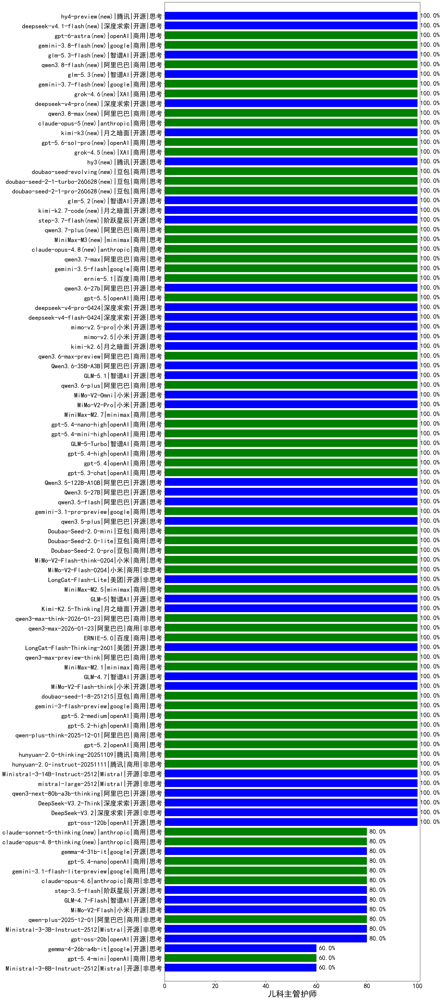

|类别|机构|大模型|【儿科主管护师】准确率|平均耗时|平均消耗token|花费/千次（元）|排名（准确率）|
|---|---|-----|-------------------|-------|-----------|-----------|-----------|
|开源|openAI|gpt-oss-120b|100.0%|8s|549|1.3|1|
|开源|小米|mimo-v2.5-pro|100.0%|30s|1393|24.3|2|
|商用|minimax|MiniMax-M3(new)|100.0%|20s|615|7.0|3|
|商用|anthropic|claude-opus-4.8(new)|100.0%|8s|564|75.7|4|
|商用|阿里巴巴|qwen3.7-max|100.0%|16s|794|26.2|5|
|商用|google|gemini-3.5-flash|100.0%|7s|1188|69.1|6|
|商用|百度|ernie-5.1|100.0%|24s|883|14.6|7|
|开源|阿里巴巴|qwen3.6-27b|100.0%|26s|1641|28.0|8|
|商用|openAI|gpt-5.5|100.0%|20s|348|50.2|9|
|开源|深度求索|deepseek-v4-pro-0424|100.0%|20s|527|11.5|10|
|开源|深度求索|deepseek-v4-flash-0424|100.0%|10s|518|0.9|11|
|开源|小米|mimo-v2.5|100.0%|13s|919|8.9|12|
|开源|阶跃星辰|step-3.7-flash(new)|100.0%|103s|2131|16.6|13|
|开源|月之暗面|kimi-k2.6|100.0%|66s|1182|30.1|14|
|商用|阿里巴巴|qwen3.6-max-preview|100.0%|46s|1514|77.3|15|
|开源|阿里巴巴|Qwen3.6-35B-A3B|100.0%|11s|1435|14.6|16|
|开源|智谱AI|GLM-5.1|100.0%|152s|1194|26.9|17|
|商用|阿里巴巴|qwen3.6-plus|100.0%|48s|1540|17.4|18|
|开源|小米|MiMo-V2-Omni|100.0%|447s|1146|12.1|19|
|开源|小米|MiMo-V2-Pro|100.0%|537s|1204|20.3|20|
|商用|minimax|MiniMax-M2.7|100.0%|23s|914|6.9|21|
|商用|openAI|gpt-5.4-nano-high|100.0%|13s|442|2.9|22|
|商用|阿里巴巴|qwen3.7-plus(new)|100.0%|18s|931|6.8|23|
|开源|月之暗面|kimi-k2.7-code(new)|100.0%|10s|414|9.3|24|
|商用|openAI|gpt-5.4-high|100.0%|7s|508|40.9|25|
|商用|XAI|grok-4.6(new)|100.0%|19s|939|31.0|26|
|开源|小米|mimo-v2.6-pro(new)|100.0%|31s|885|5.0|27|
|开源|腾讯|hy4-preview(new)|100.0%|19s|1139|19.2|28|
|开源|深度求索|deepseek-v4.1-flash(new)|100.0%|15s|468|3.0|29|
|商用|openAI|gpt-6-astra(new)|100.0%|14s|301|68.8|30|
|商用|google|gemini-3.8-flash(new)|100.0%|51s|651|29.6|31|
|开源|智谱AI|glm-5.3-flash(new)|100.0%|132s|1252|3.3|32|
|商用|阿里巴巴|qwen3.8-flash(new)|100.0%|13s|670|1.5|33|
|开源|智谱AI|glm-5.3(new)|100.0%|29s|835|21.3|34|
|商用|google|gemini-3.7-flash(new)|100.0%|32s|570|12.7|35|
|开源|深度求索|deepseek-v4-pro(new)|100.0%|12s|527|11.1|36|
|开源|智谱AI|glm-5.2(new)|100.0%|28s|1196|31.4|37|
|商用|阿里巴巴|qwen3.8-max(new)|100.0%|9s|497|14.6|38|
|商用|anthropic|claude-opus-5(new)|100.0%|12s|683|96.6|39|
|开源|月之暗面|kimi-k3(new)|100.0%|29s|541|40.6|40|
|商用|openAI|gpt-5.6-sol-pro(new)|100.0%|9s|3082|214.2|41|
|商用|XAI|grok-4.5(new)|100.0%|170s|1105|38.0|42|
|开源|腾讯|hy3(new)|100.0%|5s|235|0.7|43|
|商用|豆包|doubao-seed-evolving(new)|100.0%|117s|3958|115.5|44|
|商用|豆包|doubao-seed-2-1-turbo-260628(new)|100.0%|99s|4419|64.7|45|
|商用|豆包|doubao-seed-2-1-pro-260628(new)|100.0%|133s|4011|117.2|46|
|商用|智谱AI|GLM-5-Turbo|100.0%|50s|1242|25.7|47|
|商用|openAI|gpt-5.4-mini-high|100.0%|11s|627|16.3|48|
|商用|openAI|gpt-5.4|100.0%|23s|391|29.6|49|
|开源|月之暗面|Kimi-K2.5-Thinking|100.0%|265s|1380|27.4|50|
|商用|阿里巴巴|qwen3-max-2026-01-23|100.0%|66s|557|4.7|51|
|开源|美团|LongCat-Flash-Thinking-2601|100.0%|182s|1674|0.0|52|
|商用|阿里巴巴|qwen3-max-preview-think|100.0%|55s|2080|47.9|53|
|商用|minimax|MiniMax-M2.1|100.0%|23s|1118|8.6|54|
|开源|智谱AI|GLM-4.7|100.0%|43s|1869|25.1|55|
|开源|小米|MiMo-V2-Flash-think|100.0%|378s|1855|0.0|56|
|商用|豆包|doubao-seed-1-8-251215|100.0%|23s|586|3.7|57|
|商用|google|gemini-3-flash-preview|100.0%|106s|1010|19.6|58|
|商用|openAI|gpt-5.2-medium|100.0%|6s|349|23.3|59|
|商用|openAI|gpt-5.2-high|100.0%|12s|367|25.1|60|
|商用|阿里巴巴|qwen-plus-think-2025-12-01|100.0%|59s|2690|20.7|61|
|商用|openAI|gpt-5.2|100.0%|17s|275|15.9|62|
|商用|腾讯|hunyuan-2.0-thinking-20251109|100.0%|11s|617|2.2|63|
|商用|腾讯|hunyuan-2.0-instruct-20251111|100.0%|10s|387|0.6|64|
|开源|Mistral|Ministral-3-14B-Instruct-2512|100.0%|13s|662|0.9|65|
|开源|Mistral|mistral-large-2512|100.0%|12s|587|5.2|66|
|开源|阿里巴巴|qwen3-next-80b-a3b-thinking|100.0%|169s|3411|13.3|67|
|开源|深度求索|DeepSeek-V3.2-Think|100.0%|31s|687|2.0|68|
|开源|深度求索|DeepSeek-V3.2|100.0%|84s|429|1.2|69|
|商用|阿里巴巴|qwen3-max-think-2026-01-23|100.0%|293s|2259|21.7|70|
|商用|百度|ERNIE-5.0|100.0%|146s|1553|35.7|71|
|开源|阿里巴巴|qwen3.5-plus|100.0%|23s|1881|8.6|72|
|商用|豆包|Doubao-Seed-2.0-pro|100.0%|183s|785|10.8|73|
|商用|openAI|gpt-5.3-chat|100.0%|6s|395|27.5|74|
|开源|阿里巴巴|Qwen3.5-122B-A10B|100.0%|154s|2068|12.7|75|
|开源|阿里巴巴|Qwen3.5-27B|100.0%|283s|1888|8.6|76|
|开源|阿里巴巴|qwen3.5-flash|100.0%|121s|1966|3.8|77|
|商用|google|gemini-3.1-pro-preview|100.0%|24s|1212|95.5|78|
|商用|豆包|Doubao-Seed-2.0-mini|100.0%|248s|1112|2.0|79|
|商用|豆包|Doubao-Seed-2.0-lite|100.0%|156s|759|2.3|80|
|开源|小米|mimo-v2.6-flash(new)|100.0%|26s|789|1.5|81|
|商用|小米|MiMo-V2-Flash-think-0204|100.0%|515s|1252|2.4|82|
|商用|小米|MiMo-V2-Flash-0204|100.0%|431s|589|1.1|83|
|开源|美团|LongCat-Flash-Lite|100.0%|381s|503|0.0|84|
|开源|智谱AI|GLM-5|100.0%|63s|1655|28.4|85|
|商用|minimax|MiniMax-M2.5|100.0%|20s|1058|8.1|86|
|商用|anthropic|claude-sonnet-5-thinking(new)|80.0%|13s|760|44.0|87|
|开源|openAI|gpt-oss-20b|80.0%|6s|921|0.9|88|
|商用|openAI|gpt-5.4-nano|80.0%|3s|313|1.8|89|
|商用|google|gemini-3.1-flash-lite-preview|80.0%|16s|410|3.3|90|
|开源|Mistral|Ministral-3-3B-Instruct-2512|80.0%|8s|678|0.5|91|
|商用|anthropic|claude-opus-4.8-thinking(new)|80.0%|10s|705|100.3|92|
|开源|google|gemma-4-31b-it|80.0%|59s|581|1.4|93|
|商用|阿里巴巴|qwen-plus-2025-12-01|80.0%|21s|889|1.6|94|
|开源|智谱AI|GLM-4.7-Flash|80.0%|172s|1368|0.0|95|
|商用|anthropic|claude-opus-4.6|80.0%|12s|684|96.5|96|
|开源|小米|MiMo-V2-Flash|80.0%|131s|452|0.0|97|
|开源|阶跃星辰|step-3.5-flash|80.0%|44s|1710|3.4|98|
|开源|Mistral|Ministral-3-8B-Instruct-2512|60.0%|10s|556|0.6|99|
|商用|openAI|gpt-5.4-mini|60.0%|90s|350|7.6|100|
|开源|google|gemma-4-26b-a4b-it|60.0%|59s|588|1.4|101|

