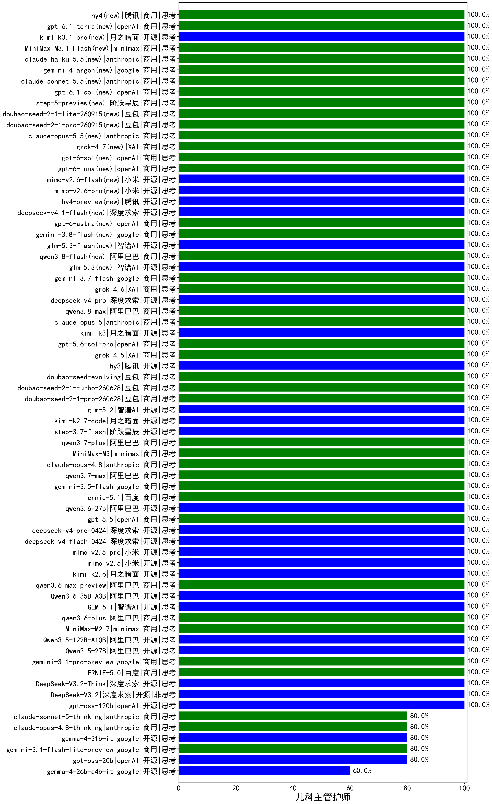

|类别|机构|大模型|【儿科主管护师】准确率|平均耗时|平均消耗token|花费/千次（元）|排名（准确率）|
|---|---|-----|-------------------|-------|-----------|-----------|-----------|
|开源|openAI|gpt-oss-120b|100.0%|8s|549|1.3|1|
|商用|XAI|grok-4.5|100.0%|170s|1105|38.0|2|
|开源|小米|mimo-v2.6-flash(new)|100.0%|26s|789|1.5|3|
|开源|小米|mimo-v2.6-pro(new)|100.0%|31s|885|5.0|4|
|开源|腾讯|hy4-preview(new)|100.0%|19s|1139|19.2|5|
|开源|深度求索|deepseek-v4.1-flash(new)|100.0%|15s|468|3.0|6|
|商用|openAI|gpt-6-astra(new)|100.0%|14s|301|68.8|7|
|商用|google|gemini-3.8-flash(new)|100.0%|51s|651|29.6|8|
|开源|智谱AI|glm-5.3-flash(new)|100.0%|132s|1252|3.3|9|
|商用|阿里巴巴|qwen3.8-flash(new)|100.0%|13s|670|1.5|10|
|开源|智谱AI|glm-5.3(new)|100.0%|29s|835|21.3|11|
|商用|google|gemini-3.7-flash|100.0%|32s|570|12.7|12|
|商用|XAI|grok-4.6|100.0%|19s|939|31.0|13|
|开源|深度求索|deepseek-v4-pro|100.0%|12s|527|11.1|14|
|商用|阿里巴巴|qwen3.8-max|100.0%|9s|497|14.6|15|
|商用|anthropic|claude-opus-5|100.0%|12s|683|96.6|16|
|开源|月之暗面|kimi-k3|100.0%|29s|541|40.6|17|
|商用|openAI|gpt-6-luna(new)|100.0%|109s|339|0.8|18|
|商用|openAI|gpt-6-sol(new)|100.0%|180s|245|9.8|19|
|商用|XAI|grok-4.7(new)|100.0%|13s|2211|55.5|20|
|商用|minimax|MiniMax-M3.1-Flash(new)|100.0%|12s|650|1.7|21|
|商用|腾讯|hy4-flash(new)|100.0%|71s|657|1.1|22|
|商用|google|gemini-4-carbon(new)|100.0%|19s|816|99.4|23|
|商用|anthropic|claude-fable-5.2(new)|100.0%|32s|527|110.4|24|
|商用|腾讯|hy4(new)|100.0%|46s|2297|40.0|25|
|商用|openAI|gpt-6.1-terra(new)|100.0%|5s|304|7.0|26|
|开源|月之暗面|kimi-k3.1-pro(new)|100.0%|24s|909|52.5|27|
|商用|anthropic|claude-haiku-5.5(new)|100.0%|12s|708|2.0|28|
|商用|anthropic|claude-opus-5.5(new)|100.0%|13s|682|76.9|29|
|商用|google|gemini-4-argon(new)|100.0%|25s|472|51.2|30|
|商用|anthropic|claude-sonnet-5.5(new)|100.0%|7s|535|28.1|31|
|商用|openAI|gpt-6.1-sol(new)|100.0%|5s|270|11.5|32|
|商用|阶跃星辰|step-5-preview(new)|100.0%|9s|571|10.1|33|
|商用|豆包|doubao-seed-2-1-lite-260915(new)|100.0%|18s|559|1.3|34|
|商用|豆包|doubao-seed-2-1-pro-260915(new)|100.0%|32s|1088|29.5|35|
|商用|openAI|gpt-5.6-sol-pro|100.0%|9s|3082|214.2|36|
|开源|腾讯|hy3|100.0%|5s|235|0.7|37|
|开源|深度求索|deepseek-v4-flash-0424|100.0%|10s|518|0.9|38|
|开源|深度求索|deepseek-v4-pro-0424|100.0%|20s|527|11.5|39|
|开源|深度求索|DeepSeek-V3.2|100.0%|84s|429|1.2|40|
|开源|深度求索|DeepSeek-V3.2-Think|100.0%|31s|687|2.0|41|
|商用|百度|ERNIE-5.0|100.0%|146s|1553|35.7|42|
|商用|google|gemini-3.1-pro-preview|100.0%|24s|1212|95.5|43|
|开源|阿里巴巴|Qwen3.5-27B|100.0%|283s|1888|8.6|44|
|开源|阿里巴巴|Qwen3.5-122B-A10B|100.0%|154s|2068|12.7|45|
|商用|minimax|MiniMax-M2.7|100.0%|23s|914|6.9|46|
|商用|阿里巴巴|qwen3.6-plus|100.0%|48s|1540|17.4|47|
|开源|智谱AI|GLM-5.1|100.0%|152s|1194|26.9|48|
|开源|阿里巴巴|Qwen3.6-35B-A3B|100.0%|11s|1435|14.6|49|
|商用|阿里巴巴|qwen3.6-max-preview|100.0%|46s|1514|77.3|50|
|开源|月之暗面|kimi-k2.6|100.0%|66s|1182|30.1|51|
|开源|小米|mimo-v2.5|100.0%|13s|919|8.9|52|
|开源|小米|mimo-v2.5-pro|100.0%|30s|1393|24.3|53|
|商用|阿里巴巴|qwen4-max(new)|100.0%|13s|491|12.5|54|
|商用|openAI|gpt-5.5|100.0%|20s|348|50.2|55|
|开源|阶跃星辰|step-3.7-flash|100.0%|103s|2131|16.6|56|
|商用|豆包|doubao-seed-evolving|100.0%|117s|3958|115.5|57|
|商用|豆包|doubao-seed-2-1-turbo-260628|100.0%|99s|4419|64.7|58|
|商用|豆包|doubao-seed-2-1-pro-260628|100.0%|133s|4011|117.2|59|
|开源|智谱AI|glm-5.2|100.0%|28s|1196|31.4|60|
|开源|月之暗面|kimi-k2.7-code|100.0%|10s|414|9.3|61|
|商用|阿里巴巴|qwen3.7-plus|100.0%|18s|931|6.8|62|
|商用|minimax|MiniMax-M3|100.0%|20s|615|7.0|63|
|商用|anthropic|claude-opus-4.8|100.0%|8s|564|75.7|64|
|商用|阿里巴巴|qwen3.7-max|100.0%|16s|794|26.2|65|
|商用|google|gemini-3.5-flash|100.0%|7s|1188|69.1|66|
|商用|百度|ernie-5.1|100.0%|24s|883|14.6|67|
|开源|阿里巴巴|qwen3.6-27b|100.0%|26s|1641|28.0|68|
|开源|google|gemma-4-31b-it|80.0%|59s|581|1.4|69|
|商用|anthropic|claude-sonnet-5-thinking|80.0%|13s|760|44.0|70|
|商用|google|gemini-3.1-flash-lite-preview|80.0%|16s|410|3.3|71|
|商用|anthropic|claude-opus-4.8-thinking|80.0%|10s|705|100.3|72|
|开源|openAI|gpt-oss-20b|80.0%|6s|921|0.9|73|
|开源|google|gemma-4-26b-a4b-it|60.0%|59s|588|1.4|74|

