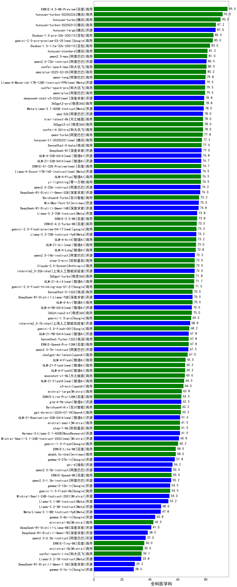

|类别|机构|大模型|【全科医学科】准确率|平均耗时|平均消耗token|花费/千次（元）|排名（准确率）|
|---|---|-----|-------------------|-------|-----------|-----------|-----------|
|开源|阿里巴巴|Qwen3-235B-A22B-nothink|95.0%|22s|459|4.0|1|
|商用|百度|ERNIE-4.5-Turbo-32K|95.0%|22s|555|1.6|2|
|商用|阿里巴巴|qwen-turbo-2025-07-15(new)|90.0%|6s|334|0.2|3|
|商用|阿里巴巴|qwen-plus-2025-07-14(new)|90.0%|11s|555|1.0|4|
|开源|智谱AI|GLM-4.5-nothink|90.0%|24s|801|10.5|5|
|商用|openAI|gpt-4.1|90.0%|8s|303|14.0|6|
|商用|腾讯|hunyuan-turbos-20250604|90.0%|100s|416|0.7|7|
|开源|阿里巴巴|Qwen3-30B-A3B-Thinking-2507(new)|90.0%|63s|2071|5.6|8|
|开源|月之暗面|kimi-k2-0711-preview(new)|90.0%|28s|500|7.2|9|
|开源|阿里巴巴|Qwen3-1.7B-nothink|90.0%|14s|440|1.1|10|
|商用|腾讯|hunyuan-turbos-20250716(new)|90.0%|12s|518|0.9|11|
|商用|anthropic|claude-4-sonnet|90.0%|44s|540|48.7|12|
|开源|阿里巴巴|qwen3-235b-a22b-instruct-2507(new)|90.0%|12s|474|3.4|13|
|开源|minimax|MiniMax-M1|87.5%|88s|2386|17.8|14|
|开源|腾讯|hunyuan-large|87.0%|11s|516|4.4|15|
|商用|豆包|Doubao-1.5-pro-32k-250115|85.5%|7s|392|0.7|16|
|商用|豆包|doubao-seed-1-6-flash-250615|85.0%|4s|346|0.4|17|
|开源|阿里巴巴|Qwen3-235B-A22B|85.0%|141s|3154|30.9|18|
|商用|豆包|doubao-seed-1-6-250615|85.0%|60s|467|2.9|19|
|商用|豆包|Doubao-1.5-lite-32k-250115|83.0%|3s|207|0.1|20|
|商用|智谱AI|GLM-Z1-Air|82.5%|45s|1461|0.8|21|
|开源|百度|ERNIE-4.5-300B-A47B|82.5%|21s|337|2.2|22|
|商用|百度|ERNIE-X1-Turbo-32K|82.5%|150s|2006|7.8|23|
|商用|阿里巴巴|qwen-turbo-think-2025-04-28|82.5%|170s|2223|6.4|24|
|开源|百度|ERNIE-4.5-21B-A3B|82.5%|33s|327|0.0|25|
|商用|google|gemini-2.5-flash-lite-preview-06-17|82.5%|2s|506|1.3|26|
|商用|腾讯|hunyuan-standard|81.2%|/|/|/|27|
|商用|阿里巴巴|qwen2.5-max|81.0%|17s|468|3.9|28|
|商用|智谱AI|GLM-4-Plus|80.5%|14s|293|1.5|29|
|商用|科大讯飞|xunfei-spark-max|80.5%|5s|140|4.2|30|
|开源|阿里巴巴|qwen2.5-72b-instruct|80.5%|10s|286|2.7|31|
|商用|阿里巴巴|qwq-plus-2025-03-05|80.2%|59s|2361|9.3|32|
|商用|豆包|doubao-seed-1-6-flash-thinking-250615|80.0%|6s|633|0.8|33|
|商用|anthropic|claude-4-sonnet-thinking|80.0%|49s|1086|108.0|34|
|开源|深度求索|DeepSeek-R1-0528|80.0%|231s|1882|29.2|35|
|开源|阿里巴巴|Qwen3-30B-A3B-nothink|80.0%|13s|432|1.1|36|
|开源|阿里巴巴|Qwen3-14B-nothink|80.0%|22s|487|0.9|37|
|开源|智谱AI|GLM-4.5-Air(new)|80.0%|27s|1278|7.3|38|
|商用|智谱AI|GLM-4.5-Flash-nothink|80.0%|16s|911|0.0|39|
|开源|阶跃星辰|step-3(new)|80.0%|61s|1237|4.8|40|
|开源|智谱AI|GLM-4.5-Air-nothink|80.0%|11s|933|5.3|41|
|开源|华为|pangu-pro-moe|80.0%|69s|1213|4.6|42|
|商用|XAI|grok-4-0709|80.0%|364s|1135|116.9|43|
|商用|腾讯|hunyuan-t1-20250711(new)|80.0%|18s|1066|4.0|44|
|开源|腾讯|Hunyuan-A13B-Instruct-nothink(new)|80.0%|92s|425|1.5|45|
|商用|科大讯飞|xunfei-spark-x1-0725(new)|80.0%|/|768|9.2|46|
|开源|阿里巴巴|Qwen3-8B-nothink|80.0%|90s|497|0.0|47|
|商用|google|gemini-2.5-pro|80.0%|34s|2214|155.5|48|
|商用|智谱AI|GLM-Z1-Flash|80.0%|19s|1969|0.0|49|
|开源|智谱AI|GLM-Z1-32B-0414|80.0%|123s|2467|9.6|50|
|开源|阿里巴巴|Qwen3-32B|80.0%|33s|1290|4.9|51|
|商用|openAI|gpt-5-2025-08-07(new)|80.0%|25s|268|14.7|52|
|商用|阿里巴巴|qwen-flash-2025-07-28(new)|80.0%|7s|514|0.7|53|
|开源|智谱AI|GLM-4.5(new)|80.0%|45s|1664|22.6|54|
|商用|阿里巴巴|qwen-flash-think-2025-07-28(new)|80.0%|20s|2015|2.9|55|
|商用|豆包|doubao-seed-1-6-thinking-250715(new)|80.0%|11s|933|7.0|56|
|开源|阿里巴巴|Qwen3-32B-nothink|80.0%|142s|543|2.0|57|
|开源|阿里巴巴|qwen3-235b-a22b-thinking-2507(new)|80.0%|102s|1824|35.2|58|
|商用|阿里巴巴|qwen-long-2025-01-25|79.8%|27s|327|0.6|59|
|商用|科大讯飞|xunfei-spark-pro|79.5%|/|/|/|60|
|商用|奇虎360|360gpt2-pro|78.8%|8s|252|1.0|61|
|开源|阿里巴巴|qwq-32b|78.0%|46s|2350|13.8|62|
|商用|月之暗面|kimi-latest-8k|78.0%|17s|519|6.2|63|
|商用|奇虎360|360gpt2-o1|78.0%|19s|361|15.2|64|
|商用|科大讯飞|xunfei-4.0Ultra|78.0%|3s|141|10.0|65|
|开源|meta|Llama-4-Maverick-17B-128E-Instruct-FP8|77.5%|7s|508|2.0|66|
|开源|智谱AI|GLM-4-9B-0414|77.5%|5s|426|0.0|67|
|开源|meta|Llama-4-Scout-17B-16E-Instruct|77.5%|11s|508|1.0|68|
|开源|深度求索|deepseek-chat-v3-0324|77.5%|139s|298|2.0|69|
|商用|google|gemini-2.5-flash|77.5%|11s|1742|30.3|70|
|开源|阿里巴巴|Qwen3-4B|77.5%|20s|1497|4.2|71|
|开源|阿里巴巴|Qwen3-30B-A3B|77.5%|22s|1385|3.7|72|
|商用|零一万物|yi-lightning|76.5%|/|/|/|73|
|开源|阿里巴巴|qwen2.5-32b-instruct|76.2%|7s|253|1.2|74|
|开源|深度求索|DeepSeek-R1-Distill-Qwen-32B|76.0%|30s|778|1.0|75|
|商用|百川智能|Baichuan4-Turbo|75.2%|/|/|/|76|
|商用|智谱AI|GLM-Z1-AirX|75.0%|27s|2065|11.7|77|
|商用|阶跃星辰|step-r1-v-mini|75.0%|43s|1640|12.6|78|
|开源|腾讯|Hunyuan-A13B-Instruct|75.0%|63s|990|3.7|79|
|商用|智谱AI|GLM-Z1-FlashX|75.0%|31s|1579|0.3|80|
|开源|minimax|MiniMax-Text-01|75.0%|11s|912|7.3|81|
|开源|阿里巴巴|Qwen3-8B|75.0%|125s|3409|0.0|82|
|开源|智谱AI|GLM-4-32B-0414|75.0%|25s|384|0.7|83|
|开源|深度求索|DeepSeek-R1-0528-Qwen3-8B|75.0%|283s|1585|0.0|84|
|开源|阿里巴巴|Qwen3-1.7B|75.0%|13s|1006|2.8|85|
|开源|深度求索|DeepSeek-R1-Distill-Qwen-14B|74.8%|/|/|/|86|
|商用|百度|ERNIE-3.5-8K|73.8%|23s|366|0.7|87|
|商用|阿里巴巴|qwen-plus-think-2025-04-28|72.5%|166s|2247|17.3|88|
|开源|阿里巴巴|Qwen3-14B|72.5%|27s|981|1.8|89|
|开源|阿里巴巴|qwen2.5-14b-instruct|72.2%|6s|241|0.6|90|
|商用|阶跃星辰|step-2-mini|72.0%|5s|365|0.7|91|
|商用|奇虎360|360gpt-turbo|71.8%|/|/|/|92|
|商用|智谱AI|GLM-4-AirX|71.7%|5s|287|2.9|93|
|商用|商汤|SenseChat-5-1202|70.5%|/|/|/|94|
|商用|openAI|gpt-5-mini-2025-08-07(new)|70.0%|43s|843|11.2|95|
|商用|openAI|gpt-5-nano-2025-08-07(new)|70.0%|141s|1736|4.8|96|
|开源|openAI|gpt-oss-120b(new)|70.0%|31s|601|1.6|97|
|商用|openAI|gpt-4.1-mini|70.0%|9s|370|3.6|98|
|商用|智谱AI|GLM-4.5-Flash(new)|70.0%|22s|1333|0.0|99|
|开源|阿里巴巴|Qwen3-4B-nothink|70.0%|20s|492|1.3|100|
|商用|奇虎360|360zhinao2-o1|70.0%|/|/|/|101|
|开源|阿里巴巴|Qwen3-30B-A3B-Instruct-2507(new)|70.0%|4s|495|1.3|102|
|商用|XAI|grok-3-mini|70.0%|228s|1052|3.7|103|
|开源|上海人工智能实验室|internlm2_5-7b-chat|68.8%|/|/|/|104|
|开源|阿里巴巴|qwen2.5-7b-instruct|67.5%|5s|249|0.2|105|
|商用|openAI|chatgpt-4o-latest|67.0%|/|/|/|106|
|商用|智谱AI|GLM-4-Long|66.7%|10s|355|0.4|107|
|商用|智谱AI|GLM-4-FlashX|65.2%|8s|301|0.0|108|
|开源|智谱AI|GLM-Z1-Rumination-32B-0414|65.0%|38s|1645|4.9|109|
|商用|Mistral|mistral-large|62.8%|/|/|/|110|
|开源|智谱AI|GLM-Z1-9B-0414|62.5%|89s|2827|0.0|111|
|商用|百川智能|Baichuan4-Air|62.2%|/|/|/|112|
|商用|OpenAI|gpt-4o-mini|62.2%|/|/|/|113|
|商用|Mistral|mistral-small|61.5%|/|/|/|114|
|开源|Mistral|Mistral-Small-3.1-24B-Instruct-2503|60.0%|/|/|/|115|
|开源|openAI|gpt-oss-20b(new)|60.0%|7s|766|0.8|116|
|商用|百度|ERNIE-Lite-8K|58.5%|/|/|/|117|
|开源|Google|gemma-3-27b-it|57.8%|/|/|/|118|
|开源|微软|phi-4|56.2%|/|/|/|119|
|商用|百度|ERNIE-Speed-8K|55.5%|/|/|/|120|
|开源|阿里巴巴|qwen2.5-3b-instruct|55.5%|4s|278|0.2|121|
|开源|阿里巴巴|qwen2.5-1.5b-instruct|55.2%|4s|135|0.0|122|
|商用|openAI|o4-mini|55.0%|35s|862|25.5|123|
|开源|Google|gemma-3-12b-it|54.5%|/|/|/|124|
|开源|Google|gemma-3-4b-it|43.8%|/|/|/|125|
|商用|Mistral|ministral-8b|42.5%|/|/|/|126|
|开源|百度|ERNIE-4.5-0.3B|42.5%|57s|406|0.0|127|
|开源|阿里巴巴|Qwen3-0.6B|37.5%|6s|1268|3.6|128|
|开源|阿里巴巴|qwen2.5-0.5b-instruct|37.0%|3s|262|0.0|129|
|商用|百度|ERNIE-Tiny-8K|36.0%|/|/|/|130|
|商用|Mistral|ministral-3b|35.0%|/|/|/|131|
|商用|科大讯飞|xunfei-spark-lite|34.1%|/|/|/|132|
|开源|阿里巴巴|Qwen3-0.6B-nothink|30.0%|8s|256|0.6|133|

