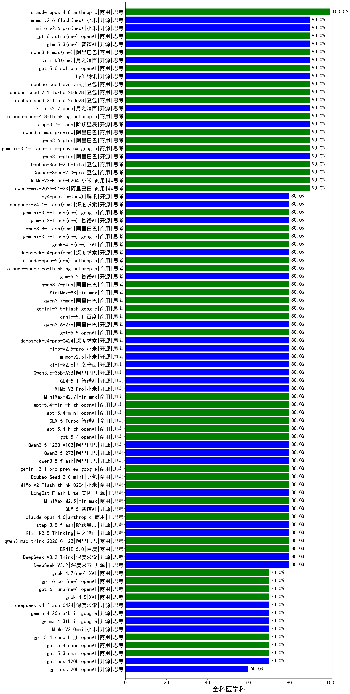

|类别|机构|大模型|【全科医学科】准确率|平均耗时|平均消耗token|花费/千次（元）|排名（准确率）|
|---|---|-----|-------------------|-------|-----------|-----------|-----------|
|商用|anthropic|claude-opus-4.8|100.0%|12s|587|88.8|1|
|商用|阿里巴巴|qwen3.6-plus|90.0%|29s|1468|17.0|2|
|商用|豆包|doubao-seed-2-1-turbo-260628|90.0%|91s|3376|49.4|3|
|商用|openAI|gpt-6-astra(new)|90.0%|14s|306|84.5|4|
|开源|智谱AI|glm-5.3(new)|90.0%|445s|3221|88.8|5|
|开源|小米|mimo-v2.6-pro(new)|90.0%|46s|903|5.2|6|
|开源|小米|mimo-v2.6-flash(new)|90.0%|303s|784|1.5|7|
|商用|google|gemini-3.1-flash-lite-preview|90.0%|4s|408|3.7|8|
|开源|阶跃星辰|step-3.7-flash|90.0%|16s|1440|11.2|9|
|商用|anthropic|claude-opus-4.8-thinking|90.0%|11s|639|97.9|10|
|开源|阿里巴巴|qwen3.5-plus|90.0%|30s|2476|11.6|11|
|商用|豆包|doubao-seed-2-1-pro-260628|90.0%|200s|4591|135.3|12|
|商用|豆包|Doubao-Seed-2.0-lite|90.0%|142s|728|2.3|13|
|商用|豆包|Doubao-Seed-2.0-pro|90.0%|198s|863|12.5|14|
|开源|月之暗面|kimi-k2.7-code|90.0%|23s|779|19.8|15|
|商用|小米|MiMo-V2-Flash-0204|90.0%|84s|473|0.9|16|
|商用|openAI|gpt-5.6-sol-pro|90.0%|17s|3691|315.9|17|
|商用|阿里巴巴|qwen3.8-max(new)|90.0%|18s|698|22.7|18|
|商用|阿里巴巴|qwen3-max-2026-01-23|90.0%|52s|622|5.7|19|
|商用|豆包|doubao-seed-evolving|90.0%|213s|4968|146.6|20|
|开源|月之暗面|kimi-k3(new)|90.0%|58s|1260|115.0|21|
|商用|阿里巴巴|qwen3.6-max-preview|90.0%|49s|1611|84.1|22|
|开源|腾讯|hy3|90.0%|6s|203|0.6|23|
|商用|阿里巴巴|qwen3.8-flash(new)|80.0%|12s|765|1.8|24|
|开源|阿里巴巴|qwen3.6-27b|80.0%|27s|1611|28.0|25|
|开源|小米|mimo-v2.5|80.0%|21s|1049|11.2|26|
|开源|小米|mimo-v2.5-pro|80.0%|28s|1354|24.1|27|
|商用|XAI|grok-4.6(new)|80.0%|263s|1303|47.3|28|
|开源|智谱AI|glm-5.3-flash(new)|80.0%|51s|2294|6.3|29|
|开源|深度求索|deepseek-v4-pro(new)|80.0%|322s|1501|38.0|30|
|开源|深度求索|deepseek-v4-pro-0424|80.0%|34s|675|15.5|31|
|商用|openAI|gpt-5.5|80.0%|10s|589|109.6|32|
|商用|anthropic|claude-sonnet-5-thinking|80.0%|14s|758|47.5|33|
|商用|google|gemini-3.8-flash(new)|80.0%|33s|645|31.1|34|
|商用|百度|ernie-5.1|80.0%|52s|879|15.0|35|
|开源|智谱AI|glm-5.2|80.0%|47s|1727|47.0|36|
|商用|阿里巴巴|qwen3.7-max|80.0%|29s|1048|36.2|37|
|商用|anthropic|claude-opus-5(new)|80.0%|16s|735|114.7|38|
|商用|minimax|MiniMax-M3|80.0%|21s|608|7.3|39|
|商用|阿里巴巴|qwen3.7-plus|80.0%|20s|1031|7.9|40|
|商用|google|gemini-3.5-flash|80.0%|10s|1561|94.9|41|
|开源|月之暗面|kimi-k2.6|80.0%|83s|1626|42.7|42|
|开源|阿里巴巴|Qwen3.6-35B-A3B|80.0%|57s|1436|14.9|43|
|商用|google|gemini-3.1-pro-preview|80.0%|72s|2210|183.6|44|
|开源|深度求索|DeepSeek-V3.2|80.0%|40s|275|0.8|45|
|开源|深度求索|DeepSeek-V3.2-Think|80.0%|25s|797|2.3|46|
|商用|百度|ERNIE-5.0|80.0%|67s|1324|30.8|47|
|商用|阿里巴巴|qwen3-max-think-2026-01-23|80.0%|139s|2621|25.7|48|
|开源|月之暗面|Kimi-K2.5-Thinking|80.0%|283s|1429|29.0|49|
|开源|阶跃星辰|step-3.5-flash|80.0%|14s|912|1.8|50|
|商用|anthropic|claude-opus-4.6|80.0%|11s|619|94.1|51|
|开源|智谱AI|GLM-5|80.0%|67s|2112|37.1|52|
|商用|minimax|MiniMax-M2.5|80.0%|20s|971|7.6|53|
|开源|美团|LongCat-Flash-Lite|80.0%|180s|425|0.0|54|
|商用|小米|MiMo-V2-Flash-think-0204|80.0%|497s|1469|3.0|55|
|商用|豆包|Doubao-Seed-2.0-mini|80.0%|269s|1366|2.5|56|
|开源|阿里巴巴|qwen3.5-flash|80.0%|272s|2690|5.3|57|
|开源|智谱AI|GLM-5.1|80.0%|133s|1676|39.1|58|
|开源|阿里巴巴|Qwen3.5-27B|80.0%|208s|2345|11.0|59|
|开源|阿里巴巴|Qwen3.5-122B-A10B|80.0%|226s|2386|14.9|60|
|商用|openAI|gpt-5.4|80.0%|14s|310|25.5|61|
|商用|openAI|gpt-5.4-high|80.0%|18s|815|78.5|62|
|商用|智谱AI|GLM-5-Turbo|80.0%|39s|1026|21.6|63|
|商用|openAI|gpt-5.4-mini|80.0%|40s|255|5.9|64|
|商用|openAI|gpt-5.4-mini-high|80.0%|63s|781|22.5|65|
|商用|minimax|MiniMax-M2.7|80.0%|33s|1258|10.0|66|
|开源|小米|MiMo-V2-Pro|80.0%|289s|960|15.8|67|
|开源|腾讯|hy4-preview(new)|80.0%|51s|1823|31.9|68|
|开源|深度求索|deepseek-v4.1-flash(new)|80.0%|3s|528|3.7|69|
|商用|google|gemini-3.7-flash(new)|80.0%|5s|766|18.7|70|
|商用|openAI|gpt-6-luna(new)|70.0%|148s|508|1.6|71|
|开源|openAI|gpt-oss-120b|70.0%|31s|601|1.6|72|
|商用|XAI|grok-4.5|70.0%|67s|1853|70.4|73|
|开源|深度求索|deepseek-v4-flash-0424|70.0%|24s|678|1.3|74|
|开源|google|gemma-4-26b-a4b-it|70.0%|39s|544|1.4|75|
|开源|google|gemma-4-31b-it|70.0%|77s|517|1.3|76|
|开源|小米|MiMo-V2-Omni|70.0%|254s|1064|11.4|77|
|商用|openAI|gpt-5.4-nano-high|70.0%|10s|464|3.5|78|
|商用|openAI|gpt-5.4-nano|70.0%|8s|224|1.4|79|
|商用|openAI|gpt-5.3-chat|70.0%|6s|354|27.8|80|
|商用|openAI|gpt-6-sol(new)|70.0%|246s|259|13.6|81|
|开源|openAI|gpt-oss-20b|60.0%|7s|766|0.8|82|

