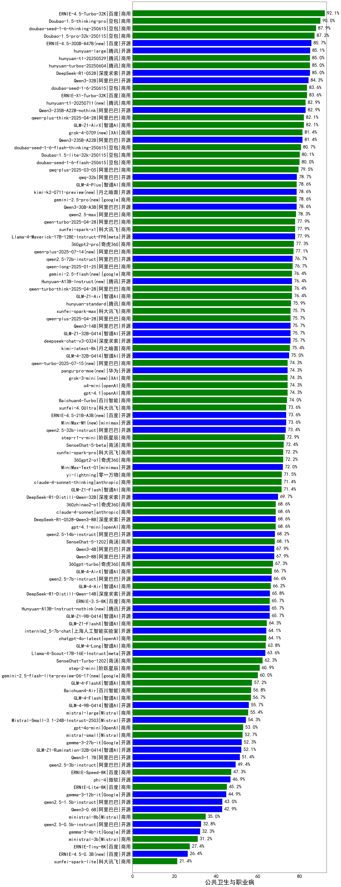

|类别|机构|大模型|【公共卫生与职业病】准确率|平均耗时|平均消耗token|花费/千次（元）|排名（准确率）|
|---|---|-----|-------------------|-------|-----------|-----------|-----------|
|商用|百度|ERNIE-4.5-Turbo-32K|92.1%|22s|563|1.7|1|
|商用|智谱AI|GLM-4.5-Flash(new)|91.4%|33s|1861|0.0|2|
|商用|豆包|doubao-seed-1-6-thinking-250715(new)|91.4%|20s|1184|8.9|3|
|商用|豆包|Doubao-1.5-pro-32k-250115|87.2%|10s|365|0.6|4|
|开源|百度|ERNIE-4.5-300B-A47B|85.7%|19s|359|2.5|5|
|商用|科大讯飞|xunfei-spark-x1-0725(new)|85.7%|/|895|10.8|6|
|开源|阿里巴巴|qwen3-235b-a22b-thinking-2507(new)|85.7%|107s|2566|49.9|7|
|开源|腾讯|hunyuan-large|85.1%|10s|386|3.6|8|
|开源|深度求索|DeepSeek-R1-0528|85.0%|234s|1913|29.8|9|
|商用|腾讯|hunyuan-turbos-20250604|85.0%|25s|435|0.7|10|
|开源|阿里巴巴|Qwen3-32B|84.3%|27s|1006|3.8|11|
|商用|百度|ERNIE-X1-Turbo-32K|83.6%|105s|1941|7.6|12|
|商用|豆包|doubao-seed-1-6-250615|83.6%|108s|502|3.3|13|
|开源|阿里巴巴|Qwen3-235B-A22B-nothink|82.9%|19s|466|4.1|14|
|商用|腾讯|hunyuan-t1-20250711(new)|82.9%|29s|1743|6.7|15|
|商用|阿里巴巴|qwen-plus-think-2025-04-28|82.1%|216s|2168|16.8|16|
|商用|智谱AI|GLM-Z1-AirX|82.1%|27s|1722|9.7|17|
|开源|阿里巴巴|Qwen3-235B-A22B|81.4%|89s|2079|20.2|18|
|商用|XAI|grok-4-0709|81.4%|173s|1464|152.6|19|
|商用|豆包|doubao-seed-1-6-flash-thinking-250615|80.7%|8s|862|1.1|20|
|商用|豆包|Doubao-1.5-lite-32k-250115|80.1%|5s|193|0.1|21|
|开源|阶跃星辰|step-3(new)|80.0%|104s|2031|7.9|22|
|开源|阿里巴巴|qwen3-235b-a22b-instruct-2507(new)|80.0%|13s|548|3.9|23|
|商用|豆包|doubao-seed-1-6-flash-250615|80.0%|5s|349|0.4|24|
|开源|阿里巴巴|Qwen3-30B-A3B-Instruct-2507(new)|80.0%|6s|651|1.8|25|
|开源|智谱AI|GLM-4.5(new)|80.0%|148s|1709|22.5|26|
|商用|阿里巴巴|qwq-plus-2025-03-05|79.5%|58s|2365|9.3|27|
|开源|阿里巴巴|qwq-32b|78.7%|43s|2335|13.7|28|
|商用|智谱AI|GLM-4-Plus|78.6%|12s|290|1.5|29|
|开源|阿里巴巴|Qwen3-30B-A3B-Thinking-2507(new)|78.6%|59s|2446|6.7|30|
|商用|google|gemini-2.5-pro|78.6%|29s|2265|159.8|31|
|开源|阿里巴巴|Qwen3-30B-A3B|78.6%|28s|1647|4.5|32|
|开源|月之暗面|kimi-k2-0711-preview(new)|78.6%|30s|517|7.5|33|
|商用|阿里巴巴|qwen2.5-max|78.3%|20s|470|4.0|34|
|开源|meta|Llama-4-Maverick-17B-128E-Instruct-FP8|77.9%|7s|516|2.0|35|
|商用|奇虎360|360gpt2-pro|77.3%|9s|252|1.0|36|
|商用|阿里巴巴|qwen-plus-2025-07-14(new)|77.1%|12s|646|1.2|37|
|开源|阿里巴巴|qwen2.5-72b-instruct|76.7%|12s|276|2.7|38|
|商用|阿里巴巴|qwen-long-2025-01-25|76.7%|24s|381|0.7|39|
|开源|腾讯|Hunyuan-A13B-Instruct|76.4%|64s|1122|4.3|40|
|商用|google|gemini-2.5-flash|76.4%|11s|1817|31.8|41|
|商用|阿里巴巴|qwen-turbo-think-2025-04-28|76.4%|146s|2314|6.7|42|
|商用|智谱AI|GLM-Z1-Air|76.4%|44s|1454|0.8|43|
|商用|腾讯|hunyuan-standard|75.9%|/|/|/|44|
|商用|科大讯飞|xunfei-spark-max|75.7%|5s|136|4.1|45|
|开源|阿里巴巴|Qwen3-14B|75.7%|30s|1680|3.2|46|
|开源|深度求索|deepseek-chat-v3-0324|75.7%|79s|344|2.4|47|
|开源|智谱AI|GLM-Z1-32B-0414|75.7%|169s|2194|8.6|48|
|商用|月之暗面|kimi-latest-8k|75.4%|17s|499|6.0|49|
|开源|智谱AI|GLM-4-32B-0414|75.0%|26s|372|0.7|50|
|商用|XAI|grok-3-mini|74.3%|158s|1078|3.8|51|
|商用|openAI|o4-mini|74.3%|31s|793|23.3|52|
|商用|openAI|gpt-4.1|74.3%|10s|298|13.6|53|
|商用|阿里巴巴|qwen-turbo-2025-07-15(new)|74.3%|9s|411|0.2|54|
|开源|华为|pangu-pro-moe(new)|74.3%|85s|1552|6.0|55|
|商用|百川智能|Baichuan4-Turbo|74.0%|/|/|/|56|
|商用|科大讯飞|xunfei-4.0Ultra|73.6%|5s|130|9.2|57|
|开源|百度|ERNIE-4.5-21B-A3B|73.6%|31s|332|0.0|58|
|开源|minimax|MiniMax-M1|73.6%|209s|2417|18.1|59|
|开源|阿里巴巴|qwen2.5-32b-instruct|73.4%|8s|255|1.2|60|
|商用|阶跃星辰|step-r1-v-mini|72.9%|99s|1744|13.5|61|
|商用|科大讯飞|xunfei-spark-pro|72.2%|/|/|/|62|
|商用|奇虎360|360gpt2-o1|72.2%|19s|366|15.7|63|
|开源|minimax|MiniMax-Text-01|72.0%|14s|902|7.2|64|
|商用|零一万物|yi-lightning|71.5%|/|/|/|65|
|商用|智谱AI|GLM-Z1-Flash|71.4%|28s|2108|0.0|66|
|开源|阿里巴巴|Qwen3-32B-nothink|71.4%|56s|561|2.0|67|
|商用|anthropic|claude-4-sonnet-thinking|71.4%|49s|1185|119.0|68|
|开源|阿里巴巴|Qwen3-14B-nothink|71.4%|22s|612|1.1|69|
|开源|深度求索|DeepSeek-R1-Distill-Qwen-32B|69.7%|43s|738|0.9|70|
|商用|奇虎360|360zhinao2-o1|68.6%|/|/|/|71|
|商用|openAI|gpt-4.1-mini|68.6%|8s|332|3.1|72|
|商用|anthropic|claude-4-sonnet|68.6%|42s|543|49.2|73|
|开源|深度求索|DeepSeek-R1-0528-Qwen3-8B|68.6%|261s|1745|0.0|74|
|开源|智谱AI|GLM-4.5-Air(new)|68.6%|35s|1801|10.4|75|
|开源|阿里巴巴|Qwen3-8B-nothink|68.6%|23s|525|0.0|76|
|开源|阿里巴巴|qwen2.5-14b-instruct|68.2%|11s|273|0.7|77|
|商用|商汤|SenseChat-5-1202|68.1%|/|/|/|78|
|开源|阿里巴巴|Qwen3-8B|67.9%|131s|3857|0.0|79|
|开源|阿里巴巴|Qwen3-4B|67.9%|22s|1503|4.3|80|
|商用|奇虎360|360gpt-turbo|67.3%|/|/|/|81|
|商用|智谱AI|GLM-4-AirX|66.7%|7s|287|2.9|82|
|开源|阿里巴巴|qwen2.5-7b-instruct|66.6%|5s|243|0.2|83|
|开源|深度求索|DeepSeek-R1-Distill-Qwen-14B|65.8%|/|/|/|84|
|商用|百度|ERNIE-3.5-8K|65.7%|21s|351|0.6|85|
|开源|腾讯|Hunyuan-A13B-Instruct-nothink(new)|65.7%|34s|378|1.3|86|
|开源|智谱AI|GLM-Z1-9B-0414|65.7%|106s|2769|0.0|87|
|商用|智谱AI|GLM-Z1-FlashX|64.3%|31s|1601|0.3|88|
|开源|上海人工智能实验室|internlm2_5-7b-chat|64.1%|/|/|/|89|
|商用|openAI|chatgpt-4o-latest|64.1%|/|/|/|90|
|商用|智谱AI|GLM-4-Long|63.8%|11s|375|0.4|91|
|开源|meta|Llama-4-Scout-17B-16E-Instruct|63.6%|10s|531|1.0|92|
|开源|阿里巴巴|Qwen3-30B-A3B-nothink|62.9%|23s|503|1.2|93|
|开源|阿里巴巴|Qwen3-4B-nothink|62.9%|17s|498|1.3|94|
|商用|阶跃星辰|step-2-mini|60.9%|7s|353|0.6|95|
|商用|google|gemini-2.5-flash-lite-preview-06-17|60.0%|2s|595|1.6|96|
|商用|智谱AI|GLM-4-FlashX|57.2%|9s|322|0.0|97|
|商用|百川智能|Baichuan4-Air|56.8%|/|/|/|98|
|开源|智谱AI|GLM-4-9B-0414|55.7%|11s|445|0.0|99|
|商用|Mistral|mistral-large|55.4%|/|/|/|100|
|开源|Mistral|Mistral-Small-3.1-24B-Instruct-2503|54.3%|/|/|/|101|
|商用|OpenAI|gpt-4o-mini|53.0%|/|/|/|102|
|商用|Mistral|mistral-small|52.7%|/|/|/|103|
|开源|Google|gemma-3-27b-it|52.3%|/|/|/|104|
|开源|智谱AI|GLM-Z1-Rumination-32B-0414|52.1%|26s|1259|3.4|105|
|开源|阿里巴巴|Qwen3-1.7B|51.4%|20s|2386|7.0|106|
|开源|阿里巴巴|qwen2.5-3b-instruct|49.4%|5s|294|0.2|107|
|商用|百度|ERNIE-Speed-8K|47.3%|/|/|/|108|
|开源|微软|phi-4|46.9%|/|/|/|109|
|商用|百度|ERNIE-Lite-8K|45.2%|/|/|/|110|
|开源|Google|gemma-3-12b-it|44.9%|/|/|/|111|
|开源|阿里巴巴|qwen2.5-1.5b-instruct|43.0%|6s|179|0.0|112|
|开源|阿里巴巴|Qwen3-0.6B|42.9%|8s|1135|3.2|113|
|开源|阿里巴巴|Qwen3-1.7B-nothink|40.0%|16s|499|1.3|114|
|商用|Mistral|ministral-8b|35.0%|/|/|/|115|
|开源|阿里巴巴|qwen2.5-0.5b-instruct|32.8%|4s|269|0.0|116|
|开源|Google|gemma-3-4b-it|32.3%|/|/|/|117|
|商用|Mistral|ministral-3b|31.2%|/|/|/|118|
|开源|阿里巴巴|Qwen3-0.6B-nothink|28.6%|11s|252|0.5|119|
|商用|百度|ERNIE-Tiny-8K|27.4%|/|/|/|120|
|开源|百度|ERNIE-4.5-0.3B|26.4%|41s|394|0.0|121|
|商用|科大讯飞|xunfei-spark-lite|21.4%|/|/|/|122|

