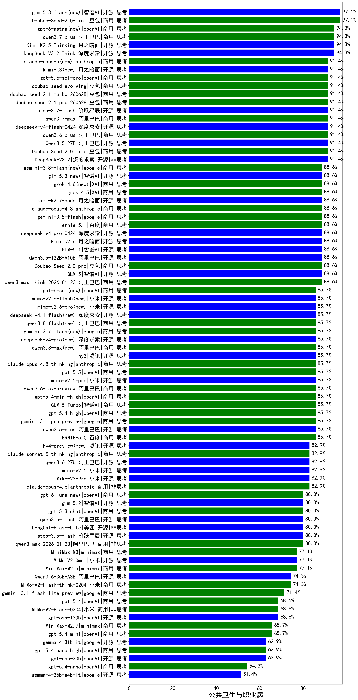

|类别|机构|大模型|【公共卫生与职业病】准确率|平均耗时|平均消耗token|花费/千次（元）|排名（准确率）|
|---|---|-----|-------------------|-------|-----------|-----------|-----------|
|商用|豆包|Doubao-Seed-2.0-mini|97.1%|352s|2056|3.9|1|
|开源|智谱AI|glm-5.3-flash(new)|97.1%|148s|1571|4.2|2|
|开源|深度求索|DeepSeek-V3.2-Think|94.3%|104s|975|2.9|3|
|开源|月之暗面|Kimi-K2.5-Thinking|94.3%|295s|1962|40.0|4|
|商用|openAI|gpt-6-astra(new)|94.3%|13s|270|71.3|5|
|商用|阿里巴巴|qwen3.7-plus(new)|94.3%|23s|1147|8.7|6|
|开源|阿里巴巴|Qwen3.5-27B|91.4%|260s|3060|14.4|7|
|商用|阿里巴巴|qwen3.7-max|91.4%|27s|1045|35.9|8|
|商用|openAI|gpt-5.6-sol-pro(new)|91.4%|52s|3213|249.9|9|
|商用|阿里巴巴|qwen3.6-plus|91.4%|42s|1541|17.7|10|
|商用|anthropic|claude-opus-5(new)|91.4%|14s|694|107.2|11|
|开源|月之暗面|kimi-k3(new)|91.4%|47s|994|87.7|12|
|开源|深度求索|deepseek-v4-flash-0424|91.4%|35s|666|1.3|13|
|商用|豆包|doubao-seed-1-8-251215|91.4%|24s|626|4.2|14|
|商用|豆包|Doubao-Seed-2.0-lite|91.4%|209s|942|3.1|15|
|商用|阿里巴巴|qwen-plus-think-2025-12-01|91.4%|86s|2908|22.7|16|
|开源|深度求索|DeepSeek-V3.2|91.4%|63s|373|1.1|17|
|商用|豆包|doubao-seed-evolving(new)|91.4%|156s|5718|168.9|18|
|商用|腾讯|hunyuan-2.0-thinking-20251109|91.4%|20s|903|3.4|19|
|商用|豆包|doubao-seed-2-1-turbo-260628(new)|91.4%|158s|6179|91.4|20|
|开源|阶跃星辰|step-3.7-flash(new)|91.4%|38s|1704|13.3|21|
|商用|豆包|doubao-seed-2-1-pro-260628(new)|91.4%|196s|5938|175.5|22|
|商用|google|gemini-3.5-flash|88.6%|8s|1524|92.3|23|
|商用|XAI|grok-4.6(new)|88.6%|151s|1476|54.5|24|
|开源|阿里巴巴|Qwen3.5-122B-A10B|88.6%|257s|2781|17.4|25|
|开源|智谱AI|glm-5.3(new)|88.6%|-40s|1947|53.0|26|
|开源|月之暗面|kimi-k2.7-code(new)|88.6%|16s|788|19.9|27|
|商用|豆包|Doubao-Seed-2.0-pro|88.6%|249s|1112|16.4|28|
|开源|智谱AI|GLM-5.1|88.6%|160s|1715|40.0|29|
|开源|月之暗面|kimi-k2.6|88.6%|109s|1849|48.5|30|
|开源|深度求索|deepseek-v4-pro-0424|88.6%|29s|778|17.9|31|
|商用|anthropic|claude-opus-4.8(new)|88.6%|11s|548|81.6|32|
|商用|百度|ernie-5.1|88.6%|27s|942|16.0|33|
|商用|XAI|grok-4.5(new)|88.6%|121s|1716|64.5|34|
|开源|智谱AI|GLM-5|88.6%|140s|2251|39.6|35|
|商用|google|gemini-3.8-flash(new)|88.6%|27s|743|36.0|36|
|商用|google|gemini-3-flash-preview|88.6%|82s|1174|23.7|37|
|商用|阿里巴巴|qwen3-max-think-2026-01-23|88.6%|144s|2879|28.2|38|
|商用|阿里巴巴|qwen3.8-flash(new)|85.7%|35s|1964|5.1|39|
|商用|openAI|gpt-5.4-high|85.7%|15s|738|70.3|40|
|开源|小米|mimo-v2.5-pro|85.7%|23s|1281|22.4|41|
|商用|百度|ERNIE-5.0|85.7%|195s|2499|58.9|42|
|商用|openAI|gpt-5.5|85.7%|13s|492|88.9|43|
|商用|阿里巴巴|qwen3.8-max(new)|85.7%|28s|1041|34.8|44|
|开源|深度求索|deepseek-v4-pro(new)|85.7%|140s|1077|26.5|45|
|商用|openAI|gpt-5.4-mini-high|85.7%|77s|919|26.8|46|
|商用|google|gemini-3.7-flash(new)|85.7%|5s|780|19.0|47|
|商用|智谱AI|GLM-5-Turbo|85.7%|31s|1283|27.1|48|
|商用|openAI|gpt-5.2-high|85.7%|8s|412|33.8|49|
|商用|阿里巴巴|qwen-plus-2025-12-01|85.7%|22s|899|1.7|50|
|商用|anthropic|claude-opus-4.8-thinking(new)|85.7%|13s|657|100.8|51|
|开源|深度求索|deepseek-v4.1-flash(new)|85.7%|9s|1109|8.3|52|
|商用|google|gemini-3.1-pro-preview|85.7%|36s|1394|113.7|53|
|开源|阿里巴巴|qwen3.5-plus|85.7%|35s|2910|13.7|54|
|开源|腾讯|hy3(new)|85.7%|56s|237|0.7|55|
|商用|阿里巴巴|qwen3.6-max-preview|85.7%|55s|1700|88.5|56|
|商用|minimax|MiniMax-M2.1|82.9%|120s|1413|11.2|57|
|开源|阿里巴巴|qwen3.6-27b|82.9%|26s|1605|27.8|58|
|商用|anthropic|claude-sonnet-5-thinking(new)|82.9%|12s|750|46.8|59|
|开源|小米|MiMo-V2-Flash-think|82.9%|24s|2233|0.0|60|
|开源|智谱AI|GLM-4.7|82.9%|46s|1707|23.1|61|
|开源|小米|mimo-v2.5|82.9%|23s|1407|16.2|62|
|商用|阿里巴巴|qwen3-max-preview-think|82.9%|183s|2776|65.2|63|
|开源|腾讯|hy4-preview(new)|82.9%|56s|2759|48.7|64|
|商用|anthropic|claude-opus-4.6|82.9%|13s|606|91.7|65|
|开源|小米|MiMo-V2-Pro|82.9%|185s|1071|18.1|66|
|开源|Mistral|mistral-large-2512|80.0%|14s|590|5.6|67|
|开源|智谱AI|glm-5.2(new)|80.0%|41s|1828|49.7|68|
|开源|阶跃星辰|step-3.5-flash|80.0%|26s|1994|4.1|69|
|开源|阿里巴巴|qwen3-next-80b-a3b-thinking|80.0%|115s|3423|13.5|70|
|商用|openAI|gpt-5.3-chat|80.0%|19s|373|29.5|71|
|商用|openAI|gpt-5.2-medium|80.0%|9s|338|26.5|72|
|商用|阿里巴巴|qwen3-max-2026-01-23|80.0%|38s|499|4.4|73|
|开源|美团|LongCat-Flash-Thinking-2601|80.0%|146s|1836|0.0|74|
|开源|美团|LongCat-Flash-Lite|80.0%|247s|480|0.0|75|
|开源|阿里巴巴|qwen3.5-flash|80.0%|285s|3062|6.0|76|
|商用|minimax|MiniMax-M2.5|77.1%|25s|1274|10.1|77|
|商用|minimax|MiniMax-M3(new)|77.1%|25s|741|9.5|78|
|商用|腾讯|hunyuan-2.0-instruct-20251111|77.1%|10s|507|0.9|79|
|开源|小米|MiMo-V2-Omni|77.1%|60s|1272|14.2|80|
|开源|阿里巴巴|Qwen3.6-35B-A3B|74.3%|97s|1645|17.1|81|
|商用|小米|MiMo-V2-Flash-think-0204|74.3%|754s|2244|4.6|82|
|开源|智谱AI|GLM-4.7-Flash|74.3%|1195s|4669|0.0|83|
|商用|openAI|gpt-5.2|74.3%|6s|197|12.4|84|
|商用|google|gemini-3.1-flash-lite-preview|71.4%|5s|386|3.4|85|
|开源|openAI|gpt-oss-120b|68.6%|61s|603|1.6|86|
|商用|openAI|gpt-5.4|68.6%|6s|265|20.6|87|
|商用|小米|MiMo-V2-Flash-0204|68.6%|284s|547|1.0|88|
|开源|小米|MiMo-V2-Flash|68.6%|79s|562|0.0|89|
|商用|minimax|MiniMax-M2.7|65.7%|36s|1446|11.5|90|
|商用|openAI|gpt-5.4-mini|65.7%|31s|223|4.9|91|
|开源|google|gemma-4-31b-it|62.9%|90s|545|1.4|92|
|商用|openAI|gpt-5.4-nano-high|62.9%|46s|551|4.2|93|
|开源|openAI|gpt-oss-20b|62.9%|72s|1499|1.6|94|
|开源|Mistral|Ministral-3-8B-Instruct-2512|62.9%|8s|752|0.8|95|
|开源|Mistral|Ministral-3-14B-Instruct-2512|62.9%|24s|2670|3.8|96|
|开源|Mistral|Ministral-3-3B-Instruct-2512|57.1%|8s|961|0.7|97|
|商用|openAI|gpt-5.4-nano|54.3%|39s|245|1.5|98|
|开源|google|gemma-4-26b-a4b-it|51.4%|53s|617|1.6|99|

