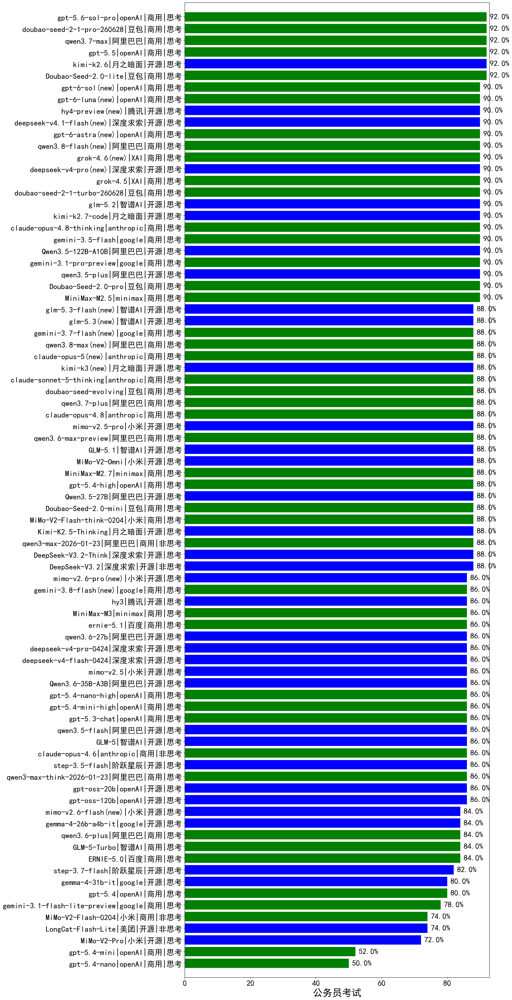

|类别|机构|大模型|【公务员考试】准确率|平均耗时|平均消耗token|花费/千次（元）|排名（准确率）|
|---|---|-----|-------------------|-------|-----------|-----------|-----------|
|开源|月之暗面|kimi-k2.6|92.0%|197s|3466|90.8|1|
|商用|openAI|gpt-5.5|92.0%|12s|824|140.7|2|
|商用|阿里巴巴|qwen3.7-max|92.0%|42s|2005|68.7|3|
|商用|豆包|doubao-seed-2-1-pro-260628|92.0%|263s|11444|338.6|4|
|商用|openAI|gpt-5.6-sol-pro|92.0%|27s|4695|397.3|5|
|商用|豆包|Doubao-Seed-2.0-lite|92.0%|322s|1667|5.4|6|
|商用|豆包|Doubao-Seed-2.0-pro|90.0%|335s|1563|22.5|7|
|商用|google|gemini-3.5-flash|90.0%|14s|2228|131.5|8|
|商用|anthropic|claude-opus-4.8-thinking|90.0%|16s|1314|194.3|9|
|开源|月之暗面|kimi-k2.7-code|90.0%|42s|1618|40.9|10|
|开源|智谱AI|glm-5.2|90.0%|69s|2808|75.6|11|
|商用|豆包|doubao-seed-2-1-turbo-260628|90.0%|226s|9719|143.4|12|
|商用|XAI|grok-4.5|90.0%|87s|3686|144.5|13|
|开源|阿里巴巴|Qwen3.5-122B-A10B|90.0%|103s|3987|24.7|14|
|开源|阿里巴巴|qwen3.5-plus|90.0%|50s|3799|17.6|15|
|商用|google|gemini-3.1-pro-preview|90.0%|36s|2057|163.3|16|
|商用|阿里巴巴|qwen3.8-flash(new)|90.0%|39s|2215|5.6|17|
|商用|openAI|gpt-6-astra(new)|90.0%|16s|462|110.3|18|
|开源|深度求索|deepseek-v4-pro(new)|90.0%|171s|5323|139.7|19|
|商用|openAI|gpt-6-sol(new)|90.0%|104s|384|16.6|20|
|商用|XAI|grok-4.6(new)|90.0%|70s|3069|118.6|21|
|商用|minimax|MiniMax-M2.5|90.0%|56s|3326|26.8|22|
|商用|openAI|gpt-6-luna(new)|90.0%|232s|733|2.1|23|
|开源|腾讯|hy4-preview(new)|90.0%|55s|3186|55.4|24|
|开源|深度求索|deepseek-v4.1-flash(new)|90.0%|6s|1168|8.3|25|
|开源|小米|mimo-v2.5-pro|88.0%|52s|3407|65.9|26|
|商用|anthropic|claude-opus-4.8|88.0%|10s|834|110.3|27|
|商用|阿里巴巴|qwen3.7-plus|88.0%|65s|3517|27.3|28|
|商用|阿里巴巴|qwen3.8-max(new)|88.0%|48s|1936|65.3|29|
|开源|智谱AI|glm-5.3-flash(new)|88.0%|86s|2441|6.5|30|
|商用|anthropic|claude-opus-5(new)|88.0%|13s|886|119.4|31|
|开源|智谱AI|glm-5.3(new)|88.0%|74s|2017|53.4|32|
|商用|豆包|doubao-seed-evolving|88.0%|307s|12514|370.7|33|
|商用|anthropic|claude-sonnet-5-thinking|88.0%|19s|1594|97.3|34|
|商用|google|gemini-3.7-flash(new)|88.0%|6s|1087|25.0|35|
|开源|月之暗面|kimi-k3(new)|88.0%|79s|2083|191.1|36|
|开源|智谱AI|GLM-5.1|88.0%|240s|2530|58.1|37|
|商用|阿里巴巴|qwen3.6-max-preview|88.0%|90s|2781|143.6|38|
|商用|XAI|grok-4.7(new)|88.0%|90s|6729|243.3|39|
|开源|深度求索|DeepSeek-V3.2|88.0%|27s|957|2.7|40|
|开源|深度求索|DeepSeek-V3.2-Think|88.0%|176s|2037|6.0|41|
|开源|阿里巴巴|Qwen3.5-27B|88.0%|415s|4345|20.2|42|
|商用|阿里巴巴|qwen3-max-2026-01-23|88.0%|139s|1272|11.5|43|
|商用|豆包|Doubao-Seed-2.0-mini|88.0%|292s|6763|13.2|44|
|开源|月之暗面|Kimi-K2.5-Thinking|88.0%|202s|4167|85.2|45|
|商用|openAI|gpt-5.4-high|88.0%|33s|1168|106.6|46|
|开源|小米|MiMo-V2-Omni|88.0%|500s|2755|34.1|47|
|商用|小米|MiMo-V2-Flash-think-0204|88.0%|554s|2964|6.0|48|
|商用|minimax|MiniMax-M2.7|88.0%|96s|4328|35.3|49|
|开源|阿里巴巴|Qwen3.6-35B-A3B|86.0%|17s|3196|33.2|50|
|开源|智谱AI|GLM-5|86.0%|149s|3619|63.1|51|
|开源|阿里巴巴|qwen3.5-flash|86.0%|427s|5187|10.1|52|
|开源|阶跃星辰|step-3.5-flash|86.0%|32s|5304|10.9|53|
|商用|anthropic|claude-opus-4.6|86.0%|26s|1013|141.2|54|
|商用|google|gemini-3.8-flash(new)|86.0%|12s|1300|61.2|55|
|商用|阿里巴巴|qwen3-max-think-2026-01-23|86.0%|124s|4377|42.6|56|
|开源|小米|mimo-v2.6-pro(new)|86.0%|39s|2032|11.7|57|
|开源|腾讯|hy3|86.0%|27s|522|1.6|58|
|商用|openAI|gpt-5.3-chat|86.0%|26s|802|62.8|59|
|开源|openAI|gpt-oss-120b|86.0%|246s|1450|4.1|60|
|商用|百度|ernie-5.1|86.0%|73s|3412|59.1|61|
|开源|openAI|gpt-oss-20b|86.0%|151s|2444|2.6|62|
|开源|小米|mimo-v2.5|86.0%|28s|2337|28.3|63|
|商用|openAI|gpt-5.4-mini-high|86.0%|73s|1707|48.9|64|
|开源|深度求索|deepseek-v4-flash-0424|86.0%|33s|1898|3.7|65|
|商用|openAI|gpt-5.4-nano-high|86.0%|46s|1415|11.0|66|
|开源|深度求索|deepseek-v4-pro-0424|86.0%|53s|1584|36.3|67|
|商用|minimax|MiniMax-M3|86.0%|96s|1983|29.4|68|
|开源|阿里巴巴|qwen3.6-27b|86.0%|45s|2876|49.6|69|
|开源|小米|mimo-v2.6-flash(new)|84.0%|292s|1504|2.9|70|
|商用|百度|ERNIE-5.0|84.0%|250s|3716|86.6|71|
|商用|阿里巴巴|qwen3.6-plus|84.0%|67s|2817|32.3|72|
|商用|智谱AI|GLM-5-Turbo|84.0%|37s|2660|56.0|73|
|开源|google|gemma-4-26b-a4b-it|84.0%|41s|1160|2.9|74|
|开源|阶跃星辰|step-3.7-flash|82.0%|1308s|4436|34.9|75|
|商用|openAI|gpt-5.4|80.0%|10s|660|53.2|76|
|开源|google|gemma-4-31b-it|80.0%|128s|852|2.1|77|
|商用|google|gemini-3.1-flash-lite-preview|78.0%|8s|719|6.1|78|
|开源|美团|LongCat-Flash-Lite|74.0%|160s|1522|0.0|79|
|商用|小米|MiMo-V2-Flash-0204|74.0%|206s|1455|2.8|80|
|开源|小米|MiMo-V2-Pro|72.0%|375s|1616|28.4|81|
|商用|openAI|gpt-5.4-mini|52.0%|23s|544|12.3|82|
|商用|openAI|gpt-5.4-nano|50.0%|71s|671|4.5|83|

