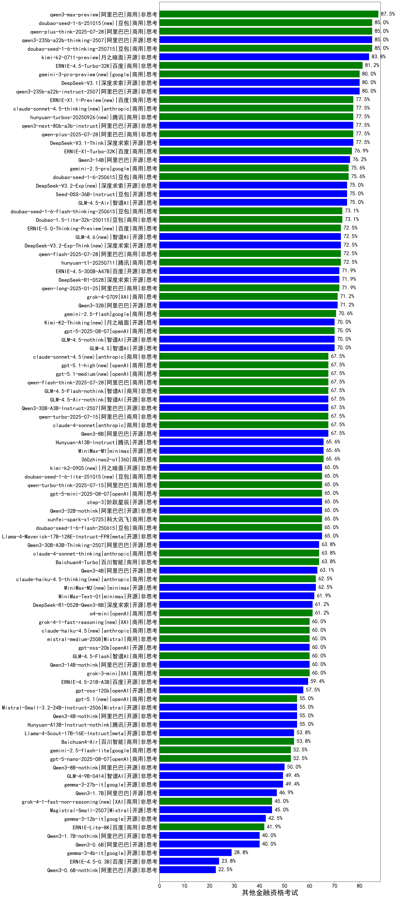

|类别|机构|大模型|【其他金融资格考试】准确率|平均耗时|平均消耗token|花费/千次（元）|排名（准确率）|
|---|---|-----|-------------------|-------|-----------|-----------|-----------|
|开源|阿里巴巴|qwen3-235b-a22b-thinking-2507(new)|85.0%|159s|3579|70.1|1|
|商用|豆包|doubao-seed-1-6-thinking-250715(new)|85.0%|65s|2528|19.6|2|
|开源|月之暗面|kimi-k2-0711-preview(new)|83.8%|49s|643|9.4|3|
|商用|豆包|Doubao-1.5-pro-32k-250115|82.1%|11s|428|0.8|4|
|商用|百度|ERNIE-4.5-Turbo-32K|81.2%|36s|675|2.0|5|
|开源|腾讯|hunyuan-large|80.9%|14s|988|6.8|6|
|开源|阿里巴巴|qwen3-235b-a22b-instruct-2507(new)|80.0%|23s|1024|7.7|7|
|开源|阿里巴巴|Qwen3-235B-A22B|77.5%|114s|2673|26.1|8|
|商用|阿里巴巴|qwen-plus-2025-07-14(new)|77.5%|20s|1210|2.3|9|
|商用|百度|ERNIE-X1-Turbo-32K|76.9%|163s|2615|10.2|10|
|开源|阿里巴巴|Qwen3-14B|76.2%|47s|2295|4.5|11|
|商用|豆包|doubao-seed-1-6-250615|75.6%|100s|458|2.8|12|
|商用|google|gemini-2.5-pro|75.6%|31s|2302|161.6|13|
|商用|阿里巴巴|qwen-plus-think-2025-04-28|75.6%|219s|2783|21.6|14|
|商用|腾讯|hunyuan-turbos-20250604|75.6%|70s|985|1.8|15|
|开源|智谱AI|GLM-4.5-Air(new)|75.0%|65s|3632|21.4|16|
|商用|阿里巴巴|qwq-plus-2025-03-05|74.5%|68s|2969|11.7|17|
|开源|阿里巴巴|qwq-32b|74.0%|87s|2488|14.6|18|
|商用|豆包|doubao-seed-1-6-flash-thinking-250615|73.1%|35s|1734|2.4|19|
|商用|豆包|Doubao-1.5-lite-32k-250115|73.0%|7s|325|0.2|20|
|商用|阿里巴巴|qwen2.5-max|72.6%|19s|451|3.7|21|
|开源|阿里巴巴|Qwen3-30B-A3B|72.5%|41s|2296|6.2|22|
|商用|腾讯|hunyuan-t1-20250711(new)|72.5%|50s|3196|12.4|23|
|开源|华为|pangu-pro-moe(new)|72.5%|114s|2391|9.3|24|
|商用|智谱AI|GLM-Z1-AirX|71.9%|29s|2068|14.1|25|
|开源|深度求索|DeepSeek-R1-0528|71.9%|267s|3017|47.4|26|
|开源|百度|ERNIE-4.5-300B-A47B|71.9%|28s|596|4.3|27|
|商用|智谱AI|GLM-4-Plus|71.8%|10s|315|1.6|28|
|开源|深度求索|deepseek-chat-v3-0324|71.2%|132s|619|4.5|29|
|商用|阶跃星辰|step-r1-v-mini|71.2%|156s|2388|18.6|30|
|商用|XAI|grok-4-0709|71.2%|318s|2502|264.6|31|
|开源|阿里巴巴|Qwen3-235B-A22B-nothink|71.2%|27s|553|4.8|32|
|开源|阿里巴巴|Qwen3-32B|71.2%|28s|1089|4.1|33|
|商用|google|gemini-2.5-flash|70.6%|11s|1907|33.2|34|
|商用|阿里巴巴|qwen-long-2025-01-25|70.1%|76s|450|0.8|35|
|商用|阿里巴巴|qwen-turbo-think-2025-04-28|70.0%|119s|3254|9.5|36|
|开源|智谱AI|GLM-4.5-nothink|70.0%|78s|2613|35.7|37|
|开源|智谱AI|GLM-4.5(new)|70.0%|122s|3109|42.7|38|
|开源|minimax|MiniMax-M1|70.0%|297s|3207|24.4|39|
|商用|奇虎360|360gpt2-pro|69.6%|11s|291|1.1|40|
|商用|月之暗面|kimi-latest-8k|69.3%|16s|482|5.8|41|
|商用|科大讯飞|xunfei-spark-max|68.3%|9s|238|7.2|42|
|商用|科大讯飞|xunfei-4.0Ultra|68.3%|9s|238|16.8|43|
|开源|智谱AI|GLM-Z1-32B-0414|68.1%|208s|2947|11.6|44|
|商用|anthropic|claude-4-sonnet|67.5%|55s|587|52.8|45|
|开源|阿里巴巴|Qwen3-30B-A3B-Instruct-2507(new)|67.5%|13s|1215|3.5|46|
|商用|阿里巴巴|qwen-turbo-2025-07-15(new)|67.5%|17s|918|0.5|47|
|商用|智谱AI|GLM-4.5-Flash-nothink|67.5%|21s|1103|0.0|48|
|开源|智谱AI|GLM-4.5-Air-nothink|67.5%|51s|2770|16.1|49|
|开源|阿里巴巴|qwen2.5-72b-instruct|66.8%|12s|308|2.9|50|
|商用|科大讯飞|xunfei-spark-x1-0725(new)|66.2%|/|2735|32.8|51|
|开源|智谱AI|GLM-4-32B-0414|66.2%|27s|549|1.0|52|
|开源|深度求索|DeepSeek-R1-Distill-Qwen-32B|66.0%|42s|1469|1.9|53|
|开源|腾讯|Hunyuan-A13B-Instruct|65.6%|70s|1706|6.6|54|
|商用|智谱AI|GLM-Z1-Air|65.6%|44s|1458|0.8|55|
|开源|阿里巴巴|Qwen3-32B-nothink|65.0%|51s|671|2.4|56|
|开源|阶跃星辰|step-3(new)|65.0%|210s|4080|16.1|57|
|商用|豆包|doubao-seed-1-6-flash-250615|65.0%|28s|639|0.8|58|
|开源|阿里巴巴|qwen2.5-32b-instruct|64.8%|9s|279|1.3|59|
|商用|商汤|SenseChat-5-1202|64.7%|/|/|/|60|
|商用|奇虎360|360gpt2-o1|64.5%|24s|566|25.3|61|
|商用|腾讯|hunyuan-standard|64.0%|/|/|/|62|
|商用|奇虎360|360zhinao2-o1|64.0%|/|/|/|63|
|商用|anthropic|claude-4-sonnet-thinking|63.8%|62s|1317|132.1|64|
|开源|阿里巴巴|Qwen3-30B-A3B-Thinking-2507(new)|63.8%|89s|3678|10.1|65|
|开源|meta|Llama-4-Maverick-17B-128E-Instruct-FP8|63.8%|8s|563|2.2|66|
|商用|百川智能|Baichuan4-Turbo|63.2%|/|/|/|67|
|开源|阿里巴巴|Qwen3-4B|63.1%|23s|1728|5.0|68|
|商用|奇虎360|360gpt-turbo|63.0%|/|/|/|69|
|开源|阿里巴巴|Qwen3-8B|62.5%|154s|4718|0.0|70|
|商用|openAI|o4-mini|61.2%|34s|1203|36.2|71|
|开源|深度求索|DeepSeek-R1-0528-Qwen3-8B|61.2%|261s|3311|0.0|72|
|开源|阿里巴巴|qwen2.5-14b-instruct|61.0%|11s|351|0.8|73|
|商用|智谱AI|GLM-Z1-Flash|60.6%|33s|1714|0.0|74|
|开源|智谱AI|GLM-Z1-9B-0414|60.6%|106s|3459|0.0|75|
|商用|零一万物|yi-lightning|60.6%|/|/|/|76|
|商用|XAI|grok-3-mini|60.0%|192s|1333|4.7|77|
|商用|智谱AI|GLM-4.5-Flash(new)|60.0%|66s|3879|0.0|78|
|开源|阿里巴巴|Qwen3-14B-nothink|60.0%|17s|786|1.4|79|
|开源|阿里巴巴|Qwen3-30B-A3B-nothink|60.0%|26s|739|1.9|80|
|开源|minimax|MiniMax-Text-01|59.8%|13s|908|7.3|81|
|商用|科大讯飞|xunfei-spark-pro|59.2%|/|/|/|82|
|开源|阿里巴巴|qwen2.5-7b-instruct|58.8%|13s|333|0.3|83|
|开源|百度|ERNIE-4.5-21B-A3B|57.5%|28s|761|0.0|84|
|商用|openAI|gpt-4.1|57.5%|11s|379|17.9|85|
|商用|openAI|chatgpt-4o-latest|57.4%|/|/|/|86|
|开源|深度求索|DeepSeek-R1-Distill-Qwen-14B|57.2%|/|/|/|87|
|商用|智谱AI|GLM-4-Long|57.1%|10s|347|0.4|88|
|开源|阿里巴巴|Qwen3-4B-nothink|55.0%|18s|595|1.5|89|
|开源|腾讯|Hunyuan-A13B-Instruct-nothink(new)|55.0%|53s|428|1.5|90|
|开源|Mistral|Mistral-Small-3.1-24B-Instruct-2503|54.4%|/|/|/|91|
|开源|上海人工智能实验室|internlm2_5-7b-chat|53.9%|/|/|/|92|
|商用|智谱AI|GLM-Z1-FlashX|53.1%|31s|1556|0.4|93|
|商用|智谱AI|GLM-4-AirX|52.9%|6s|347|3.0|94|
|商用|百度|ERNIE-3.5-8K|52.9%|24s|491|0.9|95|
|开源|阿里巴巴|Qwen3-8B-nothink|52.5%|47s|735|0.0|96|
|商用|Mistral|mistral-small|52.1%|/|/|/|97|
|商用|阶跃星辰|step-2-mini|50.7%|8s|379|0.7|98|
|商用|google|gemini-2.5-flash-lite-preview-06-17|50.6%|4s|1219|3.4|99|
|开源|meta|Llama-4-Scout-17B-16E-Instruct|50.6%|10s|612|1.2|100|
|商用|Mistral|mistral-large|50.0%|/|/|/|101|
|开源|智谱AI|GLM-4-9B-0414|49.4%|11s|496|0.0|102|
|商用|openAI|gpt-4.1-mini|48.8%|9s|482|4.8|103|
|开源|智谱AI|GLM-Z1-Rumination-32B-0414|48.1%|49s|1987|6.3|104|
|商用|百川智能|Baichuan4-Air|48.0%|/|/|/|105|
|开源|阿里巴巴|Qwen3-1.7B|46.9%|31s|3050|8.9|106|
|开源|Google|gemma-3-27b-it|45.4%|/|/|/|107|
|商用|智谱AI|GLM-4-FlashX|45.3%|9s|425|0.0|108|
|商用|OpenAI|gpt-4o-mini|44.4%|/|/|/|109|
|开源|阿里巴巴|qwen2.5-3b-instruct|44.0%|10s|356|0.3|110|
|开源|微软|phi-4|43.1%|/|/|/|111|
|开源|阿里巴巴|Qwen3-1.7B-nothink|40.0%|12s|570|1.5|112|
|开源|阿里巴巴|Qwen3-0.6B|40.0%|11s|1877|5.4|113|
|商用|百度|ERNIE-Lite-8K|37.4%|/|/|/|114|
|商用|百度|ERNIE-Speed-8K|36.5%|/|/|/|115|
|开源|Google|gemma-3-12b-it|36.5%|/|/|/|116|
|开源|阿里巴巴|qwen2.5-1.5b-instruct|34.9%|10s|233|0.0|117|
|商用|Mistral|ministral-8b|31.2%|/|/|/|118|
|开源|Google|gemma-3-4b-it|29.2%|/|/|/|119|
|商用|Mistral|ministral-3b|27.9%|/|/|/|120|
|开源|阿里巴巴|qwen2.5-0.5b-instruct|25.6%|8s|287|0.0|121|
|开源|百度|ERNIE-4.5-0.3B|23.1%|20s|433|0.0|122|
|商用|百度|ERNIE-Tiny-8K|22.8%|/|/|/|123|
|开源|阿里巴巴|Qwen3-0.6B-nothink|22.5%|8s|320|0.7|124|
|商用|科大讯飞|xunfei-spark-lite|18.9%|/|/|/|125|

