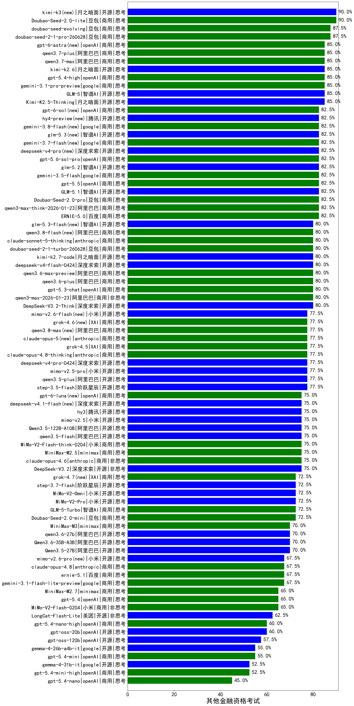

|类别|机构|大模型|【其他金融资格考试】准确率|平均耗时|平均消耗token|花费/千次（元）|排名（准确率）|
|---|---|-----|-------------------|-------|-----------|-----------|-----------|
|商用|豆包|Doubao-Seed-2.0-lite|90.0%|293s|1341|4.5|1|
|开源|月之暗面|kimi-k3(new)|90.0%|74s|1790|166.8|2|
|商用|豆包|doubao-seed-2-1-pro-260628(new)|87.5%|274s|10102|300.1|3|
|商用|豆包|doubao-seed-evolving(new)|87.5%|280s|10527|312.9|4|
|商用|openAI|gpt-6-astra(new)|85.0%|14s|330|89.9|5|
|商用|豆包|doubao-seed-1-8-251215|85.0%|31s|921|6.5|6|
|商用|阿里巴巴|qwen3.7-max|85.0%|41s|2220|78.0|7|
|商用|阿里巴巴|qwen3.7-plus(new)|85.0%|43s|2325|18.1|8|
|商用|openAI|gpt-5.4-high|85.0%|25s|1192|117.0|9|
|商用|google|gemini-3.1-pro-preview|85.0%|43s|1939|159.2|10|
|开源|月之暗面|Kimi-K2.5-Thinking|85.0%|299s|3056|62.9|11|
|开源|美团|LongCat-Flash-Thinking-2601|85.0%|228s|3867|0.0|12|
|开源|智谱AI|GLM-4.7|85.0%|66s|2823|38.7|13|
|开源|智谱AI|GLM-5|85.0%|187s|2896|51.1|14|
|开源|月之暗面|kimi-k2.6|85.0%|157s|3417|90.7|15|
|商用|腾讯|hunyuan-2.0-thinking-20251109|85.0%|20s|1731|6.7|16|
|商用|阿里巴巴|qwen-plus-think-2025-12-01|85.0%|65s|2975|23.2|17|
|开源|智谱AI|glm-5.3(new)|82.5%|-10s|6776|188.0|18|
|商用|豆包|Doubao-Seed-2.0-pro|82.5%|283s|1272|18.7|19|
|商用|google|gemini-3.8-flash(new)|82.5%|28s|1071|52.7|20|
|开源|智谱AI|glm-5.2(new)|82.5%|85s|3198|87.9|21|
|商用|google|gemini-3.5-flash|82.5%|11s|1978|120.2|22|
|商用|阿里巴巴|qwen3-max-think-2026-01-23|82.5%|181s|4342|42.8|23|
|商用|百度|ERNIE-5.0|82.5%|239s|4873|115.7|24|
|商用|openAI|gpt-5.5|82.5%|11s|697|130.1|25|
|商用|openAI|gpt-5.6-sol-pro(new)|82.5%|38s|4120|357.3|26|
|商用|google|gemini-3.7-flash(new)|82.5%|8s|978|23.9|27|
|开源|智谱AI|GLM-5.1|82.5%|160s|2812|66.1|28|
|商用|google|gemini-3-flash-preview|82.5%|59s|1839|37.7|29|
|开源|深度求索|deepseek-v4-pro(new)|82.5%|136s|3503|91.8|30|
|商用|阿里巴巴|qwen3.8-flash(new)|80.0%|77s|3668|9.7|31|
|商用|阿里巴巴|qwen3.6-plus|80.0%|69s|2601|30.4|32|
|开源|深度求索|DeepSeek-V3.2-Think|80.0%|145s|2590|7.7|33|
|开源|月之暗面|kimi-k2.7-code(new)|80.0%|47s|1556|40.5|34|
|开源|深度求索|deepseek-v4-flash-0424|80.0%|53s|2121|4.2|35|
|商用|openAI|gpt-5.3-chat|80.0%|8s|491|40.2|36|
|商用|豆包|doubao-seed-2-1-turbo-260628(new)|80.0%|254s|10226|151.9|37|
|开源|智谱AI|glm-5.3-flash(new)|80.0%|159s|4960|13.7|38|
|商用|阿里巴巴|qwen3.6-max-preview|80.0%|65s|2054|107.2|39|
|商用|anthropic|claude-sonnet-5-thinking(new)|80.0%|15s|990|62.5|40|
|商用|阿里巴巴|qwen3-max-preview-think|80.0%|205s|3091|72.6|41|
|商用|阿里巴巴|qwen3-max-2026-01-23|80.0%|48s|750|6.9|42|
|开源|阿里巴巴|qwen3.5-plus|77.5%|47s|3760|17.7|43|
|商用|anthropic|claude-opus-4.8-thinking(new)|77.5%|16s|1107|176.9|44|
|商用|阿里巴巴|qwen3.8-max(new)|77.5%|41s|1954|67.5|45|
|开源|小米|mimo-v2.5-pro|77.5%|48s|2254|42.7|46|
|商用|anthropic|claude-opus-5(new)|77.5%|13s|844|130.9|47|
|商用|阿里巴巴|qwen-plus-2025-12-01|77.5%|43s|1237|2.4|48|
|开源|深度求索|deepseek-v4-pro-0424|77.5%|67s|2018|47.6|49|
|开源|阶跃星辰|step-3.5-flash|77.5%|45s|5882|12.2|50|
|商用|XAI|grok-4.6(new)|77.5%|45s|2107|80.6|51|
|商用|XAI|grok-4.5(new)|77.5%|91s|2504|97.3|52|
|开源|阿里巴巴|qwen3.5-flash|75.0%|345s|4603|9.1|53|
|商用|anthropic|claude-opus-4.6|75.0%|16s|624|92.1|54|
|开源|深度求索|DeepSeek-V3.2|75.0%|70s|517|1.5|55|
|商用|腾讯|hunyuan-2.0-instruct-20251111|75.0%|8s|564|1.0|56|
|开源|小米|mimo-v2.5|75.0%|62s|3647|47.4|57|
|开源|阿里巴巴|qwen3-next-80b-a3b-thinking|75.0%|137s|3745|14.7|58|
|商用|minimax|MiniMax-M2.5|75.0%|56s|3263|26.7|59|
|开源|腾讯|hy3(new)|75.0%|69s|387|1.3|60|
|开源|阿里巴巴|Qwen3.5-122B-A10B|75.0%|273s|3677|23.1|61|
|商用|小米|MiMo-V2-Flash-think-0204|75.0%|582s|4278|8.8|62|
|开源|阶跃星辰|step-3.7-flash(new)|72.5%|47s|4337|34.6|63|
|商用|智谱AI|GLM-5-Turbo|72.5%|71s|2977|64.2|64|
|开源|小米|MiMo-V2-Omni|72.5%|443s|2644|33.4|65|
|商用|openAI|gpt-5.2-high|72.5%|21s|1039|95.2|66|
|开源|小米|MiMo-V2-Pro|72.5%|151s|5678|114.7|67|
|开源|小米|MiMo-V2-Flash-think|72.5%|136s|4247|0.0|68|
|商用|豆包|Doubao-Seed-2.0-mini|72.5%|423s|2702|5.2|69|
|开源|阿里巴巴|Qwen3.6-35B-A3B|70.0%|73s|2353|24.7|70|
|开源|阿里巴巴|Qwen3.5-27B|70.0%|339s|4046|19.1|71|
|开源|阿里巴巴|qwen3.6-27b|70.0%|41s|2553|44.7|72|
|商用|minimax|MiniMax-M3(new)|70.0%|74s|2431|37.8|73|
|开源|Mistral|mistral-large-2512|67.5%|12s|613|5.8|74|
|商用|openAI|gpt-5.2-medium|67.5%|11s|648|56.4|75|
|开源|小米|MiMo-V2-Flash|67.5%|75s|1083|0.0|76|
|商用|minimax|MiniMax-M2.1|67.5%|120s|3719|30.6|77|
|商用|google|gemini-3.1-flash-lite-preview|67.5%|14s|459|4.1|78|
|商用|百度|ernie-5.1|67.5%|53s|1953|34.0|79|
|商用|anthropic|claude-opus-4.8(new)|67.5%|10s|551|79.6|80|
|商用|openAI|gpt-5.4|65.0%|5s|321|25.6|81|
|商用|minimax|MiniMax-M2.7|65.0%|87s|3823|31.4|82|
|商用|小米|MiMo-V2-Flash-0204|65.0%|305s|814|1.6|83|
|开源|美团|LongCat-Flash-Lite|62.5%|204s|933|0.0|84|
|开源|openAI|gpt-oss-20b|60.0%|51s|3253|3.6|85|
|开源|Mistral|Ministral-3-14B-Instruct-2512|60.0%|12s|862|1.2|86|
|商用|openAI|gpt-5.4-nano-high|60.0%|56s|1983|16.7|87|
|商用|openAI|gpt-5.2|57.5%|6s|264|18.2|88|
|开源|openAI|gpt-oss-120b|57.5%|60s|841|2.4|89|
|开源|智谱AI|GLM-4.7-Flash|55.0%|1534s|7208|0.0|90|
|商用|openAI|gpt-5.4-mini|55.0%|55s|279|6.4|91|
|开源|google|gemma-4-26b-a4b-it|55.0%|71s|630|1.6|92|
|商用|openAI|gpt-5.4-mini-high|52.5%|41s|1715|51.6|93|
|开源|google|gemma-4-31b-it|52.5%|65s|571|1.4|94|
|商用|openAI|gpt-5.4-nano|45.0%|39s|332|2.2|95|
|开源|Mistral|Ministral-3-3B-Instruct-2512|45.0%|16s|1869|1.3|96|
|开源|Mistral|Ministral-3-8B-Instruct-2512|45.0%|48s|5372|5.7|97|

