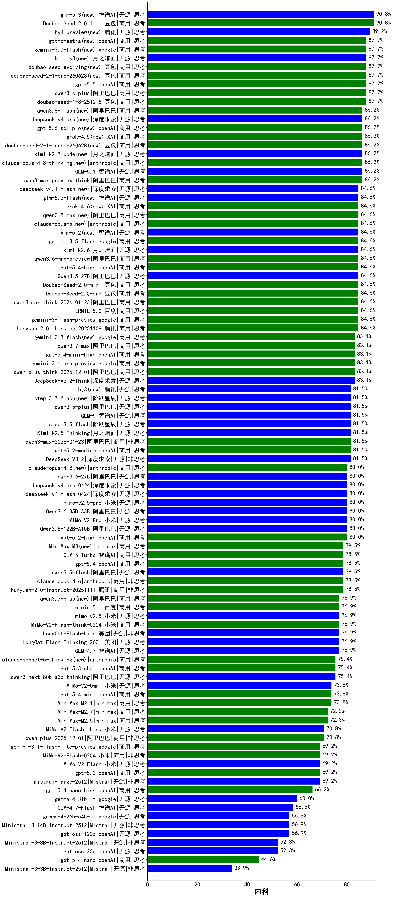

|类别|机构|大模型|【内科】准确率|平均耗时|平均消耗token|花费/千次（元）|排名（准确率）|
|---|---|-----|-------------------|-------|-----------|-----------|-----------|
|开源|智谱AI|glm-5.3(new)|90.8%|66s|1741|47.0|1|
|商用|openAI|gpt-6-sol(new)|90.8%|234s|272|13.3|2|
|商用|豆包|Doubao-Seed-2.0-lite|90.8%|210s|987|3.2|3|
|商用|openAI|gpt-6-luna(new)|89.2%|289s|501|1.5|4|
|开源|腾讯|hy4-preview(new)|89.2%|48s|2742|48.3|5|
|商用|google|gemini-3.7-flash(new)|87.7%|12s|913|22.2|6|
|商用|豆包|doubao-seed-evolving|87.7%|250s|7421|219.8|7|
|开源|月之暗面|kimi-k3(new)|87.7%|40s|805|68.2|8|
|商用|阿里巴巴|qwen3.6-plus|87.7%|36s|1803|20.8|9|
|商用|豆包|doubao-seed-2-1-pro-260628|87.7%|259s|7131|211.1|10|
|商用|openAI|gpt-5.5|87.7%|10s|504|87.9|11|
|商用|openAI|gpt-6-astra(new)|87.7%|12s|330|86.6|12|
|商用|阿里巴巴|qwen3.8-flash(new)|86.2%|40s|1327|3.3|13|
|开源|月之暗面|kimi-k2.7-code|86.2%|43s|1268|32.7|14|
|开源|深度求索|deepseek-v4-pro(new)|86.2%|257s|1225|30.3|15|
|商用|anthropic|claude-opus-4.8-thinking|86.2%|15s|813|124.7|16|
|商用|openAI|gpt-5.6-sol-pro|86.2%|52s|3533|283.2|17|
|商用|XAI|grok-4.5|86.2%|78s|1544|57.0|18|
|开源|小米|mimo-v2.6-pro(new)|86.2%|37s|1191|6.9|19|
|商用|豆包|doubao-seed-2-1-turbo-260628|86.2%|181s|5921|87.4|20|
|开源|智谱AI|GLM-5.1|86.2%|158s|1823|42.3|21|
|商用|google|gemini-3.5-flash|84.6%|10s|1593|95.9|22|
|商用|阿里巴巴|qwen3.6-max-preview|84.6%|57s|1844|95.9|23|
|开源|月之暗面|kimi-k2.6|84.6%|141s|2112|55.4|24|
|开源|智谱AI|glm-5.2|84.6%|50s|1911|51.8|25|
|商用|阿里巴巴|qwen3.8-max(new)|84.6%|26s|1101|36.7|26|
|商用|XAI|grok-4.6(new)|84.6%|140s|1605|59.6|27|
|开源|智谱AI|glm-5.3-flash(new)|84.6%|76s|2318|6.3|28|
|开源|深度求索|deepseek-v4.1-flash(new)|84.6%|9s|1138|8.5|29|
|商用|anthropic|claude-opus-5(new)|84.6%|19s|759|115.2|30|
|商用|XAI|grok-4.7(new)|84.6%|44s|3339|103.4|31|
|商用|阿里巴巴|qwen3-max-think-2026-01-23|84.6%|184s|3478|34.1|32|
|商用|openAI|gpt-5.4-high|84.6%|14s|712|65.8|33|
|开源|阿里巴巴|Qwen3.5-27B|84.6%|295s|3473|16.3|34|
|商用|百度|ERNIE-5.0|84.6%|209s|2375|55.7|35|
|商用|豆包|Doubao-Seed-2.0-mini|84.6%|358s|2477|4.7|36|
|商用|豆包|Doubao-Seed-2.0-pro|84.6%|252s|1147|16.8|37|
|商用|openAI|gpt-5.4-mini-high|83.1%|50s|1100|32.0|38|
|开源|深度求索|DeepSeek-V3.2-Think|83.1%|93s|1419|4.2|39|
|商用|google|gemini-3.8-flash(new)|83.1%|20s|898|43.6|40|
|商用|google|gemini-3.1-pro-preview|83.1%|44s|2044|167.4|41|
|商用|阿里巴巴|qwen3.7-max|83.1%|27s|1296|44.7|42|
|开源|智谱AI|GLM-5|81.5%|105s|2426|42.6|43|
|开源|阶跃星辰|step-3.5-flash|81.5%|27s|1952|4.0|44|
|开源|阿里巴巴|qwen3.5-plus|81.5%|43s|3381|15.9|45|
|开源|腾讯|hy3|81.5%|69s|277|0.9|46|
|开源|月之暗面|Kimi-K2.5-Thinking|81.5%|384s|2187|44.6|47|
|商用|阿里巴巴|qwen3-max-2026-01-23|81.5%|61s|564|5.0|48|
|开源|阶跃星辰|step-3.7-flash|81.5%|36s|2559|20.2|49|
|开源|深度求索|DeepSeek-V3.2|81.5%|83s|418|1.2|50|
|开源|小米|mimo-v2.5-pro|80.0%|31s|1482|26.5|51|
|商用|anthropic|claude-opus-4.8|80.0%|10s|642|94.7|52|
|开源|阿里巴巴|qwen3.6-27b|80.0%|33s|2065|35.9|53|
|开源|小米|MiMo-V2-Pro|80.0%|244s|1245|21.5|54|
|开源|深度求索|deepseek-v4-flash-0424|80.0%|32s|1061|2.0|55|
|开源|阿里巴巴|Qwen3.6-35B-A3B|80.0%|76s|2248|23.5|56|
|开源|阿里巴巴|Qwen3.5-122B-A10B|80.0%|289s|3424|21.4|57|
|开源|深度求索|deepseek-v4-pro-0424|80.0%|45s|1185|27.5|58|
|开源|阿里巴巴|qwen3.5-flash|78.5%|302s|4009|7.9|59|
|开源|小米|mimo-v2.6-flash(new)|78.5%|96s|1125|2.2|60|
|商用|anthropic|claude-opus-4.6|78.5%|14s|718|107.9|61|
|商用|openAI|gpt-5.4|78.5%|8s|354|28.1|62|
|商用|智谱AI|GLM-5-Turbo|78.5%|49s|1638|34.7|63|
|商用|minimax|MiniMax-M3|78.5%|23s|633|7.6|64|
|开源|美团|LongCat-Flash-Lite|76.9%|243s|620|0.0|65|
|商用|小米|MiMo-V2-Flash-think-0204|76.9%|597s|2137|4.3|66|
|商用|百度|ernie-5.1|76.9%|41s|1071|18.2|67|
|开源|小米|mimo-v2.5|76.9%|28s|1459|16.8|68|
|商用|阿里巴巴|qwen3.7-plus|76.9%|38s|2050|15.9|69|
|商用|anthropic|claude-sonnet-5-thinking|75.4%|19s|944|59.0|70|
|商用|openAI|gpt-5.3-chat|75.4%|22s|462|36.4|71|
|商用|openAI|gpt-5.4-mini|73.8%|47s|303|6.8|72|
|开源|小米|MiMo-V2-Omni|73.8%|133s|1439|16.4|73|
|商用|minimax|MiniMax-M2.5|72.3%|32s|1573|12.5|74|
|商用|minimax|MiniMax-M2.7|72.3%|45s|1841|14.8|75|
|商用|小米|MiMo-V2-Flash-0204|69.2%|200s|595|1.1|76|
|商用|google|gemini-3.1-flash-lite-preview|69.2%|14s|449|4.0|77|
|商用|openAI|gpt-5.4-nano-high|66.2%|53s|570|4.2|78|
|开源|google|gemma-4-31b-it|60.0%|94s|616|1.5|79|
|开源|google|gemma-4-26b-a4b-it|56.9%|59s|655|1.7|80|
|开源|openAI|gpt-oss-120b|56.9%|35s|742|2.0|81|
|开源|openAI|gpt-oss-20b|52.3%|45s|1146|1.2|82|
|商用|openAI|gpt-5.4-nano|44.6%|30s|304|1.9|83|

