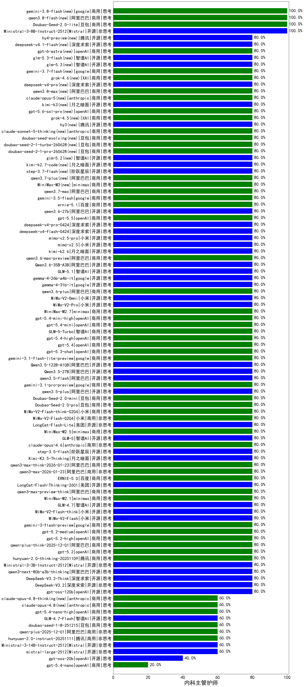

|类别|机构|大模型|【内科主管护师】准确率|平均耗时|平均消耗token|花费/千次（元）|排名（准确率）|
|---|---|-----|-------------------|-------|-----------|-----------|-----------|
|商用|google|gemini-3.8-flash(new)|100.0%|12s|742|35.8|1|
|商用|阿里巴巴|qwen3.8-flash(new)|100.0%|101s|631|1.5|2|
|开源|Mistral|Ministral-3-8B-Instruct-2512|100.0%|4s|587|0.6|3|
|商用|豆包|Doubao-Seed-2.0-lite|100.0%|207s|895|2.9|4|
|开源|openAI|gpt-oss-120b|80.0%|3s|635|1.7|5|
|商用|阿里巴巴|qwen3.6-max-preview|80.0%|48s|1468|76.0|6|
|商用|百度|ernie-5.1|80.0%|28s|750|12.6|7|
|开源|阿里巴巴|qwen3.6-27b|80.0%|30s|1565|27.1|8|
|商用|openAI|gpt-5.5|80.0%|6s|320|51.6|9|
|开源|深度求索|deepseek-v4-pro-0424|80.0%|37s|797|18.3|10|
|开源|深度求索|deepseek-v4-flash-0424|80.0%|26s|508|0.9|11|
|开源|小米|mimo-v2.5-pro|80.0%|14s|1037|17.3|12|
|开源|小米|mimo-v2.5|80.0%|402s|1358|15.5|13|
|开源|月之暗面|kimi-k2.6|80.0%|97s|1643|43.0|14|
|开源|智谱AI|GLM-5.1|80.0%|184s|1456|33.7|15|
|开源|阿里巴巴|Qwen3.6-35B-A3B|80.0%|112s|1517|15.7|16|
|商用|阿里巴巴|qwen3.7-max|80.0%|17s|845|28.7|17|
|开源|google|gemma-4-26b-a4b-it|80.0%|44s|625|1.6|18|
|开源|google|gemma-4-31b-it|80.0%|71s|559|1.4|19|
|商用|阿里巴巴|qwen3.6-plus|80.0%|24s|1397|16.0|20|
|开源|小米|MiMo-V2-Omni|80.0%|152s|1002|10.4|21|
|开源|小米|MiMo-V2-Pro|80.0%|13s|1065|17.9|22|
|商用|minimax|MiniMax-M2.7|80.0%|26s|1007|7.8|23|
|商用|openAI|gpt-5.4-mini-high|80.0%|11s|541|14.7|24|
|商用|google|gemini-3.5-flash|80.0%|8s|1103|65.6|25|
|商用|阿里巴巴|qwen3.7-plus(new)|80.0%|19s|896|6.7|26|
|商用|minimax|MiniMax-M3(new)|80.0%|26s|723|9.2|27|
|商用|openAI|gpt-5.6-sol-pro(new)|80.0%|9s|2822|191.6|28|
|开源|智谱AI|glm-5.3-flash(new)|80.0%|34s|1335|3.6|29|
|开源|智谱AI|glm-5.3(new)|80.0%|42s|1049|27.9|30|
|商用|google|gemini-3.7-flash(new)|80.0%|5s|684|16.4|31|
|商用|XAI|grok-4.6(new)|80.0%|20s|1001|34.5|32|
|开源|深度求索|deepseek-v4-pro(new)|80.0%|27s|616|14.0|33|
|商用|阿里巴巴|qwen3.8-max(new)|80.0%|15s|682|21.9|34|
|商用|anthropic|claude-opus-5(new)|80.0%|15s|745|115.1|35|
|开源|月之暗面|kimi-k3(new)|80.0%|58s|651|53.5|36|
|商用|XAI|grok-4.5(new)|80.0%|55s|1083|37.9|37|
|商用|openAI|gpt-5.4-high|80.0%|7s|462|40.7|38|
|开源|腾讯|hy3(new)|80.0%|59s|209|0.6|39|
|商用|anthropic|claude-sonnet-5-thinking(new)|80.0%|13s|715|43.9|40|
|商用|豆包|doubao-seed-evolving(new)|80.0%|206s|6512|192.8|41|
|商用|豆包|doubao-seed-2-1-turbo-260628(new)|80.0%|165s|5341|78.8|42|
|商用|豆包|doubao-seed-2-1-pro-260628(new)|80.0%|334s|5998|177.4|43|
|开源|智谱AI|glm-5.2(new)|80.0%|33s|1558|42.1|44|
|开源|月之暗面|kimi-k2.7-code(new)|80.0%|12s|506|12.3|45|
|开源|阶跃星辰|step-3.7-flash(new)|80.0%|20s|1112|8.5|46|
|商用|openAI|gpt-5.4-mini|80.0%|81s|259|5.8|47|
|商用|智谱AI|GLM-5-Turbo|80.0%|30s|1116|23.4|48|
|商用|openAI|gpt-6-astra(new)|80.0%|15s|244|60.4|49|
|开源|智谱AI|GLM-4.7|80.0%|50s|1837|25.0|50|
|商用|阿里巴巴|qwen3-max-2026-01-23|80.0%|62s|382|3.2|51|
|商用|百度|ERNIE-5.0|80.0%|166s|1449|33.7|52|
|商用|openAI|gpt-5.4|80.0%|17s|327|26.6|53|
|开源|美团|LongCat-Flash-Thinking-2601|80.0%|109s|1177|0.0|54|
|开源|阿里巴巴|qwen3-next-80b-a3b-thinking|80.0%|132s|1957|7.6|55|
|商用|阿里巴巴|qwen3-max-preview-think|80.0%|164s|1384|31.8|56|
|商用|minimax|MiniMax-M2.1|80.0%|14s|717|5.4|57|
|开源|小米|MiMo-V2-Flash-think|80.0%|22s|1750|0.0|58|
|开源|阶跃星辰|step-3.5-flash|80.0%|12s|1326|2.7|59|
|开源|小米|MiMo-V2-Flash|80.0%|125s|414|0.0|60|
|商用|google|gemini-3-flash-preview|80.0%|95s|996|19.9|61|
|商用|openAI|gpt-5.2-medium|80.0%|6s|349|26.9|62|
|商用|openAI|gpt-5.2-high|80.0%|9s|318|23.8|63|
|商用|阿里巴巴|qwen-plus-think-2025-12-01|80.0%|47s|1785|13.7|64|
|开源|Mistral|Ministral-3-3B-Instruct-2512|80.0%|3s|939|0.7|65|
|商用|openAI|gpt-5.2|80.0%|5s|211|13.2|66|
|商用|阿里巴巴|qwen3-max-think-2026-01-23|80.0%|80s|2114|20.5|67|
|开源|月之暗面|Kimi-K2.5-Thinking|80.0%|208s|1107|22.1|68|
|开源|阿里巴巴|qwen3.5-plus|80.0%|25s|1824|8.5|69|
|商用|anthropic|claude-opus-4.6|80.0%|23s|639|96.5|70|
|商用|openAI|gpt-5.3-chat|80.0%|62s|332|24.8|71|
|开源|深度求索|DeepSeek-V3.2|80.0%|144s|322|0.9|72|
|开源|深度求索|DeepSeek-V3.2-Think|80.0%|32s|805|2.3|73|
|商用|google|gemini-3.1-flash-lite-preview|80.0%|32s|405|3.6|74|
|开源|阿里巴巴|Qwen3.5-122B-A10B|80.0%|319s|2283|14.2|75|
|开源|阿里巴巴|Qwen3.5-27B|80.0%|150s|2521|11.8|76|
|开源|阿里巴巴|qwen3.5-flash|80.0%|321s|2378|4.6|77|
|商用|google|gemini-3.1-pro-preview|80.0%|30s|1411|114.9|78|
|商用|腾讯|hunyuan-2.0-thinking-20251109|80.0%|9s|633|2.3|79|
|商用|豆包|Doubao-Seed-2.0-mini|80.0%|357s|1611|3.0|80|
|商用|豆包|Doubao-Seed-2.0-pro|80.0%|153s|808|11.5|81|
|商用|小米|MiMo-V2-Flash-think-0204|80.0%|111s|1705|3.4|82|
|商用|小米|MiMo-V2-Flash-0204|80.0%|98s|448|0.8|83|
|开源|美团|LongCat-Flash-Lite|80.0%|47s|395|0.0|84|
|商用|minimax|MiniMax-M2.5|80.0%|20s|945|7.3|85|
|开源|智谱AI|GLM-5|80.0%|99s|2046|35.9|86|
|开源|Mistral|mistral-large-2512|60.0%|13s|506|4.7|87|
|开源|Mistral|Ministral-3-14B-Instruct-2512|60.0%|16s|1132|1.6|88|
|商用|腾讯|hunyuan-2.0-instruct-20251111|60.0%|10s|394|0.7|89|
|商用|anthropic|claude-opus-4.8(new)|60.0%|9s|519|75.5|90|
|商用|阿里巴巴|qwen-plus-2025-12-01|60.0%|20s|727|1.4|91|
|商用|豆包|doubao-seed-1-8-251215|60.0%|29s|683|4.7|92|
|商用|anthropic|claude-opus-4.8-thinking(new)|60.0%|11s|664|101.0|93|
|开源|智谱AI|GLM-4.7-Flash|60.0%|744s|4370|0.0|94|
|商用|openAI|gpt-5.4-nano-high|60.0%|12s|434|3.1|95|
|开源|openAI|gpt-oss-20b|40.0%|3s|763|0.8|96|
|商用|openAI|gpt-5.4-nano|20.0%|3s|279|1.8|97|

