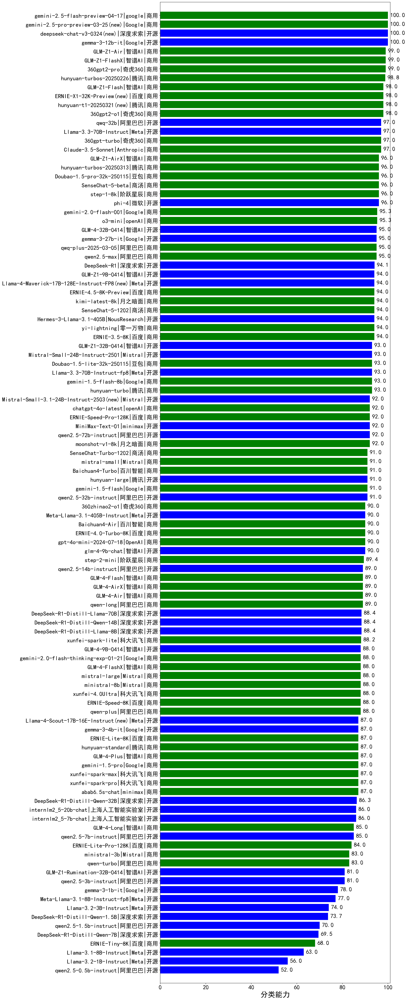

| 类别 | 大模型                         | 分类能力 | 排名 |
|-----|------------------------------|---------|----|
|开源|gemma-3-12b-it(new)|100.0|1|
|商用|360gpt2-pro|99.0|2|
|商用|hunyuan-turbos-20250226(new)|98.8|3|
|商用|360gpt2-o1|98.0|4|
|商用|gemini-2.0-flash-exp|97.0|5|
|开源|Llama-3.3-70B-Instruct|97.0|6|
|商用|360gpt-turbo|97.0|7|
|商用|360gpt-pro|97.0|8|
|商用|Claude-3.5-Sonnet|97.0|9|
|开源|Llama-3.1-Nemotron-70B-Instruct-fp8|97.0|10|
|开源|qwq-32b(new)|97.0|11|
|开源|phi-4|96.0|12|
|商用|Doubao-1.5-pro-32k-250115|96.0|13|
|商用|hunyuan-turbos-20250313(new)|96.0|14|
|商用|step-1-8k|96.0|15|
|商用|SenseChat-5-beta|96.0|16|
|商用|gemini-2.0-flash-001|95.3|17|
|商用|o3-mini|95.3|18|
|商用|qwen2.5-max|95.0|19|
|商用|qwq-plus-2025-03-05(new)|95.0|20|
|开源|gemma-3-27b-it(new)|95.0|21|
|商用|gemini-2.0-pro-exp-02-05|94.1|22|
|开源|DeepSeek-R1|94.1|23|
|商用|SenseChat-5-1202|94.0|24|
|商用|ERNIE-4.5-8K-Preview(new)|94.0|25|
|商用|ERNIE-3.5-8K|94.0|26|
|商用|kimi-latest-8k|94.0|27|
|开源|Hermes-3-Llama-3.1-405B|94.0|28|
|商用|yi-lightning|94.0|29|
|商用|o1-mini|93.7|30|
|商用|hunyuan-turbo|93.0|31|
|开源|Llama-3.3-70B-Instruct-fp8|93.0|32|
|开源|Mistral-Small-24B-Instruct-2501(new)|93.0|33|
|商用|Doubao-1.5-lite-32k-250115|93.0|34|
|商用|gemini-1.5-flash-8b|93.0|35|
|开源|deepseek-chat-v3|93.0|36|
|开源|MiniMax-Text-01|92.0|37|
|开源|gemma-2-27b-it|92.0|38|
|开源|qwen2.5-72b-instruct|92.0|39|
|商用|moonshot-v1-8k|92.0|40|
|商用|ERNIE-Speed-Pro-128K|92.0|41|
|商用|chatgpt-4o-latest|92.0|42|
|开源|qwq-32b-preview|91.6|43|
|开源|qwen2.5-32b-instruct|91.0|44|
|开源|hunyuan-large|91.0|45|
|商用|gemini-1.5-flash|91.0|46|
|商用|Baichuan4-Turbo|91.0|47|
|商用|step-1-flash|91.0|48|
|商用|SenseChat-Turbo-1202|91.0|49|
|商用|mistral-small|91.0|50|
|开源|qwen2.5-math-72b-instruct|90.5|51|
|商用|Baichuan4-Air|90.0|52|
|商用|ERNIE-4.0-Turbo-8K|90.0|53|
|开源|glm-4-9b-chat|90.0|54|
|商用|gpt-4o-mini-2024-07-18|90.0|55|
|开源|Meta-Llama-3.1-405B-Instruct|90.0|56|
|商用|360zhinao2-o1|90.0|57|
|商用|step-2-mini(new)|89.4|58|
|商用|GLM-Zero-Preview|89.0|59|
|开源|Mistral-Nemo-Instruct-2407|89.0|60|
|商用|qwen-long|89.0|61|
|商用|GLM-4-Flash|89.0|62|
|开源|qwen2.5-14b-instruct|89.0|63|
|商用|abab7-chat-preview|89.0|64|
|商用|GLM-4-AirX|89.0|65|
|商用|GLM-4-Air|89.0|66|
|开源|DeepSeek-R1-Distill-Llama-8B|88.4|67|
|开源|DeepSeek-R1-Distill-Qwen-14B|88.4|68|
|开源|DeepSeek-R1-Distill-Llama-70B|88.4|69|
|商用|xunfei-spark-lite(new)|88.2|70|
|商用|mistral-large|88.0|71|
|商用|qwen-plus|88.0|72|
|商用|ERNIE-Speed-8K|88.0|73|
|商用|xunfei-4.0Ultra|88.0|74|
|商用|ERNIE-4.0|88.0|75|
|商用|ministral-8b|88.0|76|
|商用|gemini-2.0-flash-thinking-exp-01-21|88.0|77|
|商用|GLM-4-FlashX|88.0|78|
|商用|abab6.5s-chat|87.0|79|
|商用|ERNIE-Lite-8K|87.0|80|
|开源|gemma-3-4b-it(new)|87.0|81|
|商用|xunfei-spark-pro|87.0|82|
|商用|hunyuan-standard|87.0|83|
|商用|gemini-1.5-pro|87.0|84|
|商用|GLM-4-Plus|87.0|85|
|商用|xunfei-spark-max|87.0|86|
|开源|DeepSeek-R1-Distill-Qwen-32B|86.3|87|
|商用|Baichuan4|86.0|88|
|开源|internlm2_5-7b-chat|86.0|89|
|开源|internlm2_5-20b-chat|86.0|90|
|开源|gemma-2-9b-it|85.0|91|
|开源|qwen2.5-7b-instruct|85.0|92|
|商用|GLM-4-Long|85.0|93|
|商用|ERNIE-Lite-Pro-128K|84.0|94|
|商用|qwen-turbo|83.0|95|
|商用|ministral-3b|83.0|96|
|开源|Mistral-7B-Instruct-v0.3|82.0|97|
|开源|qwen2.5-3b-instruct|81.0|98|
|开源|gemma-3-1b-it(new)|78.0|99|
|开源|Meta-Llama-3.1-8B-Instruct-fp8|77.0|100|
|开源|Llama-3.2-3B-Instruct|74.0|101|
|开源|DeepSeek-R1-Distill-Qwen-1.5B|73.7|102|
|开源|qwen2.5-1.5b-instruct|70.0|103|
|开源|DeepSeek-R1-Distill-Qwen-7B|69.5|104|
|商用|ERNIE-Tiny-8K|68.0|105|
|开源|Llama-3.1-8B-Instruct|63.0|106|
|开源|Llama-3.2-1B-Instruct|56.0|107|
|开源|qwen2.5-0.5b-instruct|52.0|108|

