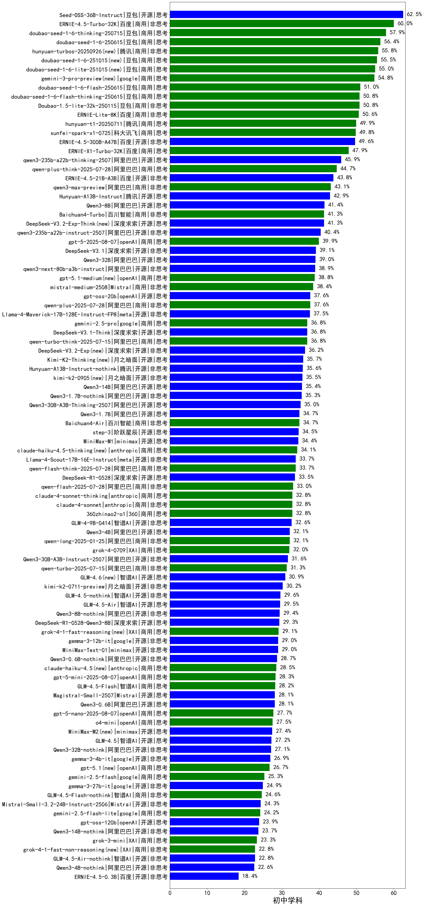

|类别|机构|大模型|【初中学科】准确率|平均耗时|平均消耗token|花费/千次（元）|排名（准确率）|
|---|---|-----|-------------------|-------|-----------|-----------|-----------|
|开源|豆包|Seed-OSS-36B-Instruct|62.5%|157s|2007|7.8|1|
|商用|百度|ERNIE-4.5-Turbo-32K|60.0%|16s|516|1.4|2|
|商用|豆包|doubao-seed-1-6-thinking-250715|57.9%|19s|1181|8.6|3|
|商用|豆包|doubao-seed-1-6-250615|56.4%|130s|365|1.9|4|
|商用|腾讯|hunyuan-turbos-20250926(new)|55.8%|14s|664|1.2|5|
|商用|豆包|doubao-seed-1-6-251015(new)|55.5%|62s|905|6.3|6|
|商用|豆包|doubao-seed-1-6-lite-251015(new)|55.0%|70s|1270|2.8|7|
|商用|豆包|doubao-seed-1-6-flash-250615|51.0%|4s|418|0.5|8|
|商用|豆包|doubao-seed-1-6-flash-thinking-250615|50.8%|22s|924|1.2|9|
|商用|豆包|Doubao-1.5-lite-32k-250115|50.8%|9s|298|0.1|10|
|商用|百度|ERNIE-Lite-8K|50.6%|/|/|/|11|
|商用|腾讯|hunyuan-t1-20250711|49.9%|28s|1607|5.7|12|
|商用|科大讯飞|xunfei-spark-x1-0725|49.8%|/|1400|16.5|13|
|开源|百度|ERNIE-4.5-300B-A47B|49.6%|210s|521|3.5|14|
|商用|百度|ERNIE-X1-Turbo-32K|47.9%|80s|1523|5.8|15|
|开源|阿里巴巴|qwen3-235b-a22b-thinking-2507|45.9%|66s|2461|46.0|16|
|商用|阿里巴巴|qwen-plus-think-2025-07-28|44.7%|/|2380|18.2|17|
|开源|百度|ERNIE-4.5-21B-A3B|43.8%|112s|513|0.1|18|
|商用|阿里巴巴|qwen3-max-preview|43.1%|33s|597|12.2|19|
|开源|腾讯|Hunyuan-A13B-Instruct|42.9%|148s|1082|4.0|20|
|开源|阿里巴巴|Qwen3-8B|41.4%|503s|12052|0.0|21|
|商用|百川智能|Baichuan4-Turbo|41.3%|/|/|/|22|
|开源|深度求索|DeepSeek-V3.2-Exp-Think(new)|41.3%|162s|1154|3.4|23|
|开源|阿里巴巴|qwen3-235b-a22b-instruct-2507|40.4%|21s|747|5.3|24|
|商用|openAI|gpt-5-2025-08-07|39.9%|52s|489|27.8|25|
|开源|深度求索|DeepSeek-V3.1|39.1%|20s|450|4.6|26|
|开源|阿里巴巴|Qwen3-32B|39.0%|86s|3166|12.3|27|
|开源|阿里巴巴|qwen3-next-80b-a3b-instruct|38.9%|32s|786|2.8|28|
|商用|Mistral|mistral-medium-2508|38.4%|95s|514|5.8|29|
|开源|openAI|gpt-oss-20b|37.6%|111s|1478|1.6|30|
|商用|阿里巴巴|qwen-plus-2025-07-28|37.6%|21s|714|1.3|31|
|开源|meta|Llama-4-Maverick-17B-128E-Instruct-FP8|37.5%|13s|654|2.5|32|
|商用|google|gemini-2.5-pro|36.8%|46s|2446|169.8|33|
|开源|深度求索|DeepSeek-V3.1-Think|36.8%|57s|1171|13.3|34|
|商用|阿里巴巴|qwen-turbo-think-2025-07-15|36.8%|/|2535|7.3|35|
|开源|深度求索|DeepSeek-V3.2-Exp(new)|36.2%|167s|398|1.1|36|
|开源|腾讯|Hunyuan-A13B-Instruct-nothink|35.6%|201s|499|1.7|37|
|开源|阿里巴巴|Qwen3-14B|35.4%|98s|5090|10.0|38|
|开源|阿里巴巴|Qwen3-1.7B-nothink|35.3%|28s|561|1.4|39|
|开源|阿里巴巴|Qwen3-30B-A3B-Thinking-2507|35.0%|78s|2369|6.4|40|
|开源|阿里巴巴|Qwen3-1.7B|34.7%|29s|2688|7.8|41|
|商用|百川智能|Baichuan4-Air|34.7%|/|/|/|42|
|开源|阶跃星辰|step-3|34.5%|145s|2383|9.3|43|
|开源|minimax|MiniMax-M1|34.4%|243s|3706|27.9|44|
|开源|meta|Llama-4-Scout-17B-16E-Instruct|33.7%|18s|578|1.1|45|
|商用|阿里巴巴|qwen-flash-think-2025-07-28|33.7%|25s|2396|3.4|46|
|开源|深度求索|DeepSeek-R1-0528|33.5%|147s|2148|33.2|47|
|商用|阿里巴巴|qwen-flash-2025-07-28|33.0%|27s|801|1.0|48|
|商用|anthropic|claude-4-sonnet-thinking|32.8%|23s|926|87.3|49|
|商用|anthropic|claude-4-sonnet|32.8%|17s|587|50.3|50|
|商用|360|360zhinao2-o1|32.8%|/|/|/|51|
|开源|智谱AI|GLM-4-9B-0414|32.6%|17s|503|0.0|52|
|开源|阿里巴巴|Qwen3-4B|32.1%|39s|2459|7.1|53|
|商用|阿里巴巴|qwen-long-2025-01-25|32.1%|65s|456|0.8|54|
|商用|XAI|grok-4-0709|32.0%|273s|1736|178.8|55|
|开源|阿里巴巴|Qwen3-30B-A3B-Instruct-2507|31.6%|30s|801|2.1|56|
|商用|阿里巴巴|qwen-turbo-2025-07-15|31.3%|29s|518|0.3|57|
|开源|智谱AI|GLM-4.6(new)|30.9%|60s|2484|33.6|58|
|开源|月之暗面|kimi-k2-0711-preview|30.2%|55s|705|10.1|59|
|开源|智谱AI|GLM-4.5-nothink|29.6%|59s|1197|15.4|60|
|开源|智谱AI|GLM-4.5-Air|29.5%|61s|2512|14.4|61|
|开源|阿里巴巴|Qwen3-8B-nothink|29.4%|38s|580|0.0|62|
|开源|深度求索|DeepSeek-R1-0528-Qwen3-8B|29.3%|135s|1986|0.0|63|
|开源|google|gemma-3-12b-it|29.0%|/|/|/|64|
|开源|minimax|MiniMax-Text-01|29.0%|9s|917|7.4|65|
|开源|阿里巴巴|Qwen3-0.6B-nothink|28.7%|30s|340|0.7|66|
|商用|openAI|gpt-5-mini-2025-08-07|28.3%|57s|1015|13.1|67|
|商用|智谱AI|GLM-4.5-Flash|28.2%|49s|2271|0.0|68|
|开源|Mistral|Magistral-Small-2507|28.1%|160s|5627|60.2|69|
|开源|阿里巴巴|Qwen3-0.6B|28.1%|17s|2022|5.8|70|
|商用|openAI|gpt-5-nano-2025-08-07|27.7%|49s|2358|6.5|71|
|商用|openAI|o4-mini|27.5%|20s|970|28.3|72|
|开源|minimax|MiniMax-M2(new)|27.4%|79s|2791|22.6|73|
|开源|智谱AI|GLM-4.5|27.2%|81s|2277|30.5|74|
|开源|阿里巴巴|Qwen3-32B-nothink|27.1%|44s|612|2.1|75|
|开源|google|gemma-3-4b-it|26.9%|/|/|/|76|
|商用|google|gemini-2.5-flash|25.3%|14s|2126|36.6|77|
|开源|google|gemma-3-27b-it|24.9%|/|/|/|78|
|商用|智谱AI|GLM-4.5-Flash-nothink|24.6%|30s|1241|0.0|79|
|开源|Mistral|Mistral-Small-3.2-24B-Instruct-2506|24.3%|44s|799|1.5|80|
|商用|google|gemini-2.5-flash-lite|24.2%|19s|1775|4.9|81|
|开源|openAI|gpt-oss-120b|23.9%|45s|885|2.4|82|
|开源|阿里巴巴|Qwen3-14B-nothink|23.7%|34s|616|1.1|83|
|商用|XAI|grok-3-mini|23.3%|177s|1248|4.4|84|
|开源|智谱AI|GLM-4.5-Air-nothink|22.8%|38s|1385|7.7|85|
|开源|阿里巴巴|Qwen3-4B-nothink|22.6%|17s|538|1.3|86|
|开源|百度|ERNIE-4.5-0.3B|18.4%|118s|413|0.0|87|

