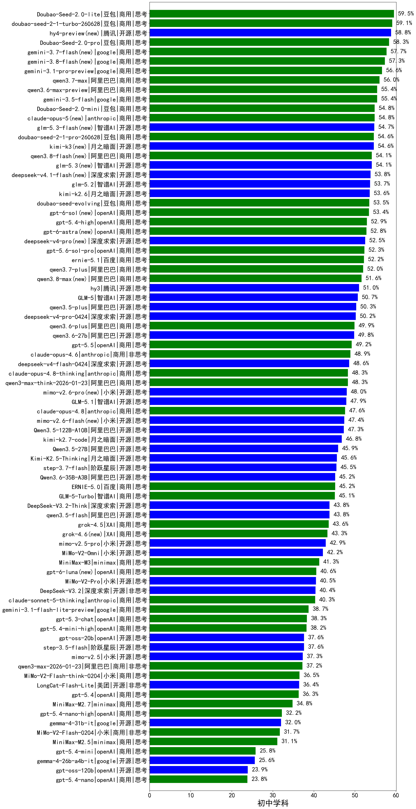

|类别|机构|大模型|【初中学科】准确率|平均耗时|平均消耗token|花费/千次（元）|排名（准确率）|
|---|---|-----|-------------------|-------|-----------|-----------|-----------|
|商用|豆包|Doubao-Seed-2.0-lite|59.5%|221s|1047|3.3|1|
|商用|豆包|doubao-seed-2-1-turbo-260628(new)|59.1%|183s|7844|115.9|2|
|商用|豆包|Doubao-Seed-2.0-pro|58.3%|286s|1407|20.6|3|
|商用|google|gemini-3.7-flash(new)|57.7%|8s|844|19.8|4|
|商用|google|gemini-3.8-flash(new)|57.3%|15s|1004|47.9|5|
|商用|google|gemini-3.1-pro-preview|56.6%|39s|1956|158.4|6|
|商用|阿里巴巴|qwen3.7-max|56.0%|45s|2127|74.0|7|
|商用|阿里巴巴|qwen3.6-max-preview|55.4%|76s|2057|106.2|8|
|商用|google|gemini-3.5-flash|55.4%|11s|1832|109.4|9|
|商用|豆包|Doubao-Seed-2.0-mini|54.8%|415s|2441|4.6|10|
|商用|anthropic|claude-opus-5(new)|54.8%|12s|747|107.6|11|
|开源|智谱AI|glm-5.3-flash(new)|54.7%|87s|3136|8.6|12|
|商用|豆包|doubao-seed-2-1-pro-260628(new)|54.6%|221s|9868|292.5|13|
|开源|月之暗面|kimi-k3(new)|54.6%|62s|1456|131.4|14|
|商用|豆包|doubao-seed-1-8-251215|54.3%|27s|764|5.0|15|
|商用|腾讯|hunyuan-2.0-thinking-20251109|54.3%|31s|1301|4.9|16|
|商用|阿里巴巴|qwen3.8-flash(new)|54.1%|62s|3203|8.3|17|
|开源|智谱AI|glm-5.3(new)|54.1%|350s|4238|116.1|18|
|商用|google|gemini-3-flash-preview|53.8%|56s|1839|37.1|19|
|开源|智谱AI|glm-5.2(new)|53.7%|74s|2689|73.1|20|
|开源|月之暗面|kimi-k2.6|53.6%|114s|2930|77.1|21|
|商用|豆包|doubao-seed-evolving(new)|53.5%|220s|9065|268.5|22|
|商用|openAI|gpt-5.4-high|52.9%|17s|966|90.4|23|
|商用|openAI|gpt-6-astra(new)|52.8%|12s|318|76.2|24|
|开源|深度求索|deepseek-v4-pro(new)|52.5%|205s|2140|54.6|25|
|商用|openAI|gpt-5.6-sol-pro(new)|52.3%|20s|3965|326.9|26|
|商用|百度|ernie-5.1|52.2%|42s|1629|27.9|27|
|商用|阿里巴巴|qwen3.7-plus(new)|52.0%|66s|3504|27.4|28|
|商用|阿里巴巴|qwen3.8-max(new)|51.6%|57s|2475|85.6|29|
|开源|腾讯|hy3(new)|51.0%|64s|402|1.3|30|
|开源|智谱AI|GLM-5|50.7%|134s|2860|50.1|31|
|开源|阿里巴巴|qwen3.5-plus|50.3%|48s|3992|18.7|32|
|开源|深度求索|deepseek-v4-pro-0424|50.2%|55s|1686|39.3|33|
|商用|阿里巴巴|qwen3.6-plus|49.9%|58s|2830|32.9|34|
|开源|阿里巴巴|qwen3.6-27b|49.8%|48s|3060|53.5|35|
|商用|openAI|gpt-5.5|49.2%|14s|651|114.7|36|
|商用|anthropic|claude-opus-4.6|48.9%|18s|673|94.9|37|
|开源|深度求索|deepseek-v4-flash-0424|48.6%|42s|1637|3.2|38|
|商用|anthropic|claude-opus-4.8-thinking(new)|48.3%|15s|1066|163.4|39|
|商用|阿里巴巴|qwen3-max-think-2026-01-23|48.3%|287s|4466|43.8|40|
|开源|智谱AI|GLM-5.1|47.9%|222s|2599|60.5|41|
|商用|腾讯|hunyuan-2.0-instruct-20251111|47.7%|19s|540|0.9|42|
|商用|anthropic|claude-opus-4.8(new)|47.6%|8s|602|82.1|43|
|开源|阿里巴巴|Qwen3.5-122B-A10B|47.3%|205s|4195|26.2|44|
|开源|月之暗面|kimi-k2.7-code(new)|46.8%|36s|1374|35.0|45|
|开源|智谱AI|GLM-4.7|46.1%|77s|2910|39.6|46|
|开源|阿里巴巴|Qwen3.5-27B|45.9%|409s|4353|20.4|47|
|开源|月之暗面|Kimi-K2.5-Thinking|45.6%|317s|2961|60.5|48|
|开源|阶跃星辰|step-3.7-flash(new)|45.5%|268s|3950|31.3|49|
|开源|阿里巴巴|Qwen3.6-35B-A3B|45.2%|67s|2698|28.2|50|
|商用|百度|ERNIE-5.0|45.2%|180s|2879|67.4|51|
|商用|智谱AI|GLM-5-Turbo|45.1%|42s|2256|47.9|52|
|开源|深度求索|DeepSeek-V3.2-Think|43.8%|159s|1863|5.5|53|
|开源|阿里巴巴|qwen3.5-flash|43.8%|343s|4711|9.2|54|
|商用|XAI|grok-4.5(new)|43.6%|81s|2906|113.4|55|
|商用|XAI|grok-4.6(new)|43.3%|156s|2417|92.9|56|
|开源|小米|mimo-v2.5-pro|42.9%|70s|4331|86.0|57|
|开源|小米|MiMo-V2-Omni|42.2%|279s|2200|26.8|58|
|商用|minimax|MiniMax-M3(new)|41.3%|56s|1732|25.7|59|
|商用|阿里巴巴|qwen-plus-2025-12-01|40.9%|31s|1271|2.4|60|
|开源|小米|MiMo-V2-Pro|40.5%|311s|1424|24.9|61|
|开源|深度求索|DeepSeek-V3.2|40.4%|76s|507|1.4|62|
|商用|anthropic|claude-sonnet-5-thinking(new)|40.3%|19s|1269|79.5|63|
|开源|阿里巴巴|qwen3-next-80b-a3b-thinking|39.3%|107s|4284|16.8|64|
|商用|google|gemini-3.1-flash-lite-preview|38.7%|20s|433|3.5|65|
|商用|openAI|gpt-5.3-chat|38.3%|36s|498|38.1|66|
|商用|openAI|gpt-5.4-mini-high|38.2%|65s|1431|41.8|67|
|商用|阿里巴巴|qwen-plus-think-2025-12-01|37.9%|70s|3200|24.8|68|
|开源|openAI|gpt-oss-20b|37.6%|111s|1478|1.6|69|
|开源|阶跃星辰|step-3.5-flash|37.6%|32s|3373|6.9|70|
|开源|小米|MiMo-V2-Flash-think|37.6%|83s|3172|0.0|71|
|开源|小米|mimo-v2.5|37.3%|30s|1953|23.4|72|
|开源|美团|LongCat-Flash-Thinking-2601|37.2%|165s|3377|0.0|73|
|商用|阿里巴巴|qwen3-max-2026-01-23|37.2%|125s|1026|9.4|74|
|商用|阿里巴巴|qwen3-max-preview-think|37.0%|162s|2830|65.9|75|
|商用|openAI|gpt-5.2-high|36.8%|16s|765|65.1|76|
|商用|小米|MiMo-V2-Flash-think-0204|36.5%|560s|2782|5.7|77|
|开源|美团|LongCat-Flash-Lite|36.4%|203s|796|0.0|78|
|商用|openAI|gpt-5.4|36.3%|4s|344|25.2|79|
|商用|minimax|MiniMax-M2.7|34.8%|61s|2566|20.7|80|
|开源|Mistral|mistral-large-2512|34.3%|14s|632|5.7|81|
|商用|openAI|gpt-5.2-medium|34.2%|13s|617|50.4|82|
|开源|小米|MiMo-V2-Flash|34.1%|61s|805|0.0|83|
|商用|openAI|gpt-5.4-nano-high|32.2%|57s|975|7.6|84|
|开源|google|gemma-4-31b-it|32.0%|67s|550|1.3|85|
|商用|小米|MiMo-V2-Flash-0204|31.7%|228s|766|1.4|86|
|商用|minimax|MiniMax-M2.5|31.1%|40s|2133|17.1|87|
|开源|智谱AI|GLM-4.7-Flash|28.6%|1590s|4914|0.0|88|
|商用|openAI|gpt-5.2|26.7%|6s|281|17.0|89|
|商用|minimax|MiniMax-M2.1|26.2%|99s|2347|18.9|90|
|商用|openAI|gpt-5.4-mini|25.8%|36s|313|6.5|91|
|开源|google|gemma-4-26b-a4b-it|25.6%|47s|614|1.5|92|
|开源|openAI|gpt-oss-120b|23.9%|45s|885|2.4|93|
|商用|openAI|gpt-5.4-nano|23.8%|32s|310|1.8|94|
|开源|Mistral|Ministral-3-14B-Instruct-2512|23.0%|17s|1496|2.1|95|
|开源|Mistral|Ministral-3-3B-Instruct-2512|22.8%|12s|1304|0.9|96|
|开源|Mistral|Ministral-3-8B-Instruct-2512|22.1%|12s|946|1.0|97|

