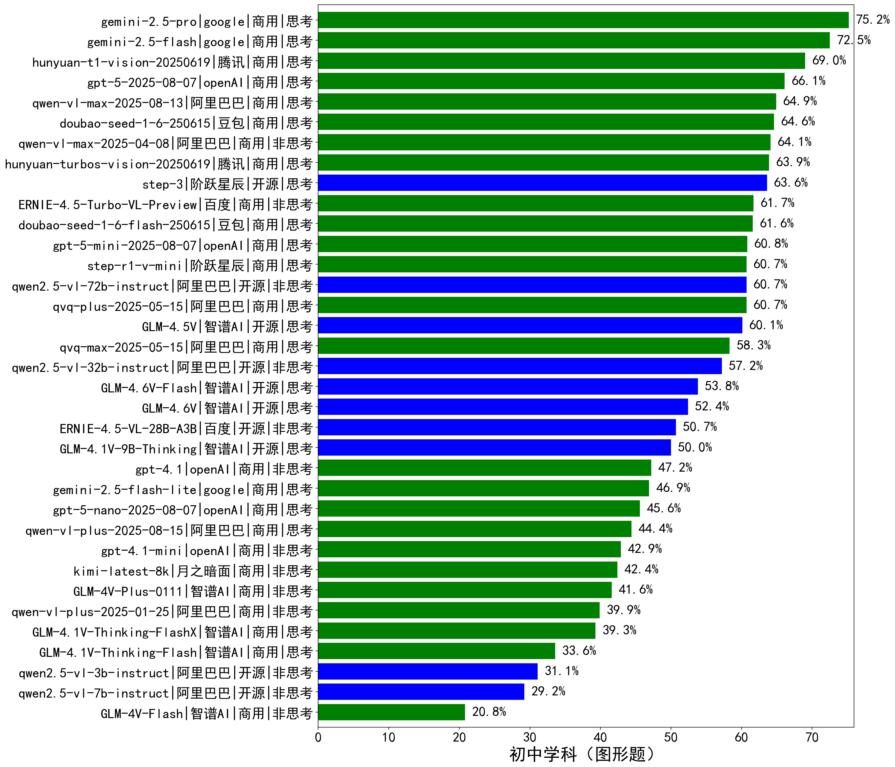

|类别|机构|大模型|【初中学科（图形题）】准确率|平均耗时|平均消耗token|花费/千次（元）|排名（准确率）|
|---|---|-----|-------------------|-------|-----------|-----------|-----------|
|商用|google|gemini-2.5-pro|75.2%|150s|2924|182.9|1|
|商用|google|gemini-2.5-flash|72.5%|124s|2586|39.6|2|
|商用|腾讯|hunyuan-t1-vision-20250619|69.0%|444s|1678|11.0|3|
|商用|openAI|gpt-5-2025-08-07|66.1%|163s|1862|95.5|4|
|商用|阿里巴巴|qwen-vl-max-2025-08-13|64.9%|39s|1454|4.6|5|
|商用|豆包|doubao-seed-1-6-250615|64.6%|/|791|2.2|6|
|商用|阿里巴巴|qwen-vl-max-2025-04-08|64.1%|587s|908|4.9|7|
|商用|腾讯|hunyuan-turbos-vision-20250619|63.9%|385s|923|4.6|8|
|开源|阶跃星辰|step-3|63.6%|530s|2510|9.2|9|
|商用|百度|ERNIE-4.5-Turbo-VL-Preview|61.7%|430s|2050|8.5|10|
|商用|豆包|doubao-seed-1-6-flash-250615|61.6%|/|887|0.6|11|
|商用|openAI|gpt-5-mini-2025-08-07|60.8%|139s|1536|16.2|12|
|开源|阿里巴巴|qwen2.5-vl-72b-instruct|60.7%|463s|740|3.1|13|
|商用|阶跃星辰|step-r1-v-mini|60.7%|467s|3319|23.2|14|
|商用|阿里巴巴|qvq-plus-2025-05-15|60.7%|777s|2438|10.6|15|
|开源|智谱AI|GLM-4.5V|60.1%|400s|1554|6.9|16|
|商用|阿里巴巴|qvq-max-2025-05-15|58.3%|674s|1990|50.7|17|
|开源|阿里巴巴|qwen2.5-vl-32b-instruct|57.2%|473s|1131|2.1|18|
|开源|百度|ERNIE-4.5-VL-28B-A3B|50.7%|434s|955|2.0|19|
|开源|智谱AI|GLM-4.1V-9B-Thinking|50.0%|635s|2181|1.8|20|
|商用|openAI|gpt-4.1|47.2%|377s|874|24.6|21|
|商用|google|gemini-2.5-flash-lite|46.9%|123s|2730|6.9|22|
|商用|openAI|gpt-5-nano-2025-08-07|45.6%|143s|2949|7.3|23|
|商用|阿里巴巴|qwen-vl-plus-2025-08-15|44.4%|7s|941|1.3|24|
|商用|openAI|gpt-4.1-mini|42.9%|599s|793|5.0|25|
|商用|月之暗面|kimi-latest-8k|42.4%|341s|1420|16.9|26|
|商用|智谱AI|GLM-4V-Plus-0111|41.6%|228s|814|3.2|27|
|商用|阿里巴巴|qwen-vl-plus-2025-01-25|39.9%|495s|795|2.0|28|
|商用|智谱AI|GLM-4.1V-Thinking-FlashX|39.3%|361s|1551|3.1|29|
|商用|智谱AI|GLM-4.1V-Thinking-Flash|33.6%|40s|1398|0.0|30|
|开源|阿里巴巴|qwen2.5-vl-3b-instruct|31.1%|514s|689|1.2|31|
|开源|阿里巴巴|qwen2.5-vl-7b-instruct|29.2%|30s|828|0.3|32|
|商用|智谱AI|GLM-4V-Flash|20.8%|30s|879|0.0|33|

