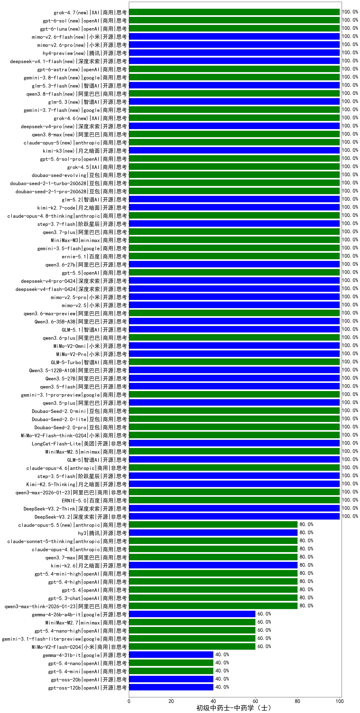

|类别|机构|大模型|【初级中药士-中药学（士）】准确率|平均耗时|平均消耗token|花费/千次（元）|排名（准确率）|
|---|---|-----|-------------------|-------|-----------|-----------|-----------|
|开源|小米|mimo-v2.5-pro|100.0%|19s|1234|21.6|1|
|开源|阶跃星辰|step-3.7-flash|100.0%|98s|1758|13.8|2|
|商用|XAI|grok-4.5|100.0%|153s|1118|39.6|3|
|商用|豆包|doubao-seed-evolving|100.0%|134s|4270|125.7|4|
|商用|豆包|doubao-seed-2-1-turbo-260628|100.0%|117s|3280|48.0|5|
|商用|豆包|doubao-seed-2-1-pro-260628|100.0%|215s|3707|108.8|6|
|开源|智谱AI|glm-5.2|100.0%|83s|1263|34.0|7|
|开源|月之暗面|kimi-k2.7-code|100.0%|16s|731|18.5|8|
|商用|anthropic|claude-opus-4.8-thinking|100.0%|10s|580|90.0|9|
|商用|阿里巴巴|qwen3.7-plus|100.0%|15s|792|5.9|10|
|开源|月之暗面|kimi-k3(new)|100.0%|35s|560|44.9|11|
|商用|minimax|MiniMax-M3|100.0%|14s|486|5.3|12|
|商用|google|gemini-3.5-flash|100.0%|7s|1296|78.4|13|
|商用|百度|ernie-5.1|100.0%|20s|749|12.7|14|
|开源|阿里巴巴|qwen3.6-27b|100.0%|27s|1676|29.2|15|
|商用|openAI|gpt-5.5|100.0%|8s|375|66.4|16|
|开源|深度求索|deepseek-v4-pro-0424|100.0%|29s|484|10.9|17|
|开源|深度求索|deepseek-v4-flash-0424|100.0%|45s|422|0.8|18|
|商用|openAI|gpt-5.6-sol-pro|100.0%|27s|3193|251.2|19|
|商用|anthropic|claude-opus-5(new)|100.0%|14s|568|87.9|20|
|商用|阿里巴巴|qwen3.6-max-preview|100.0%|60s|1545|80.5|21|
|开源|深度求索|deepseek-v4.1-flash(new)|100.0%|41s|2119|16.4|22|
|商用|豆包|doubao-seed-2-1-pro-260915(new)|100.0%|34s|948|26.1|23|
|商用|XAI|grok-4.7(new)|100.0%|17s|2307|60.5|24|
|商用|openAI|gpt-6-sol(new)|100.0%|318s|214|11.0|25|
|商用|openAI|gpt-6-luna(new)|100.0%|88s|305|0.9|26|
|开源|小米|mimo-v2.6-flash(new)|100.0%|178s|13250|26.4|27|
|开源|小米|mimo-v2.6-pro(new)|100.0%|21s|729|4.2|28|
|开源|腾讯|hy4-preview(new)|100.0%|110s|8291|148.3|29|
|商用|openAI|gpt-6-astra(new)|100.0%|12s|211|54.2|30|
|商用|阿里巴巴|qwen3.8-max(new)|100.0%|12s|504|15.7|31|
|商用|google|gemini-3.8-flash(new)|100.0%|52s|561|26.9|32|
|开源|智谱AI|glm-5.3-flash(new)|100.0%|27s|1171|3.1|33|
|商用|阿里巴巴|qwen3.8-flash(new)|100.0%|40s|532|1.2|34|
|开源|智谱AI|glm-5.3(new)|100.0%|51s|2186|59.8|35|
|商用|google|gemini-3.7-flash(new)|100.0%|5s|538|12.8|36|
|商用|XAI|grok-4.6(new)|100.0%|43s|1459|53.9|37|
|开源|深度求索|deepseek-v4-pro(new)|100.0%|423s|585|13.3|38|
|开源|小米|mimo-v2.5|100.0%|30s|975|10.2|39|
|商用|豆包|doubao-seed-2-1-lite-260915(new)|100.0%|15s|687|1.7|40|
|开源|阿里巴巴|Qwen3.6-35B-A3B|100.0%|10s|1597|16.7|41|
|商用|minimax|MiniMax-M2.5|100.0%|13s|646|4.8|42|
|商用|google|gemini-3.1-pro-preview|100.0%|27s|1247|102.0|43|
|开源|阿里巴巴|qwen3.5-plus|100.0%|23s|1674|7.8|44|
|商用|豆包|Doubao-Seed-2.0-mini|100.0%|306s|1268|2.4|45|
|商用|豆包|Doubao-Seed-2.0-lite|100.0%|121s|620|1.9|46|
|商用|豆包|Doubao-Seed-2.0-pro|100.0%|196s|880|12.8|47|
|商用|小米|MiMo-V2-Flash-think-0204|100.0%|567s|1212|2.4|48|
|开源|美团|LongCat-Flash-Lite|100.0%|58s|429|0.0|49|
|开源|智谱AI|GLM-5|100.0%|78s|1452|25.3|50|
|开源|阿里巴巴|Qwen3.5-27B|100.0%|335s|3006|14.2|51|
|商用|anthropic|claude-opus-4.6|100.0%|20s|511|77.5|52|
|开源|阶跃星辰|step-3.5-flash|100.0%|13s|1169|2.4|53|
|开源|月之暗面|Kimi-K2.5-Thinking|100.0%|233s|1092|21.9|54|
|商用|阿里巴巴|qwen3-max-2026-01-23|100.0%|64s|442|3.9|55|
|商用|百度|ERNIE-5.0|100.0%|122s|1222|28.4|56|
|开源|深度求索|DeepSeek-V3.2-Think|100.0%|124s|957|2.8|57|
|开源|深度求索|DeepSeek-V3.2|100.0%|62s|299|0.8|58|
|开源|阿里巴巴|qwen3.5-flash|100.0%|292s|2439|4.8|59|
|开源|阿里巴巴|Qwen3.5-122B-A10B|100.0%|324s|2497|15.6|60|
|开源|智谱AI|GLM-5.1|100.0%|151s|1202|27.7|61|
|商用|智谱AI|GLM-5-Turbo|100.0%|33s|1216|25.7|62|
|商用|阿里巴巴|qwen3.6-plus|100.0%|21s|1430|16.5|63|
|开源|小米|MiMo-V2-Omni|100.0%|6s|996|10.5|64|
|开源|小米|MiMo-V2-Pro|100.0%|506s|1232|21.6|65|
|商用|openAI|gpt-5.4|80.0%|5s|214|16.3|66|
|商用|openAI|gpt-5.4-high|80.0%|17s|908|89.2|67|
|商用|openAI|gpt-5.3-chat|80.0%|9s|368|30.0|68|
|开源|月之暗面|kimi-k2.6|80.0%|67s|1742|45.8|69|
|商用|openAI|gpt-5.4-mini-high|80.0%|16s|1289|38.8|70|
|商用|anthropic|claude-opus-5.5(new)|80.0%|13s|662|83.2|71|
|商用|阿里巴巴|qwen3-max-think-2026-01-23|80.0%|122s|3060|30.1|72|
|商用|anthropic|claude-sonnet-5-thinking|80.0%|18s|830|53.5|73|
|商用|阿里巴巴|qwen3.7-max|80.0%|23s|1164|40.3|74|
|开源|腾讯|hy3|80.0%|69s|198|0.6|75|
|商用|anthropic|claude-opus-4.8|80.0%|13s|490|74.1|76|
|开源|google|gemma-4-26b-a4b-it|60.0%|63s|552|1.4|77|
|商用|google|gemini-3.1-flash-lite-preview|60.0%|2s|333|3.0|78|
|商用|minimax|MiniMax-M2.7|60.0%|54s|2162|17.6|79|
|商用|小米|MiMo-V2-Flash-0204|60.0%|152s|687|1.3|80|
|商用|openAI|gpt-5.4-nano-high|60.0%|84s|1006|8.3|81|
|开源|google|gemma-4-31b-it|40.0%|77s|430|1.1|82|
|开源|openAI|gpt-oss-20b|40.0%|13s|1570|1.7|83|
|商用|openAI|gpt-5.4-nano|40.0%|5s|230|1.5|84|
|商用|openAI|gpt-5.4-mini|40.0%|22s|199|4.4|85|
|开源|openAI|gpt-oss-120b|40.0%|70s|873|2.5|86|

