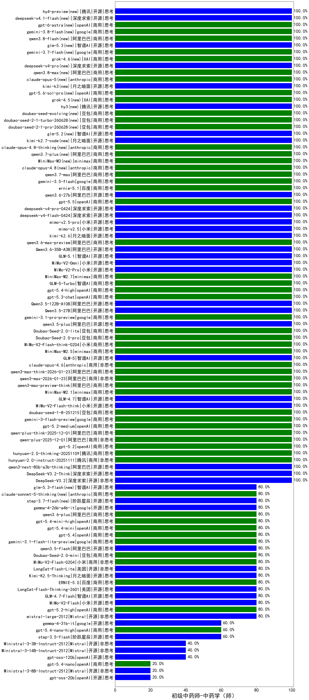

|类别|机构|大模型|【初级中药师-中药学（师）】准确率|平均耗时|平均消耗token|花费/千次（元）|排名（准确率）|
|---|---|-----|-------------------|-------|-----------|-----------|-----------|
|商用|智谱AI|GLM-5-Turbo|100.0%|22s|1000|21.1|1|
|开源|小米|mimo-v2.5|100.0%|733s|841|8.4|2|
|商用|阿里巴巴|qwen3.7-max|100.0%|26s|637|21.5|3|
|商用|google|gemini-3.5-flash|100.0%|10s|1095|66.2|4|
|商用|百度|ernie-5.1|100.0%|24s|805|13.8|5|
|开源|阿里巴巴|qwen3.6-27b|100.0%|22s|1424|24.8|6|
|商用|openAI|gpt-5.5|100.0%|5s|260|43.2|7|
|开源|深度求索|deepseek-v4-pro-0424|100.0%|17s|354|7.9|8|
|开源|深度求索|deepseek-v4-flash-0424|100.0%|16s|361|0.7|9|
|开源|小米|mimo-v2.5-pro|100.0%|19s|925|15.2|10|
|开源|月之暗面|kimi-k2.6|100.0%|31s|741|18.9|11|
|开源|阿里巴巴|Qwen3.5-27B|100.0%|335s|2720|12.8|12|
|商用|阿里巴巴|qwen3.6-max-preview|100.0%|31s|1189|61.5|13|
|开源|阿里巴巴|Qwen3.6-35B-A3B|100.0%|10s|1480|15.5|14|
|开源|智谱AI|GLM-5.1|100.0%|28s|934|21.4|15|
|开源|小米|MiMo-V2-Omni|100.0%|157s|881|9.0|16|
|开源|小米|MiMo-V2-Pro|100.0%|199s|911|14.9|17|
|商用|minimax|MiniMax-M2.7|100.0%|19s|780|6.0|18|
|商用|openAI|gpt-5.4-high|100.0%|51s|564|53.5|19|
|商用|openAI|gpt-5.3-chat|100.0%|55s|357|29.3|20|
|商用|anthropic|claude-opus-4.8(new)|100.0%|7s|406|60.1|21|
|商用|minimax|MiniMax-M3(new)|100.0%|19s|484|5.3|22|
|商用|阿里巴巴|qwen3.7-plus(new)|100.0%|15s|667|5.0|23|
|商用|anthropic|claude-opus-4.8-thinking(new)|100.0%|9s|503|77.1|24|
|商用|google|gemini-3.8-flash(new)|100.0%|42s|495|23.7|25|
|商用|阿里巴巴|qwen3.8-flash(new)|100.0%|159s|3284|8.7|26|
|开源|智谱AI|glm-5.3(new)|100.0%|23s|799|21.1|27|
|商用|google|gemini-3.7-flash(new)|100.0%|6s|716|17.7|28|
|商用|XAI|grok-4.6(new)|100.0%|1056s|1324|48.4|29|
|开源|深度求索|deepseek-v4-pro(new)|100.0%|6s|322|6.3|30|
|商用|阿里巴巴|qwen3.8-max(new)|100.0%|19s|460|14.2|31|
|商用|anthropic|claude-opus-5(new)|100.0%|14s|564|87.6|32|
|开源|月之暗面|kimi-k3(new)|100.0%|41s|972|86.6|33|
|商用|openAI|gpt-5.6-sol-pro(new)|100.0%|13s|2654|185.4|34|
|商用|XAI|grok-4.5(new)|100.0%|52s|994|34.5|35|
|开源|腾讯|hy3(new)|100.0%|74s|178|0.5|36|
|商用|豆包|doubao-seed-evolving(new)|100.0%|118s|3723|109.4|37|
|商用|豆包|doubao-seed-2-1-turbo-260628(new)|100.0%|62s|2828|41.3|38|
|商用|豆包|doubao-seed-2-1-pro-260628(new)|100.0%|110s|3043|89.0|39|
|开源|智谱AI|glm-5.2(new)|100.0%|31s|1368|37.1|40|
|开源|月之暗面|kimi-k2.7-code(new)|100.0%|25s|818|21.0|41|
|开源|阿里巴巴|Qwen3.5-122B-A10B|100.0%|322s|2414|15.1|42|
|商用|openAI|gpt-6-astra(new)|100.0%|8s|146|32.6|43|
|商用|小米|MiMo-V2-Flash-think-0204|100.0%|771s|1190|2.4|44|
|商用|阿里巴巴|qwen-plus-2025-12-01|100.0%|16s|592|1.1|45|
|商用|minimax|MiniMax-M2.1|100.0%|87s|1150|9.1|46|
|商用|阿里巴巴|qwen3-max-preview-think|100.0%|52s|1170|27.0|47|
|开源|小米|MiMo-V2-Flash-think|100.0%|38s|1087|0.0|48|
|商用|豆包|doubao-seed-1-8-251215|100.0%|28s|439|2.8|49|
|商用|阿里巴巴|qwen3-max-2026-01-23|100.0%|44s|244|2.0|50|
|商用|阿里巴巴|qwen3-max-think-2026-01-23|100.0%|56s|1575|15.3|51|
|商用|google|gemini-3-flash-preview|100.0%|91s|811|16.3|52|
|商用|openAI|gpt-5.2-medium|100.0%|5s|291|23.2|53|
|商用|anthropic|claude-opus-4.6|100.0%|20s|479|72.8|54|
|开源|智谱AI|GLM-5|100.0%|52s|1033|17.8|55|
|商用|minimax|MiniMax-M2.5|100.0%|15s|505|3.7|56|
|商用|阿里巴巴|qwen-plus-think-2025-12-01|100.0%|33s|1309|10.0|57|
|开源|智谱AI|GLM-4.7|100.0%|27s|1209|16.3|58|
|商用|openAI|gpt-5.2|100.0%|2s|162|10.4|59|
|商用|google|gemini-3.1-pro-preview|100.0%|29s|1031|84.0|60|
|开源|深度求索|DeepSeek-V3.2|100.0%|120s|238|0.7|61|
|商用|豆包|Doubao-Seed-2.0-pro|100.0%|127s|558|7.7|62|
|商用|豆包|Doubao-Seed-2.0-lite|100.0%|145s|661|2.1|63|
|商用|腾讯|hunyuan-2.0-thinking-20251109|100.0%|17s|731|2.8|64|
|商用|腾讯|hunyuan-2.0-instruct-20251111|100.0%|6s|343|0.6|65|
|开源|阿里巴巴|qwen3.5-plus|100.0%|22s|1518|7.0|66|
|开源|阿里巴巴|qwen3-next-80b-a3b-thinking|100.0%|147s|2947|11.6|67|
|开源|深度求索|DeepSeek-V3.2-Think|100.0%|17s|522|1.5|68|
|开源|小米|MiMo-V2-Flash|80.0%|11s|391|0.0|69|
|开源|Mistral|mistral-large-2512|80.0%|9s|314|2.8|70|
|开源|智谱AI|glm-5.3-flash(new)|80.0%|85s|3069|8.5|71|
|开源|阶跃星辰|step-3.7-flash(new)|80.0%|20s|3101|24.7|72|
|商用|openAI|gpt-5.2-high|80.0%|27s|975|91.2|73|
|商用|anthropic|claude-sonnet-5-thinking(new)|80.0%|13s|594|37.2|74|
|开源|阿里巴巴|qwen3.5-flash|80.0%|107s|2434|4.8|75|
|开源|美团|LongCat-Flash-Thinking-2601|80.0%|111s|1740|0.0|76|
|开源|智谱AI|GLM-4.7-Flash|80.0%|215s|1309|0.0|77|
|开源|google|gemma-4-26b-a4b-it|80.0%|47s|427|1.1|78|
|商用|openAI|gpt-5.4|80.0%|3s|194|14.7|79|
|商用|openAI|gpt-5.4-mini|80.0%|5s|194|4.4|80|
|商用|openAI|gpt-5.4-mini-high|80.0%|22s|798|23.4|81|
|商用|google|gemini-3.1-flash-lite-preview|80.0%|4s|245|2.1|82|
|商用|阿里巴巴|qwen3.6-plus|80.0%|27s|1392|16.1|83|
|商用|豆包|Doubao-Seed-2.0-mini|80.0%|390s|1701|3.2|84|
|商用|小米|MiMo-V2-Flash-0204|80.0%|172s|335|0.6|85|
|开源|美团|LongCat-Flash-Lite|80.0%|49s|280|0.0|86|
|开源|月之暗面|Kimi-K2.5-Thinking|80.0%|258s|1242|25.2|87|
|商用|百度|ERNIE-5.0|80.0%|414s|925|21.3|88|
|开源|google|gemma-4-31b-it|60.0%|69s|339|0.8|89|
|商用|openAI|gpt-5.4-nano-high|60.0%|6s|488|3.8|90|
|开源|阶跃星辰|step-3.5-flash|60.0%|8s|1133|2.3|91|
|开源|Mistral|Ministral-3-3B-Instruct-2512|40.0%|13s|558|0.4|92|
|开源|Mistral|Ministral-3-14B-Instruct-2512|40.0%|13s|327|0.5|93|
|开源|openAI|gpt-oss-120b|40.0%|11s|574|1.6|94|
|开源|Mistral|Ministral-3-8B-Instruct-2512|20.0%|10s|475|0.5|95|
|商用|openAI|gpt-5.4-nano|20.0%|2s|149|0.8|96|
|开源|openAI|gpt-oss-20b|20.0%|10s|2164|2.4|97|

