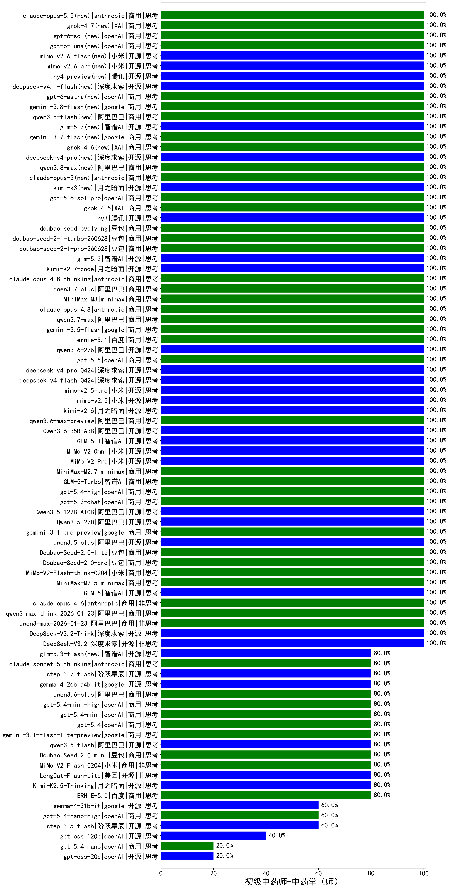

|类别|机构|大模型|【初级中药师-中药学（师）】准确率|平均耗时|平均消耗token|花费/千次（元）|排名（准确率）|
|---|---|-----|-------------------|-------|-----------|-----------|-----------|
|开源|小米|mimo-v2.5|100.0%|733s|841|8.4|1|
|商用|阿里巴巴|qwen3.6-max-preview|100.0%|31s|1189|61.5|2|
|商用|豆包|doubao-seed-evolving|100.0%|118s|3723|109.4|3|
|商用|豆包|doubao-seed-2-1-turbo-260628|100.0%|62s|2828|41.3|4|
|商用|豆包|doubao-seed-2-1-pro-260628|100.0%|110s|3043|89.0|5|
|开源|智谱AI|glm-5.2|100.0%|31s|1368|37.1|6|
|开源|月之暗面|kimi-k2.7-code|100.0%|25s|818|21.0|7|
|商用|anthropic|claude-opus-4.8-thinking|100.0%|9s|503|77.1|8|
|商用|阿里巴巴|qwen3.7-plus|100.0%|15s|667|5.0|9|
|商用|minimax|MiniMax-M3|100.0%|19s|484|5.3|10|
|商用|anthropic|claude-opus-4.8|100.0%|7s|406|60.1|11|
|商用|阿里巴巴|qwen3.7-max|100.0%|26s|637|21.5|12|
|商用|google|gemini-3.5-flash|100.0%|10s|1095|66.2|13|
|商用|百度|ernie-5.1|100.0%|24s|805|13.8|14|
|开源|阿里巴巴|qwen3.6-27b|100.0%|22s|1424|24.8|15|
|商用|openAI|gpt-5.5|100.0%|5s|260|43.2|16|
|开源|深度求索|deepseek-v4-pro-0424|100.0%|17s|354|7.9|17|
|开源|深度求索|deepseek-v4-flash-0424|100.0%|16s|361|0.7|18|
|开源|小米|mimo-v2.5-pro|100.0%|19s|925|15.2|19|
|开源|腾讯|hy3|100.0%|74s|178|0.5|20|
|商用|XAI|grok-4.5|100.0%|52s|994|34.5|21|
|商用|openAI|gpt-5.6-sol-pro|100.0%|13s|2654|185.4|22|
|商用|openAI|gpt-6-astra(new)|100.0%|8s|146|32.6|23|
|商用|XAI|grok-4.7(new)|100.0%|18s|2185|55.6|24|
|商用|openAI|gpt-6-sol(new)|100.0%|68s|160|7.5|25|
|商用|openAI|gpt-6-luna(new)|100.0%|262s|522|1.6|26|
|开源|小米|mimo-v2.6-flash(new)|100.0%|31s|867|1.7|27|
|开源|小米|mimo-v2.6-pro(new)|100.0%|32s|1196|7.0|28|
|开源|腾讯|hy4-preview(new)|100.0%|26s|1723|30.2|29|
|开源|深度求索|deepseek-v4.1-flash(new)|100.0%|5s|729|5.4|30|
|商用|google|gemini-3.8-flash(new)|100.0%|42s|495|23.7|31|
|开源|月之暗面|kimi-k3(new)|100.0%|41s|972|86.6|32|
|商用|阿里巴巴|qwen3.8-flash(new)|100.0%|159s|3284|8.7|33|
|开源|智谱AI|glm-5.3(new)|100.0%|23s|799|21.1|34|
|商用|google|gemini-3.7-flash(new)|100.0%|6s|716|17.7|35|
|商用|XAI|grok-4.6(new)|100.0%|1056s|1324|48.4|36|
|开源|深度求索|deepseek-v4-pro(new)|100.0%|6s|322|6.3|37|
|商用|阿里巴巴|qwen3.8-max(new)|100.0%|19s|460|14.2|38|
|商用|anthropic|claude-opus-5(new)|100.0%|14s|564|87.6|39|
|开源|月之暗面|kimi-k2.6|100.0%|31s|741|18.9|40|
|商用|anthropic|claude-opus-5.5(new)|100.0%|10s|453|54.6|41|
|开源|阿里巴巴|Qwen3.6-35B-A3B|100.0%|10s|1480|15.5|42|
|商用|openAI|gpt-5.3-chat|100.0%|55s|357|29.3|43|
|开源|深度求索|DeepSeek-V3.2|100.0%|120s|238|0.7|44|
|开源|深度求索|DeepSeek-V3.2-Think|100.0%|17s|522|1.5|45|
|商用|阿里巴巴|qwen3-max-2026-01-23|100.0%|44s|244|2.0|46|
|商用|阿里巴巴|qwen3-max-think-2026-01-23|100.0%|56s|1575|15.3|47|
|商用|anthropic|claude-opus-4.6|100.0%|20s|479|72.8|48|
|开源|智谱AI|GLM-5|100.0%|52s|1033|17.8|49|
|商用|minimax|MiniMax-M2.5|100.0%|15s|505|3.7|50|
|商用|小米|MiMo-V2-Flash-think-0204|100.0%|771s|1190|2.4|51|
|商用|豆包|Doubao-Seed-2.0-pro|100.0%|127s|558|7.7|52|
|商用|豆包|Doubao-Seed-2.0-lite|100.0%|145s|661|2.1|53|
|开源|阿里巴巴|qwen3.5-plus|100.0%|22s|1518|7.0|54|
|商用|google|gemini-3.1-pro-preview|100.0%|29s|1031|84.0|55|
|开源|阿里巴巴|Qwen3.5-122B-A10B|100.0%|322s|2414|15.1|56|
|开源|阿里巴巴|Qwen3.5-27B|100.0%|335s|2720|12.8|57|
|商用|openAI|gpt-5.4-high|100.0%|51s|564|53.5|58|
|开源|智谱AI|GLM-5.1|100.0%|28s|934|21.4|59|
|商用|智谱AI|GLM-5-Turbo|100.0%|22s|1000|21.1|60|
|开源|小米|MiMo-V2-Omni|100.0%|157s|881|9.0|61|
|开源|小米|MiMo-V2-Pro|100.0%|199s|911|14.9|62|
|商用|minimax|MiniMax-M2.7|100.0%|19s|780|6.0|63|
|商用|openAI|gpt-5.4|80.0%|3s|194|14.7|64|
|开源|google|gemma-4-26b-a4b-it|80.0%|47s|427|1.1|65|
|商用|百度|ERNIE-5.0|80.0%|414s|925|21.3|66|
|商用|阿里巴巴|qwen3.6-plus|80.0%|27s|1392|16.1|67|
|开源|月之暗面|Kimi-K2.5-Thinking|80.0%|258s|1242|25.2|68|
|开源|智谱AI|glm-5.3-flash(new)|80.0%|85s|3069|8.5|69|
|开源|美团|LongCat-Flash-Lite|80.0%|49s|280|0.0|70|
|商用|小米|MiMo-V2-Flash-0204|80.0%|172s|335|0.6|71|
|商用|openAI|gpt-5.4-mini-high|80.0%|22s|798|23.4|72|
|商用|豆包|Doubao-Seed-2.0-mini|80.0%|390s|1701|3.2|73|
|商用|openAI|gpt-5.4-mini|80.0%|5s|194|4.4|74|
|开源|阶跃星辰|step-3.7-flash|80.0%|20s|3101|24.7|75|
|开源|阿里巴巴|qwen3.5-flash|80.0%|107s|2434|4.8|76|
|商用|anthropic|claude-sonnet-5-thinking|80.0%|13s|594|37.2|77|
|商用|google|gemini-3.1-flash-lite-preview|80.0%|4s|245|2.1|78|
|商用|openAI|gpt-5.4-nano-high|60.0%|6s|488|3.8|79|
|开源|阶跃星辰|step-3.5-flash|60.0%|8s|1133|2.3|80|
|开源|google|gemma-4-31b-it|60.0%|69s|339|0.8|81|
|开源|openAI|gpt-oss-120b|40.0%|11s|574|1.6|82|
|商用|openAI|gpt-5.4-nano|20.0%|2s|149|0.8|83|
|开源|openAI|gpt-oss-20b|20.0%|10s|2164|2.4|84|

