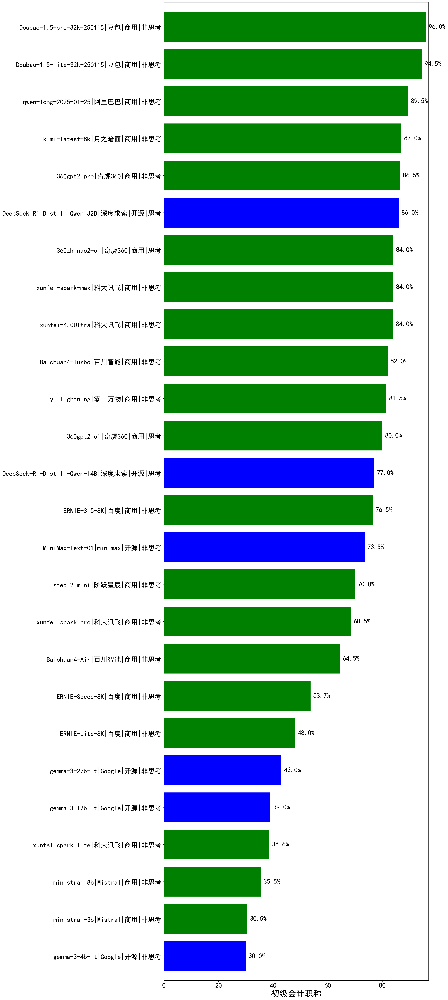

|类别|机构|大模型|【初级会计职称】准确率|平均耗时|平均消耗token|花费/千次（元）|排名（准确率）|
|---|---|-----|-------------------|-------|-----------|-----------|-----------|
|商用|豆包|Doubao-1.5-pro-32k-250115|96.0%|11s|423|0.7|1|
|开源|腾讯|hunyuan-large|95.5%|12s|977|6.0|2|
|商用|豆包|Doubao-1.5-lite-32k-250115|94.5%|7s|281|0.1|3|
|开源|阿里巴巴|qwq-32b|92.0%|52s|1825|10.5|4|
|商用|阿里巴巴|qwq-plus-2025-03-05|91.0%|42s|1903|7.4|5|
|商用|阿里巴巴|qwen-long-2025-01-25|89.5%|123s|258|0.4|6|
|商用|商汤|SenseChat-5-beta|88.0%|17s|342|5.7|7|
|商用|商汤|SenseChat-5-1202|87.0%|/|/|/|8|
|商用|月之暗面|kimi-latest-8k|87.0%|17s|492|5.9|9|
|开源|阿里巴巴|qwen2.5-72b-instruct|87.0%|13s|326|2.9|10|
|商用|奇虎360|360gpt2-pro|86.5%|11s|299|1.1|11|
|商用|腾讯|hunyuan-standard|86.0%|/|/|/|12|
|开源|深度求索|DeepSeek-R1-Distill-Qwen-32B|86.0%|35s|1190|1.5|13|
|商用|科大讯飞|xunfei-spark-max|84.0%|11s|249|7.5|14|
|商用|科大讯飞|xunfei-4.0Ultra|84.0%|10s|247|17.3|15|
|商用|奇虎360|360zhinao2-o1|84.0%|/|/|/|16|
|商用|阿里巴巴|qwen2.5-max|83.5%|15s|464|3.6|17|
|商用|百川智能|Baichuan4-Turbo|82.0%|/|/|/|18|
|商用|零一万物|yi-lightning|81.5%|/|/|/|19|
|商用|奇虎360|360gpt2-o1|80.0%|21s|483|20.7|20|
|商用|奇虎360|360gpt-turbo|80.0%|/|/|/|21|
|开源|阿里巴巴|qwen2.5-32b-instruct|79.5%|9s|303|1.3|22|
|开源|深度求索|DeepSeek-R1-Distill-Qwen-14B|77.0%|/|/|/|23|
|商用|百度|ERNIE-3.5-8K|76.5%|21s|330|0.6|24|
|开源|阿里巴巴|qwen2.5-14b-instruct|76.5%|5s|178|0.4|25|
|开源|阿里巴巴|qwen2.5-7b-instruct|74.0%|13s|208|0.2|26|
|开源|minimax|MiniMax-Text-01|73.5%|13s|912|7.3|27|
|商用|智谱AI|GLM-4-Flash|72.3%|7s|408|0.0|28|
|商用|智谱AI|GLM-4-FlashX|71.5%|12s|534|0.0|29|
|开源|上海人工智能实验室|internlm2_5-7b-chat|70.5%|/|/|/|30|
|商用|阶跃星辰|step-2-mini|70.0%|8s|263|0.5|31|
|商用|科大讯飞|xunfei-spark-pro|68.5%|/|/|/|32|
|商用|openAI|chatgpt-4o-latest|68.0%|/|/|/|33|
|商用|商汤|SenseChat-Turbo-1202|65.5%|/|/|/|34|
|商用|百川智能|Baichuan4-Air|64.5%|/|/|/|35|
|商用|Mistral|mistral-small|64.0%|/|/|/|36|
|开源|阿里巴巴|qwen2.5-3b-instruct|56.0%|6s|184|0.1|37|
|开源|阿里巴巴|qwen2.5-1.5b-instruct|55.5%|5s|133|0.0|38|
|商用|百度|ERNIE-Speed-8K|53.7%|/|/|/|39|
|商用|Mistral|mistral-large|53.0%|/|/|/|40|
|商用|百度|ERNIE-Lite-8K|48.0%|/|/|/|41|
|开源|微软|phi-4|46.5%|/|/|/|42|
|商用|OpenAI|gpt-4o-mini|46.5%|/|/|/|43|
|开源|Google|gemma-3-27b-it|43.0%|/|/|/|44|
|开源|Google|gemma-3-12b-it|39.0%|/|/|/|45|
|商用|科大讯飞|xunfei-spark-lite|38.6%|/|/|/|46|
|商用|Mistral|ministral-8b|35.5%|/|/|/|47|
|开源|阿里巴巴|qwen2.5-0.5b-instruct|31.5%|5s|169|0.0|48|
|商用|Mistral|ministral-3b|30.5%|/|/|/|49|
|开源|Google|gemma-3-4b-it|30.0%|/|/|/|50|
|商用|百度|ERNIE-Tiny-8K|28.0%|/|/|/|51|
|商用|智谱AI|GLM-4-Air|nan%|7s|214|0.1|52|
|商用|智谱AI|GLM-4-AirX|nan%|6s|215|2.2|53|
|商用|智谱AI|GLM-4-Long|nan%|8s|205|0.2|54|
|商用|智谱AI|GLM-4-Plus|nan%|13s|332|1.6|55|
|开源|深度求索|deepseek-chat-v3-0324|nan%|115s|230|1.5|56|
|开源|meta|Llama-4-Scout-17B-16E-Instruct|nan%|10s|513|1.0|57|
|开源|meta|Llama-4-Maverick-17B-128E-Instruct-FP8|nan%|8s|554|2.1|58|
|开源|Mistral|Mistral-Small-3.1-24B-Instruct-2503|nan%|/|/|/|59|
|商用|智谱AI|GLM-Z1-Flash|nan%|29s|1596|0.0|60|
|商用|智谱AI|GLM-Z1-FlashX|nan%|32s|1261|0.2|61|
|商用|智谱AI|GLM-Z1-Air|nan%|46s|1247|0.6|62|
|商用|智谱AI|GLM-Z1-AirX|nan%|38s|2350|11.7|63|
|开源|智谱AI|GLM-4-9B-0414|nan%|11s|470|0.0|64|
|开源|智谱AI|GLM-Z1-9B-0414|nan%|81s|3368|0.0|65|
|开源|智谱AI|GLM-4-32B-0414|nan%|14s|472|0.9|66|
|开源|智谱AI|GLM-Z1-32B-0414|nan%|74s|1700|6.6|67|
|开源|智谱AI|GLM-Z1-Rumination-32B-0414|nan%|32s|1478|4.3|68|
|开源|阿里巴巴|Qwen3-235B-A22B|nan%|41s|1327|12.8|69|
|开源|阿里巴巴|Qwen3-32B|nan%|29s|1254|4.8|70|
|开源|阿里巴巴|Qwen3-30B-A3B|nan%|27s|1647|4.5|71|
|开源|阿里巴巴|Qwen3-14B|nan%|23s|1633|3.2|72|
|开源|阿里巴巴|Qwen3-8B|nan%|203s|5690|0.0|73|
|开源|阿里巴巴|Qwen3-4B|nan%|22s|1009|2.8|74|
|开源|阿里巴巴|Qwen3-1.7B|nan%|19s|2160|6.3|75|
|开源|阿里巴巴|Qwen3-0.6B|nan%|7s|1521|4.4|76|
|商用|科大讯飞|xunfei-spark-x1|nan%|43s|1147|13.8|77|
|商用|openAI|gpt-4.1|nan%|11s|256|11.2|78|
|商用|openAI|gpt-4.1-mini|nan%|7s|299|2.7|79|
|商用|openAI|o4-mini|nan%|31s|1292|39.2|80|
|开源|深度求索|DeepSeek-R1-0528|nan%|203s|1641|25.5|81|
|商用|百度|ERNIE-4.5-Turbo-32K|nan%|19s|503|1.4|82|
|商用|百度|ERNIE-X1-Turbo-32K|nan%|45s|1015|3.9|83|
|开源|深度求索|DeepSeek-R1-0528-Qwen3-8B|nan%|258s|1458|0.0|84|
|商用|anthropic|claude-4-sonnet|nan%|39s|455|39.9|85|
|商用|anthropic|claude-4-sonnet-thinking|nan%|46s|922|90.7|86|
|商用|阶跃星辰|step-r1-v-mini|nan%|67s|948|7.2|87|
|商用|腾讯|hunyuan-turbos-20250604|nan%|8s|324|0.5|88|
|商用|腾讯|hunyuan-t1-20250529|nan%|14s|785|2.9|89|
|商用|豆包|doubao-seed-1-6-flash-250615|nan%|3s|302|0.4|90|
|商用|豆包|doubao-seed-1-6-flash-thinking-250615|nan%|5s|500|0.6|91|
|商用|豆包|doubao-seed-1-6-250615|nan%|103s|311|1.7|92|
|商用|豆包|doubao-seed-1-6-thinking-250615|nan%|17s|901|6.7|93|
|商用|阿里巴巴|qwen-plus-2025-04-28|nan%|180s|366|0.6|94|
|商用|阿里巴巴|qwen-plus-think-2025-04-28|nan%|229s|1446|11.0|95|
|商用|阿里巴巴|qwen-turbo-2025-04-28|nan%|3s|374|0.2|96|
|商用|阿里巴巴|qwen-turbo-think-2025-04-28|nan%|136s|1883|5.5|97|
|开源|minimax|MiniMax-M1(new)|nan%|88s|2496|18.8|98|
|开源|百度|ERNIE-4.5-0.3B(new)|nan%|45s|380|0.0|99|
|开源|百度|ERNIE-4.5-21B-A3B(new)|nan%|42s|518|0.0|100|
|开源|百度|ERNIE-4.5-300B-A47B(new)|nan%|5s|341|2.3|101|
|开源|腾讯|Hunyuan-A13B-Instruct(new)|nan%|34s|991|3.7|102|
|商用|google|gemini-2.5-flash(new)|nan%|11s|1561|27.3|103|
|商用|google|gemini-2.5-flash-lite-preview-06-17(new)|nan%|1s|409|1.0|104|
|商用|XAI|grok-4-0709(new)|nan%|376s|1360|141.2|105|
|商用|XAI|grok-3-mini(new)|nan%|132s|1133|4.0|106|
|商用|google|gemini-2.5-pro(new)|nan%|23s|1813|127.3|107|
|开源|月之暗面|kimi-k2-0711-preview(new)|nan%|9s|211|2.6|108|
|开源|阿里巴巴|Qwen3-235B-A22B-nothink|nan%|14s|316|2.6|109|
|商用|腾讯|hunyuan-t1-20250711(new)|nan%|10s|644|2.3|110|
|开源|华为|pangu-pro-moe(new)|nan%|66s|1167|4.5|111|
|商用|阿里巴巴|qwen-turbo-2025-07-15(new)|nan%|6s|258|0.1|112|
|商用|阿里巴巴|qwen-plus-2025-07-14(new)|nan%|15s|276|0.5|113|
|开源|腾讯|Hunyuan-A13B-Instruct-nothink(new)|nan%|9s|250|0.8|114|
|开源|阿里巴巴|qwen3-235b-a22b-instruct-2507(new)|nan%|8s|328|2.2|115|
|商用|豆包|doubao-seed-1-6-thinking-250715(new)|nan%|15s|713|5.3|116|

