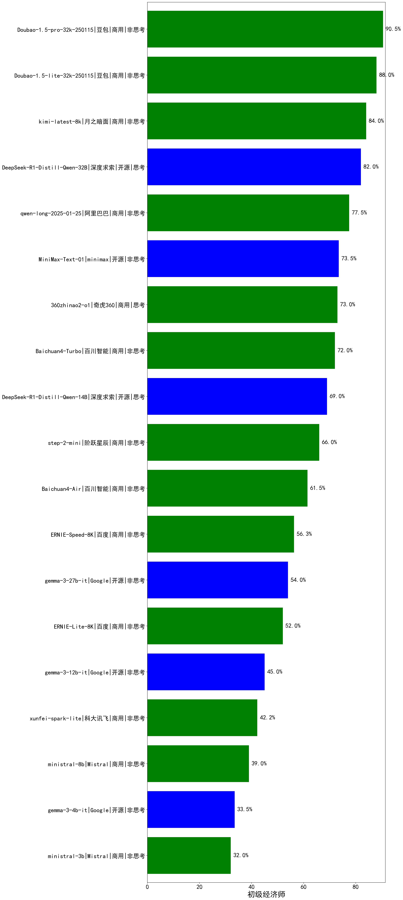

|类别|机构|大模型|【初级经济师】准确率|平均耗时|平均消耗token|花费/千次（元）|排名（准确率）|
|---|---|-----|-------------------|-------|-----------|-----------|-----------|
|开源|腾讯|hunyuan-large|95.5%|14s|939|6.1|1|
|商用|豆包|Doubao-1.5-pro-32k-250115|90.5%|12s|391|0.7|2|
|商用|豆包|Doubao-1.5-lite-32k-250115|88.0%|7s|224|0.1|3|
|商用|科大讯飞|xunfei-4.0Ultra|87.0%|8s|129|9.0|4|
|开源|阿里巴巴|qwq-32b|86.0%|50s|1836|10.7|5|
|商用|科大讯飞|xunfei-spark-max|86.0%|8s|127|3.8|6|
|商用|月之暗面|kimi-latest-8k|84.0%|15s|418|5.0|7|
|商用|阿里巴巴|qwq-plus-2025-03-05|83.0%|42s|1856|7.3|8|
|开源|深度求索|DeepSeek-R1-Distill-Qwen-32B|82.0%|23s|637|0.8|9|
|商用|腾讯|hunyuan-standard|81.5%|/|/|/|10|
|商用|商汤|SenseChat-5-1202|81.0%|/|/|/|11|
|开源|阿里巴巴|qwen2.5-72b-instruct|79.0%|11s|247|2.3|12|
|商用|奇虎360|360gpt2-pro|78.0%|9s|210|0.8|13|
|商用|阿里巴巴|qwen-long-2025-01-25|77.5%|121s|260|0.5|14|
|商用|阿里巴巴|qwen2.5-max|75.0%|15s|387|3.2|15|
|开源|阿里巴巴|qwen2.5-32b-instruct|74.0%|8s|236|1.1|16|
|商用|奇虎360|360gpt-turbo|73.5%|/|/|/|17|
|开源|minimax|MiniMax-Text-01|73.5%|12s|871|7.0|18|
|商用|奇虎360|360zhinao2-o1|73.0%|/|/|/|19|
|商用|openAI|chatgpt-4o-latest|73.0%|/|/|/|20|
|开源|阿里巴巴|qwen2.5-14b-instruct|72.0%|6s|204|0.5|21|
|开源|上海人工智能实验室|internlm2_5-7b-chat|72.0%|/|/|/|22|
|商用|百川智能|Baichuan4-Turbo|72.0%|/|/|/|23|
|商用|奇虎360|360gpt2-o1|71.0%|18s|349|15.1|24|
|商用|百度|ERNIE-3.5-8K|71.0%|29s|468|0.9|25|
|开源|阿里巴巴|qwen2.5-7b-instruct|71.0%|8s|193|0.2|26|
|商用|智谱AI|GLM-4-FlashX|70.0%|7s|204|0.0|27|
|开源|深度求索|DeepSeek-R1-Distill-Qwen-14B|69.0%|/|/|/|28|
|商用|零一万物|yi-lightning|68.5%|/|/|/|29|
|商用|科大讯飞|xunfei-spark-pro|68.5%|/|/|/|30|
|商用|Mistral|mistral-large|66.0%|/|/|/|31|
|商用|阶跃星辰|step-2-mini|66.0%|9s|305|0.6|32|
|商用|Mistral|mistral-small|65.0%|/|/|/|33|
|商用|百川智能|Baichuan4-Air|61.5%|/|/|/|34|
|开源|阿里巴巴|qwen2.5-3b-instruct|57.0%|6s|214|0.2|35|
|商用|百度|ERNIE-Speed-8K|56.3%|/|/|/|36|
|商用|OpenAI|gpt-4o-mini|56.0%|/|/|/|37|
|开源|微软|phi-4|54.0%|/|/|/|38|
|开源|Google|gemma-3-27b-it|54.0%|/|/|/|39|
|商用|百度|ERNIE-Lite-8K|52.0%|/|/|/|40|
|开源|阿里巴巴|qwen2.5-1.5b-instruct|50.0%|9s|141|0.0|41|
|开源|Google|gemma-3-12b-it|45.0%|/|/|/|42|
|商用|科大讯飞|xunfei-spark-lite|42.2%|/|/|/|43|
|商用|Mistral|ministral-8b|39.0%|/|/|/|44|
|开源|Google|gemma-3-4b-it|33.5%|/|/|/|45|
|商用|Mistral|ministral-3b|32.0%|/|/|/|46|
|开源|阿里巴巴|qwen2.5-0.5b-instruct|31.0%|6s|133|0.0|47|
|商用|百度|ERNIE-Tiny-8K|26.0%|/|/|/|48|
|商用|智谱AI|GLM-4-AirX|nan%|6s|183|1.9|49|
|商用|智谱AI|GLM-4-Long|nan%|9s|187|0.2|50|
|商用|智谱AI|GLM-4-Plus|nan%|9s|258|1.3|51|
|开源|深度求索|deepseek-chat-v3-0324|nan%|32s|253|1.8|52|
|开源|meta|Llama-4-Scout-17B-16E-Instruct|nan%|10s|432|0.9|53|
|开源|meta|Llama-4-Maverick-17B-128E-Instruct-FP8|nan%|8s|490|1.9|54|
|开源|Mistral|Mistral-Small-3.1-24B-Instruct-2503|nan%|/|/|/|55|
|商用|智谱AI|GLM-Z1-Flash|nan%|30s|1385|0.0|56|
|商用|智谱AI|GLM-Z1-FlashX|nan%|13s|1321|0.2|57|
|商用|智谱AI|GLM-Z1-Air|nan%|30s|1194|0.6|58|
|商用|智谱AI|GLM-Z1-AirX|nan%|28s|1238|8.7|59|
|开源|智谱AI|GLM-4-9B-0414|nan%|10s|364|0.0|60|
|开源|智谱AI|GLM-Z1-9B-0414|nan%|65s|2380|0.0|61|
|开源|智谱AI|GLM-4-32B-0414|nan%|11s|318|0.6|62|
|开源|智谱AI|GLM-Z1-32B-0414|nan%|159s|1735|6.8|63|
|开源|智谱AI|GLM-Z1-Rumination-32B-0414|nan%|19s|1037|2.6|64|
|开源|阿里巴巴|Qwen3-235B-A22B|nan%|63s|1863|18.2|65|
|开源|阿里巴巴|Qwen3-32B|nan%|24s|678|2.5|66|
|开源|阿里巴巴|Qwen3-30B-A3B|nan%|19s|645|1.7|67|
|开源|阿里巴巴|Qwen3-14B|nan%|18s|808|1.5|68|
|开源|阿里巴巴|Qwen3-8B|nan%|149s|3559|0.0|69|
|开源|阿里巴巴|Qwen3-4B|nan%|14s|1481|4.3|70|
|开源|阿里巴巴|Qwen3-1.7B|nan%|18s|1992|5.8|71|
|开源|阿里巴巴|Qwen3-0.6B|nan%|6s|1167|3.3|72|
|商用|openAI|gpt-4.1|nan%|10s|210|9.7|73|
|商用|openAI|gpt-4.1-mini|nan%|7s|213|2.0|74|
|商用|openAI|o4-mini|nan%|33s|915|27.9|75|
|开源|深度求索|DeepSeek-R1-0528|nan%|207s|1538|24.0|76|
|商用|百度|ERNIE-4.5-Turbo-32K|nan%|21s|488|1.4|77|
|商用|百度|ERNIE-X1-Turbo-32K|nan%|111s|1717|6.7|78|
|开源|深度求索|DeepSeek-R1-0528-Qwen3-8B|nan%|213s|1446|0.0|79|
|商用|anthropic|claude-4-sonnet|nan%|40s|463|43.7|80|
|商用|anthropic|claude-4-sonnet-thinking|nan%|51s|972|99.1|81|
|商用|阶跃星辰|step-r1-v-mini|nan%|188s|1268|9.8|82|
|商用|腾讯|hunyuan-turbos-20250604|nan%|7s|336|0.6|83|
|商用|豆包|doubao-seed-1-6-flash-250615|nan%|5s|304|0.4|84|
|商用|豆包|doubao-seed-1-6-flash-thinking-250615|nan%|5s|471|0.6|85|
|商用|豆包|doubao-seed-1-6-250615|nan%|151s|362|2.2|86|
|商用|阿里巴巴|qwen-plus-think-2025-04-28|nan%|191s|2080|16.2|87|
|商用|阿里巴巴|qwen-turbo-think-2025-04-28|nan%|70s|1893|5.5|88|
|开源|minimax|MiniMax-M1|nan%|285s|1853|13.7|89|
|开源|百度|ERNIE-4.5-0.3B|nan%|2s|348|0.0|90|
|开源|百度|ERNIE-4.5-21B-A3B|nan%|51s|339|0.0|91|
|开源|百度|ERNIE-4.5-300B-A47B|nan%|13s|379|2.7|92|
|开源|腾讯|Hunyuan-A13B-Instruct|nan%|24s|811|3.1|93|
|商用|google|gemini-2.5-flash|nan%|11s|1524|26.7|94|
|商用|google|gemini-2.5-flash-lite-preview-06-17|nan%|2s|372|1.0|95|
|商用|XAI|grok-4-0709|nan%|332s|1614|171.0|96|
|商用|XAI|grok-3-mini|nan%|150s|1040|3.7|97|
|商用|google|gemini-2.5-pro|nan%|25s|1818|128.3|98|
|开源|月之暗面|kimi-k2-0711-preview(new)|nan%|15s|272|3.8|99|
|开源|阿里巴巴|Qwen3-235B-A22B-nothink|nan%|10s|314|2.7|100|
|商用|腾讯|hunyuan-t1-20250711(new)|nan%|29s|1567|6.0|101|
|开源|华为|pangu-pro-moe(new)|nan%|53s|862|3.3|102|
|商用|阿里巴巴|qwen-turbo-2025-07-15(new)|nan%|6s|272|0.1|103|
|商用|阿里巴巴|qwen-plus-2025-07-14(new)|nan%|11s|352|0.6|104|
|开源|腾讯|Hunyuan-A13B-Instruct-nothink(new)|nan%|15s|371|1.3|105|
|开源|阿里巴巴|qwen3-235b-a22b-instruct-2507(new)|nan%|9s|351|2.5|106|
|商用|豆包|doubao-seed-1-6-thinking-250715(new)|nan%|26s|1225|9.4|107|
|开源|阿里巴巴|qwen3-235b-a22b-thinking-2507(new)|nan%|181s|3055|60.1|108|
|商用|科大讯飞|xunfei-spark-x1-0725(new)|nan%|/|683|8.2|109|
|开源|阿里巴巴|Qwen3-0.6B-nothink|nan%|17s|187|0.4|110|
|开源|阿里巴巴|Qwen3-1.7B-nothink|nan%|15s|323|0.8|111|
|开源|阿里巴巴|Qwen3-4B-nothink|nan%|14s|334|0.8|112|
|开源|阿里巴巴|Qwen3-8B-nothink|nan%|15s|398|0.0|113|
|开源|阿里巴巴|Qwen3-14B-nothink|nan%|10s|407|0.7|114|
|开源|阿里巴巴|Qwen3-30B-A3B-nothink|nan%|29s|358|0.9|115|
|开源|阿里巴巴|Qwen3-32B-nothink|nan%|19s|396|1.4|116|
|商用|智谱AI|GLM-4.5-Flash(new)|nan%|25s|1411|0.0|117|
|开源|智谱AI|GLM-4.5-Air(new)|nan%|22s|1082|6.2|118|
|开源|智谱AI|GLM-4.5(new)|nan%|32s|1190|16.1|119|
|开源|阿里巴巴|Qwen3-30B-A3B-Instruct-2507(new)|nan%|4s|402|1.1|120|
|开源|阿里巴巴|Qwen3-30B-A3B-Thinking-2507(new)|nan%|59s|2211|6.1|121|
|开源|阶跃星辰|step-3(new)|nan%|115s|2241|8.8|122|

