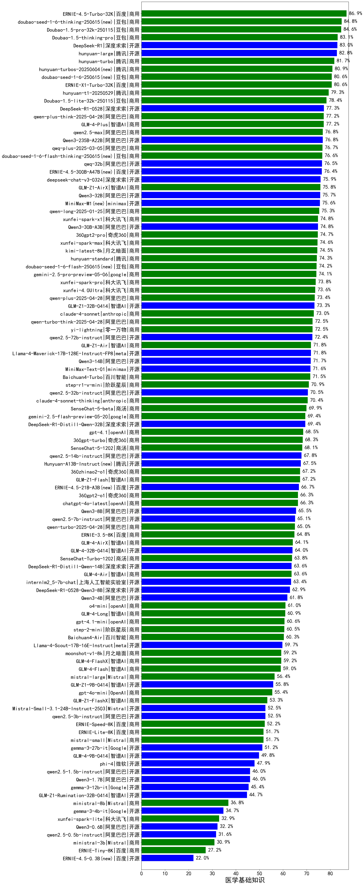

|类别|机构|大模型|【医学基础知识】准确率|平均耗时|平均消耗token|花费/千次（元）|排名（准确率）|
|---|---|-----|-------------------|-------|-----------|-----------|-----------|
|商用|百度|ERNIE-4.5-Turbo-32K|86.9%|22s|535|1.6|1|
|商用|豆包|doubao-seed-1-6-thinking-250615(new)|84.8%|293s|1338|5.1|2|
|商用|豆包|Doubao-1.5-pro-32k-250115|84.6%|8s|385|0.7|3|
|商用|豆包|Doubao-1.5-thinking-pro|83.1%|436s|892|13.4|4|
|开源|腾讯|hunyuan-large|82.8%|8s|1006|6.5|5|
|商用|腾讯|hunyuan-turbos-20250604(new)|80.9%|49s|476|0.8|6|
|商用|豆包|doubao-seed-1-6-250615(new)|80.6%|96s|404|1.5|7|
|商用|百度|ERNIE-X1-Turbo-32K|80.6%|111s|2041|8.0|8|
|商用|腾讯|hunyuan-t1-20250711(new)|80.1%|25s|1550|5.9|9|
|商用|腾讯|hunyuan-t1-20250529|79.3%|84s|1091|4.1|10|
|商用|google|gemini-2.5-pro(new)|78.5%|34s|2312|163.1|11|
|商用|豆包|Doubao-1.5-lite-32k-250115|78.4%|2s|192|0.1|12|
|开源|阿里巴巴|Qwen3-235B-A22B-nothink|77.5%|21s|461|4.0|13|
|开源|深度求索|DeepSeek-R1-0528|77.3%|230s|1809|28.2|14|
|商用|阿里巴巴|qwen-plus-think-2025-04-28|77.2%|154s|1990|15.9|15|
|商用|智谱AI|GLM-4-Plus|77.2%|11s|284|1.4|16|
|开源|月之暗面|kimi-k2-0711-preview(new)|77.0%|30s|494|7.1|17|
|商用|阿里巴巴|qwen2.5-max|76.8%|18s|447|3.8|18|
|开源|阿里巴巴|Qwen3-235B-A22B|76.8%|118s|2418|23.6|19|
|商用|阿里巴巴|qwq-plus-2025-03-05|76.7%|47s|2327|9.1|20|
|商用|豆包|doubao-seed-1-6-flash-thinking-250615(new)|76.6%|7s|553|0.4|21|
|开源|阿里巴巴|qwq-32b|76.5%|38s|3086|18.2|22|
|开源|百度|ERNIE-4.5-300B-A47B(new)|76.4%|22s|355|2.4|23|
|开源|深度求索|deepseek-chat-v3-0324|75.9%|101s|330|2.3|24|
|商用|智谱AI|GLM-Z1-AirX|75.8%|24s|1892|9.5|25|
|开源|阿里巴巴|Qwen3-32B|75.7%|34s|1279|4.9|26|
|开源|minimax|MiniMax-M1(new)|75.6%|162s|2754|17.9|27|
|商用|阿里巴巴|qwen-long-2025-01-25|75.3%|55s|328|0.6|28|
|商用|XAI|grok-4-0709(new)|75.0%|246s|1447|151.1|29|
|商用|科大讯飞|xunfei-spark-x1|74.8%|46s|1344|16.1|30|
|开源|阿里巴巴|Qwen3-30B-A3B|74.8%|35s|1633|4.4|31|
|商用|奇虎360|360gpt2-pro|74.7%|9s|232|0.9|32|
|商用|科大讯飞|xunfei-spark-max|74.6%|2s|132|4.0|33|
|商用|月之暗面|kimi-latest-8k|74.5%|27s|496|6.0|34|
|商用|腾讯|hunyuan-standard|74.3%|/|/|/|35|
|商用|豆包|doubao-seed-1-6-flash-250615(new)|74.2%|3s|320|0.2|36|
|商用|科大讯飞|xunfei-spark-pro|73.8%|/|/|/|37|
|商用|科大讯飞|xunfei-4.0Ultra|73.6%|2s|131|9.2|38|
|商用|阿里巴巴|qwen-plus-2025-04-28|73.4%|121s|441|0.8|39|
|开源|智谱AI|GLM-Z1-32B-0414|73.3%|139s|2129|8.3|40|
|商用|anthropic|claude-4-sonnet|73.0%|43s|532|48.4|41|
|商用|阿里巴巴|qwen-turbo-think-2025-04-28|72.5%|122s|2192|6.6|42|
|商用|零一万物|yi-lightning|72.5%|/|/|/|43|
|开源|阿里巴巴|qwen2.5-72b-instruct|72.4%|14s|263|2.6|44|
|商用|智谱AI|GLM-Z1-Air|71.8%|67s|2108|0.7|45|
|开源|meta|Llama-4-Maverick-17B-128E-Instruct-FP8|71.8%|11s|516|2.0|46|
|开源|阿里巴巴|Qwen3-14B|71.7%|35s|1585|3.1|47|
|开源|minimax|MiniMax-Text-01|71.6%|10s|896|7.2|48|
|商用|百川智能|Baichuan4-Turbo|71.5%|/|/|/|49|
|商用|阶跃星辰|step-r1-v-mini|70.9%|117s|1700|13.1|50|
|开源|阿里巴巴|qwen2.5-32b-instruct|70.5%|7s|236|1.1|51|
|商用|anthropic|claude-4-sonnet-thinking|70.4%|49s|1142|114.8|52|
|商用|商汤|SenseChat-5-beta|69.9%|18s|324|5.7|53|
|开源|深度求索|DeepSeek-R1-Distill-Qwen-32B|69.4%|32s|739|0.9|54|
|商用|openAI|gpt-4.1|68.5%|10s|285|13.1|55|
|商用|奇虎360|360gpt-turbo|68.3%|/|/|/|56|
|商用|google|gemini-2.5-flash(new)|68.2%|10s|1811|31.7|57|
|商用|商汤|SenseChat-5-1202|68.1%|/|/|/|58|
|开源|阿里巴巴|qwen2.5-14b-instruct|67.8%|3s|243|0.6|59|
|开源|华为|pangu-pro-moe(new)|67.8%|76s|1363|5.2|60|
|开源|腾讯|Hunyuan-A13B-Instruct(new)|67.5%|54s|1095|4.2|61|
|商用|奇虎360|360zhinao2-o1|67.2%|/|/|/|62|
|商用|智谱AI|GLM-Z1-Flash|67.2%|22s|2115|0.0|63|
|开源|百度|ERNIE-4.5-21B-A3B(new)|66.7%|40s|336|0.0|64|
|商用|奇虎360|360gpt2-o1|66.3%|12s|330|14.0|65|
|商用|openAI|chatgpt-4o-latest|66.3%|/|/|/|66|
|商用|XAI|grok-3-mini(new)|66.1%|222s|1039|3.7|67|
|开源|阿里巴巴|Qwen3-8B|65.5%|175s|4622|0.0|68|
|开源|阿里巴巴|qwen2.5-7b-instruct|65.1%|10s|238|0.2|69|
|商用|阿里巴巴|qwen-turbo-2025-04-28|65.0%|7s|421|0.2|70|
|商用|百度|ERNIE-3.5-8K|64.8%|21s|361|0.7|71|
|商用|智谱AI|GLM-4-AirX|64.1%|9s|276|2.8|72|
|开源|智谱AI|GLM-4-32B-0414|64.0%|22s|360|0.7|73|
|商用|商汤|SenseChat-Turbo-1202|63.8%|/|/|/|74|
|开源|深度求索|DeepSeek-R1-Distill-Qwen-14B|63.6%|/|/|/|75|
|商用|智谱AI|GLM-4-Air|63.6%|13s|277|0.1|76|
|开源|上海人工智能实验室|internlm2_5-7b-chat|63.4%|/|/|/|77|
|开源|深度求索|DeepSeek-R1-0528-Qwen3-8B|62.9%|252s|1692|0.0|78|
|开源|阿里巴巴|Qwen3-4B|61.8%|26s|1738|5.0|79|
|商用|openAI|o4-mini|61.0%|32s|944|28.2|80|
|商用|智谱AI|GLM-4-Long|60.9%|18s|360|0.4|81|
|商用|openAI|gpt-4.1-mini|60.6%|7s|336|3.2|82|
|商用|阶跃星辰|step-2-mini|60.5%|83s|340|0.6|83|
|商用|百川智能|Baichuan4-Air|60.3%|/|/|/|84|
|开源|meta|Llama-4-Scout-17B-16E-Instruct|59.7%|100s|480|1.0|85|
|商用|智谱AI|GLM-4-FlashX|59.2%|21s|281|0.0|86|
|商用|智谱AI|GLM-4-Flash|59.0%|10s|275|0.0|87|
|商用|Mistral|mistral-large|56.4%|/|/|/|88|
|开源|智谱AI|GLM-Z1-9B-0414|55.8%|113s|2598|0.0|89|
|商用|OpenAI|gpt-4o-mini|55.4%|/|/|/|90|
|商用|智谱AI|GLM-Z1-FlashX|53.3%|42s|3063|0.3|91|
|商用|google|gemini-2.5-flash-lite-preview-06-17(new)|52.7%|3s|564|1.5|92|
|开源|Mistral|Mistral-Small-3.1-24B-Instruct-2503|52.5%|/|/|/|93|
|开源|阿里巴巴|qwen2.5-3b-instruct|52.5%|8s|257|0.2|94|
|商用|百度|ERNIE-Speed-8K|52.2%|/|/|/|95|
|商用|百度|ERNIE-Lite-8K|51.7%|/|/|/|96|
|商用|Mistral|mistral-small|51.7%|/|/|/|97|
|开源|Google|gemma-3-27b-it|51.2%|/|/|/|98|
|开源|智谱AI|GLM-4-9B-0414|49.8%|10s|434|0.0|99|
|开源|微软|phi-4|47.9%|/|/|/|100|
|开源|阿里巴巴|qwen2.5-1.5b-instruct|46.0%|4s|157|0.0|101|
|开源|阿里巴巴|Qwen3-1.7B|46.0%|23s|2135|6.2|102|
|开源|Google|gemma-3-12b-it|45.4%|/|/|/|103|
|开源|智谱AI|GLM-Z1-Rumination-32B-0414|44.7%|28s|1351|3.8|104|
|商用|Mistral|ministral-8b|36.8%|/|/|/|105|
|开源|Google|gemma-3-4b-it|34.7%|/|/|/|106|
|商用|科大讯飞|xunfei-spark-lite|32.9%|/|/|/|107|
|开源|阿里巴巴|Qwen3-0.6B|32.2%|9s|1170|3.3|108|
|开源|阿里巴巴|qwen2.5-0.5b-instruct|31.6%|12s|250|0.0|109|
|商用|Mistral|ministral-3b|30.9%|/|/|/|110|
|商用|百度|ERNIE-Tiny-8K|27.2%|/|/|/|111|
|开源|百度|ERNIE-4.5-0.3B(new)|22.0%|40s|386|0.0|112|

