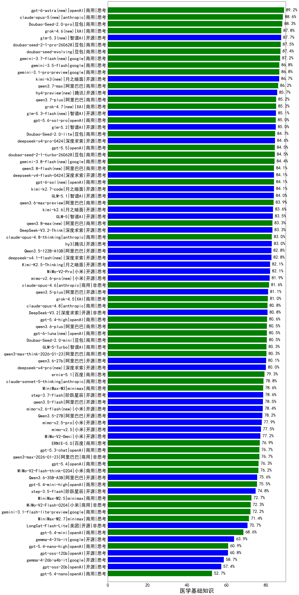

|类别|机构|大模型|【医学基础知识】准确率|平均耗时|平均消耗token|花费/千次（元）|排名（准确率）|
|---|---|-----|-------------------|-------|-----------|-----------|-----------|
|商用|openAI|gpt-6-astra(new)|89.2%|11s|252|66.2|1|
|商用|anthropic|claude-opus-5(new)|88.6%|14s|682|105.9|2|
|商用|豆包|Doubao-Seed-2.0-pro|88.3%|235s|1057|15.6|3|
|商用|XAI|grok-4.6(new)|87.8%|130s|1537|57.1|4|
|开源|智谱AI|glm-5.3(new)|87.7%|38s|1783|48.5|5|
|商用|豆包|doubao-seed-2-1-pro-260628|87.5%|210s|7326|217.3|6|
|商用|豆包|doubao-seed-evolving|87.4%|253s|7420|220.1|7|
|商用|google|gemini-3.7-flash(new)|87.2%|6s|775|19.0|8|
|商用|google|gemini-3.5-flash|86.8%|8s|1349|81.5|9|
|商用|google|gemini-3.1-pro-preview|86.8%|48s|1548|127.2|10|
|开源|月之暗面|kimi-k3(new)|86.7%|46s|810|69.8|11|
|商用|阿里巴巴|qwen3.7-max|86.2%|24s|1162|40.2|12|
|开源|腾讯|hy4-preview(new)|85.7%|62s|3320|58.8|13|
|商用|阿里巴巴|qwen3.7-plus|85.2%|23s|1165|8.9|14|
|开源|智谱AI|glm-5.3-flash(new)|85.1%|89s|1874|5.1|15|
|商用|openAI|gpt-5.6-sol-pro|85.0%|35s|3229|251.6|16|
|开源|智谱AI|glm-5.2|85.0%|44s|1602|43.5|17|
|商用|豆包|Doubao-Seed-2.0-lite|84.7%|197s|905|2.9|18|
|开源|深度求索|deepseek-v4-pro-0424|84.6%|35s|965|22.4|19|
|商用|openAI|gpt-5.5|84.5%|9s|445|79.6|20|
|商用|豆包|doubao-seed-2-1-turbo-260628|84.5%|215s|6969|103.3|21|
|商用|google|gemini-3.8-flash(new)|84.4%|18s|743|36.3|22|
|商用|阿里巴巴|qwen3.8-flash(new)|84.1%|40s|1636|4.2|23|
|开源|深度求索|deepseek-v4-flash-0424|84.1%|29s|836|1.6|24|
|商用|openAI|gpt-6-sol(new)|84.1%|179s|244|12.7|25|
|开源|月之暗面|kimi-k2.7-code|84.1%|32s|932|23.9|26|
|开源|智谱AI|GLM-5.1|84.0%|136s|1442|33.5|27|
|商用|阿里巴巴|qwen3.6-max-preview|83.9%|50s|1566|81.5|28|
|开源|月之暗面|kimi-k2.6|83.6%|103s|1776|46.7|29|
|开源|智谱AI|GLM-5|83.5%|121s|2002|35.2|30|
|商用|阿里巴巴|qwen3.8-max(new)|83.3%|24s|953|31.8|31|
|开源|深度求索|DeepSeek-V3.2-Think|83.3%|95s|1145|3.4|32|
|商用|anthropic|claude-opus-4.8-thinking|83.0%|15s|888|141.9|33|
|开源|腾讯|hy3|83.0%|71s|222|0.7|34|
|开源|阿里巴巴|Qwen3.5-122B-A10B|82.8%|255s|2964|18.6|35|
|开源|深度求索|deepseek-v4.1-flash(new)|82.8%|17s|1230|9.3|36|
|开源|月之暗面|Kimi-K2.5-Thinking|82.1%|345s|1827|37.3|37|
|开源|小米|MiMo-V2-Pro|82.1%|209s|1058|17.9|38|
|开源|小米|mimo-v2.6-pro(new)|81.9%|122s|1230|7.2|39|
|商用|anthropic|claude-opus-4.6|81.6%|15s|606|92.4|40|
|开源|阿里巴巴|qwen3.5-plus|81.1%|36s|2858|13.4|41|
|商用|XAI|grok-4.5|81.0%|84s|1662|62.4|42|
|开源|深度求索|DeepSeek-V3.2|80.8%|69s|336|1.0|43|
|商用|anthropic|claude-opus-4.8|80.8%|10s|529|79.2|44|
|商用|openAI|gpt-5.4-high|80.6%|16s|685|65.2|45|
|商用|阿里巴巴|qwen3.6-plus|80.5%|37s|1549|17.9|46|
|商用|openAI|gpt-6-luna(new)|80.5%|259s|420|1.2|47|
|商用|豆包|Doubao-Seed-2.0-mini|80.5%|390s|2226|4.3|48|
|商用|智谱AI|GLM-5-Turbo|80.3%|42s|1378|29.2|49|
|商用|阿里巴巴|qwen3-max-think-2026-01-23|80.3%|179s|2706|26.5|50|
|开源|阿里巴巴|qwen3.6-27b|80.1%|28s|1732|30.2|51|
|开源|深度求索|deepseek-v4-pro(new)|80.0%|212s|997|24.4|52|
|商用|百度|ernie-5.1|79.3%|35s|968|16.6|53|
|商用|anthropic|claude-sonnet-5-thinking|78.8%|17s|778|49.1|54|
|商用|minimax|MiniMax-M3|78.6%|26s|717|9.2|55|
|开源|阶跃星辰|step-3.7-flash|78.6%|46s|2574|20.4|56|
|开源|阿里巴巴|qwen3.5-flash|78.5%|256s|3116|6.1|57|
|开源|小米|mimo-v2.6-flash(new)|78.4%|133s|927|1.8|58|
|开源|阿里巴巴|Qwen3.5-27B|78.2%|299s|3061|14.4|59|
|开源|小米|mimo-v2.5-pro|77.9%|28s|1403|25.1|60|
|开源|小米|mimo-v2.5|77.5%|31s|1272|14.4|61|
|开源|小米|MiMo-V2-Omni|77.2%|239s|1214|13.5|62|
|商用|百度|ERNIE-5.0|76.9%|149s|1851|43.4|63|
|商用|openAI|gpt-5.3-chat|76.7%|19s|372|29.7|64|
|商用|阿里巴巴|qwen3-max-2026-01-23|76.7%|51s|452|4.0|65|
|商用|openAI|gpt-5.4|76.3%|6s|253|19.8|66|
|商用|小米|MiMo-V2-Flash-think-0204|76.2%|551s|1770|3.6|67|
|开源|阿里巴巴|Qwen3.6-35B-A3B|75.6%|69s|2045|21.5|68|
|商用|openAI|gpt-5.4-mini-high|75.5%|51s|954|28.0|69|
|开源|阶跃星辰|step-3.5-flash|74.8%|20s|1694|3.5|70|
|商用|minimax|MiniMax-M2.5|72.7%|25s|1272|10.1|71|
|商用|小米|MiMo-V2-Flash-0204|72.3%|216s|496|0.9|72|
|商用|google|gemini-3.1-flash-lite-preview|72.2%|16s|361|3.2|73|
|商用|minimax|MiniMax-M2.7|71.4%|36s|1482|11.9|74|
|开源|美团|LongCat-Flash-Lite|70.7%|228s|456|0.0|75|
|商用|openAI|gpt-5.4-mini|68.6%|23s|217|4.8|76|
|开源|google|gemma-4-31b-it|63.9%|80s|507|1.3|77|
|商用|openAI|gpt-5.4-nano-high|60.9%|29s|538|4.1|78|
|开源|openAI|gpt-oss-120b|60.8%|25s|620|1.7|79|
|开源|google|gemma-4-26b-a4b-it|58.7%|63s|568|1.4|80|
|开源|openAI|gpt-oss-20b|57.4%|58s|1131|1.2|81|
|商用|openAI|gpt-5.4-nano|52.7%|32s|224|1.4|82|

