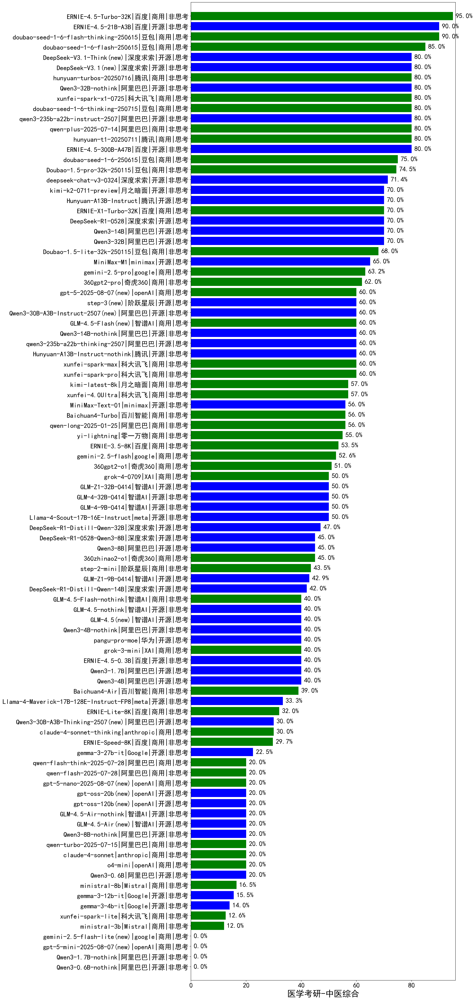

|类别|机构|大模型|【医学考研-中医综合】准确率|平均耗时|平均消耗token|花费/千次（元）|排名（准确率）|
|---|---|-----|-------------------|-------|-----------|-----------|-----------|
|商用|豆包|doubao-seed-1-6-lite-251015(new)|100.0%|28s|1097|2.4|1|
|商用|百度|ERNIE-4.5-Turbo-32K|95.0%|24s|582|1.7|2|
|商用|豆包|Doubao-1.5-lite-32k-250115|92.9%|3s|203|0.1|3|
|商用|豆包|doubao-seed-1-6-flash-thinking-250615|90.0%|6s|613|0.8|4|
|开源|百度|ERNIE-4.5-21B-A3B|90.0%|58s|325|0.0|5|
|商用|豆包|doubao-seed-1-6-flash-250615|85.0%|3s|348|0.4|6|
|开源|阿里巴巴|qwen3-next-80b-a3b-instruct|80.0%|8s|686|2.5|7|
|开源|豆包|Seed-OSS-36B-Instruct|80.0%|102s|1649|6.4|8|
|商用|阿里巴巴|qwen3-max-preview|80.0%|12s|533|11.3|9|
|商用|阿里巴巴|qwen-plus-2025-07-28|80.0%|15s|572|1.0|10|
|开源|深度求索|DeepSeek-V3.2-Exp(new)|80.0%|26s|454|1.3|11|
|开源|深度求索|DeepSeek-V3.1|80.0%|27s|401|4.2|12|
|开源|阿里巴巴|Qwen3-32B-nothink|80.0%|16s|581|2.1|13|
|开源|阿里巴巴|Qwen3-8B-nothink|80.0%|27s|552|0.0|14|
|商用|科大讯飞|xunfei-spark-x1-0725|80.0%|/|841|10.1|15|
|开源|阿里巴巴|qwen3-235b-a22b-instruct-2507|80.0%|15s|559|4.0|16|
|商用|腾讯|hunyuan-t1-20250711|80.0%|25s|1370|5.1|17|
|商用|腾讯|hunyuan-turbos-20250926(new)|80.0%|16s|684|1.2|18|
|商用|豆包|doubao-seed-1-6-250615|80.0%|108s|567|3.8|19|
|商用|豆包|doubao-seed-1-6-251015(new)|80.0%|178s|870|6.2|20|
|开源|深度求索|DeepSeek-V3.1-Think|80.0%|92s|1800|21.0|21|
|商用|豆包|doubao-seed-1-6-thinking-250715|80.0%|45s|2056|15.9|22|
|开源|百度|ERNIE-4.5-300B-A47B|78.9%|13s|324|2.1|23|
|商用|百度|ERNIE-X1-Turbo-32K|70.0%|113s|2270|8.9|24|
|开源|月之暗面|kimi-k2-0711-preview|70.0%|30s|502|7.2|25|
|开源|深度求索|DeepSeek-R1-0528|70.0%|236s|1907|29.7|26|
|开源|阿里巴巴|Qwen3-32B|68.4%|207s|3618|14.2|27|
|开源|阿里巴巴|Qwen3-14B|68.4%|173s|5655|11.2|28|
|开源|minimax|MiniMax-M1|65.0%|196s|3043|21.1|29|
|开源|腾讯|Hunyuan-A13B-Instruct|65.0%|59s|1248|4.8|30|
|商用|google|gemini-2.5-pro|63.2%|40s|2633|186.2|31|
|商用|阿里巴巴|qwen-plus-think-2025-07-28|60.0%|/|3336|26.1|32|
|开源|月之暗面|Kimi-K2-Thinking(new)|60.0%|148s|2108|32.8|33|
|商用|openAI|gpt-5-2025-08-07|60.0%|26s|330|18.5|34|
|开源|深度求索|DeepSeek-V3.2-Exp-Think(new)|60.0%|60s|1547|4.6|35|
|开源|阿里巴巴|qwen3-235b-a22b-thinking-2507|60.0%|94s|4390|86.3|36|
|开源|阶跃星辰|step-3|60.0%|167s|3258|12.8|37|
|开源|阿里巴巴|Qwen3-30B-A3B-Instruct-2507|60.0%|6s|610|1.6|38|
|商用|智谱AI|GLM-4.5-Flash|60.0%|37s|2008|0.0|39|
|开源|阿里巴巴|Qwen3-14B-nothink|60.0%|26s|622|1.1|40|
|开源|腾讯|Hunyuan-A13B-Instruct-nothink|60.0%|12s|386|1.3|41|
|商用|openAI|gpt-5.1-medium(new)|60.0%|177s|751|47.7|42|
|开源|minimax|MiniMax-Text-01|57.1%|23s|943|7.6|43|
|商用|百川智能|Baichuan4-Turbo|57.1%|/|/|/|44|
|商用|阿里巴巴|qwen-long-2025-01-25|57.1%|8s|417|0.7|45|
|商用|google|gemini-2.5-flash|52.6%|13s|2048|36.0|46|
|开源|智谱AI|GLM-4-9B-0414|50.0%|14s|562|0.0|47|
|开源|meta|Llama-4-Scout-17B-16E-Instruct|50.0%|11s|608|1.2|48|
|商用|XAI|grok-4-0709|50.0%|629s|1956|205.7|49|
|开源|深度求索|DeepSeek-R1-0528-Qwen3-8B|45.0%|265s|2046|0.0|50|
|开源|阿里巴巴|Qwen3-4B|42.1%|98s|2210|6.4|51|
|开源|minimax|MiniMax-M2(new)|40.0%|75s|3541|29.1|52|
|开源|智谱AI|GLM-4.6(new)|40.0%|68s|2945|40.3|53|
|商用|阿里巴巴|qwen-turbo-think-2025-07-15|40.0%|/|4039|11.9|54|
|开源|百度|ERNIE-4.5-0.3B|40.0%|56s|374|0.0|55|
|商用|智谱AI|GLM-4.5-Flash-nothink|40.0%|26s|1194|0.0|56|
|开源|智谱AI|GLM-4.5-nothink|40.0%|47s|1329|17.7|57|
|开源|智谱AI|GLM-4.5|40.0%|56s|2263|30.8|58|
|开源|阿里巴巴|Qwen3-8B|40.0%|600s|15533|0.0|59|
|商用|XAI|grok-3-mini|40.0%|213s|1255|4.4|60|
|开源|阿里巴巴|Qwen3-4B-nothink|40.0%|23s|488|1.2|61|
|开源|阿里巴巴|Qwen3-1.7B|36.8%|80s|2850|8.3|62|
|商用|百度|ERNIE-Lite-8K|35.7%|/|/|/|63|
|开源|meta|Llama-4-Maverick-17B-128E-Instruct-FP8|33.3%|7s|577|2.3|64|
|开源|阿里巴巴|Qwen3-30B-A3B-Thinking-2507|30.0%|82s|3224|8.9|65|
|商用|anthropic|claude-4-sonnet-thinking|30.0%|53s|1312|132.5|66|
|商用|百川智能|Baichuan4-Air|28.6%|/|/|/|67|
|开源|google|gemma-3-27b-it|28.6%|/|/|/|68|
|开源|google|gemma-3-4b-it|28.6%|/|/|/|69|
|开源|google|gemma-3-12b-it|28.6%|/|/|/|70|
|开源|Mistral|Mistral-Small-3.2-24B-Instruct-2506|20.0%|8s|585|1.1|71|
|商用|anthropic|claude-4-sonnet|20.0%|41s|571|51.9|72|
|商用|openAI|o4-mini|20.0%|46s|1326|40.1|73|
|开源|Mistral|Magistral-Small-2507|20.0%|64s|6024|64.8|74|
|开源|智谱AI|GLM-4.5-Air-nothink|20.0%|17s|1128|6.3|75|
|商用|Mistral|mistral-medium-2508|20.0%|26s|770|10.0|76|
|商用|阿里巴巴|qwen-turbo-2025-07-15|20.0%|11s|489|0.3|77|
|商用|阿里巴巴|qwen-flash-think-2025-07-28|20.0%|40s|4022|5.9|78|
|商用|阿里巴巴|qwen-flash-2025-07-28|20.0%|7s|613|0.8|79|
|商用|openAI|gpt-5.1(new)|20.0%|64s|206|9.0|80|
|开源|openAI|gpt-oss-20b|20.0%|265s|1359|1.5|81|
|开源|openAI|gpt-oss-120b|20.0%|7s|939|2.7|82|
|开源|智谱AI|GLM-4.5-Air|20.0%|46s|2215|12.9|83|
|商用|openAI|gpt-5-nano-2025-08-07|20.0%|146s|2604|7.3|84|
|开源|阿里巴巴|Qwen3-0.6B|15.8%|89s|1049|2.9|85|
|商用|anthropic|claude-haiku-4.5(new)|/%|15s|649|20.0|86|
|开源|阿里巴巴|Qwen3-0.6B-nothink|/%|6s|238|0.5|87|
|商用|google|gemini-2.5-flash-lite|/%|3s|590|1.5|88|
|商用|openAI|gpt-5-mini-2025-08-07|/%|39s|1382|18.9|89|
|开源|阿里巴巴|Qwen3-1.7B-nothink|/%|22s|535|1.4|90|
|商用|360|360zhinao2-o1|/%|/|/|/|91|
|商用|anthropic|claude-haiku-4.5-thinking(new)|/%|30s|3625|127.0|92|

