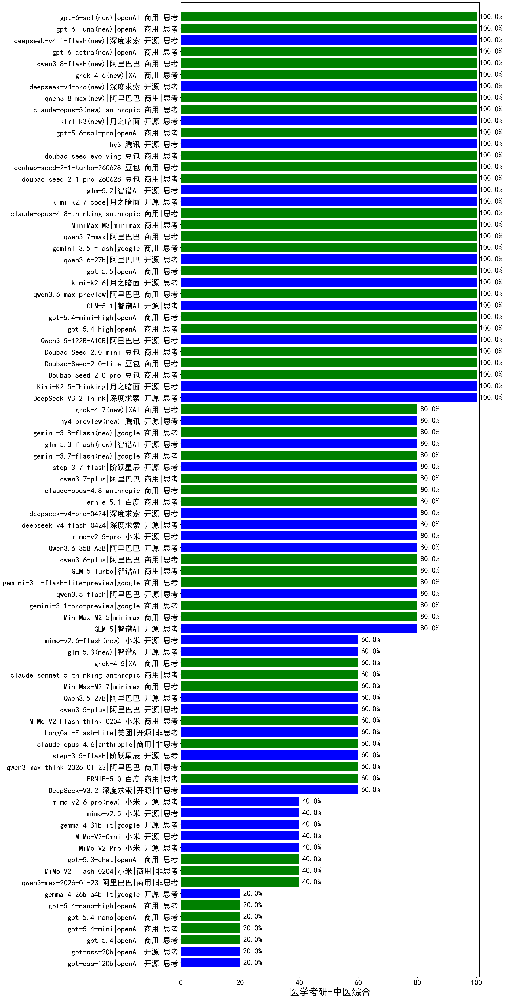

|类别|机构|大模型|【医学考研-中医综合】准确率|平均耗时|平均消耗token|花费/千次（元）|排名（准确率）|
|---|---|-----|-------------------|-------|-----------|-----------|-----------|
|开源|月之暗面|kimi-k2.6|100.0%|89s|1233|31.8|1|
|开源|月之暗面|kimi-k2.7-code|100.0%|20s|986|25.1|2|
|开源|腾讯|hy3|100.0%|67s|321|1.0|3|
|商用|豆包|doubao-seed-evolving|100.0%|249s|8248|244.7|4|
|商用|豆包|doubao-seed-2-1-turbo-260628|100.0%|275s|10132|150.6|5|
|商用|openAI|gpt-5.4-high|100.0%|32s|1649|165.2|6|
|商用|豆包|doubao-seed-2-1-pro-260628|100.0%|485s|10184|302.8|7|
|开源|智谱AI|glm-5.2|100.0%|83s|3697|101.8|8|
|商用|openAI|gpt-5.4-mini-high|100.0%|32s|1431|42.7|9|
|商用|anthropic|claude-opus-4.8-thinking|100.0%|15s|809|126.7|10|
|开源|月之暗面|kimi-k3(new)|100.0%|44s|1063|94.1|11|
|商用|minimax|MiniMax-M3|100.0%|33s|940|12.7|12|
|商用|阿里巴巴|qwen3.7-max|100.0%|31s|1566|54.4|13|
|商用|google|gemini-3.5-flash|100.0%|10s|1664|100.7|14|
|开源|智谱AI|GLM-5.1|100.0%|77s|1915|44.5|15|
|商用|阿里巴巴|qwen3.6-max-preview|100.0%|66s|2042|106.6|16|
|开源|阿里巴巴|qwen3.6-27b|100.0%|37s|2358|41.2|17|
|商用|openAI|gpt-5.5|100.0%|23s|581|106.1|18|
|商用|openAI|gpt-5.6-sol-pro|100.0%|24s|4610|420.0|19|
|开源|阿里巴巴|Qwen3.5-122B-A10B|100.0%|331s|5326|33.6|20|
|商用|anthropic|claude-opus-5(new)|100.0%|16s|731|113.0|21|
|开源|月之暗面|Kimi-K2.5-Thinking|100.0%|385s|1953|39.8|22|
|商用|openAI|gpt-6-sol(new)|100.0%|232s|465|27.5|23|
|商用|豆包|Doubao-Seed-2.0-mini|100.0%|434s|4943|9.7|24|
|商用|豆包|Doubao-Seed-2.0-lite|100.0%|222s|1063|3.5|25|
|商用|豆包|Doubao-Seed-2.0-pro|100.0%|293s|1230|18.2|26|
|开源|深度求索|deepseek-v4-pro(new)|100.0%|130s|1095|26.8|27|
|商用|XAI|grok-4.6(new)|100.0%|53s|2251|86.7|28|
|开源|深度求索|DeepSeek-V3.2-Think|100.0%|130s|1903|5.6|29|
|商用|阿里巴巴|qwen3.8-flash(new)|100.0%|25s|2031|5.2|30|
|商用|openAI|gpt-6-luna(new)|100.0%|297s|905|2.9|31|
|商用|阿里巴巴|qwen3.8-max(new)|100.0%|41s|2013|69.6|32|
|商用|openAI|gpt-6-astra(new)|100.0%|14s|285|74.5|33|
|开源|深度求索|deepseek-v4.1-flash(new)|100.0%|10s|1641|12.5|34|
|商用|百度|ernie-5.1|80.0%|42s|1407|24.3|35|
|开源|腾讯|hy4-preview(new)|80.0%|140s|9025|161.3|36|
|开源|阶跃星辰|step-3.7-flash|80.0%|24s|3526|28.0|37|
|商用|anthropic|claude-opus-4.8|80.0%|10s|549|81.1|38|
|商用|阿里巴巴|qwen3.7-plus|80.0%|27s|1432|11.0|39|
|商用|google|gemini-3.8-flash(new)|80.0%|54s|3255|167.6|40|
|开源|智谱AI|glm-5.3-flash(new)|80.0%|52s|2078|5.6|41|
|商用|google|gemini-3.7-flash(new)|80.0%|7s|933|22.8|42|
|开源|深度求索|deepseek-v4-flash-0424|80.0%|33s|828|1.6|43|
|开源|深度求索|deepseek-v4-pro-0424|80.0%|48s|1220|28.4|44|
|商用|XAI|grok-4.7(new)|80.0%|159s|10220|392.4|45|
|开源|小米|mimo-v2.5-pro|80.0%|65s|2116|39.9|46|
|开源|阿里巴巴|qwen3.5-flash|80.0%|267s|5150|10.2|47|
|商用|google|gemini-3.1-flash-lite-preview|80.0%|3s|435|3.9|48|
|商用|智谱AI|GLM-5-Turbo|80.0%|103s|2593|55.7|49|
|商用|minimax|MiniMax-M2.5|80.0%|34s|1890|15.2|50|
|开源|智谱AI|GLM-5|80.0%|126s|3790|67.1|51|
|商用|google|gemini-3.1-pro-preview|80.0%|57s|3296|275.3|52|
|商用|阿里巴巴|qwen3.6-plus|80.0%|57s|1812|21.1|53|
|开源|阿里巴巴|Qwen3.6-35B-A3B|80.0%|14s|2676|28.2|54|
|商用|阿里巴巴|qwen3-max-think-2026-01-23|60.0%|137s|4196|41.3|55|
|开源|阶跃星辰|step-3.5-flash|60.0%|75s|3416|7.1|56|
|开源|小米|mimo-v2.6-flash(new)|60.0%|84s|1333|2.6|57|
|商用|百度|ERNIE-5.0|60.0%|575s|4080|96.7|58|
|开源|智谱AI|glm-5.3(new)|60.0%|104s|5824|161.4|59|
|开源|美团|LongCat-Flash-Lite|60.0%|185s|865|0.0|60|
|商用|小米|MiMo-V2-Flash-think-0204|60.0%|1386s|3362|6.9|61|
|开源|阿里巴巴|qwen3.5-plus|60.0%|65s|4955|23.5|62|
|开源|深度求索|DeepSeek-V3.2|60.0%|16s|495|1.4|63|
|商用|anthropic|claude-opus-4.6|60.0%|23s|653|99.2|64|
|开源|阿里巴巴|Qwen3.5-27B|60.0%|446s|5035|23.8|65|
|商用|minimax|MiniMax-M2.7|60.0%|61s|2391|19.4|66|
|商用|XAI|grok-4.5|60.0%|85s|3029|119.3|67|
|商用|anthropic|claude-sonnet-5-thinking|60.0%|17s|1154|74.8|68|
|开源|google|gemma-4-31b-it|40.0%|127s|568|1.4|69|
|开源|小米|mimo-v2.6-pro(new)|40.0%|48s|1909|11.2|70|
|商用|阿里巴巴|qwen3-max-2026-01-23|40.0%|203s|625|5.6|71|
|开源|小米|MiMo-V2-Omni|40.0%|8s|1261|14.0|72|
|开源|小米|MiMo-V2-Pro|40.0%|483s|1143|19.5|73|
|开源|小米|mimo-v2.5|40.0%|95s|3219|41.4|74|
|商用|小米|MiMo-V2-Flash-0204|40.0%|394s|593|1.1|75|
|商用|openAI|gpt-5.3-chat|40.0%|11s|503|41.5|76|
|商用|openAI|gpt-5.4-nano-high|20.0%|15s|681|5.3|77|
|商用|openAI|gpt-5.4-nano|20.0%|25s|239|1.4|78|
|商用|openAI|gpt-5.4-mini|20.0%|11s|247|5.4|79|
|商用|openAI|gpt-5.4|20.0%|4s|353|28.7|80|
|开源|google|gemma-4-26b-a4b-it|20.0%|39s|601|1.5|81|
|开源|openAI|gpt-oss-20b|20.0%|265s|1359|1.5|82|
|开源|openAI|gpt-oss-120b|20.0%|7s|939|2.7|83|

