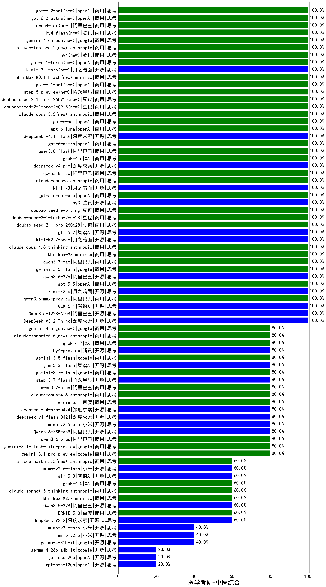

|类别|机构|大模型|【医学考研-中医综合】准确率|平均耗时|平均消耗token|花费/千次（元）|排名（准确率）|
|---|---|-----|-------------------|-------|-----------|-----------|-----------|
|商用|openAI|gpt-6.2-sol(new)|100.0%|5s|235|11.4|1|
|商用|anthropic|claude-opus-5|100.0%|16s|731|113.0|2|
|商用|openAI|gpt-6.1-sol(new)|100.0%|7s|305|16.3|3|
|开源|智谱AI|glm-5.2|100.0%|83s|3697|101.8|4|
|商用|豆包|doubao-seed-2-1-pro-260628|100.0%|485s|10184|302.8|5|
|商用|豆包|doubao-seed-2-1-turbo-260628|100.0%|275s|10132|150.6|6|
|商用|豆包|doubao-seed-evolving|100.0%|249s|8248|244.7|7|
|开源|月之暗面|kimi-k3.1-pro(new)|100.0%|59s|2122|135.9|8|
|开源|腾讯|hy3|100.0%|67s|321|1.0|9|
|商用|minimax|MiniMax-M3.1-Flash(new)|100.0%|41s|2472|9.1|10|
|商用|openAI|gpt-5.6-sol-pro|100.0%|24s|4610|420.0|11|
|开源|月之暗面|kimi-k3|100.0%|44s|1063|94.1|12|
|商用|阿里巴巴|qwen3.8-max|100.0%|41s|2013|69.6|13|
|商用|minimax|MiniMax-M3|100.0%|33s|940|12.7|14|
|开源|深度求索|deepseek-v4-pro|100.0%|130s|1095|26.8|15|
|商用|XAI|grok-4.6|100.0%|53s|2251|86.7|16|
|商用|阿里巴巴|qwen3.8-flash|100.0%|25s|2031|5.2|17|
|商用|openAI|gpt-6-astra|100.0%|14s|285|74.5|18|
|开源|深度求索|deepseek-v4.1-flash|100.0%|10s|1641|12.5|19|
|商用|openAI|gpt-6-luna|100.0%|297s|905|2.9|20|
|商用|openAI|gpt-6-sol|100.0%|232s|465|27.5|21|
|商用|anthropic|claude-opus-5.5(new)|100.0%|16s|837|105.0|22|
|商用|豆包|doubao-seed-2-1-pro-260915(new)|100.0%|41s|1003|27.4|23|
|商用|豆包|doubao-seed-2-1-lite-260915(new)|100.0%|39s|1203|3.1|24|
|商用|anthropic|claude-opus-4.8-thinking|100.0%|15s|809|126.7|25|
|开源|月之暗面|kimi-k2.7-code|100.0%|20s|986|25.1|26|
|商用|阶跃星辰|step-5-preview(new)|100.0%|38s|3214|63.2|27|
|商用|腾讯|hy4-flash(new)|100.0%|64s|3747|7.4|28|
|商用|google|gemini-4-carbon(new)|100.0%|41s|1678|222.8|29|
|商用|阿里巴巴|qwen3.7-max|100.0%|31s|1566|54.4|30|
|商用|anthropic|claude-fable-5.2(new)|100.0%|16s|786|195.9|31|
|商用|腾讯|hy4(new)|100.0%|83s|4509|80.1|32|
|开源|智谱AI|GLM-5.1|100.0%|77s|1915|44.5|33|
|商用|阿里巴巴|qwen3.6-max-preview|100.0%|66s|2042|106.6|34|
|开源|月之暗面|kimi-k2.6|100.0%|89s|1233|31.8|35|
|商用|openAI|gpt-6.1-terra(new)|100.0%|7s|551|16.8|36|
|商用|openAI|gpt-5.5|100.0%|23s|581|106.1|37|
|开源|阿里巴巴|qwen3.6-27b|100.0%|37s|2358|41.2|38|
|商用|阿里巴巴|qwen4-max(new)|100.0%|20s|865|24.1|39|
|商用|google|gemini-3.5-flash|100.0%|10s|1664|100.7|40|
|开源|深度求索|DeepSeek-V3.2-Think|100.0%|130s|1903|5.6|41|
|商用|openAI|gpt-6.2-astra(new)|100.0%|7s|249|49.5|42|
|开源|阿里巴巴|Qwen3.5-122B-A10B|100.0%|331s|5326|33.6|43|
|商用|google|gemini-3.1-pro-preview|80.0%|57s|3296|275.3|44|
|商用|google|gemini-3.1-flash-lite-preview|80.0%|3s|435|3.9|45|
|商用|XAI|grok-4.7|80.0%|159s|10220|392.4|46|
|商用|anthropic|claude-sonnet-5.5(new)|80.0%|10s|575|34.2|47|
|商用|google|gemini-4-argon(new)|80.0%|25s|665|81.1|48|
|开源|腾讯|hy4-preview|80.0%|140s|9025|161.3|49|
|商用|anthropic|claude-opus-4.8|80.0%|10s|549|81.1|50|
|商用|google|gemini-3.8-flash|80.0%|54s|3255|167.6|51|
|开源|智谱AI|glm-5.3-flash|80.0%|52s|2078|5.6|52|
|商用|google|gemini-3.7-flash|80.0%|7s|933|22.8|53|
|开源|阿里巴巴|Qwen3.6-35B-A3B|80.0%|14s|2676|28.2|54|
|开源|小米|mimo-v2.5-pro|80.0%|65s|2116|39.9|55|
|开源|深度求索|deepseek-v4-flash-0424|80.0%|33s|828|1.6|56|
|开源|深度求索|deepseek-v4-pro-0424|80.0%|48s|1220|28.4|57|
|商用|百度|ernie-5.1|80.0%|42s|1407|24.3|58|
|开源|阶跃星辰|step-3.7-flash|80.0%|24s|3526|28.0|59|
|商用|阿里巴巴|qwen3.7-plus|80.0%|27s|1432|11.0|60|
|商用|阿里巴巴|qwen3.6-plus|80.0%|57s|1812|21.1|61|
|商用|anthropic|claude-haiku-5.5(new)|60.0%|13s|1134|3.7|62|
|商用|XAI|grok-4.5|60.0%|85s|3029|119.3|63|
|开源|小米|mimo-v2.6-flash|60.0%|84s|1333|2.6|64|
|开源|智谱AI|glm-5.3|60.0%|104s|5824|161.4|65|
|商用|anthropic|claude-sonnet-5-thinking|60.0%|17s|1154|74.8|66|
|商用|minimax|MiniMax-M2.7|60.0%|61s|2391|19.4|67|
|开源|阿里巴巴|Qwen3.5-27B|60.0%|446s|5035|23.8|68|
|商用|百度|ERNIE-5.0|60.0%|575s|4080|96.7|69|
|开源|深度求索|DeepSeek-V3.2|60.0%|16s|495|1.4|70|
|开源|小米|mimo-v2.6-pro|40.0%|48s|1909|11.2|71|
|开源|小米|mimo-v2.5|40.0%|95s|3219|41.4|72|
|开源|google|gemma-4-31b-it|40.0%|127s|568|1.4|73|
|开源|openAI|gpt-oss-20b|20.0%|265s|1359|1.5|74|
|开源|google|gemma-4-26b-a4b-it|20.0%|39s|601|1.5|75|
|开源|openAI|gpt-oss-120b|20.0%|7s|939|2.7|76|

