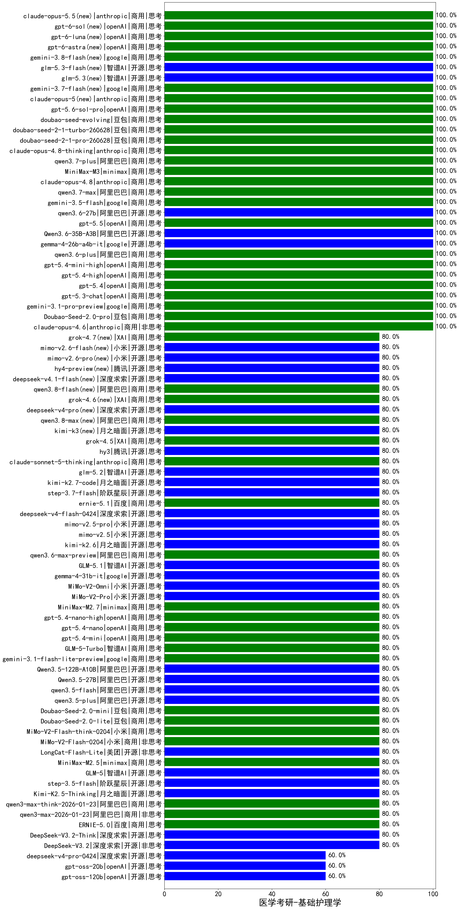

|类别|机构|大模型|【医学考研-基础护理学】准确率|平均耗时|平均消耗token|花费/千次（元）|排名（准确率）|
|---|---|-----|-------------------|-------|-----------|-----------|-----------|
|商用|豆包|doubao-seed-2-1-lite-260915(new)|100.0%|27s|750|1.8|1|
|商用|豆包|doubao-seed-2-1-pro-260628|100.0%|215s|7216|213.8|2|
|商用|openAI|gpt-5.4|100.0%|5s|286|21.8|3|
|商用|openAI|gpt-5.4-high|100.0%|10s|593|54.0|4|
|商用|openAI|gpt-5.6-sol-pro|100.0%|11s|2992|214.5|5|
|商用|openAI|gpt-5.4-mini-high|100.0%|138s|776|22.0|6|
|商用|豆包|doubao-seed-evolving|100.0%|298s|5199|153.3|7|
|商用|豆包|doubao-seed-2-1-turbo-260628|100.0%|62s|3689|54.0|8|
|商用|阿里巴巴|qwen3.6-plus|100.0%|28s|1510|17.3|9|
|开源|google|gemma-4-26b-a4b-it|100.0%|87s|529|1.3|10|
|商用|anthropic|claude-opus-5(new)|100.0%|13s|632|94.6|11|
|开源|阿里巴巴|Qwen3.6-35B-A3B|100.0%|111s|1740|18.1|12|
|商用|anthropic|claude-opus-4.8-thinking|100.0%|11s|724|110.7|13|
|商用|阿里巴巴|qwen3.7-plus|100.0%|20s|1018|7.7|14|
|商用|minimax|MiniMax-M3|100.0%|28s|589|6.9|15|
|商用|anthropic|claude-opus-4.8|100.0%|9s|560|81.9|16|
|商用|openAI|gpt-5.5|100.0%|7s|377|62.7|17|
|开源|阿里巴巴|qwen3.6-27b|100.0%|26s|1630|28.2|18|
|商用|google|gemini-3.5-flash|100.0%|8s|1211|72.3|19|
|商用|openAI|gpt-5.3-chat|100.0%|6s|394|30.5|20|
|商用|openAI|gpt-6-astra(new)|100.0%|14s|264|66.2|21|
|开源|智谱AI|glm-5.3-flash(new)|100.0%|28s|894|2.3|22|
|商用|豆包|doubao-seed-2-1-pro-260915(new)|100.0%|35s|1030|28.2|23|
|商用|anthropic|claude-opus-5.5(new)|100.0%|44s|643|76.9|24|
|商用|openAI|gpt-6-sol(new)|100.0%|903s|201|8.8|25|
|商用|openAI|gpt-6-luna(new)|100.0%|249s|275|0.7|26|
|商用|anthropic|claude-opus-4.6|100.0%|17s|665|100.0|27|
|商用|google|gemini-3.8-flash(new)|100.0%|17s|725|34.8|28|
|商用|阿里巴巴|qwen3.7-max|100.0%|15s|802|27.0|29|
|商用|豆包|Doubao-Seed-2.0-pro|100.0%|161s|755|10.6|30|
|商用|google|gemini-3.1-pro-preview|100.0%|44s|1280|103.6|31|
|商用|google|gemini-3.7-flash(new)|100.0%|6s|635|15.1|32|
|开源|智谱AI|glm-5.3(new)|100.0%|52s|1257|33.5|33|
|商用|XAI|grok-4.5|80.0%|49s|1438|52.6|34|
|商用|阿里巴巴|qwen3.8-max(new)|80.0%|10s|431|12.7|35|
|商用|XAI|grok-4.7(new)|80.0%|39s|3765|121.4|36|
|开源|阶跃星辰|step-3.7-flash|80.0%|16s|966|7.3|37|
|开源|小米|mimo-v2.6-flash(new)|80.0%|135s|694|1.3|38|
|开源|月之暗面|kimi-k2.7-code|80.0%|8s|345|7.9|39|
|开源|小米|mimo-v2.6-pro(new)|80.0%|75s|803|4.6|40|
|开源|智谱AI|glm-5.2|80.0%|30s|1263|33.7|41|
|商用|阿里巴巴|qwen3.8-flash(new)|80.0%|21s|656|1.5|42|
|开源|腾讯|hy4-preview(new)|80.0%|38s|2414|42.4|43|
|开源|深度求索|deepseek-v4.1-flash(new)|80.0%|5s|396|2.6|44|
|开源|深度求索|deepseek-v4-pro(new)|80.0%|20s|598|13.4|45|
|开源|月之暗面|kimi-k3(new)|80.0%|24s|459|33.9|46|
|商用|anthropic|claude-sonnet-5-thinking|80.0%|12s|671|40.6|47|
|开源|腾讯|hy3|80.0%|52s|239|0.7|48|
|商用|XAI|grok-4.6(new)|80.0%|40s|1825|68.9|49|
|开源|小米|mimo-v2.5-pro|80.0%|43s|1131|19.2|50|
|商用|百度|ernie-5.1|80.0%|28s|727|12.1|51|
|开源|智谱AI|GLM-5|80.0%|70s|2379|41.8|52|
|商用|豆包|Doubao-Seed-2.0-mini|80.0%|296s|1314|2.4|53|
|商用|豆包|Doubao-Seed-2.0-lite|80.0%|183s|862|2.8|54|
|商用|小米|MiMo-V2-Flash-think-0204|80.0%|470s|1794|3.6|55|
|商用|小米|MiMo-V2-Flash-0204|80.0%|97s|450|0.8|56|
|开源|美团|LongCat-Flash-Lite|80.0%|269s|359|0.0|57|
|商用|minimax|MiniMax-M2.5|80.0%|25s|918|7.1|58|
|开源|阶跃星辰|step-3.5-flash|80.0%|14s|1170|2.3|59|
|开源|阿里巴巴|qwen3.5-flash|80.0%|277s|3998|7.9|60|
|开源|月之暗面|Kimi-K2.5-Thinking|80.0%|257s|1227|24.6|61|
|商用|阿里巴巴|qwen3-max-think-2026-01-23|80.0%|137s|2567|25.0|62|
|商用|阿里巴巴|qwen3-max-2026-01-23|80.0%|52s|408|3.5|63|
|商用|百度|ERNIE-5.0|80.0%|156s|1498|34.8|64|
|开源|深度求索|DeepSeek-V3.2-Think|80.0%|25s|786|2.3|65|
|开源|深度求索|DeepSeek-V3.2|80.0%|95s|277|0.8|66|
|开源|阿里巴巴|qwen3.5-plus|80.0%|33s|2457|11.5|67|
|开源|阿里巴巴|Qwen3.5-27B|80.0%|286s|1960|9.1|68|
|开源|小米|MiMo-V2-Omni|80.0%|729s|1254|13.9|69|
|开源|深度求索|deepseek-v4-flash-0424|80.0%|30s|519|1.0|70|
|商用|google|gemini-3.1-flash-lite-preview|80.0%|2s|372|3.2|71|
|商用|智谱AI|GLM-5-Turbo|80.0%|23s|1369|28.8|72|
|商用|openAI|gpt-5.4-mini|80.0%|17s|268|6.0|73|
|商用|openAI|gpt-5.4-nano|80.0%|11s|259|1.6|74|
|商用|openAI|gpt-5.4-nano-high|80.0%|17s|360|2.5|75|
|商用|minimax|MiniMax-M2.7|80.0%|36s|1298|10.2|76|
|开源|小米|MiMo-V2-Pro|80.0%|15s|1023|17.0|77|
|开源|阿里巴巴|Qwen3.5-122B-A10B|80.0%|88s|1898|11.7|78|
|开源|google|gemma-4-31b-it|80.0%|118s|521|1.3|79|
|开源|智谱AI|GLM-5.1|80.0%|137s|1302|29.9|80|
|商用|阿里巴巴|qwen3.6-max-preview|80.0%|42s|1575|81.5|81|
|开源|月之暗面|kimi-k2.6|80.0%|94s|1318|34.1|82|
|开源|小米|mimo-v2.5|80.0%|15s|1189|13.1|83|
|开源|深度求索|deepseek-v4-pro-0424|60.0%|36s|627|14.2|84|
|开源|openAI|gpt-oss-20b|60.0%|3s|725|0.7|85|
|开源|openAI|gpt-oss-120b|60.0%|9s|578|1.5|86|

