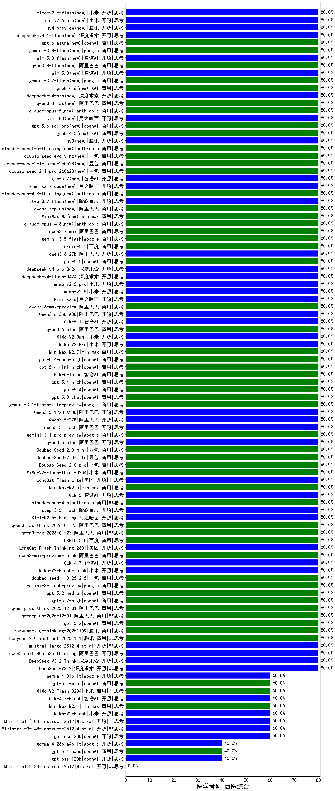

|类别|机构|大模型|【医学考研-西医综合】准确率|平均耗时|平均消耗token|花费/千次（元）|排名（准确率）|
|---|---|-----|-------------------|-------|-----------|-----------|-----------|
|商用|openAI|gpt-5.4-mini-high|80.0%|12s|462|12.3|1|
|商用|智谱AI|GLM-5-Turbo|80.0%|18s|969|20.2|2|
|开源|阶跃星辰|step-3.7-flash(new)|80.0%|92s|1502|11.7|3|
|商用|阿里巴巴|qwen3.7-plus(new)|80.0%|13s|591|4.3|4|
|商用|minimax|MiniMax-M3(new)|80.0%|22s|501|5.5|5|
|商用|anthropic|claude-opus-4.8(new)|80.0%|10s|481|70.0|6|
|商用|阿里巴巴|qwen3.7-max|80.0%|13s|602|20.0|7|
|商用|google|gemini-3.5-flash|80.0%|6s|777|45.3|8|
|商用|百度|ernie-5.1|80.0%|42s|698|11.7|9|
|开源|阿里巴巴|qwen3.6-27b|80.0%|21s|1237|21.2|10|
|商用|openAI|gpt-5.5|80.0%|5s|239|35.5|11|
|开源|深度求索|deepseek-v4-pro-0424|80.0%|14s|383|8.4|12|
|开源|深度求索|deepseek-v4-flash-0424|80.0%|13s|352|0.6|13|
|开源|小米|mimo-v2.5-pro|80.0%|16s|887|14.2|14|
|开源|小米|mimo-v2.5|80.0%|12s|791|7.6|15|
|开源|月之暗面|kimi-k2.6|80.0%|48s|617|15.4|16|
|商用|阿里巴巴|qwen3.6-max-preview|80.0%|44s|1278|65.9|17|
|开源|阿里巴巴|Qwen3.6-35B-A3B|80.0%|103s|1303|13.5|18|
|开源|智谱AI|GLM-5.1|80.0%|138s|1084|24.9|19|
|商用|阿里巴巴|qwen3.6-plus|80.0%|38s|1163|13.3|20|
|开源|小米|MiMo-V2-Omni|80.0%|152s|958|9.9|21|
|开源|小米|MiMo-V2-Pro|80.0%|43s|875|14.0|22|
|商用|minimax|MiniMax-M2.7|80.0%|20s|821|6.3|23|
|商用|anthropic|claude-opus-4.8-thinking(new)|80.0%|8s|499|73.1|24|
|开源|月之暗面|kimi-k2.7-code(new)|80.0%|7s|330|7.6|25|
|开源|智谱AI|glm-5.2(new)|80.0%|30s|900|23.8|26|
|商用|XAI|grok-4.6(new)|80.0%|16s|759|24.4|27|
|开源|小米|mimo-v2.6-pro(new)|80.0%|18s|558|3.1|28|
|开源|腾讯|hy4-preview(new)|80.0%|31s|2085|36.6|29|
|开源|深度求索|deepseek-v4.1-flash(new)|80.0%|7s|267|1.6|30|
|商用|openAI|gpt-6-astra(new)|80.0%|8s|160|32.4|31|
|商用|google|gemini-3.8-flash(new)|80.0%|17s|475|22.0|32|
|开源|智谱AI|glm-5.3-flash(new)|80.0%|384s|846|2.2|33|
|商用|阿里巴巴|qwen3.8-flash(new)|80.0%|17s|480|1.1|34|
|开源|智谱AI|glm-5.3(new)|80.0%|28s|722|18.8|35|
|商用|google|gemini-3.7-flash(new)|80.0%|4s|589|14.0|36|
|开源|深度求索|deepseek-v4-pro(new)|80.0%|16s|581|13.1|37|
|商用|豆包|doubao-seed-2-1-pro-260628(new)|80.0%|153s|6765|200.5|38|
|商用|阿里巴巴|qwen3.8-max(new)|80.0%|9s|400|11.8|39|
|商用|anthropic|claude-opus-5(new)|80.0%|11s|581|87.6|40|
|开源|月之暗面|kimi-k3(new)|80.0%|22s|336|22.4|41|
|商用|openAI|gpt-5.6-sol-pro(new)|80.0%|7s|2447|147.3|42|
|商用|XAI|grok-4.5(new)|80.0%|66s|814|26.7|43|
|开源|腾讯|hy3(new)|80.0%|195s|203|0.6|44|
|商用|anthropic|claude-sonnet-5-thinking(new)|80.0%|13s|605|36.7|45|
|商用|豆包|doubao-seed-evolving(new)|80.0%|141s|4502|132.6|46|
|商用|豆包|doubao-seed-2-1-turbo-260628(new)|80.0%|47s|1839|26.3|47|
|商用|openAI|gpt-5.4-nano-high|80.0%|5s|357|2.5|48|
|开源|小米|mimo-v2.6-flash(new)|80.0%|23s|547|1.0|49|
|商用|阿里巴巴|qwen3-max-2026-01-23|80.0%|66s|310|2.6|50|
|商用|腾讯|hunyuan-2.0-instruct-20251111|80.0%|2s|314|0.5|51|
|商用|anthropic|claude-opus-4.6|80.0%|16s|514|75.5|52|
|开源|阶跃星辰|step-3.5-flash|80.0%|9s|677|1.3|53|
|开源|月之暗面|Kimi-K2.5-Thinking|80.0%|190s|841|16.6|54|
|商用|阿里巴巴|qwen3-max-think-2026-01-23|80.0%|288s|1930|18.7|55|
|商用|百度|ERNIE-5.0|80.0%|126s|1033|23.8|56|
|开源|美团|LongCat-Flash-Thinking-2601|80.0%|67s|1099|0.0|57|
|商用|阿里巴巴|qwen3-max-preview-think|80.0%|73s|1572|36.4|58|
|开源|智谱AI|GLM-4.7|80.0%|30s|1235|16.6|59|
|商用|openAI|gpt-5.2|80.0%|10s|160|8.6|60|
|开源|小米|MiMo-V2-Flash-think|80.0%|17s|1515|0.0|61|
|商用|腾讯|hunyuan-2.0-thinking-20251109|80.0%|8s|548|2.0|62|
|商用|豆包|doubao-seed-1-8-251215|80.0%|22s|470|3.0|63|
|商用|google|gemini-3-flash-preview|80.0%|97s|739|14.5|64|
|商用|openAI|gpt-5.2-medium|80.0%|4s|241|16.7|65|
|商用|openAI|gpt-5.2-high|80.0%|4s|262|18.8|66|
|商用|阿里巴巴|qwen-plus-think-2025-12-01|80.0%|29s|1375|10.5|67|
|开源|智谱AI|GLM-5|80.0%|32s|1177|20.3|68|
|商用|minimax|MiniMax-M2.5|80.0%|15s|783|6.0|69|
|开源|美团|LongCat-Flash-Lite|80.0%|343s|464|0.0|70|
|开源|阿里巴巴|Qwen3.5-27B|80.0%|97s|1413|6.5|71|
|开源|深度求索|DeepSeek-V3.2|80.0%|114s|196|0.5|72|
|商用|openAI|gpt-5.4-high|80.0%|6s|330|27.3|73|
|商用|openAI|gpt-5.4|80.0%|3s|226|16.4|74|
|商用|openAI|gpt-5.3-chat|80.0%|34s|303|22.5|75|
|商用|google|gemini-3.1-flash-lite-preview|80.0%|2s|276|2.3|76|
|开源|阿里巴巴|Qwen3.5-122B-A10B|80.0%|245s|1603|9.9|77|
|开源|深度求索|DeepSeek-V3.2-Think|80.0%|16s|493|1.4|78|
|开源|阿里巴巴|qwen3-next-80b-a3b-thinking|80.0%|46s|1661|6.4|79|
|开源|阿里巴巴|qwen3.5-flash|80.0%|250s|1675|3.2|80|
|开源|Mistral|mistral-large-2512|80.0%|9s|406|3.6|81|
|商用|google|gemini-3.1-pro-preview|80.0%|29s|1005|80.7|82|
|开源|阿里巴巴|qwen3.5-plus|80.0%|16s|1208|5.5|83|
|商用|豆包|Doubao-Seed-2.0-mini|80.0%|274s|941|1.7|84|
|商用|豆包|Doubao-Seed-2.0-lite|80.0%|73s|490|1.4|85|
|商用|豆包|Doubao-Seed-2.0-pro|80.0%|150s|712|10.0|86|
|商用|小米|MiMo-V2-Flash-think-0204|80.0%|537s|1161|2.3|87|
|商用|阿里巴巴|qwen-plus-2025-12-01|80.0%|15s|543|1.0|88|
|开源|Mistral|Ministral-3-8B-Instruct-2512|60.0%|9s|401|0.4|89|
|开源|Mistral|Ministral-3-14B-Instruct-2512|60.0%|13s|644|0.9|90|
|商用|openAI|gpt-5.4-mini|60.0%|3s|185|3.6|91|
|开源|小米|MiMo-V2-Flash|60.0%|8s|352|0.0|92|
|商用|minimax|MiniMax-M2.1|60.0%|88s|919|7.1|93|
|开源|智谱AI|GLM-4.7-Flash|60.0%|302s|2135|0.0|94|
|开源|openAI|gpt-oss-20b|60.0%|218s|729|0.7|95|
|商用|小米|MiMo-V2-Flash-0204|60.0%|53s|396|0.7|96|
|开源|google|gemma-4-31b-it|60.0%|38s|501|1.3|97|
|开源|google|gemma-4-26b-a4b-it|40.0%|79s|699|1.8|98|
|商用|openAI|gpt-5.4-nano|40.0%|29s|216|1.3|99|
|开源|openAI|gpt-oss-120b|40.0%|7s|507|1.3|100|
|开源|Mistral|Ministral-3-3B-Instruct-2512|0.0%|10s|490|0.3|101|

