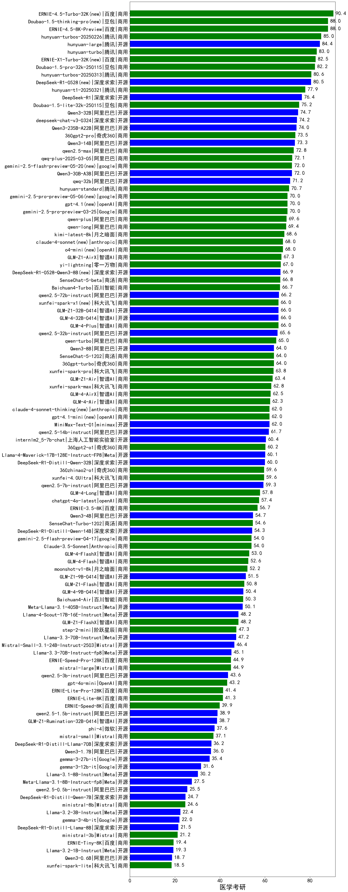

|类别|机构|大模型|【医学考研】准确率|平均耗时|平均消耗token|花费/千次（元）|排名（准确率）|
|---|---|-----|-------------------|-------|-----------|-----------|-----------|
|开源|阿里巴巴|qwen3-235b-a22b-instruct-2507(new)|92.0%|10s|451|3.2|1|
|开源|阿里巴巴|Qwen3-32B-nothink|92.0%|18s|493|1.7|2|
|商用|百度|ERNIE-4.5-Turbo-32K|91.0%|22s|540|1.6|3|
|商用|腾讯|hunyuan-turbos-20250716(new)|88.0%|10s|510|0.9|4|
|商用|腾讯|hunyuan-t1-20250711(new)|88.0%|17s|1012|3.7|5|
|商用|豆包|doubao-seed-1-6-thinking-250715(new)|88.0%|24s|1056|7.9|6|
|开源|阿里巴巴|Qwen3-30B-A3B-Instruct-2507(new)|88.0%|4s|479|1.3|7|
|商用|阿里巴巴|qwen-plus-2025-07-14(new)|88.0%|13s|456|0.8|8|
|商用|豆包|doubao-seed-1-6-flash-250615|87.0%|3s|324|0.4|9|
|商用|豆包|doubao-seed-1-6-250615|86.0%|110s|470|3.0|10|
|商用|豆包|doubao-seed-1-6-flash-thinking-250615|85.0%|6s|550|0.7|11|
|开源|腾讯|hunyuan-large|84.4%|11s|1190|7.5|12|
|商用|科大讯飞|xunfei-spark-x1-0725(new)|84.0%|/|829|10.0|13|
|开源|阿里巴巴|Qwen3-235B-A22B-nothink|84.0%|23s|441|3.8|14|
|商用|腾讯|hunyuan-turbos-20250604|84.0%|65s|418|0.7|15|
|开源|深度求索|deepseek-chat-v3-0324|83.3%|130s|299|2.0|16|
|商用|阿里巴巴|qwen-plus-think-2025-04-28|82.5%|181s|1940|15.0|17|
|商用|豆包|Doubao-1.5-pro-32k-250115|82.2%|10s|422|0.8|18|
|开源|月之暗面|kimi-k2-0711-preview(new)|82.0%|27s|475|6.8|19|
|商用|百度|ERNIE-X1-Turbo-32K|80.5%|89s|1919|7.5|20|
|开源|阶跃星辰|step-3(new)|80.0%|93s|1842|7.2|21|
|开源|阿里巴巴|qwen3-235b-a22b-thinking-2507(new)|80.0%|63s|2323|45.1|22|
|商用|openAI|gpt-5-2025-08-07(new)|80.0%|22s|299|16.7|23|
|商用|阿里巴巴|qwen-flash-2025-07-28(new)|80.0%|6s|483|0.6|24|
|开源|阿里巴巴|Qwen3-14B|79.5%|112s|2888|5.7|25|
|开源|百度|ERNIE-4.5-300B-A47B|79.5%|19s|330|2.2|26|
|开源|深度求索|DeepSeek-R1-0528|79.5%|207s|1754|27.2|27|
|开源|阿里巴巴|Qwen3-235B-A22B|79.5%|131s|2098|20.4|28|
|商用|智谱AI|GLM-4-Plus|78.2%|8s|286|1.4|29|
|开源|阿里巴巴|Qwen3-32B|77.5%|121s|2164|8.4|30|
|开源|百度|ERNIE-4.5-21B-A3B|77.5%|37s|326|0.0|31|
|开源|阿里巴巴|Qwen3-30B-A3B|76.5%|196s|2714|7.4|32|
|开源|阿里巴巴|Qwen3-14B-nothink|76.0%|22s|520|0.9|33|
|商用|智谱AI|GLM-4.5-Flash(new)|76.0%|26s|1491|0.0|34|
|开源|阿里巴巴|Qwen3-30B-A3B-nothink|76.0%|20s|413|1.0|35|
|商用|XAI|grok-4-0709|76.0%|381s|1369|142.3|36|
|商用|智谱AI|GLM-4.5-Flash-nothink|76.0%|19s|942|0.0|37|
|开源|腾讯|Hunyuan-A13B-Instruct-nothink(new)|76.0%|73s|378|1.3|38|
|商用|google|gemini-2.5-pro|75.6%|37s|2413|170.4|39|
|开源|minimax|MiniMax-M1|75.5%|124s|2089|15.4|40|
|开源|腾讯|Hunyuan-A13B-Instruct|75.5%|60s|996|3.8|41|
|商用|豆包|Doubao-1.5-lite-32k-250115|75.2%|4s|214|0.1|42|
|开源|智谱AI|GLM-4-32B-0414|75.0%|23s|425|0.8|43|
|商用|奇虎360|360gpt2-pro|73.5%|8s|273|1.1|44|
|商用|google|gemini-2.5-flash|73.0%|10s|1718|30.0|45|
|商用|阿里巴巴|qwen2.5-max|72.8%|27s|477|4.1|46|
|商用|智谱AI|GLM-Z1-AirX|72.5%|23s|1769|8.9|47|
|商用|阿里巴巴|qwq-plus-2025-03-05|72.1%|59s|2453|9.6|48|
|开源|智谱AI|GLM-4.5-Air(new)|72.0%|29s|1497|8.3|49|
|开源|智谱AI|GLM-4.5-Air-nothink|72.0%|19s|937|5.1|50|
|商用|openAI|gpt-5-nano-2025-08-07(new)|72.0%|52s|1783|5.0|51|
|开源|华为|pangu-pro-moe|72.0%|88s|1689|6.5|52|
|开源|智谱AI|GLM-4.5-nothink|72.0%|28s|724|9.3|53|
|开源|智谱AI|GLM-4.5(new)|72.0%|48s|1545|20.9|54|
|开源|meta|Llama-4-Maverick-17B-128E-Instruct-FP8|71.7%|20s|562|2.2|55|
|开源|阿里巴巴|qwq-32b|71.2%|47s|2620|15.4|56|
|商用|腾讯|hunyuan-standard|70.7%|/|/|/|57|
|商用|阿里巴巴|qwen-turbo-think-2025-04-28|70.5%|112s|2315|6.7|58|
|商用|智谱AI|GLM-Z1-Air|70.5%|47s|1523|0.8|59|
|商用|阶跃星辰|step-r1-v-mini|70.0%|78s|1742|13.5|60|
|商用|openAI|gpt-4.1|70.0%|11s|308|14.1|61|
|开源|阿里巴巴|Qwen3-8B|69.5%|165s|4506|0.0|62|
|商用|阿里巴巴|qwen-long-2025-01-25|69.4%|19s|355|0.6|63|
|开源|深度求索|DeepSeek-R1-0528-Qwen3-8B|68.9%|229s|1730|0.0|64|
|商用|月之暗面|kimi-latest-8k|68.6%|46s|491|5.9|65|
|商用|阿里巴巴|qwen-flash-think-2025-07-28(new)|68.0%|24s|2398|3.5|66|
|开源|阿里巴巴|Qwen3-30B-A3B-Thinking-2507(new)|68.0%|63s|2556|7.0|67|
|商用|阿里巴巴|qwen-turbo-2025-07-15(new)|68.0%|8s|372|0.2|68|
|商用|XAI|grok-3-mini|68.0%|239s|1055|3.7|69|
|商用|anthropic|claude-4-sonnet|68.0%|43s|552|49.9|70|
|商用|openAI|o4-mini|68.0%|29s|892|26.4|71|
|商用|智谱AI|GLM-4-AirX|67.8%|6s|285|2.9|72|
|商用|零一万物|yi-lightning|67.0%|/|/|/|73|
|商用|百川智能|Baichuan4-Turbo|66.7%|/|/|/|74|
|开源|阿里巴巴|qwen2.5-72b-instruct|66.2%|34s|297|3.0|75|
|开源|智谱AI|GLM-Z1-32B-0414|66.1%|145s|2180|8.5|76|
|商用|anthropic|claude-4-sonnet-thinking|66.0%|50s|1174|117.5|77|
|开源|meta|Llama-4-Scout-17B-16E-Instruct|66.0%|14s|552|1.1|78|
|开源|阿里巴巴|qwen2.5-32b-instruct|65.6%|6s|265|1.3|79|
|商用|智谱AI|GLM-4-Long|65.1%|10s|359|0.4|80|
|商用|奇虎360|360gpt-turbo|64.0%|/|/|/|81|
|商用|商汤|SenseChat-5-1202|64.0%|/|/|/|82|
|商用|科大讯飞|xunfei-spark-pro|63.8%|/|/|/|83|
|商用|科大讯飞|xunfei-spark-max|62.8%|3s|140|4.2|84|
|商用|openAI|gpt-4.1-mini|62.0%|8s|354|3.4|85|
|开源|minimax|MiniMax-Text-01|62.0%|15s|905|6.6|86|
|商用|google|gemini-2.5-flash-lite-preview-06-17|61.9%|2s|734|2.0|87|
|开源|阿里巴巴|qwen2.5-14b-instruct|61.7%|6s|233|0.5|88|
|开源|阿里巴巴|Qwen3-4B|61.5%|72s|2009|5.8|89|
|开源|智谱AI|GLM-4-9B-0414|61.0%|11s|504|0.0|90|
|开源|上海人工智能实验室|internlm2_5-7b-chat|60.4%|/|/|/|91|
|商用|奇虎360|360gpt2-o1|60.2%|17s|385|16.6|92|
|开源|深度求索|DeepSeek-R1-Distill-Qwen-32B|60.0%|54s|762|1.0|93|
|商用|智谱AI|GLM-Z1-Flash|59.8%|25s|2260|0.0|94|
|商用|奇虎360|360zhinao2-o1|59.6%|/|/|/|95|
|商用|科大讯飞|xunfei-4.0Ultra|59.6%|3s|156|10.9|96|
|开源|阿里巴巴|qwen2.5-7b-instruct|59.3%|6s|224|0.2|97|
|开源|Mistral|Mistral-Small-3.1-24B-Instruct-2503|58.7%|/|/|/|98|
|开源|智谱AI|GLM-Z1-9B-0414|57.6%|159s|4394|0.0|99|
|商用|openAI|chatgpt-4o-latest|57.4%|/|/|/|100|
|商用|百度|ERNIE-3.5-8K|56.7%|20s|340|0.6|101|
|开源|阿里巴巴|Qwen3-4B-nothink|56.0%|16s|421|1.1|102|
|开源|openAI|gpt-oss-20b(new)|56.0%|100s|871|0.9|103|
|商用|智谱AI|GLM-Z1-FlashX|55.9%|25s|1645|0.2|104|
|开源|深度求索|DeepSeek-R1-Distill-Qwen-14B|54.3%|/|/|/|105|
|商用|智谱AI|GLM-4-FlashX|53.0%|9s|299|0.0|106|
|开源|openAI|gpt-oss-120b(new)|52.0%|6s|638|1.7|107|
|开源|阿里巴巴|Qwen3-8B-nothink|52.0%|49s|475|0.0|108|
|商用|百川智能|Baichuan4-Air|50.3%|/|/|/|109|
|商用|openAI|gpt-5-mini-2025-08-07(new)|48.0%|27s|926|12.3|110|
|开源|阿里巴巴|Qwen3-1.7B|47.4%|66s|2561|7.5|111|
|商用|阶跃星辰|step-2-mini|47.3%|22s|329|0.6|112|
|商用|Mistral|mistral-large|44.9%|/|/|/|113|
|开源|阿里巴巴|qwen2.5-3b-instruct|43.6%|8s|259|0.2|114|
|商用|OpenAI|gpt-4o-mini|43.2%|/|/|/|115|
|商用|百度|ERNIE-Lite-8K|41.3%|/|/|/|116|
|商用|百度|ERNIE-Speed-8K|39.9%|/|/|/|117|
|开源|智谱AI|GLM-Z1-Rumination-32B-0414|39.7%|/|/|/|118|
|开源|阿里巴巴|qwen2.5-1.5b-instruct|38.9%|3s|167|0.0|119|
|开源|微软|phi-4|37.6%|/|/|/|120|
|商用|Mistral|mistral-small|37.1%|/|/|/|121|
|开源|Google|gemma-3-27b-it|35.4%|/|/|/|122|
|开源|阿里巴巴|Qwen3-1.7B-nothink|32.0%|9s|435|1.1|123|
|开源|Google|gemma-3-12b-it|31.6%|/|/|/|124|
|开源|百度|ERNIE-4.5-0.3B|26.1%|42s|396|0.0|125|
|开源|阿里巴巴|Qwen3-0.6B|25.8%|45s|1323|3.8|126|
|开源|阿里巴巴|qwen2.5-0.5b-instruct|25.5%|5s|256|0.0|127|
|商用|Mistral|ministral-8b|24.6%|/|/|/|128|
|开源|Google|gemma-3-4b-it|22.0%|/|/|/|129|
|商用|Mistral|ministral-3b|21.2%|/|/|/|130|
|商用|百度|ERNIE-Tiny-8K|19.4%|/|/|/|131|
|商用|科大讯飞|xunfei-spark-lite|18.5%|/|/|/|132|
|开源|阿里巴巴|Qwen3-0.6B-nothink|16.0%|6s|238|0.5|133|

