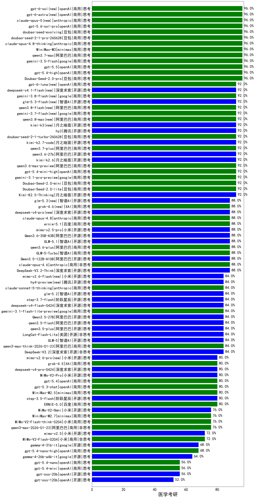

|类别|机构|大模型|【医学考研】准确率|平均耗时|平均消耗token|花费/千次（元）|排名（准确率）|
|---|---|-----|-------------------|-------|-----------|-----------|-----------|
|商用|anthropic|claude-opus-5(new)|96.0%|14s|648|99.2|1|
|商用|anthropic|claude-opus-4.8-thinking(new)|96.0%|11s|685|105.8|2|
|商用|豆包|doubao-seed-evolving(new)|96.0%|216s|5546|163.8|3|
|商用|google|gemini-3-flash-preview|96.0%|74s|1121|22.6|4|
|商用|openAI|gpt-5.5|96.0%|9s|371|63.1|5|
|商用|openAI|gpt-5.4-high|96.0%|12s|682|64.3|6|
|商用|豆包|doubao-seed-2-1-pro-260628(new)|96.0%|226s|6412|189.8|7|
|商用|google|gemini-3.5-flash|96.0%|8s|1196|71.7|8|
|商用|openAI|gpt-5.6-sol-pro(new)|96.0%|27s|3162|238.7|9|
|商用|openAI|gpt-6-astra(new)|96.0%|12s|245|62.1|10|
|商用|minimax|MiniMax-M3(new)|96.0%|28s|726|9.2|11|
|商用|阿里巴巴|qwen3.7-max|96.0%|24s|920|31.4|12|
|商用|豆包|Doubao-Seed-2.0-pro|96.0%|196s|873|12.6|13|
|商用|google|gemini-3.1-pro-preview|92.0%|41s|1674|137.7|14|
|开源|月之暗面|kimi-k3(new)|92.0%|28s|576|46.1|15|
|开源|月之暗面|Kimi-K2.5-Thinking|92.0%|270s|1386|28.0|16|
|商用|阿里巴巴|qwen3.7-plus(new)|92.0%|19s|972|7.3|17|
|商用|豆包|doubao-seed-2-1-turbo-260628(new)|92.0%|135s|5071|74.8|18|
|开源|腾讯|hy3(new)|92.0%|86s|229|0.7|19|
|开源|月之暗面|kimi-k2.7-code(new)|92.0%|11s|497|12.1|20|
|商用|openAI|gpt-5.4-mini-high|92.0%|57s|760|21.7|21|
|商用|豆包|Doubao-Seed-2.0-mini|92.0%|264s|1968|3.7|22|
|商用|阿里巴巴|qwen3.8-max(new)|92.0%|19s|833|27.3|23|
|商用|阿里巴巴|qwen3.6-max-preview|92.0%|47s|1561|81.1|24|
|开源|深度求索|deepseek-v4.1-flash(new)|92.0%|8s|632|4.5|25|
|商用|google|gemini-3.8-flash(new)|92.0%|31s|1137|56.7|26|
|开源|智谱AI|glm-5.3-flash(new)|92.0%|103s|1249|3.3|27|
|商用|阿里巴巴|qwen3.8-flash(new)|92.0%|18s|898|2.2|28|
|开源|月之暗面|kimi-k2.6|92.0%|63s|1047|26.9|29|
|商用|腾讯|hunyuan-2.0-thinking-20251109|92.0%|8s|746|2.8|30|
|商用|google|gemini-3.7-flash(new)|92.0%|5s|740|18.0|31|
|开源|阿里巴巴|qwen3.6-27b|92.0%|26s|1694|29.4|32|
|商用|豆包|Doubao-Seed-2.0-lite|92.0%|153s|760|2.4|33|
|开源|小米|mimo-v2.5-pro|88.0%|35s|1227|21.3|34|
|商用|百度|ernie-5.1|88.0%|31s|920|15.7|35|
|商用|智谱AI|GLM-5-Turbo|88.0%|39s|1440|30.5|36|
|开源|阿里巴巴|Qwen3.5-122B-A10B|88.0%|181s|2813|17.6|37|
|开源|阿里巴巴|Qwen3.6-35B-A3B|88.0%|70s|1936|20.3|38|
|开源|智谱AI|GLM-5.1|88.0%|137s|1453|33.7|39|
|商用|anthropic|claude-opus-4.8(new)|88.0%|10s|543|80.7|40|
|商用|anthropic|claude-opus-4.6|88.0%|15s|596|89.8|41|
|商用|阿里巴巴|qwen3.6-plus|88.0%|38s|1538|17.8|42|
|开源|深度求索|deepseek-v4-pro(new)|88.0%|86s|746|17.5|43|
|商用|openAI|gpt-5.2-medium|88.0%|9s|386|31.1|44|
|商用|openAI|gpt-5.2-high|88.0%|9s|435|35.9|45|
|商用|XAI|grok-4.6(new)|88.0%|52s|1385|50.6|46|
|开源|智谱AI|glm-5.3(new)|88.0%|48s|1922|52.3|47|
|商用|腾讯|hunyuan-2.0-instruct-20251111|88.0%|4s|391|0.7|48|
|开源|深度求索|DeepSeek-V3.2-Think|88.0%|58s|958|2.8|49|
|开源|阶跃星辰|step-3.7-flash(new)|84.0%|33s|1970|15.5|50|
|商用|anthropic|claude-sonnet-5-thinking(new)|84.0%|15s|769|48.2|51|
|开源|深度求索|deepseek-v4-flash-0424|84.0%|26s|652|1.2|52|
|开源|腾讯|hy4-preview(new)|84.0%|50s|3176|56.2|53|
|开源|智谱AI|glm-5.2(new)|84.0%|51s|1641|44.4|54|
|开源|小米|mimo-v2.6-flash(new)|84.0%|63s|775|1.5|55|
|商用|阿里巴巴|qwen3-max-think-2026-01-23|84.0%|202s|2826|27.7|56|
|商用|豆包|doubao-seed-1-8-251215|84.0%|28s|630|4.3|57|
|开源|智谱AI|GLM-5|84.0%|67s|2083|36.6|58|
|开源|美团|LongCat-Flash-Lite|84.0%|212s|498|0.0|59|
|开源|智谱AI|GLM-4.7|84.0%|48s|1829|24.9|60|
|开源|阿里巴巴|qwen3.5-plus|84.0%|32s|2548|11.9|61|
|开源|阿里巴巴|qwen3.5-flash|84.0%|228s|3282|6.4|62|
|开源|阿里巴巴|Qwen3.5-27B|84.0%|287s|2616|12.3|63|
|商用|google|gemini-3.1-flash-lite-preview|84.0%|3s|354|3.1|64|
|开源|深度求索|DeepSeek-V3.2|84.0%|88s|314|0.9|65|
|商用|百度|ERNIE-5.0|80.0%|199s|1889|44.3|66|
|开源|阶跃星辰|step-3.5-flash|80.0%|24s|1550|3.2|67|
|开源|深度求索|deepseek-v4-pro-0424|80.0%|29s|706|16.2|68|
|商用|openAI|gpt-5.3-chat|80.0%|16s|369|28.9|69|
|商用|阿里巴巴|qwen3-max-preview-think|80.0%|180s|2136|49.9|70|
|商用|XAI|grok-4.5(new)|80.0%|73s|1442|53.0|71|
|商用|阿里巴巴|qwen-plus-2025-12-01|80.0%|19s|737|1.4|72|
|商用|openAI|gpt-5.2|80.0%|6s|204|13.0|73|
|商用|openAI|gpt-5.4|80.0%|4s|283|22.3|74|
|开源|小米|MiMo-V2-Pro|80.0%|172s|1037|17.4|75|
|商用|minimax|MiniMax-M2.5|80.0%|21s|1064|8.3|76|
|开源|小米|mimo-v2.6-pro(new)|80.0%|47s|968|5.6|77|
|开源|小米|MiMo-V2-Flash|76.0%|14s|417|0.0|78|
|开源|阿里巴巴|qwen3-next-80b-a3b-thinking|76.0%|133s|3031|11.9|79|
|商用|阿里巴巴|qwen-plus-think-2025-12-01|76.0%|50s|2154|16.7|80|
|开源|小米|MiMo-V2-Flash-think|76.0%|47s|2035|0.0|81|
|开源|小米|MiMo-V2-Omni|76.0%|285s|1186|13.1|82|
|商用|阿里巴巴|qwen3-max-2026-01-23|76.0%|92s|445|3.9|83|
|商用|小米|MiMo-V2-Flash-think-0204|76.0%|799s|2040|4.2|84|
|开源|美团|LongCat-Flash-Thinking-2601|76.0%|113s|1518|0.0|85|
|商用|minimax|MiniMax-M2.7|76.0%|35s|1391|11.1|86|
|商用|小米|MiMo-V2-Flash-0204|72.0%|189s|480|0.9|87|
|开源|小米|mimo-v2.5|72.0%|34s|1430|16.5|88|
|开源|Mistral|Ministral-3-8B-Instruct-2512|72.0%|10s|518|0.6|89|
|开源|Mistral|mistral-large-2512|68.0%|11s|484|4.5|90|
|开源|google|gemma-4-31b-it|68.0%|84s|528|1.3|91|
|商用|openAI|gpt-5.4-nano-high|68.0%|31s|472|3.5|92|
|商用|minimax|MiniMax-M2.1|64.0%|89s|1531|12.2|93|
|开源|google|gemma-4-26b-a4b-it|64.0%|69s|582|1.5|94|
|开源|智谱AI|GLM-4.7-Flash|56.0%|1275s|7433|0.0|95|
|商用|openAI|gpt-5.4-nano|56.0%|43s|248|1.6|96|
|开源|openAI|gpt-oss-20b|56.0%|100s|871|0.9|97|
|商用|openAI|gpt-5.4-mini|56.0%|11s|227|4.9|98|
|开源|Mistral|Ministral-3-14B-Instruct-2512|52.0%|11s|564|0.8|99|
|开源|openAI|gpt-oss-120b|52.0%|6s|638|1.7|100|
|开源|Mistral|Ministral-3-3B-Instruct-2512|32.0%|10s|745|0.5|101|

