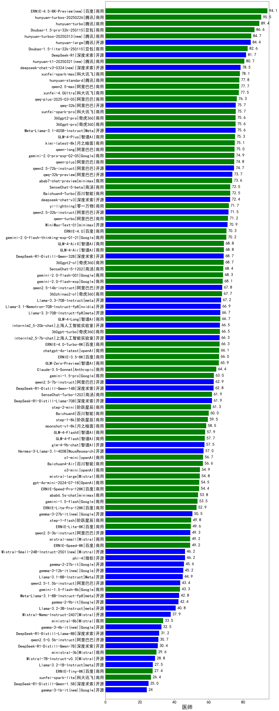

| 类别 | 大模型                         | 医师 | 排名 |
|-----|------------------------------|---------|----|
|商用|ERNIE-4.5-Turbo-32K(new)|92.4%|1|
|商用|hunyuan-turbo|89.4%|2|
|商用|doubao-seed-1-6-thinking-250615(new)|86.7%|3|
|商用|Doubao-1.5-pro-32k-250115|86.6%|4|
|商用|GLM-Z1-Air|86.3%|5|
|商用|doubao-seed-1-6-250615(new)|85.8%|6|
|商用|Doubao-1.5-thinking-pro|85.2%|7|
|商用|hunyuan-turbos-20250604(new)|84.7%|8|
|商用|hunyuan-turbos-20250313|84.7%|9|
|开源|hunyuan-large|84.4%|10|
|商用|ERNIE-X1-Turbo-32K(new)|82.9%|11|
|开源|Qwen3-235B-A22B|82.7%|12|
|商用|Doubao-1.5-lite-32k-250115|82.6%|13|
|开源|DeepSeek-R1|81.7%|14|
|商用|hunyuan-t1-20250529(new)|81.3%|15|
|开源|Llama-4-Maverick-17B-128E-Instruct-FP8|81.2%|16|
|商用|doubao-seed-1-6-flash-thinking-250615(new)|81.0%|17|
|商用|doubao-seed-1-6-flash-250615(new)|80.9%|18|
|商用|hunyuan-t1-20250321|80.7%|19|
|开源|Qwen3-32B|80.5%|20|
|开源|DeepSeek-R1-0528(new)|80.4%|21|
|商用|GLM-4-Plus|78.7%|22|
|开源|deepseek-chat-v3-0324|78.5%|23|
|开源|Qwen3-30B-A3B|78.5%|24|
|商用|xunfei-spark-max|78.1%|25|
|商用|gemini-2.5-pro-preview-03-25|78.1%|26|
|商用|gemini-2.5-pro-preview-05-06(new)|77.8%|27|
|商用|hunyuan-standard|77.8%|28|
|商用|qwen2.5-max|77.7%|29|
|商用|xunfei-4.0Ultra|77.5%|30|
|商用|xunfei-spark-x1|77.3%|31|
|商用|qwq-plus-2025-03-05|76.3%|32|
|开源|qwq-32b|75.7%|33|
|商用|xunfei-spark-pro|75.7%|34|
|商用|360gpt2-pro|75.6%|35|
|开源|Qwen3-14B|75.5%|36|
|商用|claude-4-sonnet(new)|75.2%|37|
|商用|kimi-latest-8k|75.1%|38|
|商用|qwen-long|75.0%|39|
|商用|GLM-Z1-AirX|74.8%|40|
|商用|qwen-plus|74.8%|41|
|开源|qwen2.5-72b-instruct|74.7%|42|
|商用|gemini-2.5-flash-preview-04-17|74.6%|43|
|商用|gemini-2.5-flash-preview-05-20(new)|73.4%|44|
|开源|Qwen3-8B|73.2%|45|
|开源|GLM-Z1-32B-0414|73.2%|46|
|商用|gpt-4.1|72.8%|47|
|商用|SenseChat-5-beta|72.5%|48|
|商用|Baichuan4-Turbo|72.5%|49|
|商用|yi-lightning|71.7%|50|
|开源|qwen2.5-32b-instruct|71.5%|51|
|开源|GLM-4-32B-0414|71.5%|52|
|商用|qwen-turbo|71.2%|53|
|开源|MiniMax-Text-01|70.9%|54|
|开源|Llama-4-Scout-17B-16E-Instruct|70.9%|55|
|商用|step-r1-v-mini(new)|70.7%|56|
|商用|GLM-4-AirX|70.3%|57|
|商用|GLM-4-Air|69.8%|58|
|商用|claude-4-sonnet-thinking(new)|69.7%|59|
|开源|DeepSeek-R1-Distill-Qwen-32B|68.7%|60|
|商用|360gpt2-o1|68.7%|61|
|商用|SenseChat-5-1202|68.4%|62|
|开源|qwen2.5-14b-instruct|67.8%|63|
|商用|360zhinao2-o1|67.7%|64|
|商用|GLM-4-Long|67.2%|65|
|开源|Llama-3.3-70B-Instruct|67.2%|66|
|开源|Llama-3.3-70B-Instruct-fp8|66.7%|67|
|商用|360gpt-turbo|66.5%|68|
|开源|internlm2_5-7b-chat|66.3%|69|
|商用|chatgpt-4o-latest|66.1%|70|
|商用|ERNIE-3.5-8K|66.0%|71|
|商用|o4-mini|65.1%|72|
|开源|Qwen3-4B|63.3%|73|
|开源|DeepSeek-R1-0528-Qwen3-8B(new)|63.3%|74|
|开源|qwen2.5-7b-instruct|62.9%|75|
|开源|DeepSeek-R1-Distill-Qwen-14B|62.8%|76|
|商用|gpt-4.1-mini|62.4%|77|
|商用|SenseChat-Turbo-1202|61.9%|78|
|开源|DeepSeek-R1-Distill-Llama-70B|61.9%|79|
|商用|step-2-mini|61.3%|80|
|开源|GLM-4-9B-0414|59.1%|81|
|商用|moonshot-v1-8k|58.5%|82|
|商用|GLM-Z1-FlashX|58.4%|83|
|商用|GLM-4-FlashX|57.9%|84|
|开源|GLM-Z1-9B-0414|57.8%|85|
|商用|GLM-4-Flash|57.7%|86|
|商用|Baichuan4-Air|56.6%|87|
|商用|GLM-Z1-Flash|55.2%|88|
|商用|mistral-large|54.8%|89|
|商用|gpt-4o-mini|54.5%|90|
|开源|Mistral-Small-3.1-24B-Instruct-2503|53.4%|91|
|开源|GLM-Z1-Rumination-32B-0414|53.2%|92|
|开源|Qwen3-1.7B|52.5%|93|
|开源|gemma-3-27b-it|50.5%|94|
|商用|ERNIE-Lite-8K|49.6%|95|
|开源|qwen2.5-3b-instruct|49.3%|96|
|商用|mistral-small|49.2%|97|
|商用|ERNIE-Speed-8K|49.2%|98|
|开源|phi-4|46.2%|99|
|开源|gemma-3-12b-it|45.2%|100|
|开源|Llama-3.1-8B-Instruct|44.9%|101|
|开源|qwen2.5-1.5b-instruct|43.4%|102|
|开源|Llama-3.2-3B-Instruct|40.8%|103|
|开源|Qwen3-0.6B|35.7%|104|
|商用|ministral-8b|33.5%|105|
|开源|gemma-3-4b-it|32.5%|106|
|开源|DeepSeek-R1-Distill-Llama-8B|31.2%|107|
|开源|qwen2.5-0.5b-instruct|30.7%|108|
|开源|DeepSeek-R1-Distill-Qwen-7B|30.4%|109|
|商用|ministral-3b|29.6%|110|
|开源|Llama-3.2-1B-Instruct|27.5%|111|
|商用|ERNIE-Tiny-8K|27.4%|112|
|商用|xunfei-spark-lite|26.4%|113|

