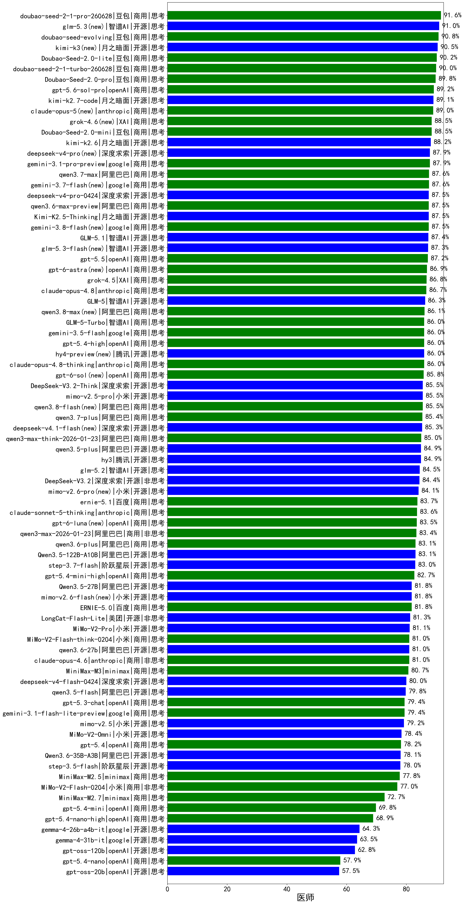

|类别|机构|大模型|【医师】准确率|平均耗时|平均消耗token|花费/千次（元）|排名（准确率）|
|---|---|-----|-------------------|-------|-----------|-----------|-----------|
|商用|豆包|doubao-seed-2-1-pro-260628|91.6%|225s|7212|213.6|1|
|开源|智谱AI|glm-5.3(new)|91.0%|74s|2066|56.2|2|
|商用|豆包|doubao-seed-evolving|90.8%|218s|7315|216.7|3|
|开源|月之暗面|kimi-k3(new)|90.5%|49s|742|62.0|4|
|商用|豆包|Doubao-Seed-2.0-lite|90.2%|201s|936|3.0|5|
|商用|豆包|doubao-seed-2-1-turbo-260628|90.0%|195s|6635|98.1|6|
|商用|豆包|Doubao-Seed-2.0-pro|89.8%|220s|1019|14.8|7|
|商用|openAI|gpt-5.6-sol-pro|89.2%|33s|3471|275.2|8|
|开源|月之暗面|kimi-k2.7-code|89.1%|39s|1232|31.7|9|
|商用|anthropic|claude-opus-5(new)|89.0%|15s|730|111.1|10|
|商用|XAI|grok-4.6(new)|88.5%|208s|1624|60.4|11|
|商用|豆包|Doubao-Seed-2.0-mini|88.5%|332s|2141|4.1|12|
|开源|月之暗面|kimi-k2.6|88.2%|109s|1977|51.8|13|
|开源|深度求索|deepseek-v4-pro(new)|87.9%|127s|1124|27.6|14|
|商用|google|gemini-3.1-pro-preview|87.9%|41s|1745|142.7|15|
|商用|阿里巴巴|qwen3.7-max|87.6%|25s|1210|41.6|16|
|商用|google|gemini-3.7-flash(new)|87.6%|7s|808|19.5|17|
|开源|深度求索|deepseek-v4-pro-0424|87.5%|48s|1137|26.4|18|
|商用|阿里巴巴|qwen3.6-max-preview|87.5%|55s|1737|90.1|19|
|开源|月之暗面|Kimi-K2.5-Thinking|87.5%|352s|2122|43.3|20|
|商用|google|gemini-3.8-flash(new)|87.5%|22s|808|39.0|21|
|开源|智谱AI|GLM-5.1|87.4%|150s|1637|37.9|22|
|开源|智谱AI|glm-5.3-flash(new)|87.3%|80s|1983|5.4|23|
|商用|openAI|gpt-5.5|87.2%|10s|555|99.4|24|
|商用|openAI|gpt-6-astra(new)|86.9%|12s|297|76.1|25|
|商用|XAI|grok-4.5|86.8%|87s|1644|61.3|26|
|商用|anthropic|claude-opus-4.8|86.7%|10s|589|86.3|27|
|开源|智谱AI|GLM-5|86.3%|91s|2211|38.7|28|
|商用|XAI|grok-4.7(new)|86.2%|57s|4235|141.0|29|
|商用|阿里巴巴|qwen3.8-max(new)|86.1%|47s|1468|50.0|30|
|商用|智谱AI|GLM-5-Turbo|86.0%|42s|1568|33.2|31|
|商用|google|gemini-3.5-flash|86.0%|9s|1489|89.5|32|
|商用|openAI|gpt-5.4-high|86.0%|15s|802|75.6|33|
|开源|腾讯|hy4-preview(new)|86.0%|68s|3349|59.2|34|
|商用|anthropic|claude-opus-4.8-thinking|86.0%|13s|769|117.8|35|
|商用|openAI|gpt-6-sol(new)|85.8%|225s|263|13.0|36|
|开源|深度求索|DeepSeek-V3.2-Think|85.5%|110s|1243|3.7|37|
|开源|小米|mimo-v2.5-pro|85.5%|29s|1438|25.6|38|
|商用|阿里巴巴|qwen3.8-flash(new)|85.5%|49s|1428|3.6|39|
|商用|阿里巴巴|qwen3.7-plus|85.4%|27s|1454|11.1|40|
|开源|深度求索|deepseek-v4.1-flash(new)|85.3%|13s|1273|9.6|41|
|商用|阿里巴巴|qwen3-max-think-2026-01-23|85.0%|150s|3141|30.8|42|
|开源|阿里巴巴|qwen3.5-plus|84.9%|36s|2989|14.0|43|
|开源|腾讯|hy3|84.9%|58s|257|0.8|44|
|开源|智谱AI|glm-5.2|84.5%|48s|1937|52.6|45|
|开源|深度求索|DeepSeek-V3.2|84.4%|71s|415|1.2|46|
|开源|小米|mimo-v2.6-pro(new)|84.1%|63s|1747|10.2|47|
|商用|百度|ernie-5.1|83.7%|35s|1003|17.0|48|
|商用|anthropic|claude-sonnet-5-thinking|83.6%|16s|848|52.6|49|
|商用|openAI|gpt-6-luna(new)|83.5%|197s|481|1.4|50|
|商用|阿里巴巴|qwen3-max-2026-01-23|83.4%|66s|553|4.9|51|
|商用|阿里巴巴|qwen3.6-plus|83.1%|37s|1705|19.7|52|
|开源|阿里巴巴|Qwen3.5-122B-A10B|83.1%|296s|3295|20.6|53|
|开源|阶跃星辰|step-3.7-flash|83.0%|37s|2777|21.9|54|
|商用|openAI|gpt-5.4-mini-high|82.7%|48s|1009|29.2|55|
|开源|阿里巴巴|Qwen3.5-27B|81.8%|302s|3273|15.4|56|
|开源|小米|mimo-v2.6-flash(new)|81.8%|103s|1305|2.5|57|
|商用|百度|ERNIE-5.0|81.8%|168s|2226|52.2|58|
|开源|美团|LongCat-Flash-Lite|81.3%|228s|606|0.0|59|
|开源|小米|MiMo-V2-Pro|81.1%|242s|1172|20.1|60|
|商用|小米|MiMo-V2-Flash-think-0204|81.0%|761s|2122|4.3|61|
|开源|阿里巴巴|qwen3.6-27b|81.0%|30s|1829|31.7|62|
|商用|anthropic|claude-opus-4.6|81.0%|15s|674|101.1|63|
|商用|minimax|MiniMax-M3|80.7%|25s|697|8.7|64|
|开源|深度求索|deepseek-v4-flash-0424|80.0%|35s|883|1.7|65|
|开源|阿里巴巴|qwen3.5-flash|79.8%|287s|3653|7.2|66|
|商用|openAI|gpt-5.3-chat|79.4%|25s|428|33.6|67|
|商用|google|gemini-3.1-flash-lite-preview|79.4%|11s|414|3.6|68|
|开源|小米|mimo-v2.5|79.2%|28s|1598|18.7|69|
|开源|小米|MiMo-V2-Omni|78.4%|135s|1485|17.1|70|
|商用|openAI|gpt-5.4|78.2%|7s|317|24.8|71|
|开源|阿里巴巴|Qwen3.6-35B-A3B|78.1%|82s|1951|20.3|72|
|开源|阶跃星辰|step-3.5-flash|78.0%|22s|2142|4.4|73|
|商用|minimax|MiniMax-M2.5|77.8%|31s|1520|12.1|74|
|商用|小米|MiMo-V2-Flash-0204|77.0%|253s|616|1.2|75|
|商用|minimax|MiniMax-M2.7|72.7%|41s|1672|13.4|76|
|商用|openAI|gpt-5.4-mini|69.8%|35s|277|6.2|77|
|商用|openAI|gpt-5.4-nano-high|68.9%|41s|631|4.8|78|
|开源|google|gemma-4-26b-a4b-it|64.3%|52s|611|1.5|79|
|开源|google|gemma-4-31b-it|63.5%|85s|556|1.4|80|
|开源|openAI|gpt-oss-120b|62.8%|42s|727|2.0|81|
|商用|openAI|gpt-5.4-nano|57.9%|35s|264|1.6|82|
|开源|openAI|gpt-oss-20b|57.5%|36s|1190|1.3|83|

