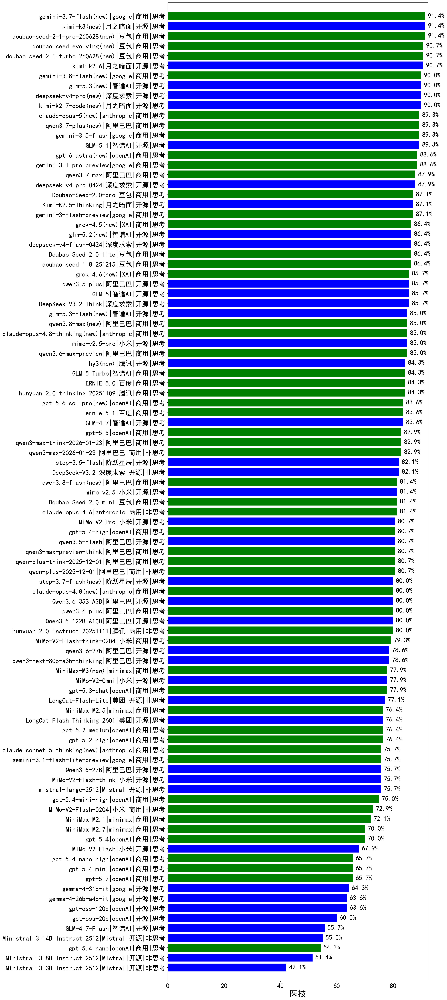

|类别|机构|大模型|【医技】准确率|平均耗时|平均消耗token|花费/千次（元）|排名（准确率）|
|---|---|-----|-------------------|-------|-----------|-----------|-----------|
|商用|豆包|doubao-seed-2-1-pro-260628(new)|91.4%|247s|8136|241.4|1|
|商用|google|gemini-3.7-flash(new)|91.4%|9s|761|18.4|2|
|开源|月之暗面|kimi-k3(new)|91.4%|66s|826|70.7|3|
|商用|豆包|doubao-seed-2-1-turbo-260628(new)|90.7%|202s|8030|119.1|4|
|开源|月之暗面|kimi-k2.6|90.7%|121s|1975|51.9|5|
|商用|豆包|doubao-seed-evolving(new)|90.7%|241s|7858|233.1|6|
|商用|google|gemini-3.8-flash(new)|90.0%|21s|754|36.5|7|
|开源|智谱AI|glm-5.3(new)|90.0%|91s|2560|70.1|8|
|开源|深度求索|deepseek-v4-pro(new)|90.0%|147s|980|23.8|9|
|开源|月之暗面|kimi-k2.7-code(new)|90.0%|49s|1411|36.7|10|
|开源|智谱AI|GLM-5.1|89.3%|158s|1569|36.4|11|
|商用|google|gemini-3.5-flash|89.3%|8s|1375|82.8|12|
|商用|anthropic|claude-opus-5(new)|89.3%|14s|668|101.9|13|
|商用|阿里巴巴|qwen3.7-plus(new)|89.3%|24s|1241|9.5|14|
|商用|google|gemini-3.1-pro-preview|88.6%|39s|1530|125.0|15|
|商用|openAI|gpt-6-astra(new)|88.6%|12s|271|70.0|16|
|商用|阿里巴巴|qwen3.7-max|87.9%|25s|1162|40.0|17|
|开源|深度求索|deepseek-v4-pro-0424|87.9%|39s|917|21.2|18|
|商用|google|gemini-3-flash-preview|87.1%|69s|1169|23.6|19|
|商用|豆包|Doubao-Seed-2.0-pro|87.1%|239s|1070|15.7|20|
|开源|月之暗面|Kimi-K2.5-Thinking|87.1%|369s|2048|41.8|21|
|商用|豆包|doubao-seed-1-8-251215|86.4%|25s|657|4.4|22|
|开源|深度求索|deepseek-v4-flash-0424|86.4%|35s|945|1.8|23|
|商用|XAI|grok-4.5(new)|86.4%|93s|1537|56.9|24|
|开源|智谱AI|glm-5.2(new)|86.4%|54s|1884|51.2|25|
|商用|豆包|Doubao-Seed-2.0-lite|86.4%|188s|892|2.9|26|
|商用|XAI|grok-4.6(new)|85.7%|173s|1627|60.7|27|
|开源|智谱AI|GLM-5|85.7%|92s|1995|34.9|28|
|开源|深度求索|DeepSeek-V3.2-Think|85.7%|101s|1273|3.8|29|
|开源|阿里巴巴|qwen3.5-plus|85.7%|34s|2647|12.4|30|
|商用|阿里巴巴|qwen3.8-max(new)|85.0%|33s|1339|45.5|31|
|商用|anthropic|claude-opus-4.8-thinking(new)|85.0%|13s|702|107.9|32|
|开源|小米|mimo-v2.5-pro|85.0%|23s|1306|22.9|33|
|商用|阿里巴巴|qwen3.6-max-preview|85.0%|48s|1574|81.6|34|
|开源|智谱AI|glm-5.3-flash(new)|85.0%|92s|2662|7.3|35|
|开源|腾讯|hy3(new)|84.3%|89s|232|0.7|36|
|商用|智谱AI|GLM-5-Turbo|84.3%|43s|1476|31.3|37|
|商用|百度|ERNIE-5.0|84.3%|156s|2031|47.6|38|
|商用|腾讯|hunyuan-2.0-thinking-20251109|84.3%|13s|884|3.3|39|
|商用|openAI|gpt-5.6-sol-pro(new)|83.6%|29s|3274|253.0|40|
|商用|百度|ernie-5.1|83.6%|32s|970|16.5|41|
|开源|智谱AI|GLM-4.7|83.6%|58s|2247|30.7|42|
|商用|openAI|gpt-5.5|82.9%|13s|558|101.1|43|
|商用|阿里巴巴|qwen3-max-think-2026-01-23|82.9%|199s|3068|30.1|44|
|商用|阿里巴巴|qwen3-max-2026-01-23|82.9%|64s|485|4.3|45|
|开源|阶跃星辰|step-3.5-flash|82.1%|23s|2005|4.1|46|
|开源|深度求索|DeepSeek-V3.2|82.1%|58s|361|1.0|47|
|商用|anthropic|claude-opus-4.6|81.4%|17s|610|91.5|48|
|开源|小米|mimo-v2.5|81.4%|19s|1377|15.7|49|
|商用|阿里巴巴|qwen3.8-flash(new)|81.4%|48s|1802|4.6|50|
|商用|豆包|Doubao-Seed-2.0-mini|81.4%|420s|2223|4.2|51|
|商用|阿里巴巴|qwen-plus-2025-12-01|80.7%|22s|852|1.6|52|
|商用|openAI|gpt-5.4-high|80.7%|17s|776|73.7|53|
|开源|阿里巴巴|qwen3.5-flash|80.7%|286s|3077|6.0|54|
|开源|小米|MiMo-V2-Pro|80.7%|242s|1149|19.6|55|
|商用|阿里巴巴|qwen3-max-preview-think|80.7%|161s|2592|60.8|56|
|商用|阿里巴巴|qwen-plus-think-2025-12-01|80.7%|63s|2615|20.4|57|
|商用|腾讯|hunyuan-2.0-instruct-20251111|80.0%|8s|423|0.7|58|
|商用|阿里巴巴|qwen3.6-plus|80.0%|36s|1520|17.5|59|
|商用|anthropic|claude-opus-4.8(new)|80.0%|9s|510|74.1|60|
|开源|阿里巴巴|Qwen3.5-122B-A10B|80.0%|268s|2938|18.4|61|
|开源|阿里巴巴|Qwen3.6-35B-A3B|80.0%|84s|1711|17.8|62|
|开源|阶跃星辰|step-3.7-flash(new)|80.0%|41s|2829|22.4|63|
|商用|小米|MiMo-V2-Flash-think-0204|79.3%|818s|2118|4.3|64|
|开源|阿里巴巴|qwen3-next-80b-a3b-thinking|78.6%|135s|3338|13.1|65|
|开源|阿里巴巴|qwen3.6-27b|78.6%|28s|1679|29.1|66|
|商用|minimax|MiniMax-M3(new)|77.9%|22s|638|7.7|67|
|开源|小米|MiMo-V2-Omni|77.9%|216s|1360|15.5|68|
|商用|openAI|gpt-5.3-chat|77.9%|26s|388|30.5|69|
|开源|美团|LongCat-Flash-Lite|77.1%|183s|478|0.0|70|
|商用|minimax|MiniMax-M2.5|76.4%|28s|1375|10.9|71|
|商用|openAI|gpt-5.2-high|76.4%|11s|479|39.9|72|
|商用|openAI|gpt-5.2-medium|76.4%|8s|372|29.3|73|
|开源|美团|LongCat-Flash-Thinking-2601|76.4%|187s|2441|0.0|74|
|开源|小米|MiMo-V2-Flash-think|75.7%|77s|2108|0.0|75|
|开源|Mistral|mistral-large-2512|75.7%|12s|496|4.6|76|
|商用|anthropic|claude-sonnet-5-thinking(new)|75.7%|15s|799|49.9|77|
|开源|阿里巴巴|Qwen3.5-27B|75.7%|284s|3244|15.3|78|
|商用|google|gemini-3.1-flash-lite-preview|75.7%|12s|357|3.1|79|
|商用|openAI|gpt-5.4-mini-high|75.0%|78s|1105|32.5|80|
|商用|小米|MiMo-V2-Flash-0204|72.9%|255s|548|1.0|81|
|商用|minimax|MiniMax-M2.1|72.1%|109s|1740|14.0|82|
|商用|minimax|MiniMax-M2.7|70.0%|42s|1692|13.6|83|
|商用|openAI|gpt-5.4|70.0%|7s|269|20.5|84|
|开源|小米|MiMo-V2-Flash|67.9%|69s|461|0.0|85|
|商用|openAI|gpt-5.2|65.7%|5s|210|13.1|86|
|商用|openAI|gpt-5.4-nano-high|65.7%|34s|570|4.3|87|
|商用|openAI|gpt-5.4-mini|65.7%|27s|232|5.0|88|
|开源|google|gemma-4-31b-it|64.3%|103s|506|1.3|89|
|开源|google|gemma-4-26b-a4b-it|63.6%|52s|568|1.4|90|
|开源|openAI|gpt-oss-120b|63.6%|39s|631|1.7|91|
|开源|openAI|gpt-oss-20b|60.0%|45s|1114|1.2|92|
|开源|智谱AI|GLM-4.7-Flash|55.7%|1080s|3270|0.0|93|
|开源|Mistral|Ministral-3-14B-Instruct-2512|55.0%|9s|553|0.8|94|
|商用|openAI|gpt-5.4-nano|54.3%|31s|253|1.6|95|
|开源|Mistral|Ministral-3-8B-Instruct-2512|51.4%|9s|588|0.6|96|
|开源|Mistral|Ministral-3-3B-Instruct-2512|42.1%|9s|670|0.5|97|

