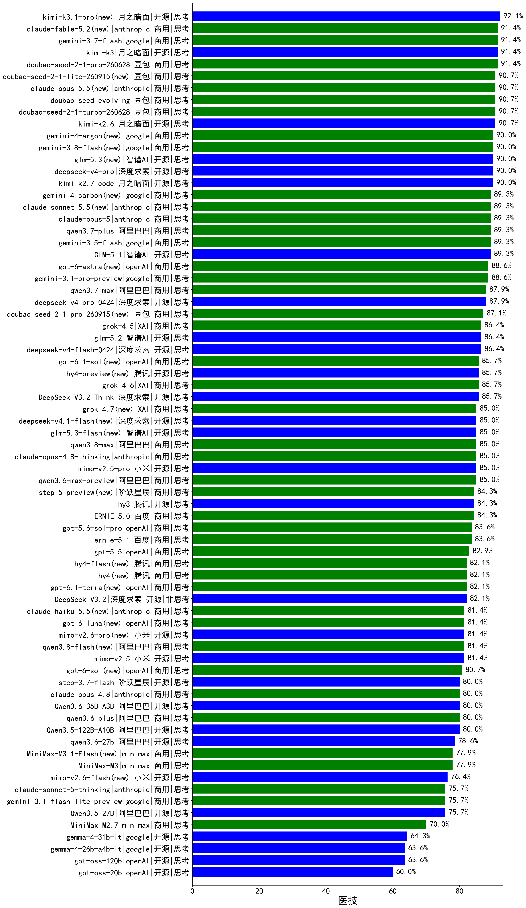

|类别|机构|大模型|【医技】准确率|平均耗时|平均消耗token|花费/千次（元）|排名（准确率）|
|---|---|-----|-------------------|-------|-----------|-----------|-----------|
|开源|月之暗面|kimi-k3.1-pro(new)|92.1%|46s|1540|96.6|1|
|商用|google|gemini-3.7-flash|91.4%|9s|761|18.4|2|
|商用|豆包|doubao-seed-2-1-pro-260628|91.4%|247s|8136|241.4|3|
|商用|anthropic|claude-fable-5.2(new)|91.4%|33s|496|114.2|4|
|开源|月之暗面|kimi-k3|91.4%|66s|826|70.7|5|
|商用|豆包|doubao-seed-evolving|90.7%|241s|7858|233.1|6|
|商用|anthropic|claude-opus-5.5(new)|90.7%|41s|645|78.1|7|
|商用|豆包|doubao-seed-2-1-lite-260915(new)|90.7%|39s|1340|3.4|8|
|开源|月之暗面|kimi-k2.6|90.7%|121s|1975|51.9|9|
|商用|豆包|doubao-seed-2-1-turbo-260628|90.7%|202s|8030|119.1|10|
|商用|google|gemini-4-argon(new)|90.0%|20s|470|54.5|11|
|开源|深度求索|deepseek-v4-pro|90.0%|147s|980|23.8|12|
|开源|月之暗面|kimi-k2.7-code|90.0%|49s|1411|36.7|13|
|开源|智谱AI|glm-5.3|90.0%|91s|2560|70.1|14|
|商用|google|gemini-3.8-flash|90.0%|21s|754|36.5|15|
|商用|google|gemini-3.5-flash|89.3%|8s|1375|82.8|16|
|商用|anthropic|claude-opus-5|89.3%|14s|668|101.9|17|
|商用|阿里巴巴|qwen3.7-plus|89.3%|24s|1241|9.5|18|
|开源|智谱AI|GLM-5.1|89.3%|158s|1569|36.4|19|
|商用|anthropic|claude-sonnet-5.5(new)|89.3%|24s|557|32.9|20|
|商用|google|gemini-4-carbon(new)|89.3%|32s|1169|152.3|21|
|商用|openAI|gpt-6-astra|88.6%|12s|271|70.0|22|
|商用|google|gemini-3.1-pro-preview|88.6%|39s|1530|125.0|23|
|开源|深度求索|deepseek-v4-pro-0424|87.9%|39s|917|21.2|24|
|商用|阿里巴巴|qwen3.7-max|87.9%|25s|1162|40.0|25|
|商用|豆包|doubao-seed-2-1-pro-260915(new)|87.1%|57s|1223|34.0|26|
|商用|openAI|gpt-6.2-sol(new)|87.1%|18s|212|9.9|27|
|商用|openAI|gpt-6.2-astra(new)|86.4%|18s|197|35.1|28|
|开源|智谱AI|glm-5.2|86.4%|54s|1884|51.2|29|
|商用|XAI|grok-4.5|86.4%|93s|1537|56.9|30|
|开源|深度求索|deepseek-v4-flash-0424|86.4%|35s|945|1.8|31|
|开源|腾讯|hy4-preview|85.7%|64s|3421|60.6|32|
|商用|阿里巴巴|qwen4-max(new)|85.7%|30s|653|17.8|33|
|商用|openAI|gpt-6.1-sol(new)|85.7%|9s|242|12.0|34|
|开源|深度求索|DeepSeek-V3.2-Think|85.7%|101s|1273|3.8|35|
|商用|XAI|grok-4.6|85.7%|173s|1627|60.7|36|
|商用|anthropic|claude-opus-4.8-thinking|85.0%|13s|702|107.9|37|
|开源|深度求索|deepseek-v4.1-flash|85.0%|14s|1029|7.7|38|
|开源|智谱AI|glm-5.3-flash|85.0%|92s|2662|7.3|39|
|商用|阿里巴巴|qwen3.6-max-preview|85.0%|48s|1574|81.6|40|
|开源|小米|mimo-v2.5-pro|85.0%|23s|1306|22.9|41|
|商用|阿里巴巴|qwen3.8-max|85.0%|33s|1339|45.5|42|
|商用|XAI|grok-4.7|85.0%|60s|4724|161.8|43|
|商用|百度|ERNIE-5.0|84.3%|156s|2031|47.6|44|
|开源|腾讯|hy3|84.3%|89s|232|0.7|45|
|商用|阶跃星辰|step-5-preview(new)|84.3%|31s|1894|36.9|46|
|商用|openAI|gpt-5.6-sol-pro|83.6%|29s|3274|253.0|47|
|商用|百度|ernie-5.1|83.6%|32s|970|16.5|48|
|商用|openAI|gpt-5.5|82.9%|13s|558|101.1|49|
|商用|腾讯|hy4(new)|82.1%|91s|4500|80.0|50|
|商用|openAI|gpt-6.1-terra(new)|82.1%|5s|309|8.3|51|
|商用|腾讯|hy4-flash(new)|82.1%|23s|1645|3.2|52|
|开源|深度求索|DeepSeek-V3.2|82.1%|58s|361|1.0|53|
|商用|openAI|gpt-6-luna|81.4%|283s|465|1.4|54|
|商用|anthropic|claude-haiku-5.5(new)|81.4%|39s|736|2.3|55|
|开源|小米|mimo-v2.6-pro|81.4%|82s|1079|6.2|56|
|商用|阿里巴巴|qwen3.8-flash|81.4%|48s|1802|4.6|57|
|开源|小米|mimo-v2.5|81.4%|19s|1377|15.7|58|
|商用|openAI|gpt-6-sol|80.7%|262s|268|13.8|59|
|商用|阿里巴巴|qwen3.6-plus|80.0%|36s|1520|17.5|60|
|商用|anthropic|claude-opus-4.8|80.0%|9s|510|74.1|61|
|开源|阶跃星辰|step-3.7-flash|80.0%|41s|2829|22.4|62|
|开源|阿里巴巴|Qwen3.5-122B-A10B|80.0%|268s|2938|18.4|63|
|开源|阿里巴巴|Qwen3.6-35B-A3B|80.0%|84s|1711|17.8|64|
|开源|阿里巴巴|qwen3.6-27b|78.6%|28s|1679|29.1|65|
|商用|minimax|MiniMax-M3|77.9%|22s|638|7.7|66|
|商用|minimax|MiniMax-M3.1-Flash(new)|77.9%|21s|1240|4.2|67|
|开源|小米|mimo-v2.6-flash|76.4%|79s|990|1.9|68|
|开源|阿里巴巴|Qwen3.5-27B|75.7%|284s|3244|15.3|69|
|商用|google|gemini-3.1-flash-lite-preview|75.7%|12s|357|3.1|70|
|商用|anthropic|claude-sonnet-5-thinking|75.7%|15s|799|49.9|71|
|商用|minimax|MiniMax-M2.7|70.0%|42s|1692|13.6|72|
|开源|google|gemma-4-31b-it|64.3%|103s|506|1.3|73|
|开源|google|gemma-4-26b-a4b-it|63.6%|52s|568|1.4|74|
|开源|openAI|gpt-oss-120b|63.6%|39s|631|1.7|75|
|开源|openAI|gpt-oss-20b|60.0%|45s|1114|1.2|76|

