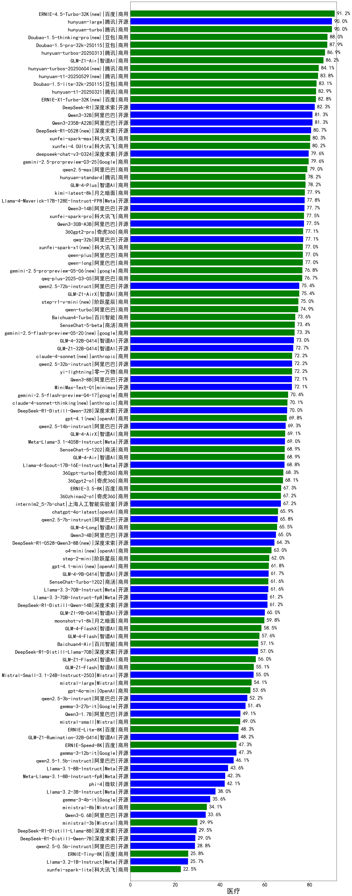

| 类别 | 大模型                         | 医疗 | 排名 |
|-----|------------------------------|---------|----|
|商用|ERNIE-4.5-8K-Preview|93.7|1|
|商用|hunyuan-turbos-20250226|91.0|2|
|开源|hunyuan-large|90.0|3|
|商用|hunyuan-turbo|90.0|4|
|商用|Doubao-1.5-thinking-pro(new)|88.0|5|
|商用|Doubao-1.5-pro-32k-250115|87.9|6|
|商用|hunyuan-turbos-20250313|86.9|7|
|商用|Doubao-1.5-lite-32k-250115|83.1|8|
|商用|hunyuan-t1-20250321|82.9|9|
|开源|DeepSeek-R1|82.3|10|
|开源|Qwen3-32B(new)|81.3|11|
|开源|Qwen3-235B-A22B(new)|81.3|12|
|商用|ERNIE-X1-32K-Preview|80.8|13|
|商用|xunfei-spark-max|80.3|14|
|商用|xunfei-4.0Ultra|80.2|15|
|开源|deepseek-chat-v3-0324|79.6|16|
|商用|gemini-2.5-pro-preview-03-25|79.6|17|
|商用|qwen2.5-max|79.0|18|
|商用|hunyuan-standard|78.2|19|
|商用|kimi-latest-8k|77.9|20|
|开源|Llama-4-Maverick-17B-128E-Instruct-FP8|77.8|21|
|开源|Qwen3-14B(new)|77.7|22|
|商用|xunfei-spark-pro|77.5|23|
|开源|Qwen3-30B-A3B(new)|77.5|24|
|商用|360gpt2-pro|77.1|25|
|开源|qwq-32b|77.1|26|
|商用|xunfei-spark-x1(new)|77.0|27|
|商用|qwen-plus|77.0|28|
|商用|qwen-long|77.0|29|
|商用|qwq-plus-2025-03-05|76.7|30|
|开源|qwen2.5-72b-instruct|75.4|31|
|商用|GLM-4-Plus|75.3|32|
|商用|qwen-turbo|74.9|33|
|商用|Baichuan4-Turbo|73.6|34|
|商用|SenseChat-5-beta|73.4|35|
|开源|GLM-4-32B-0414(new)|73.0|36|
|开源|GLM-Z1-32B-0414(new)|72.7|37|
|开源|qwen2.5-32b-instruct|72.2|38|
|商用|yi-lightning|72.2|39|
|开源|Qwen3-8B(new)|72.1|40|
|开源|MiniMax-Text-01|72.1|41|
|商用|GLM-Z1-Air(new)|71.6|42|
|商用|GLM-4-Air|70.7|43|
|商用|GLM-4-AirX|70.4|44|
|商用|gemini-2.5-flash-preview-04-17(new)|70.4|45|
|开源|DeepSeek-R1-Distill-Qwen-32B|70.0|46|
|商用|GLM-Z1-AirX(new)|70.0|47|
|商用|gpt-4.1(new)|69.8|48|
|商用|ERNIE-4.0-Turbo-8K|69.3|49|
|开源|qwen2.5-14b-instruct|69.3|50|
|开源|Meta-Llama-3.1-405B-Instruct|69.0|51|
|商用|SenseChat-5-1202|68.9|52|
|开源|Llama-4-Scout-17B-16E-Instruct|68.8|53|
|商用|360gpt-turbo|68.3|54|
|商用|360gpt2-o1|68.1|55|
|开源|internlm2_5-20b-chat|68.0|56|
|商用|gemini-2.0-flash-001|67.6|57|
|商用|ERNIE-3.5-8K|67.3|58|
|商用|360zhinao2-o1|67.2|59|
|开源|internlm2_5-7b-chat|67.2|60|
|商用|GLM-4-Long|67.0|61|
|商用|chatgpt-4o-latest|65.9|62|
|开源|qwen2.5-7b-instruct|65.8|63|
|开源|Qwen3-4B(new)|65.0|64|
|商用|o4-mini(new)|63.0|65|
|商用|step-2-mini|62.0|66|
|商用|gpt-4.1-mini(new)|61.8|67|
|开源|GLM-4-9B-0414(new)|61.7|68|
|商用|SenseChat-Turbo-1202|61.6|69|
|商用|Claude-3.5-Sonnet|61.6|70|
|开源|Llama-3.3-70B-Instruct|61.6|71|
|开源|Llama-3.3-70B-Instruct-fp8|61.2|72|
|开源|DeepSeek-R1-Distill-Qwen-14B|61.2|73|
|开源|GLM-Z1-9B-0414(new)|60.0|74|
|商用|moonshot-v1-8k|59.8|75|
|商用|GLM-4-FlashX|58.5|76|
|开源|glm-4-9b-chat|58.5|77|
|商用|GLM-4-Flash|57.6|78|
|商用|Baichuan4-Air|57.1|79|
|开源|DeepSeek-R1-Distill-Llama-70B|57.0|80|
|商用|GLM-Z1-FlashX(new)|56.9|81|
|商用|GLM-Z1-Flash(new)|55.1|82|
|开源|Mistral-Small-3.1-24B-Instruct-2503|55.0|83|
|商用|mistral-large|54.1|84|
|商用|gpt-4o-mini|53.6|85|
|商用|o3-mini|53.1|86|
|商用|abab6.5s-chat|52.3|87|
|开源|qwen2.5-3b-instruct|52.2|88|
|开源|gemma-3-27b-it|51.4|89|
|商用|ERNIE-Speed-Pro-128K|50.8|90|
|商用|ERNIE-Lite-Pro-128K|50.2|91|
|开源|Qwen3-1.7B(new)|49.1|92|
|商用|mistral-small|49.0|93|
|商用|ERNIE-Lite-8K|48.3|94|
|开源|GLM-Z1-Rumination-32B-0414(new)|48.2|95|
|商用|ERNIE-Speed-8K|47.3|96|
|开源|gemma-3-12b-it|47.3|97|
|开源|qwen2.5-1.5b-instruct|46.1|98|
|开源|Llama-3.1-8B-Instruct|43.6|99|
|开源|Meta-Llama-3.1-8B-Instruct-fp8|42.3|100|
|开源|phi-4|42.1|101|
|开源|Llama-3.2-3B-Instruct|38.0|102|
|开源|gemma-3-4b-it|35.6|103|
|商用|ministral-8b|34.1|104|
|开源|Qwen3-0.6B(new)|33.6|105|
|商用|ministral-3b|29.9|106|
|开源|DeepSeek-R1-Distill-Llama-8B|29.5|107|
|开源|DeepSeek-R1-Distill-Qwen-7B|29.0|108|
|开源|qwen2.5-0.5b-instruct|28.8|109|
|商用|ERNIE-Tiny-8K|25.8|110|
|开源|Llama-3.2-1B-Instruct|25.7|111|
|开源|DeepSeek-R1-Distill-Qwen-1.5B|23.9|112|
|商用|xunfei-spark-lite|22.5|113|

