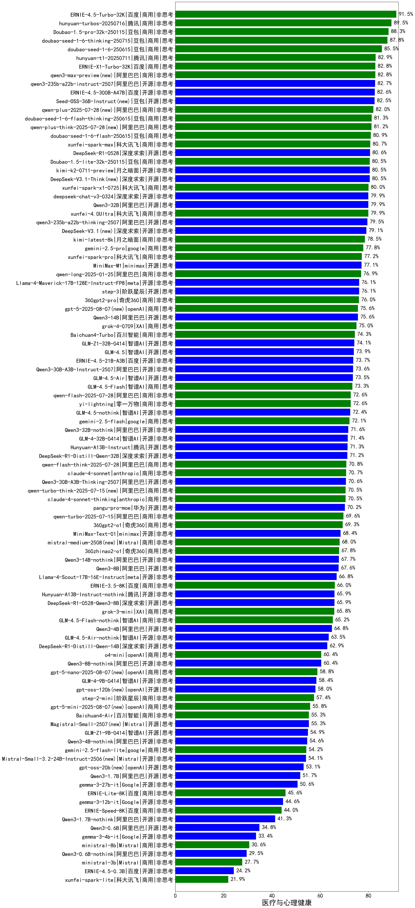

|类别|机构|大模型|【医疗与心理健康】准确率|平均耗时|平均消耗token|花费/千次（元）|排名（准确率）|
|---|---|-----|-------------------|-------|-----------|-----------|-----------|
|商用|百度|ERNIE-4.5-Turbo-32K|91.6%|21s|535|1.6|1|
|商用|google|gemini-3-pro-preview(new)|89.5%|55s|1757|144.7|2|
|商用|腾讯|hunyuan-2.0-thinking-20251109(new)|88.4%|12s|824|3.1|3|
|商用|豆包|doubao-seed-1-6-thinking-250715|87.8%|23s|1145|8.7|4|
|商用|豆包|doubao-seed-1-6-251015(new)|87.6%|32s|687|4.8|5|
|商用|google|gemini-3-flash-preview(new)|87.2%|67s|1149|23.2|6|
|商用|豆包|doubao-seed-1-6-lite-251015(new)|86.7%|48s|749|1.6|7|
|商用|腾讯|hunyuan-turbos-20250926(new)|86.1%|13s|577|1.0|8|
|商用|豆包|doubao-seed-1-6-250615|85.5%|102s|462|3.0|9|
|商用|腾讯|hunyuan-2.0-instruct-20251111(new)|84.3%|7s|401|0.7|10|
|开源|深度求索|DeepSeek-V3.2-Think(new)|84.2%|103s|1109|3.3|11|
|开源|深度求索|DeepSeek-V3.2-Exp(new)|83.0%|197s|326|0.9|12|
|商用|腾讯|hunyuan-t1-20250711|82.9%|27s|1656|6.2|13|
|商用|百度|ERNIE-X1-Turbo-32K|82.8%|100s|1915|7.5|14|
|商用|anthropic|claude-opus-4.5(new)|82.8%|14s|663|103.3|15|
|商用|阿里巴巴|qwen3-max-preview|82.8%|9s|456|9.5|16|
|开源|阿里巴巴|qwen3-235b-a22b-instruct-2507|82.7%|11s|489|3.5|17|
|开源|深度求索|DeepSeek-V3.2(new)|82.6%|63s|343|1.0|18|
|开源|百度|ERNIE-4.5-300B-A47B|82.6%|21s|333|2.2|19|
|开源|豆包|Seed-OSS-36B-Instruct|82.5%|102s|1790|7.0|20|
|开源|月之暗面|kimi-k2-0905(new)|82.1%|80s|347|4.5|21|
|商用|阿里巴巴|qwen-plus-2025-07-28|82.0%|12s|490|0.9|22|
|商用|豆包|doubao-seed-1-6-flash-thinking-250615|81.3%|8s|620|0.8|23|
|商用|阿里巴巴|qwen-plus-think-2025-07-28|81.2%|/|2468|19.1|24|
|商用|豆包|doubao-seed-1-6-flash-250615|80.9%|3s|318|0.4|25|
|开源|深度求索|DeepSeek-V3.2-Exp-Think(new)|80.9%|239s|1011|3.0|26|
|开源|阿里巴巴|qwen3-next-80b-a3b-instruct|80.8%|9s|529|1.9|27|
|开源|深度求索|DeepSeek-R1-0528|80.7%|225s|1831|28.5|28|
|商用|豆包|Doubao-1.5-lite-32k-250115|80.5%|4s|196|0.1|29|
|商用|阿里巴巴|qwen-plus-think-2025-12-01(new)|80.5%|56s|2385|18.5|30|
|开源|月之暗面|kimi-k2-0711-preview|80.5%|30s|514|7.4|31|
|开源|深度求索|DeepSeek-V3.1-Think|80.5%|51s|994|11.4|32|
|商用|阿里巴巴|qwen3-max-2025-09-23(new)|80.1%|215s|489|10.4|33|
|商用|科大讯飞|xunfei-spark-x1-0725|80.0%|/|979|11.8|34|
|开源|阿里巴巴|Qwen3-32B|79.9%|56s|1622|6.3|35|
|开源|阿里巴巴|qwen3-235b-a22b-thinking-2507|79.5%|91s|2424|46.8|36|
|商用|anthropic|claude-sonnet-4.5-thinking(new)|79.1%|23s|1620|164.6|37|
|开源|深度求索|DeepSeek-V3.1|79.1%|17s|334|3.5|38|
|开源|阿里巴巴|qwen3-next-80b-a3b-thinking(new)|78.8%|123s|3184|12.5|39|
|商用|openAI|gpt-5.2-high(new)|77.9%|11s|477|40.1|40|
|商用|google|gemini-2.5-pro|77.8%|35s|2315|163.4|41|
|开源|月之暗面|Kimi-K2-Thinking(new)|77.7%|159s|2440|38.3|42|
|商用|百度|ERNIE-X1.1-Preview(new)|77.6%|113s|768|2.9|43|
|开源|智谱AI|GLM-4.6(new)|77.6%|53s|2211|30.2|44|
|商用|openAI|gpt-5.1-high(new)|77.6%|93s|1052|69.5|45|
|商用|openAI|gpt-5.1-medium(new)|77.3%|150s|501|30.4|46|
|商用|openAI|gpt-5.2-medium(new)|77.0%|8s|361|28.7|47|
|商用|anthropic|claude-sonnet-4.5(new)|76.6%|11s|597|55.9|48|
|商用|阿里巴巴|qwen-plus-2025-12-01(new)|76.5%|21s|820|1.6|49|
|开源|minimax|MiniMax-M1|76.4%|168s|2807|19.2|50|
|商用|阿里巴巴|qwen-long-2025-01-25|76.3%|53s|339|0.6|51|
|开源|阶跃星辰|step-3|76.1%|97s|1852|7.2|52|
|商用|百度|ERNIE-5.0-Thinking-Preview(new)|76.0%|226s|1749|40.9|53|
|商用|openAI|gpt-5-2025-08-07|75.6%|25s|308|17.4|54|
|开源|阿里巴巴|Qwen3-14B|75.6%|55s|2100|4.1|55|
|商用|XAI|grok-4-0709|75.0%|256s|1446|150.7|56|
|开源|meta|Llama-4-Maverick-17B-128E-Instruct-FP8|74.4%|10s|510|2.0|57|
|商用|百川智能|Baichuan4-Turbo|74.3%|/|/|/|58|
|开源|智谱AI|GLM-4.5|73.9%|64s|1695|23.0|59|
|开源|阿里巴巴|Qwen3-30B-A3B-Instruct-2507|73.6%|4s|532|1.4|60|
|开源|百度|ERNIE-4.5-21B-A3B|73.6%|34s|319|0.0|61|
|开源|Mistral|mistral-large-2512(new)|73.5%|11s|487|4.5|62|
|开源|智谱AI|GLM-4.5-Air|73.4%|31s|1605|9.2|63|
|商用|智谱AI|GLM-4.5-Flash|73.3%|29s|1556|0.0|64|
|商用|openAI|gpt-5.2(new)|72.9%|5s|199|12.5|65|
|商用|阿里巴巴|qwen-flash-2025-07-28|72.6%|8s|520|0.7|66|
|开源|智谱AI|GLM-4.5-nothink|72.4%|22s|700|9.0|67|
|商用|google|gemini-2.5-flash|72.1%|10s|1723|30.1|68|
|开源|阿里巴巴|Qwen3-32B-nothink|71.6%|53s|510|1.8|69|
|开源|腾讯|Hunyuan-A13B-Instruct|71.2%|54s|1058|4.0|70|
|商用|阿里巴巴|qwen-flash-think-2025-07-28|70.8%|26s|2554|3.7|71|
|商用|anthropic|claude-4-sonnet|70.7%|42s|551|49.9|72|
|开源|阿里巴巴|Qwen3-30B-A3B-Thinking-2507|70.6%|67s|2713|7.4|73|
|商用|阿里巴巴|qwen-turbo-think-2025-07-15|70.5%|/|2153|6.2|74|
|商用|anthropic|claude-4-sonnet-thinking|70.5%|50s|1151|115.2|75|
|商用|XAI|grok-4-1-fast-reasoning(new)|70.3%|56s|1217|3.8|76|
|商用|anthropic|claude-haiku-4.5-thinking(new)|70.0%|34s|2349|80.9|77|
|商用|阿里巴巴|qwen-turbo-2025-07-15|69.6%|7s|359|0.2|78|
|开源|minimax|MiniMax-Text-01|69.4%|14s|898|6.9|79|
|商用|Mistral|mistral-medium-2508|68.0%|202s|482|5.9|80|
|商用|360|360zhinao2-o1|67.8%|/|/|/|81|
|开源|阿里巴巴|Qwen3-14B-nothink|67.7%|15s|534|1.0|82|
|开源|阿里巴巴|Qwen3-8B|67.5%|337s|8700|0.0|83|
|开源|minimax|MiniMax-M2(new)|67.3%|39s|1876|15.1|84|
|开源|meta|Llama-4-Scout-17B-16E-Instruct|66.3%|10s|533|1.0|85|
|开源|深度求索|DeepSeek-R1-0528-Qwen3-8B|65.9%|284s|1651|0.0|86|
|开源|腾讯|Hunyuan-A13B-Instruct-nothink|65.9%|70s|373|1.3|87|
|商用|XAI|grok-3-mini|65.8%|198s|1072|3.8|88|
|商用|智谱AI|GLM-4.5-Flash-nothink|65.2%|19s|947|0.0|89|
|开源|阿里巴巴|Qwen3-4B|64.8%|36s|1731|5.0|90|
|商用|openAI|gpt-5.1(new)|64.2%|208s|209|9.6|91|
|开源|智谱AI|GLM-4.5-Air-nothink|63.5%|15s|942|5.3|92|
|商用|anthropic|claude-haiku-4.5(new)|63.1%|11s|607|18.6|93|
|开源|阿里巴巴|Qwen3-8B-nothink|62.1%|48s|492|0.0|94|
|商用|openAI|o4-mini|60.4%|31s|943|28.1|95|
|商用|openAI|gpt-5-nano-high(new)|58.9%|484s|4216|12.0|96|
|商用|openAI|gpt-5-nano-2025-08-07|58.8%|60s|1845|5.1|97|
|开源|智谱AI|GLM-4-9B-0414|58.4%|10s|441|0.0|98|
|开源|openAI|gpt-oss-120b|58.0%|35s|635|1.7|99|
|商用|openAI|gpt-5-mini-high(new)|56.6%|522s|2032|28.4|100|
|商用|openAI|gpt-5-mini-2025-08-07|55.8%|48s|921|12.3|101|
|开源|Mistral|Ministral-3-14B-Instruct-2512(new)|55.8%|10s|599|0.9|102|
|商用|百川智能|Baichuan4-Air|55.3%|/|/|/|103|
|开源|Mistral|Magistral-Small-2507|55.3%|178s|5568|59.9|104|
|开源|阿里巴巴|Qwen3-4B-nothink|54.6%|16s|433|1.1|105|
|商用|google|gemini-2.5-flash-lite|54.2%|5s|1110|3.1|106|
|开源|Mistral|Mistral-Small-3.2-24B-Instruct-2506|54.1%|157s|510|1.0|107|
|开源|openAI|gpt-oss-20b|53.1%|50s|1189|1.3|108|
|开源|Mistral|Ministral-3-8B-Instruct-2512(new)|52.4%|9s|575|0.6|109|
|开源|阿里巴巴|Qwen3-1.7B|51.7%|37s|2134|6.2|110|
|商用|XAI|grok-4-1-fast-non-reasoning(new)|51.4%|54s|629|1.7|111|
|开源|google|gemma-3-27b-it|50.6%|/|/|/|112|
|商用|百度|ERNIE-Lite-8K|45.6%|/|/|/|113|
|开源|google|gemma-3-12b-it|44.6%|/|/|/|114|
|开源|Mistral|Ministral-3-3B-Instruct-2512(new)|41.6%|9s|929|0.7|115|
|开源|阿里巴巴|Qwen3-1.7B-nothink|41.3%|11s|449|1.1|116|
|开源|阿里巴巴|Qwen3-0.6B|34.8%|23s|1196|3.4|117|
|开源|google|gemma-3-4b-it|33.4%|/|/|/|118|
|开源|阿里巴巴|Qwen3-0.6B-nothink|29.5%|9s|238|0.5|119|
|开源|百度|ERNIE-4.5-0.3B|23.6%|36s|383|0.0|120|

