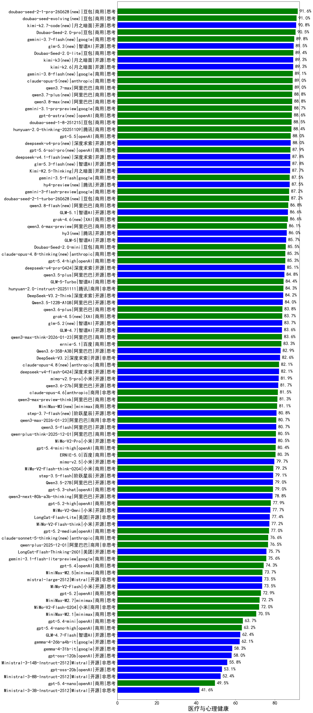

|类别|机构|大模型|【医疗与心理健康】准确率|平均耗时|平均消耗token|花费/千次（元）|排名（准确率）|
|---|---|-----|-------------------|-------|-----------|-----------|-----------|
|商用|豆包|doubao-seed-2-1-pro-260628|91.6%|218s|7048|208.9|1|
|商用|豆包|doubao-seed-evolving|91.0%|224s|6916|204.9|2|
|开源|月之暗面|kimi-k2.7-code|90.8%|30s|903|23.0|3|
|商用|豆包|Doubao-Seed-2.0-pro|90.5%|223s|1003|14.6|4|
|商用|google|gemini-3.7-flash(new)|89.8%|8s|755|18.3|5|
|开源|智谱AI|glm-5.3(new)|89.5%|38s|1911|52.0|6|
|商用|豆包|Doubao-Seed-2.0-lite|89.4%|182s|859|2.8|7|
|开源|月之暗面|kimi-k3(new)|89.3%|41s|707|59.2|8|
|开源|月之暗面|kimi-k2.6|89.3%|99s|1653|43.3|9|
|商用|google|gemini-3.8-flash(new)|89.1%|23s|808|39.5|10|
|商用|anthropic|claude-opus-5(new)|89.0%|14s|685|105.6|11|
|商用|阿里巴巴|qwen3.7-max|89.0%|23s|1065|36.6|12|
|商用|阿里巴巴|qwen3.7-plus|88.8%|22s|1124|8.6|13|
|商用|阿里巴巴|qwen3.8-max(new)|88.8%|25s|1005|33.6|14|
|商用|google|gemini-3.1-pro-preview|88.7%|40s|1529|125.3|15|
|商用|openAI|gpt-6-astra(new)|88.6%|11s|253|65.1|16|
|商用|openAI|gpt-5.5|88.0%|9s|447|79.2|17|
|开源|深度求索|deepseek-v4-pro(new)|88.0%|141s|903|21.8|18|
|商用|openAI|gpt-5.6-sol-pro|87.9%|24s|3196|244.1|19|
|开源|深度求索|deepseek-v4.1-flash(new)|87.8%|13s|992|7.4|20|
|开源|智谱AI|glm-5.3-flash(new)|87.8%|81s|1774|4.8|21|
|开源|月之暗面|Kimi-K2.5-Thinking|87.7%|319s|1688|34.3|22|
|商用|google|gemini-3.5-flash|87.5%|8s|1353|81.6|23|
|开源|腾讯|hy4-preview(new)|87.5%|61s|3400|60.2|24|
|商用|豆包|doubao-seed-2-1-turbo-260628|87.2%|190s|6770|100.3|25|
|商用|openAI|gpt-6-sol(new)|86.9%|240s|246|12.5|26|
|商用|阿里巴巴|qwen3.8-flash(new)|86.8%|41s|1277|3.2|27|
|开源|智谱AI|GLM-5.1|86.6%|145s|1555|36.1|28|
|商用|XAI|grok-4.6(new)|86.6%|143s|1490|55.0|29|
|商用|阿里巴巴|qwen3.6-max-preview|86.1%|48s|1562|81.2|30|
|开源|腾讯|hy3|86.0%|71s|224|0.7|31|
|开源|智谱AI|GLM-5|85.7%|87s|1928|33.8|32|
|商用|豆包|Doubao-Seed-2.0-mini|85.5%|344s|2079|4.0|33|
|商用|anthropic|claude-opus-4.8-thinking|85.3%|13s|737|114.6|34|
|商用|openAI|gpt-5.4-high|85.3%|14s|684|64.6|35|
|开源|深度求索|deepseek-v4-pro-0424|85.1%|34s|867|20.0|36|
|开源|阿里巴巴|qwen3.5-plus|84.8%|33s|2657|12.5|37|
|商用|智谱AI|GLM-5-Turbo|84.4%|43s|1504|32.0|38|
|开源|深度求索|DeepSeek-V3.2-Think|84.2%|103s|1109|3.3|39|
|商用|openAI|gpt-6-luna(new)|84.1%|249s|419|1.2|40|
|开源|阿里巴巴|Qwen3.5-122B-A10B|84.0%|242s|2899|18.2|41|
|商用|阿里巴巴|qwen3.6-plus|83.8%|36s|1565|18.1|42|
|商用|XAI|grok-4.5|83.7%|80s|1515|56.1|43|
|开源|智谱AI|glm-5.2|83.7%|49s|1766|48.0|44|
|商用|阿里巴巴|qwen3-max-think-2026-01-23|83.6%|159s|2862|28.0|45|
|商用|百度|ernie-5.1|83.3%|33s|926|15.8|46|
|开源|阿里巴巴|Qwen3.6-35B-A3B|82.9%|67s|1789|18.7|47|
|开源|深度求索|DeepSeek-V3.2|82.6%|63s|343|1.0|48|
|商用|anthropic|claude-opus-4.8|82.1%|9s|532|78.8|49|
|开源|深度求索|deepseek-v4-flash-0424|82.1%|29s|826|1.6|50|
|开源|小米|mimo-v2.5-pro|81.9%|25s|1272|22.3|51|
|开源|阿里巴巴|qwen3.6-27b|81.7%|27s|1703|29.6|52|
|商用|anthropic|claude-opus-4.6|81.5%|15s|609|92.0|53|
|商用|minimax|MiniMax-M3|81.1%|24s|663|8.2|54|
|开源|小米|mimo-v2.6-pro(new)|80.8%|60s|1316|7.7|55|
|开源|阶跃星辰|step-3.7-flash|80.8%|38s|2371|18.7|56|
|商用|阿里巴巴|qwen3-max-2026-01-23|80.7%|79s|501|4.5|57|
|开源|阿里巴巴|qwen3.5-flash|80.7%|260s|3186|6.2|58|
|开源|小米|MiMo-V2-Pro|80.5%|240s|1120|19.1|59|
|商用|openAI|gpt-5.4-mini-high|80.4%|49s|932|27.2|60|
|商用|百度|ERNIE-5.0|80.3%|167s|1981|46.5|61|
|开源|小米|mimo-v2.5|79.7%|43s|1340|15.3|62|
|商用|小米|MiMo-V2-Flash-think-0204|79.2%|668s|1916|3.9|63|
|开源|小米|mimo-v2.6-flash(new)|79.2%|119s|1211|2.4|64|
|开源|阶跃星辰|step-3.5-flash|79.1%|21s|1865|3.8|65|
|开源|阿里巴巴|Qwen3.5-27B|79.0%|279s|3101|14.6|66|
|商用|openAI|gpt-5.3-chat|79.0%|23s|380|30.1|67|
|开源|小米|MiMo-V2-Omni|77.7%|206s|1312|14.8|68|
|开源|美团|LongCat-Flash-Lite|77.4%|199s|490|0.0|69|
|商用|anthropic|claude-sonnet-5-thinking|76.6%|15s|788|49.4|70|
|商用|google|gemini-3.1-flash-lite-preview|75.6%|9s|359|3.2|71|
|商用|openAI|gpt-5.4|74.3%|7s|275|21.6|72|
|商用|minimax|MiniMax-M2.5|73.7%|26s|1333|10.6|73|
|商用|minimax|MiniMax-M2.7|72.2%|37s|1520|12.2|74|
|商用|小米|MiMo-V2-Flash-0204|72.0%|224s|510|0.9|75|
|商用|openAI|gpt-5.4-mini|63.7%|32s|234|5.2|76|
|商用|openAI|gpt-5.4-nano-high|63.2%|36s|535|4.1|77|
|开源|google|gemma-4-26b-a4b-it|62.1%|59s|570|1.4|78|
|开源|google|gemma-4-31b-it|58.3%|81s|517|1.3|79|
|开源|openAI|gpt-oss-120b|58.0%|35s|635|1.7|80|
|开源|openAI|gpt-oss-20b|53.1%|50s|1189|1.3|81|
|商用|openAI|gpt-5.4-nano|49.5%|27s|230|1.4|82|

