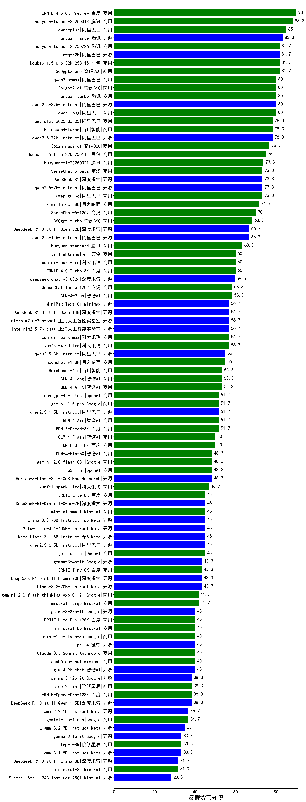

|类别|机构|大模型|【反假货币知识】准确率|平均耗时|平均消耗token|花费/千次（元）|排名（准确率）|
|---|---|-----|-------------------|-------|-----------|-----------|-----------|
|开源|腾讯|hunyuan-large|83.3%|12s|842|5.2|1|
|商用|豆包|Doubao-1.5-pro-32k-250115|81.7%|8s|211|0.3|2|
|商用|奇虎360|360gpt2-pro|81.7%|8s|154|0.5|3|
|开源|阿里巴巴|qwq-32b|81.7%|40s|1452|8.5|4|
|商用|阿里巴巴|qwen-long-2025-01-25|80.0%|8s|211|0.3|5|
|开源|阿里巴巴|qwen2.5-32b-instruct|80.0%|8s|176|0.7|6|
|商用|阿里巴巴|qwen2.5-max|80.0%|14s|241|1.9|7|
|商用|奇虎360|360gpt2-o1|80.0%|12s|240|9.7|8|
|商用|百川智能|Baichuan4-Turbo|78.3%|/|/|/|9|
|商用|阿里巴巴|qwq-plus-2025-03-05|78.3%|34s|1557|6.1|10|
|开源|阿里巴巴|qwen2.5-72b-instruct|78.3%|9s|178|1.5|11|
|商用|奇虎360|360zhinao2-o1|76.7%|/|/|/|12|
|商用|豆包|Doubao-1.5-lite-32k-250115|75.0%|5s|130|0.1|13|
|开源|阿里巴巴|qwen2.5-7b-instruct|73.3%|13s|196|0.2|14|
|商用|月之暗面|kimi-latest-8k|71.7%|14s|349|4.2|15|
|商用|商汤|SenseChat-5-1202|70.0%|/|/|/|16|
|商用|奇虎360|360gpt-turbo|68.3%|/|/|/|17|
|开源|深度求索|DeepSeek-R1-Distill-Qwen-32B|66.7%|21s|566|0.7|18|
|开源|阿里巴巴|qwen2.5-14b-instruct|66.7%|7s|204|0.4|19|
|商用|腾讯|hunyuan-standard|63.3%|/|/|/|20|
|商用|科大讯飞|xunfei-spark-pro|60.0%|/|/|/|21|
|商用|零一万物|yi-lightning|60.0%|/|/|/|22|
|开源|minimax|MiniMax-Text-01|56.7%|11s|835|6.7|23|
|商用|科大讯飞|xunfei-spark-max|56.7%|8s|104|3.1|24|
|商用|科大讯飞|xunfei-4.0Ultra|56.7%|8s|104|7.3|25|
|开源|深度求索|DeepSeek-R1-Distill-Qwen-14B|56.7%|/|/|/|26|
|开源|上海人工智能实验室|internlm2_5-7b-chat|56.7%|/|/|/|27|
|开源|阿里巴巴|qwen2.5-3b-instruct|55.0%|12s|200|0.1|28|
|商用|百川智能|Baichuan4-Air|53.3%|/|/|/|29|
|商用|百度|ERNIE-Speed-8K|51.7%|/|/|/|30|
|商用|openAI|chatgpt-4o-latest|51.7%|/|/|/|31|
|开源|阿里巴巴|qwen2.5-1.5b-instruct|51.7%|5s|131|0.0|32|
|商用|百度|ERNIE-3.5-8K|50.0%|19s|362|0.7|33|
|商用|智谱AI|GLM-4-FlashX|48.3%|6s|160|0.0|34|
|商用|科大讯飞|xunfei-spark-lite|46.7%|/|/|/|35|
|商用|OpenAI|gpt-4o-mini|45.0%|/|/|/|36|
|开源|阿里巴巴|qwen2.5-0.5b-instruct|45.0%|8s|170|0.0|37|
|商用|Mistral|mistral-small|45.0%|/|/|/|38|
|商用|百度|ERNIE-Lite-8K|45.0%|/|/|/|39|
|商用|百度|ERNIE-Tiny-8K|43.3%|/|/|/|40|
|开源|Google|gemma-3-4b-it|43.3%|/|/|/|41|
|商用|Mistral|mistral-large|41.7%|/|/|/|42|
|开源|微软|phi-4|40.0%|/|/|/|43|
|商用|Mistral|ministral-8b|40.0%|/|/|/|44|
|开源|Google|gemma-3-27b-it|40.0%|/|/|/|45|
|商用|阶跃星辰|step-2-mini|38.3%|6s|251|0.4|46|
|开源|Google|gemma-3-12b-it|38.3%|/|/|/|47|
|商用|Mistral|ministral-3b|31.7%|/|/|/|48|
|商用|智谱AI|GLM-4-AirX|nan%|5s|165|1.6|49|
|商用|智谱AI|GLM-4-Long|nan%|6s|139|0.1|50|
|商用|智谱AI|GLM-4-Plus|nan%|7s|189|0.9|51|
|开源|深度求索|deepseek-chat-v3-0324|nan%|159s|229|1.5|52|
|开源|meta|Llama-4-Scout-17B-16E-Instruct|nan%|6s|355|0.7|53|
|开源|meta|Llama-4-Maverick-17B-128E-Instruct-FP8|nan%|8s|461|1.8|54|
|开源|Mistral|Mistral-Small-3.1-24B-Instruct-2503|nan%|/|/|/|55|
|商用|智谱AI|GLM-Z1-Flash|nan%|36s|1271|0.0|56|
|商用|智谱AI|GLM-Z1-FlashX|nan%|39s|1281|0.3|57|
|商用|智谱AI|GLM-Z1-Air|nan%|51s|1304|0.7|58|
|商用|智谱AI|GLM-Z1-AirX|nan%|29s|2086|13.4|59|
|开源|智谱AI|GLM-4-9B-0414|nan%|3s|235|0.0|60|
|开源|智谱AI|GLM-Z1-9B-0414|nan%|49s|1837|0.0|61|
|开源|智谱AI|GLM-4-32B-0414|nan%|20s|173|0.3|62|
|开源|智谱AI|GLM-Z1-32B-0414|nan%|188s|2122|8.3|63|
|开源|智谱AI|GLM-Z1-Rumination-32B-0414|nan%|12s|834|1.7|64|
|开源|阿里巴巴|Qwen3-235B-A22B|nan%|55s|1651|16.0|65|
|开源|阿里巴巴|Qwen3-32B|nan%|31s|1276|4.9|66|
|开源|阿里巴巴|Qwen3-30B-A3B|nan%|19s|1015|2.7|67|
|开源|阿里巴巴|Qwen3-14B|nan%|24s|913|1.7|68|
|开源|阿里巴巴|Qwen3-8B|nan%|62s|2086|0.0|69|
|开源|阿里巴巴|Qwen3-4B|nan%|19s|1668|4.8|70|
|开源|阿里巴巴|Qwen3-1.7B|nan%|13s|1281|3.7|71|
|开源|阿里巴巴|Qwen3-0.6B|nan%|4s|813|2.3|72|
|商用|openAI|gpt-4.1|nan%|12s|205|8.4|73|
|商用|openAI|gpt-4.1-mini|nan%|6s|188|1.5|74|
|商用|openAI|o4-mini|nan%|33s|808|23.9|75|
|开源|深度求索|DeepSeek-R1-0528|nan%|224s|1766|27.6|76|
|商用|百度|ERNIE-4.5-Turbo-32K|nan%|19s|464|1.4|77|
|商用|百度|ERNIE-X1-Turbo-32K|nan%|66s|1562|6.1|78|
|开源|深度求索|DeepSeek-R1-0528-Qwen3-8B|nan%|187s|1393|0.0|79|
|商用|anthropic|claude-4-sonnet|nan%|41s|651|61.2|80|
|商用|anthropic|claude-4-sonnet-thinking|nan%|55s|1811|187.3|81|
|商用|阶跃星辰|step-r1-v-mini|nan%|192s|972|7.4|82|
|商用|腾讯|hunyuan-turbos-20250604|nan%|121s|246|0.4|83|
|商用|豆包|doubao-seed-1-6-flash-250615|nan%|1s|223|0.2|84|
|商用|豆包|doubao-seed-1-6-flash-thinking-250615|nan%|4s|382|0.4|85|
|商用|豆包|doubao-seed-1-6-250615|nan%|111s|287|1.6|86|
|商用|阿里巴巴|qwen-plus-think-2025-04-28|nan%|45s|1672|12.9|87|
|商用|阿里巴巴|qwen-turbo-think-2025-04-28|nan%|72s|1982|5.8|88|
|开源|minimax|MiniMax-M1|nan%|135s|2170|16.2|89|
|开源|百度|ERNIE-4.5-0.3B|nan%|43s|261|0.0|90|
|开源|百度|ERNIE-4.5-21B-A3B|nan%|17s|259|0.0|91|
|开源|百度|ERNIE-4.5-300B-A47B|nan%|22s|293|2.0|92|
|开源|腾讯|Hunyuan-A13B-Instruct|nan%|50s|756|2.8|93|
|商用|google|gemini-2.5-flash|nan%|9s|1473|25.7|94|
|商用|google|gemini-2.5-flash-lite-preview-06-17|nan%|1s|240|0.6|95|
|商用|XAI|grok-4-0709|nan%|134s|1840|193.7|96|
|商用|XAI|grok-3-mini|nan%|141s|782|2.7|97|
|商用|google|gemini-2.5-pro|nan%|34s|1779|125.2|98|
|开源|月之暗面|kimi-k2-0711-preview(new)|nan%|8s|187|2.2|99|
|开源|阿里巴巴|Qwen3-235B-A22B-nothink|nan%|9s|289|2.3|100|
|商用|腾讯|hunyuan-t1-20250711(new)|nan%|18s|1045|3.9|101|
|开源|华为|pangu-pro-moe(new)|nan%|73s|1307|5.0|102|
|商用|阿里巴巴|qwen-turbo-2025-07-15(new)|nan%|11s|284|0.2|103|
|商用|阿里巴巴|qwen-plus-2025-07-14(new)|nan%|7s|357|0.6|104|
|开源|腾讯|Hunyuan-A13B-Instruct-nothink(new)|nan%|6s|182|0.5|105|
|开源|阿里巴巴|qwen3-235b-a22b-instruct-2507(new)|nan%|7s|328|2.2|106|
|商用|豆包|doubao-seed-1-6-thinking-250715(new)|nan%|10s|1728|13.4|107|
|开源|阿里巴巴|qwen3-235b-a22b-thinking-2507(new)|nan%|90s|1479|28.4|108|
|商用|科大讯飞|xunfei-spark-x1-0725(new)|nan%|/|780|9.4|109|
|开源|阿里巴巴|Qwen3-0.6B-nothink|nan%|3s|149|0.3|110|
|开源|阿里巴巴|Qwen3-1.7B-nothink|nan%|8s|264|0.6|111|
|开源|阿里巴巴|Qwen3-4B-nothink|nan%|15s|304|0.7|112|
|开源|阿里巴巴|Qwen3-8B-nothink|nan%|18s|227|0.0|113|
|开源|阿里巴巴|Qwen3-14B-nothink|nan%|6s|323|0.5|114|
|开源|阿里巴巴|Qwen3-30B-A3B-nothink|nan%|14s|298|0.7|115|
|开源|阿里巴巴|Qwen3-32B-nothink|nan%|11s|349|1.2|116|
|商用|智谱AI|GLM-4.5-Flash(new)|nan%|39s|1756|0.0|117|
|开源|智谱AI|GLM-4.5-Air(new)|nan%|38s|1637|9.5|118|
|开源|智谱AI|GLM-4.5(new)|nan%|55s|947|12.6|119|
|开源|阿里巴巴|Qwen3-30B-A3B-Instruct-2507(new)|nan%|5s|543|1.5|120|
|开源|阿里巴巴|Qwen3-30B-A3B-Thinking-2507(new)|nan%|62s|2724|7.5|121|
|开源|阶跃星辰|step-3(new)|nan%|64s|1250|4.8|122|

