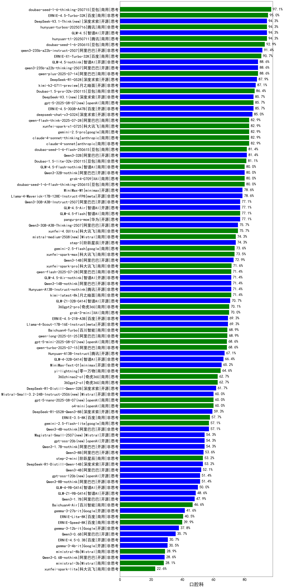

|类别|机构|大模型|【口腔科】准确率|平均耗时|平均消耗token|花费/千次（元）|排名（准确率）|
|---|---|-----|-------------------|-------|-----------|-----------|-----------|
|商用|豆包|doubao-seed-1-6-251015(new)|97.1%|62s|752|5.2|1|
|开源|深度求索|DeepSeek-V3.2-Exp-Think(new)|97.1%|174s|1066|3.1|2|
|商用|豆包|doubao-seed-1-6-thinking-250715|97.1%|19s|1134|8.5|3|
|商用|百度|ERNIE-4.5-Turbo-32K|95.0%|22s|565|1.7|4|
|商用|腾讯|hunyuan-t1-20250711|94.3%|22s|1382|5.2|5|
|开源|深度求索|DeepSeek-V3.1-Think|94.3%|49s|972|11.0|6|
|商用|阿里巴巴|qwen-plus-think-2025-07-28|94.3%|/|2163|16.7|7|
|开源|深度求索|DeepSeek-V3.2-Exp(new)|94.3%|174s|396|1.1|8|
|开源|智谱AI|GLM-4.5|94.3%|69s|1850|25.0|9|
|开源|智谱AI|GLM-4.6(new)|94.3%|49s|2316|31.5|10|
|开源|阿里巴巴|qwen3-next-80b-a3b-instruct(new)|94.3%|10s|618|2.2|11|
|商用|豆包|doubao-seed-1-6-250615|92.9%|97s|443|2.8|12|
|商用|豆包|doubao-seed-1-6-lite-251015(new)|91.4%|51s|912|2.0|13|
|开源|豆包|Seed-OSS-36B-Instruct|91.4%|95s|1576|6.1|14|
|开源|阿里巴巴|qwen3-235b-a22b-instruct-2507|91.4%|12s|510|3.6|15|
|商用|百度|ERNIE-X1-Turbo-32K|90.7%|103s|1993|7.8|16|
|开源|智谱AI|GLM-4.5-nothink|88.6%|27s|868|11.2|17|
|开源|阿里巴巴|qwen3-235b-a22b-thinking-2507|88.6%|100s|2267|43.8|18|
|商用|腾讯|hunyuan-turbos-20250926(new)|88.6%|14s|630|1.1|19|
|开源|深度求索|DeepSeek-R1-0528|87.9%|236s|1915|29.7|20|
|开源|月之暗面|kimi-k2-0711-preview|87.1%|33s|581|8.4|21|
|开源|minimax|MiniMax-M2(new)|85.7%|43s|1795|14.4|22|
|开源|深度求索|DeepSeek-V3.1|85.7%|19s|388|4.0|23|
|商用|openAI|gpt-5-2025-08-07|85.7%|23s|376|21.3|24|
|商用|阿里巴巴|qwen-plus-2025-07-28|85.7%|12s|515|0.9|25|
|商用|阿里巴巴|qwen3-max-preview|85.7%|12s|496|10.3|26|
|开源|百度|ERNIE-4.5-300B-A47B|85.7%|19s|318|2.1|27|
|商用|豆包|Doubao-1.5-lite-32k-250115|83.6%|6s|192|0.1|28|
|商用|anthropic|claude-4-sonnet-thinking|82.9%|50s|1172|116.5|29|
|商用|科大讯飞|xunfei-spark-x1-0725|82.9%|/|888|10.7|30|
|商用|google|gemini-2.5-pro|82.9%|35s|2258|158.9|31|
|商用|阿里巴巴|qwen-flash-think-2025-07-28|82.9%|25s|2562|3.7|32|
|商用|anthropic|claude-4-sonnet|82.9%|43s|557|49.5|33|
|开源|阿里巴巴|Qwen3-32B|81.4%|35s|1363|5.2|34|
|商用|豆包|doubao-seed-1-6-flash-250615|81.4%|4s|315|0.4|35|
|商用|豆包|doubao-seed-1-6-flash-thinking-250615|80.0%|6s|506|0.6|36|
|商用|智谱AI|GLM-4.5-Flash-nothink|80.0%|22s|1093|0.0|37|
|商用|XAI|grok-4-0709|80.0%|240s|1728|180.6|38|
|开源|阿里巴巴|Qwen3-32B-nothink|80.0%|22s|553|1.9|39|
|开源|meta|Llama-4-Maverick-17B-128E-Instruct-FP8|80.0%|8s|536|2.1|40|
|开源|智谱AI|GLM-4.5-Air|77.1%|39s|1949|11.3|41|
|商用|阿里巴巴|qwen-turbo-think-2025-07-15|77.1%|/|2604|7.6|42|
|开源|阿里巴巴|Qwen3-30B-A3B-Instruct-2507|77.1%|5s|681|1.8|43|
|商用|智谱AI|GLM-4.5-Flash|77.1%|31s|1640|0.0|44|
|商用|阿里巴巴|qwen-long-2025-01-25|75.7%|63s|364|0.6|45|
|开源|阿里巴巴|Qwen3-30B-A3B-Thinking-2507|75.7%|59s|2482|6.8|46|
|开源|minimax|MiniMax-M1|75.7%|174s|2837|19.4|47|
|商用|百川智能|Baichuan4-Turbo|75.0%|/|/|/|48|
|开源|阶跃星辰|step-3|74.3%|98s|1936|7.5|49|
|商用|Mistral|mistral-medium-2508|74.3%|99s|573|7.0|50|
|商用|google|gemini-2.5-flash|73.6%|11s|1768|30.8|51|
|开源|阿里巴巴|Qwen3-14B|72.9%|40s|1721|3.3|52|
|商用|阿里巴巴|qwen-flash-2025-07-28|71.4%|8s|657|0.9|53|
|开源|智谱AI|GLM-4.5-Air-nothink|71.4%|16s|1040|5.8|54|
|开源|腾讯|Hunyuan-A13B-Instruct-nothink|71.4%|186s|413|1.4|55|
|开源|阿里巴巴|Qwen3-14B-nothink|71.4%|16s|628|1.1|56|
|开源|minimax|MiniMax-Text-01|70.7%|14s|931|7.5|57|
|商用|XAI|grok-3-mini|70.0%|191s|1132|4.0|58|
|开源|百度|ERNIE-4.5-21B-A3B|69.3%|20s|319|0.0|59|
|开源|meta|Llama-4-Scout-17B-16E-Instruct|69.3%|11s|594|1.2|60|
|商用|openAI|gpt-5-mini-2025-08-07|68.6%|57s|1136|15.2|61|
|商用|阿里巴巴|qwen-turbo-2025-07-15|68.6%|7s|399|0.2|62|
|开源|腾讯|Hunyuan-A13B-Instruct|67.1%|82s|1186|4.5|63|
|商用|360|360zhinao2-o1|62.9%|/|/|/|64|
|开源|Mistral|Mistral-Small-3.2-24B-Instruct-2506|60.0%|386s|689|1.3|65|
|商用|openAI|o4-mini|60.0%|34s|1123|33.6|66|
|商用|openAI|gpt-5-nano-2025-08-07|60.0%|46s|2308|6.4|67|
|开源|深度求索|DeepSeek-R1-0528-Qwen3-8B|59.3%|249s|1759|0.0|68|
|开源|阿里巴巴|Qwen3-4B-nothink|57.1%|19s|494|1.2|69|
|商用|google|gemini-2.5-flash-lite|57.1%|3s|614|1.6|70|
|开源|openAI|gpt-oss-20b|54.3%|112s|1424|1.5|71|
|开源|Mistral|Magistral-Small-2507|54.3%|115s|5530|59.3|72|
|开源|阿里巴巴|Qwen3-1.7B-nothink|54.3%|11s|514|1.3|73|
|开源|阿里巴巴|Qwen3-8B-nothink|54.3%|44s|520|0.0|74|
|开源|阿里巴巴|Qwen3-8B|53.6%|487s|14089|0.0|75|
|开源|阿里巴巴|Qwen3-4B|52.1%|24s|1949|5.6|76|
|开源|openAI|gpt-oss-120b|51.4%|9s|777|2.1|77|
|开源|智谱AI|GLM-4-9B-0414|50.0%|11s|459|0.0|78|
|开源|阿里巴巴|Qwen3-1.7B|47.9%|25s|2155|6.2|79|
|开源|google|gemma-3-27b-it|45.7%|/|/|/|80|
|商用|百度|ERNIE-Lite-8K|42.9%|/|/|/|81|
|开源|google|gemma-3-12b-it|40.7%|/|/|/|82|
|商用|百川智能|Baichuan4-Air|40.7%|/|/|/|83|
|开源|阿里巴巴|Qwen3-0.6B|35.7%|7s|1187|3.3|84|
|开源|google|gemma-3-4b-it|32.9%|/|/|/|85|
|开源|百度|ERNIE-4.5-0.3B|30.0%|34s|381|0.0|86|
|开源|阿里巴巴|Qwen3-0.6B-nothink|28.6%|9s|263|0.5|87|

